# AgentLoop 模块与功能详解

> 一手实测记录。调研时间 2026-09-06，控制台版本 `agentloop-console-web/0.1.266`，地域 `cn-hangzhou`，AgentSpace `dh-tc-agent`。
>
> ⚠️ **本次调研的 AgentSpace 尚未接入任何 Agent 应用**，因此可观测、审计、评估结果类页面多为空态。空态页面同样保留了完整的字段名、筛选项、表格列与配置项 —— 这些恰恰是理解产品数据模型的依据，但**不要把「暂无数据」误读为功能缺失**。凡是有真实数据的地方（内置评估器 21 条、数据集 1 个、记忆库 1 个），下文都已标注。

## 0. 全局结构

AgentLoop 控制台以 **AgentSpace（智能体空间）** 为顶层资源边界，一个 AgentSpace 对应一个团队 / 业务线 / 独立项目，其下挂载 Agent 应用、数据集、评估任务、实验计划、记忆库、经验库等全部资源。左上角切换 AgentSpace 与地域。

左侧导航固定 12 项，按产品闭环分为四组：

| 分组 | 模块 | 控制台路由（`/agentloop/region/<region>/agentspace/<space>/app/…`） |
|---|---|---|
| — | Agent 总览 | `agent-insight` |
| — | 快速启动 | `quickstart` |
| **观测与审计** | 接入中心 | `integratingcenter` |
| | AI Agent 可观测 | `llm_agent/app-list` |
| | 仪表盘 | `dashboard/dashboard-list` |
| | 审计 | `audit-manage` |
| **评估与实验** | 数据中心 | `trajectory` |
| | 评估 | `evaluate-task` |
| | 实验 | `experiment-plan` |
| **持续优化** | Agent 资产 | `agent-asset/prompt` |
| | 上下文工程 | `experience` |
| — | 系统管理 | `setting/space` |

产品自己在「Agent 总览」页画了一张闭环图，可视为官方版模块关系说明：

> **观测与数据底座**（负责把 Agent 运行事实加工为可评估、可复用的数据资产）
> 接入中心（接入探针 · OpenTelemetry/SDK）→ AI Agent 可观测（Trace · Session · Tool Call）→ **Trajectory**（清洗组装后的运行轨迹，「评估 · Dataset · 经验库的共同输入」）→ 数据处理任务（Pipeline：筛选、转换与字段治理）→ Dataset（评测集 · 回归集 · 经典 Case）
>
> **在线评估与 Bad Case 发现**（负责定义标准、持续评分、定位问题并沉淀低分样本）
> 通用评估器（正确性 · 过程 · 效率 · Workflow）→ 新建在线评估任务（Evaluator → Score [0,1]）→ 找到低分 Case（Low-score Case · Root Cause）→ Bad Case Dataset（回归测试的重点输入）
>
> **实验回归**（负责验证候选版本与经验注入策略是否真正提升）

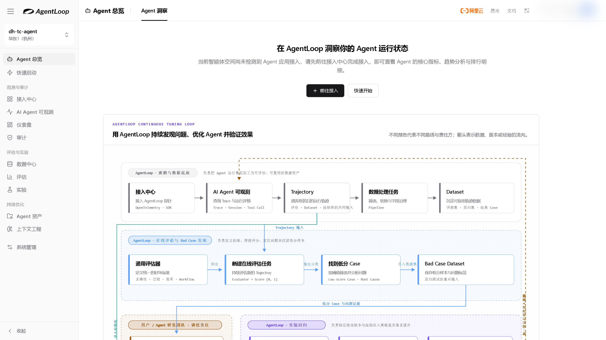

---

## 1. Agent 总览 `agent-insight`

**一句话**：AgentSpace 的着陆页，接入后展示 Agent 核心指标、趋势分析与排行明细；未接入时作为产品闭环的引导页。

顶部有 `Agent 总览` / `Agent 洞察` 两个页签（本次实测两者渲染同一内容）。未接入状态下给出「前往接入」「快速开始」两个入口，正文即上文那张 AGENTLOOP CONTINUOUS TUNING LOOP 闭环图。

---

## 2. 快速启动 `quickstart`

**一句话**：把四条主线任务做成带步骤和预估耗时的引导清单，每步都给出可复制的接入命令。

四条引导线：

| 引导 | 预估 | 说明（原文） |
|---|---|---|
| Agent 全栈观测 | 约 5 分钟 | 完成观测数据接入，验证 Agent 上下文数据完整性 |
| Agent 效果评估 | — | 创建评估器与评估任务，持续度量 Agent 效果 |
| 数据集构建 | — | 基于线上 Trace/Log 或 CSV 文件持续构建高质量数据集，沉淀企业数据资产 |
| Agent 资产管理 | — | 集中管理 Prompts 和 Skills，多版本路由，运行时动态加载 |

「Agent 全栈观测」下有 `控制台` / `Skill` / `CLI` 三种接入路径页签 —— 值得注意的是产品把自身能力也封装成了 **Skill**（「AgentLoop 生命周期管理」，阿里云官方，打通从数据接入、数据处理的全流程）和 **CLI**（「AgentLoop CLI（2026-05-20）」，阿里云官方），即控制台之外还提供 Agent 可直接调用的操作入口。

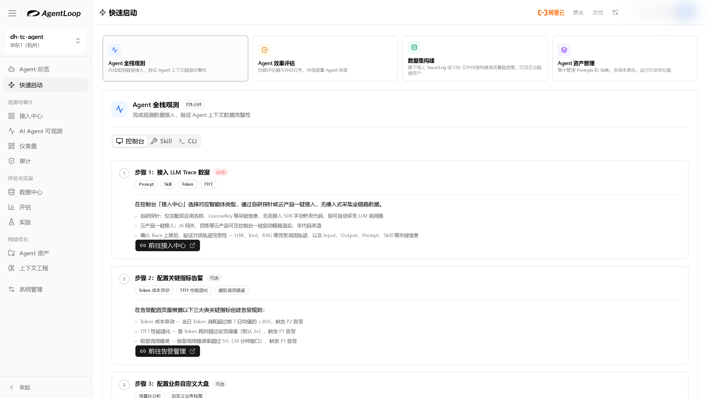
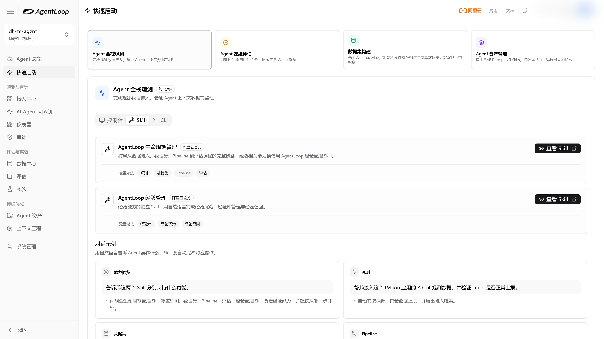
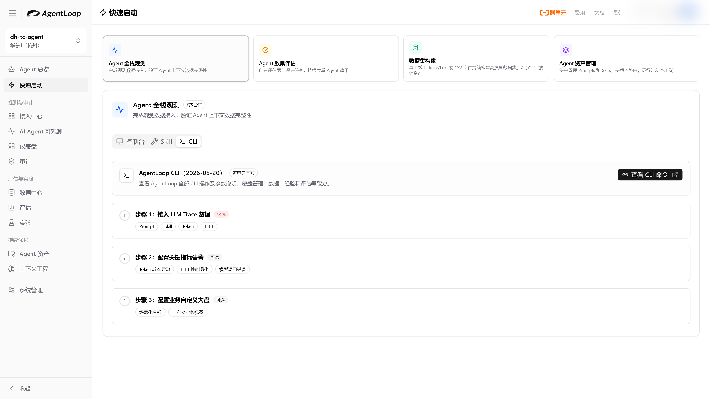

---

## 3. 接入中心 `integratingcenter`

**一句话**：全部 37 种接入方式的目录，选中任一种后按所填参数**自动生成安装命令与环境变量**，是整个产品的数据入口。

实测分类与数量（以控制台角标为准）：

| 分类 | 数量 | 具体条目 |
|---|---|---|
| Linux 通用 Agent 接入 | 1 | AI 运行时日志(eBPF) |
| Agent 框架 | 7 | AgentScope、Claude Agent SDK、Coze、CrewAI、Google ADK、LangChain/LangGraph、OpenAI Agent |
| Coding Agent | 16 | Claude Code、Codex、Cursor、DeepSeek Harness、Kiro、MiMo Code、OpenCode、Pi Coding Agent、千问办公、Qoder、Qoder CN、Qoder Work、Qoder Work CN、Qwen Code、WorkBuddy、Wukong |
| 通用 Agent | 5 | DeerFlow、Hermes、OpenClaw、OpenTelemetry 无侵入监控、QwenPaw(原 CoPaw) |
| 模型提供商 | 4 | Anthropic、DashScope、LiteLLM、OpenAI |
| 低代码 / 其他 | 4 | Dify、RagFlow、AI Native 接入、自定义 |
| **合计** | **37** | |

> **Coding Agent 占 16 席**（接近一半），是这份清单里最值得注意的信号：AgentLoop 把 AI 编程助手当作头号被观测对象，评估器里也专门有 Coding 类目。

每个接入详情页结构一致：**接入协议**（可多选，打勾为推荐）→ **参数配置**（语言 / 系统 / 连接方式 / LicenseKey 等）→ **安装与接入配置**（按参数自动生成，并标注所用协议模板名）。

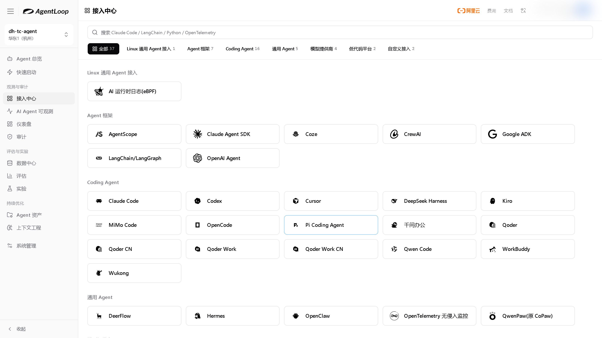

各接入方式的具体技术实现见 [02-技术栈.md](02-技术栈.md)，此处仅列截图：

- [AI 运行时日志(eBPF)](assets/screenshots/03-接入中心/04-接入-AI运行时日志%28eBPF%29.png) — LoongCollector + eBPF，固定写入 Logstore `ebpf-event`
- [LangChain/LangGraph](assets/screenshots/03-接入中心/05-接入-LangChainLangGraph.png) — ARMS Python 探针，`aliyun-bootstrap`
- [Claude Code](assets/screenshots/03-接入中心/06-接入-ClaudeCode.png) — LoongSuite Pilot 本地采集服务
- [AgentScope](assets/screenshots/03-接入中心/07-接入-AgentScope.png) — ACK/ACS 容器接入，`ack-onepilot` + K8s label 注入
- [OpenTelemetry 无侵入监控](assets/screenshots/03-接入中心/08-接入-OpenTelemetry无侵入监控.png) — OBI，eBPF DaemonSet + OTLP
- [Dify](assets/screenshots/03-接入中心/09-接入-Dify.png) — OpenTelemetry 标准协议

---

## 4. AI Agent 可观测 `llm_agent/app-list`

**一句话**：产品的观测主界面，从应用列表、拓扑、链路、会话到成本做多视角下钻 —— 实测该模块页面**嵌入自云监控 2.0（`cmsnext.console.aliyun.com`）**，即 AgentLoop 复用了云监控的可观测前端。

八个顶部页签：

| 页签 | 内容（实测字段） |
|---|---|
| **总览** | 活跃会话数、对话数、活跃 Agent 数、活跃 AI 应用数、Token 消耗（日同比）、**平均 TTFT**（日同比）；模型调用统计、Agent 调用统计、智能体框架统计 |
| **AI Agent** | 子页签 `AI 应用` / `AI Agent`，实体筛选 `apm@apm.genai.service`；列：应用名称、标签、**探针类型**、语言、区域、平均模型调用次数、平均模型调用错误次数、平均模型调用耗时、每分钟平均 token 消耗 |
| **全景拓扑** | `拓扑视图` / `健康视图` |
| **链路追踪** | 视图：`列表视图` / `卡片视图` / **`轨迹视图`**；子页签：`Trace 列表` / `Span 列表` / `全链路拓扑` / **`评估`**；指标：Trace 数、平均耗时、Token 消耗；列：Trace ID、输入、输出、开始时间、耗时、Total tokens、入口应用名称、用户 ID、会话 ID |
| **会话分析** | `会话视图` / `用户视图`；指标：会话数、平均会话时长、平均会话轮次、用户数（均带日同比）；列：会话 ID、开始时间、会话时长、轮次、Total/Input/Output Tokens、用户 ID |
| **聚类与归因** | `智能聚类` / `智能归因`，需新建聚类任务；未建任务时展示演示数据 |
| **场景化分析** | 四个分析面：`Token 用量分析` / `模型性能分析` / `工具调用分析` / `用户分析`；Token 消耗、输入/输出 Token、**缓存命中率**；分布、趋势、平均单请求 Token 趋势、AI Agent / AI 应用 / 模型 Token 消耗 TOP5 |
| **告警管理** | 下拉菜单，含 `告警规则` / `告警历史` |

> 三点值得对标：① 链路追踪里**内置了「评估」子页签**，说明评分结果直接挂回 Trace 而非另建报表；② 观测指标里有 **TTFT** 与**缓存命中率**，是 LLM 特有而非通用 APM 指标；③ 列表里有**「探针类型」**一列，即同一空间允许多种采集通道混用。

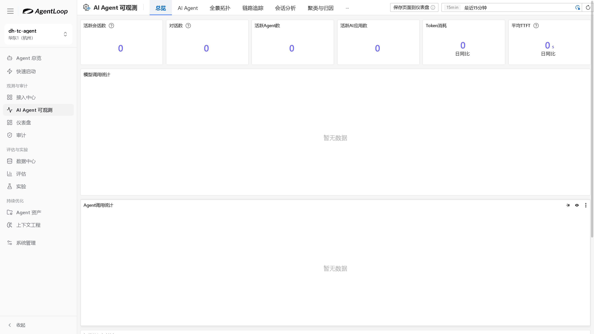
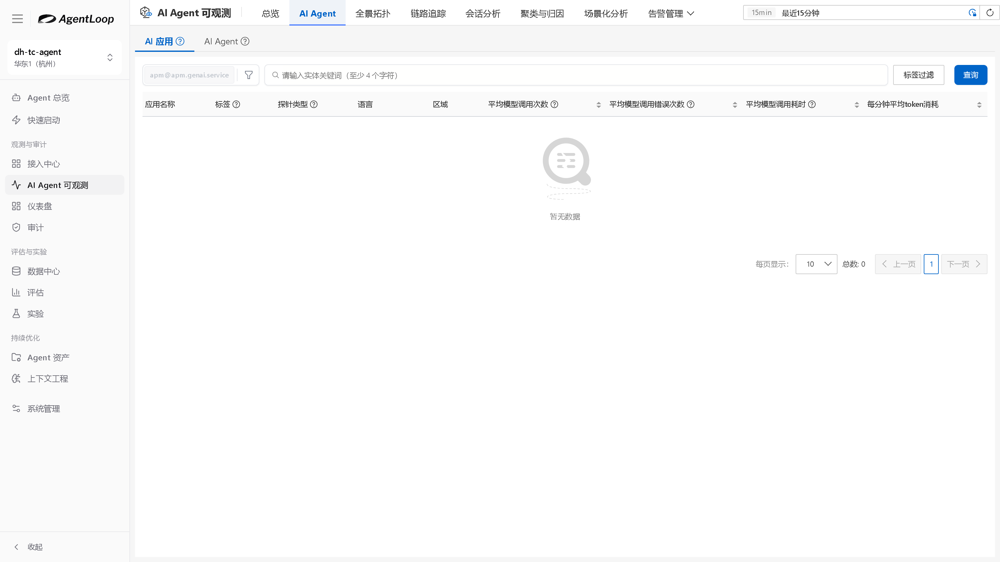
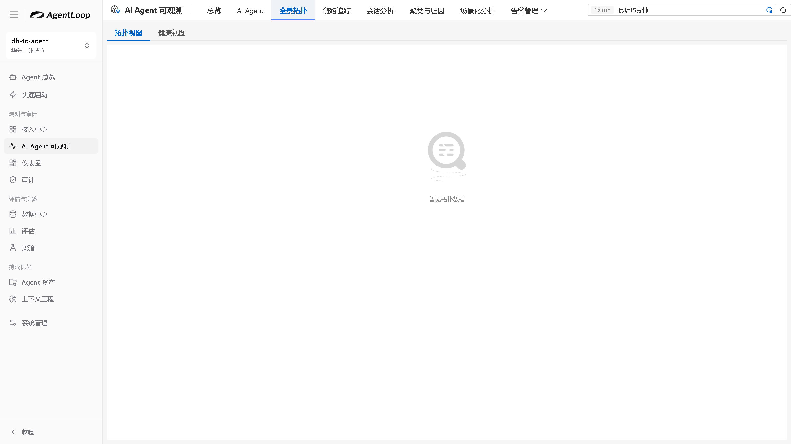
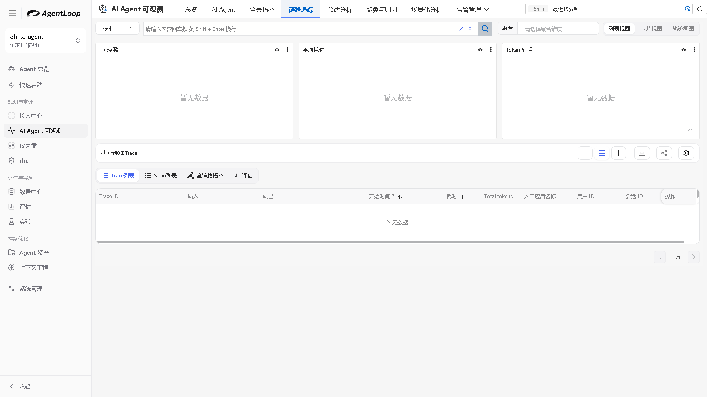
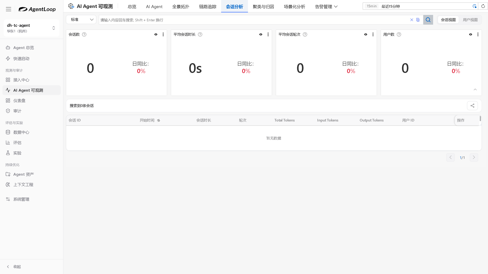
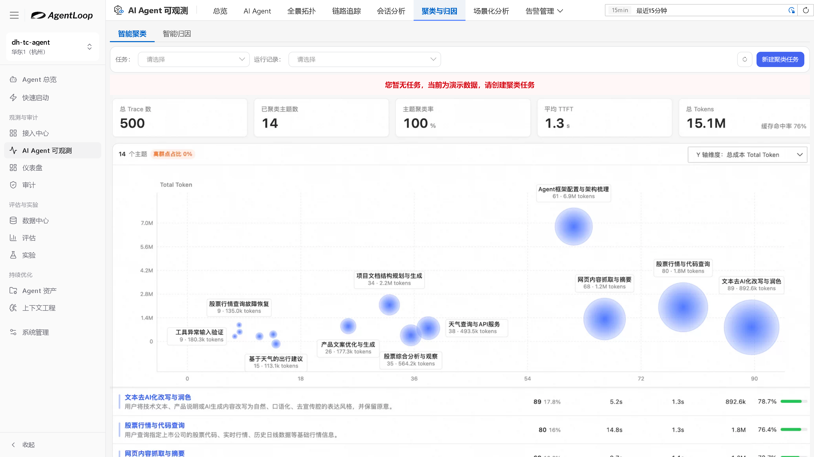
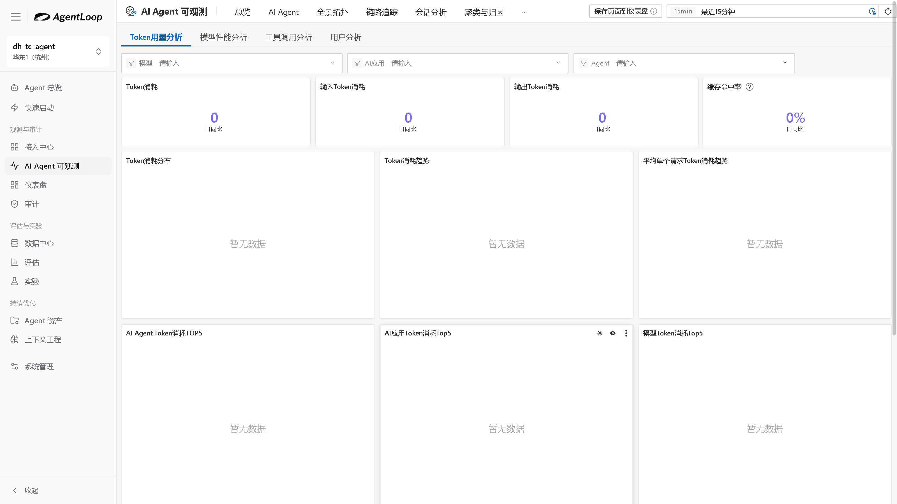
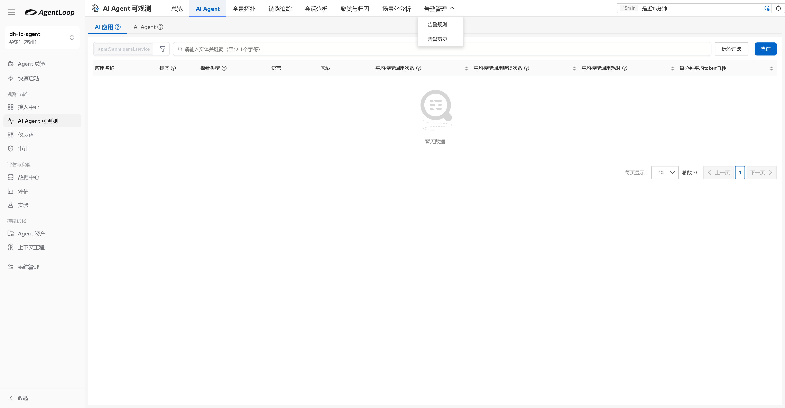

---

## 5. 仪表盘 `dashboard/dashboard-list`

**一句话**：自定义大盘的列表页，实体本身托管在云监控 2.0 工作空间里，AgentLoop 只做入口。

页面顶部直接标明「当前资源 云监控 2.0 工作空间 · `agentloop-cms-<hash>`」并提供「在云监控 2.0 查看」跳转，列表列为 名称 / ID / 标签 / 操作。

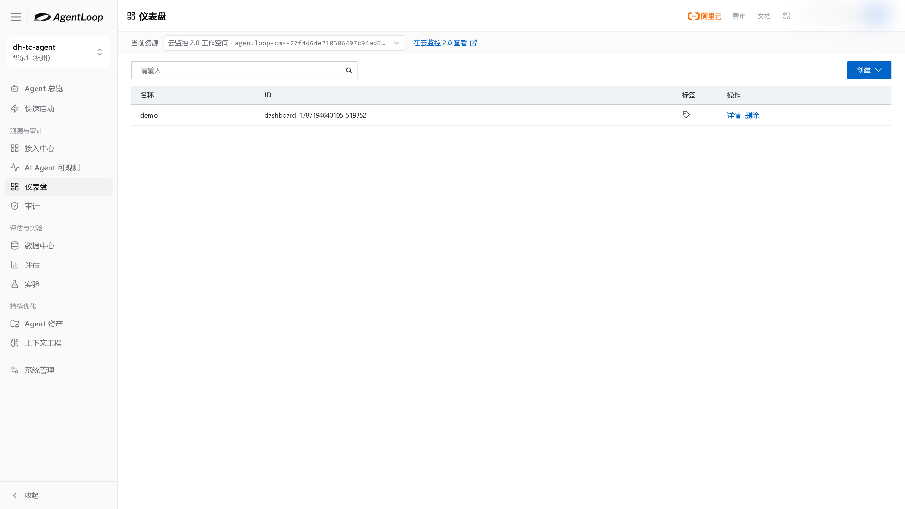

---

## 6. 审计 `audit-manage`

**一句话**：面向安全合规的独立视角，把 Agent 的每步工具调用与决策分支变成可追溯的风险事件与事实证据链。

四个页签及其路由：

| 页签 | 路由 | 官方描述（原文） |
|---|---|---|
| 审计管理 | `audit-manage` | 管理应用风险审计与运行时风险审计开关，查看接入状态与数据写入趋势 |
| 风险审计 | `audit-dashboard` | 汇总风险概览、用户风险、数据泄漏和 LLM 风险等安全指标，快速定位高风险事件和责任人 |
| 实体调查 | `audit-entity` | 从 Agent 事件中发现实体，叠加高危风险事件，追溯关联会话与服务 |
| 审计事实 | `audit-session` | 按会话维度浏览（页面标注为「会话浏览」） |

审计有**独立的数据源接入要求**：需在接入中心完成「AI 应用日志」或「AI 运行时日志(eBPF)」接入，与可观测的 Trace 接入是两条通道。本空间未接入审计数据源，四页均落在同一张接入引导页上，但路由各自独立。

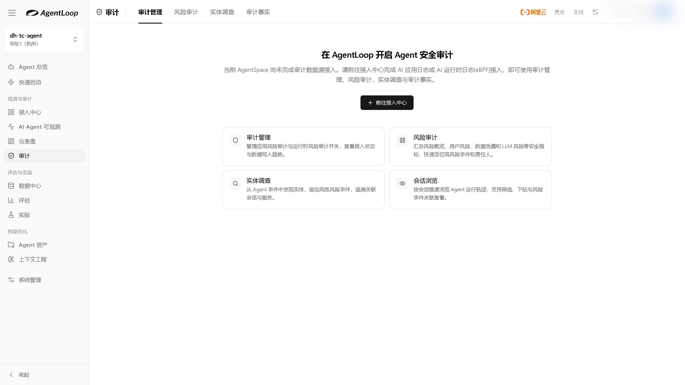
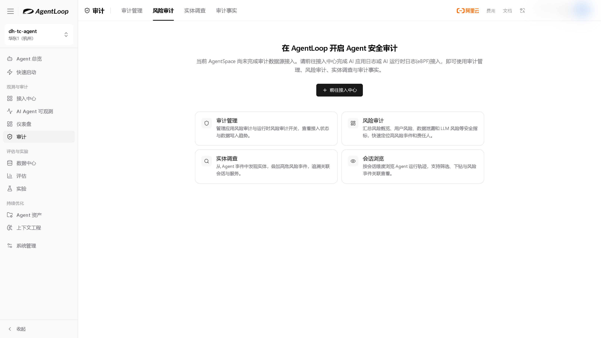

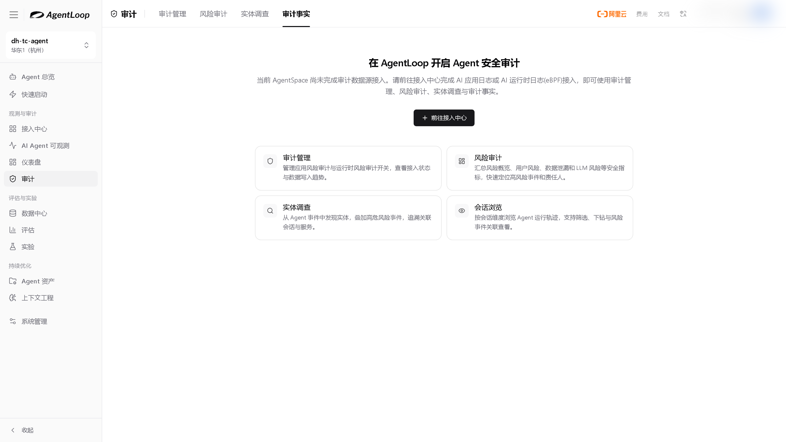

---

## 7. 数据中心 `trajectory`

**一句话**：把原始 Trace / eBPF 日志清洗成 Trajectory，再经 Pipeline 加工为可复用的 Dataset —— 产品数据飞轮的中枢。

### 7.1 Agent 轨迹 `trajectory`

数据源标注为 **`Trace` + `eBPF 日志`** 两路。列表列：输入、输出、Agent、Tokens、耗时、**Steps**、模型调用、工具调用、开始时间、Trajectory。默认时间窗 30 分钟。

### 7.2 数据集 `dataset`

列表列：名称、描述、标签、创建时间、操作（**AI 标注** / 修改 / 删除）。本空间有一条真实数据 `golden_question_bank`（标注 `Managed By AgentLoop AgentSpace dh-tc-agent`）。

数据集详情页（`dataset/<name>`）能力：

- 操作条：**发起评估** / **发起实验** / 导出 / 删除
- 页签：`数据详情` / `字段管理`
- 写入：新增记录 / 批量上传
- 查询：「请输入索引查询或 SQL 分析语句」，示例 `id: "数据 ID" | SELECT *` —— 即 SLS 的「索引查询 + 管道 SQL」语法
- 默认字段：`id` / `Input` / `Output` / `Expected_output` / `Trajectory` / 其他字段

**创建数据集**支持 4 种来源：从 Trace 数据处理（推荐）/ 从轨迹数据导入 / 上传 CSV·Excel·JSONL / 从空白开始。选 Trace 来源时可做 **Trace 筛选**与 **Span 筛选**（示例语法 `traceId = 'xxx' AND spanName LIKE '%chat%'`），并选择处理模版（如 `OT-AI Trace QA 问答对提取`，输出字段 问题 / 回答 / QA 对），调度支持单次执行与周期执行。

### 7.3 数据处理 `processing`

Pipeline 管理，列：名称、描述、**执行模式**、调度状态、创建时间、更新时间。

创建流程两步（配置流水线 → 发布），流水线结构是 `输入日志库(SLS Project) → …算子… → 输出数据集(Workspace)`。**内置 AI 助手 Loopie**：用自然语言描述需求，由它推荐并生成管线（「选择来源，loopie 为你推荐合适管线」，带新建会话 / 历史会话）。数据源三选一：Trace 数据（链路日志 / Span / Trace）、轨迹数据（Agent 轨迹 / 工具调用）、数据集（已有数据集二次处理）。

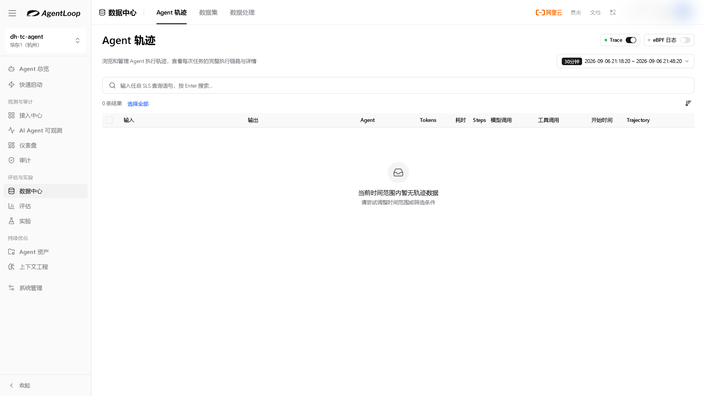
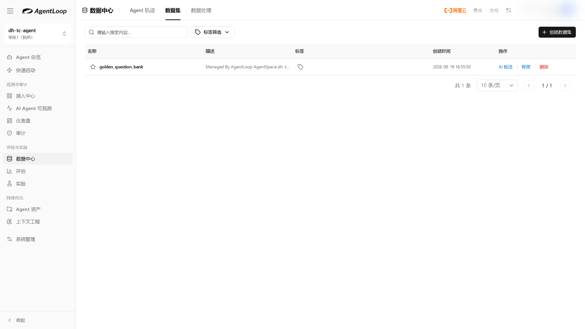
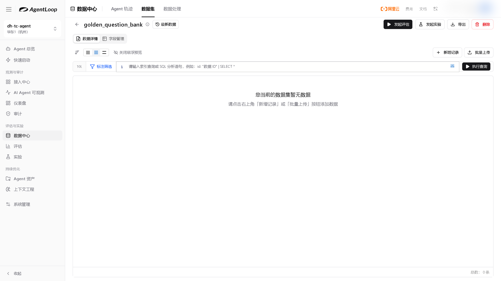
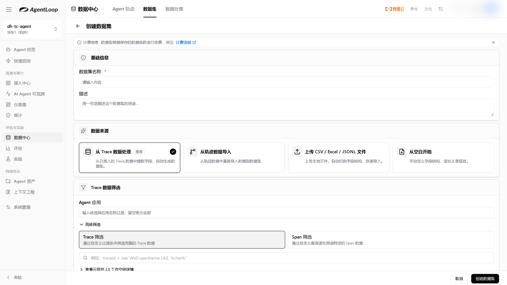
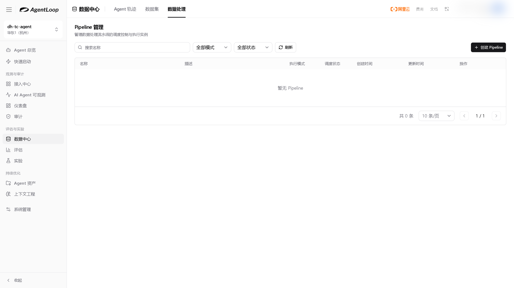
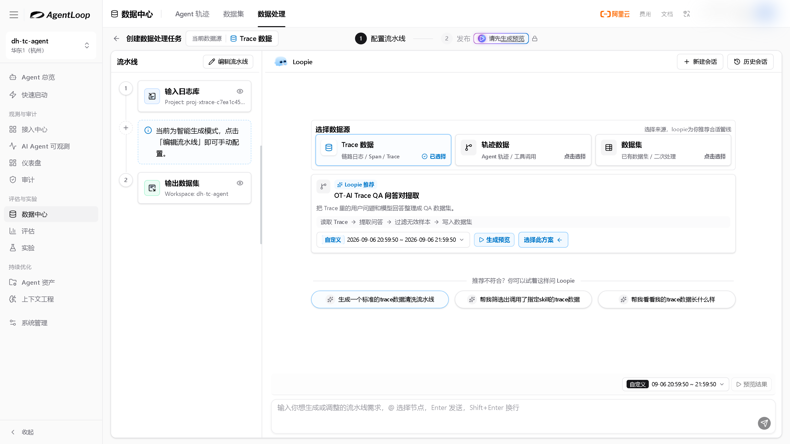

---

## 8. 评估 `evaluate-task`

**一句话**：产品的核心模块 —— 定义评估器（判官）、建评估任务（对哪批数据跑）、在分析洞察里看分数分布与低分样本。

三个页签：`评估任务` `分析洞察`(`explorer`) `评估器`(`evaluator`)。

### 8.1 评估器：21 个内置全量清单

⚠️ 官方文档《评估器》一文称提供「13 个标准评估器」，**控制台实测为 21 条（共 3 页）**，以控制台为准。类型分 `Agent`（Agent 节点执行，支持 Skills）与 `LLM`（纯 LLM 判分，Prompt 注入 system）两种。

| # | 名称 | Builtin ID | 类型 | 标签 | 描述（原文） |
|---|---|---|---|---|---|
| 1 | Agent 任务完成度 | `Builtin.agent_task_completion` | Agent | Agent评估 | 评估 Agent 是否完成了用户请求中的所有任务 |
| 2 | Agent 回答证据支持度 | `Builtin.agent_final_answer_groundedness` | Agent | Agent评估 | 评估 Agent 最终回答是否被本次运行取得的证据支撑 |
| 3 | Agent 工具调用成功率 | `Builtin.agent_tool_call_success_rate_agent` | **LLM** | Agent评估 | 评估 Agent 工具调用成功率 |
| 4 | Agent 工具选择合理性 | `Builtin.agent_tool_selections_rationality` | Agent | Agent评估 | 评估 Agent 工具选择、调用顺序和重试策略是否服务于用户目标 |
| 5 | Agent 执行步骤效率 | `Builtin.agent_step_efficiency` | Agent | Agent评估 | 确定性检测 Agent 轨迹中的机械性步骤浪费 |
| 6 | Coding 交付质量 | `Builtin.coding_quality` | Agent | Coding | — |
| 7 | CodingAgent 效能评估 | `Builtin.coding_agent_efficiency` | Agent | Coding | — |
| 8 | 需求设计 交付质量 | `Builtin.design_prd_quality` | Agent | Coding | 评估 AI Coding Agent 在完成设计和需求 PRD 产出任务时的整体完成质量。采用**动态 Rubric 生成机制**，从用户需求自动推导评分标准，覆盖任务理解、分析调研、产出完整性、产出质量和约束遵循 |
| 9 | RAG Query 质量 | `Builtin.agent_rag_query_faithfulness` | Agent | RAG | 评估 Agent RAG 流程中用户输入拆分/改写后的检索 query 是否忠实保留用户意图、是否利于检索召回 |
| 10 | RAG 回答证据忠实度 | `Builtin.agent_rag_answer_groundedness` | Agent | RAG | 评估 Agent RAG 流程最终回答的事实性主张是否被本次检索回的文档支撑 |
| 11 | RAG 检索相关性 | `Builtin.agent_rag_context_relevance` | Agent | RAG | 评估 Agent RAG 流程中检索召回的文档是否与用户问题语义相关 |
| 12 | 会话上下文保持度 | `Builtin.session_context_retention` | Agent | Session评估 | 评估 Agent 是否持续使用仍有效的历史事实、约束和任务状态 |
| 13 | 会话交互顺畅度 | `Builtin.session_interaction_friction` | Agent | Session评估 | 评估用户与 Agent 交互是否需要反复纠正、重复说明或返工 |
| 14 | 会话任务完成度 | `Builtin.session_task_completion` | Agent | Session评估 | 评估完整会话中最终有效任务是否完成 |
| 15 | 会话情绪正向度 | `Builtin.session_user_sentiment` | Agent | Session评估 | 评估会话中用户表现出的情绪正向程度 |
| 16 | 会话意图跟随度 | `Builtin.session_intent_switch_following` | Agent | Session评估 | 评估用户改变目标状态后 Agent 是否正确跟随 |
| 17 | 会话指代准确度 | `Builtin.session_reference_resolution` | Agent | Session评估 | 评估 Agent 是否正确解析依赖历史的指代和省略表达 |
| 18 | 安全性 | `Builtin.agent_security` | **LLM** | 通用 | 评估内容的安全性 |
| 19 | 幻觉检测 | `Builtin.agent_hallucination` | Agent | 通用 | 评估 Agent 最终回答幻觉程度 |
| 20 | 正确性 | `Builtin.agent_correctness` | Agent | 通用 | 评估 Agent 最终回答正确性 |
| 21 | 毒性 | `Builtin.agent_toxicity` | **LLM** | 通用 | 评估生成内容的毒性程度 |

按标签归组：**Agent 评估 5** / **Session 评估 6** / **RAG 3** / **Coding 3** / **通用 4**。

> 对建评测体系的三点启发：① 判官分 Agent / LLM 两档，**只有确实需要主动取证的维度才用 Agent 判官**（21 个里只有 3 个是纯 LLM：工具调用成功率、安全性、毒性）；② **Session 级评估独立成组共 6 个**，与单轮 Agent 评估平级 —— 多轮会话质量被当作一等公民；③ 「执行步骤效率」标注为**确定性检测**，即规则判定而非模型判分。

### 8.2 评估器的内部结构（以「Agent 任务完成度」为例）

详情页三个页签：`基础信息` / `输出定义` / `Prompt & 能力`。

**输出定义** —— 「定义评估器每次执行后返回的结构化结果。先定义『返回什么』，系统会自动将评分规则和 JSON 格式约束注入到下一步的 Prompt 中，确保模型输出可解析、可统计。」

- 系统字段：`score` (number)、`explanation` (string)，另可加自定义字段
- 输出预览：`{"score": 0, "explanation": ""}`

**Prompt & 能力** —— Prompt 原文开头：

> 你是一个任务完成度评估器。评估 Agent 是否完成用户请求中的所有任务；分数越高表示完成度越高。
> ## 输入
> - `input`：{{input}} 用户原始请求
> - `output`：{{output}} Agent 最终回答文本
> - `expected_output`：{{expected_output}} 人工参考答案或评分项，可为空
> - `trace_id`：Agent 运行轨迹 ID
> - `preprocess_enabled`：可选；仅明确为 `false` 时才现场预处理

- **参考变量**（可注入的上下文类型）：`input`、`output`、`agent_trajectory`、`tool_context`、`rag_context`、`session_trajectory`
- **已提取变量**（自动从 Prompt 中提取 `{{变量名}}`）：input 必填、output 必填、expected_output 可选、agent_trajectory 必填
- **能力挂载（可选）**：`Skills` / `MCP`，本评估器挂了两个取证 Skill：
  - `trace-span-retrieve` — 从本地 trace 文件按 `sourceSpanId`/`contentKeys` 批量读取完整 span 字段，用于补足被截断证据
  - `trace-preprocess` — 从运行时已落盘的原始轨迹文件生成 **EvidenceItem** 列表

> 这是 Agent-as-a-Judge 的实现要害：判官不是被动接收一段上下文打分，而是**通过挂载的 Skill / MCP 主动回到轨迹里取证**，以此绕开长轨迹被截断的问题。

### 8.3 评估任务

创建流程两步：`1 数据配置` → `2 选择评估器`，页面顶部标明按「评估执行次数及产生的 AI 积分」计费。

| 配置项 | 可选值 |
|---|---|
| 数据来源 | **链路** / **Agent 轨迹** / **日志** / **数据集** |
| 评估粒度 | 单轮对话 / 多轮对话（含前轮输入和输出） |
| Agent 智能体 | 可选，不限定时评估全部 |
| 数据过滤 | 表达式，示例 `serviceName: my-app and duration > 500` |
| 链路属性透传 | 选择 attribute key |
| 运行策略 | **基于新数据持续评估**（实时监控新产生的数据）/ **基于历史数据评估**（批量回溯，带时间窗） |
| 采样比例 | 1–100% 滑杆，提示「高采样率，适用于精细评估」 |
| 最大样本数 | 限制单次评估的最大数据量，避免过度消耗资源 |
| 评估结果输出 | 可开启「写入评估结果数据集」 |
| 评估器映射 | 多选评估器并配置变量映射 |

任务列表列：任务名称/ID、描述、数据来源、状态、创建时间、更新时间。支持启动 / 停止 / 编辑 / 复制 / 删除。

### 8.4 分析洞察 `explorer`

评估结果的分析视图。搜索栏示例 `evaluator:"事实一致性" 找出该评估器的样本`，支持 `聚合` / `日志` 两种模式与筛选。

- 汇总卡片：评估任务、评分分布、评估器、评估状态、数据来源、Agent、数据集、数据量、均耗时、**P95**
- 评估数据量：成功 / 未知 / 失败 三态
- 图表：评分分布（**归一化均分**）、评分趋势（归一化均分）
- 明细列：状态、时间、**原始分数**、**分数范围**、**归一化分数**、样本 ID、输入内容、输出内容（列可配置，实测 12/10）

> **原始分数 / 分数范围 / 归一化分数**三列并存，说明产品允许各评估器用不同制式打分（5 分制、3 分制、Pass/Fail），再统一归一化到 [0,1] 汇总 —— 这是多判官体系里绕不开的一步。

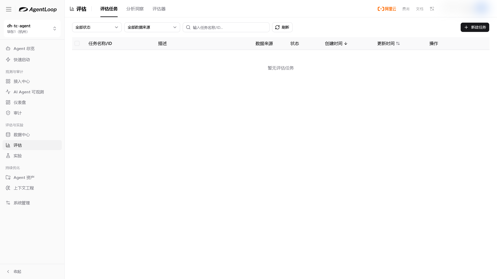
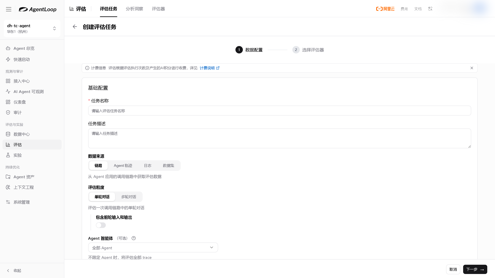
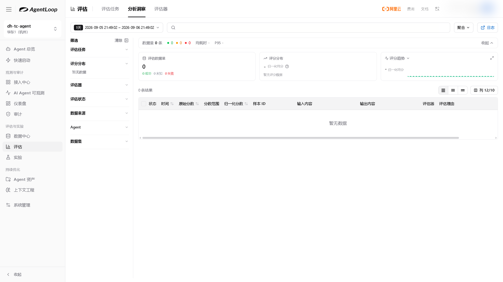
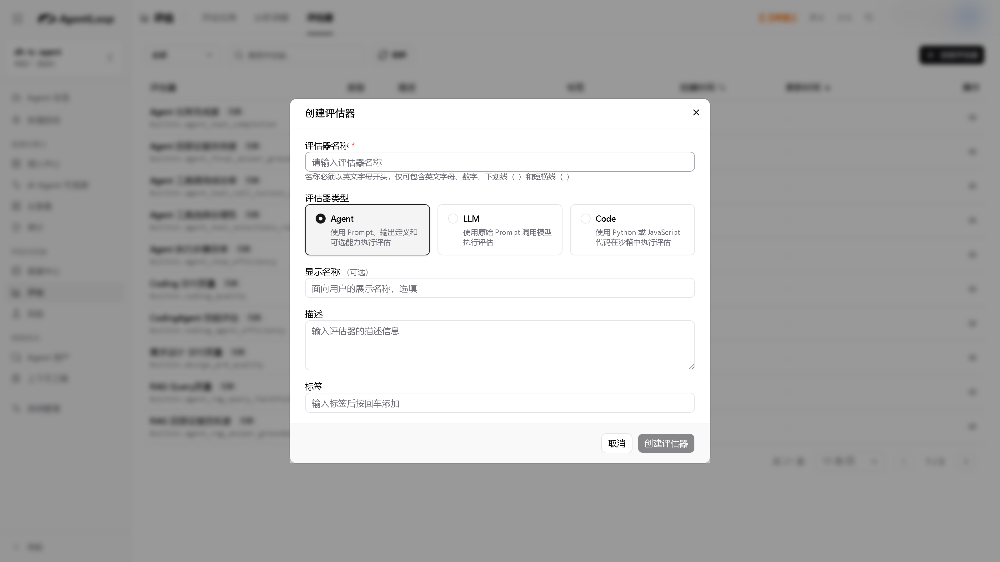
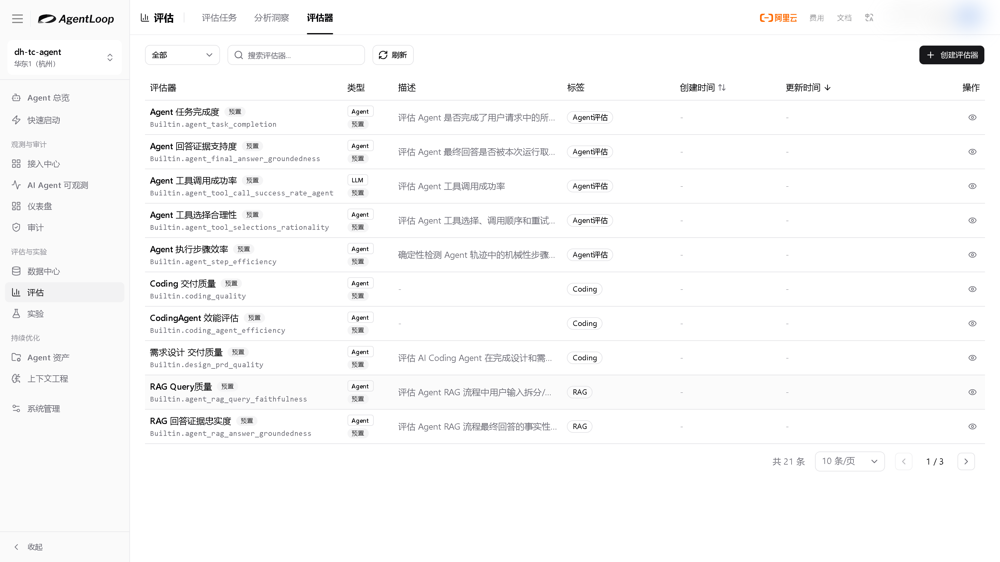
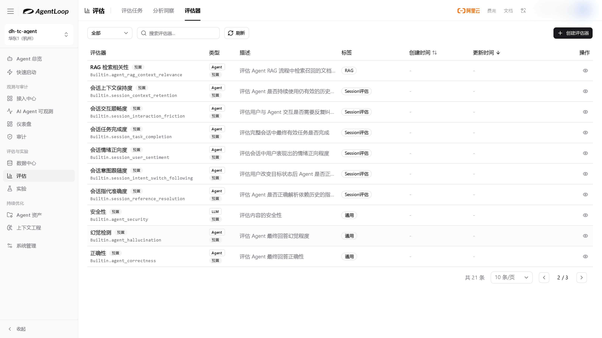
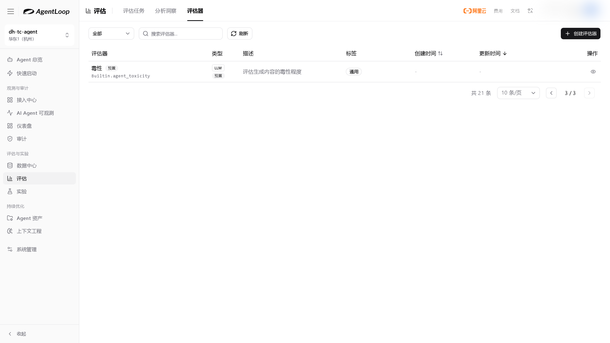
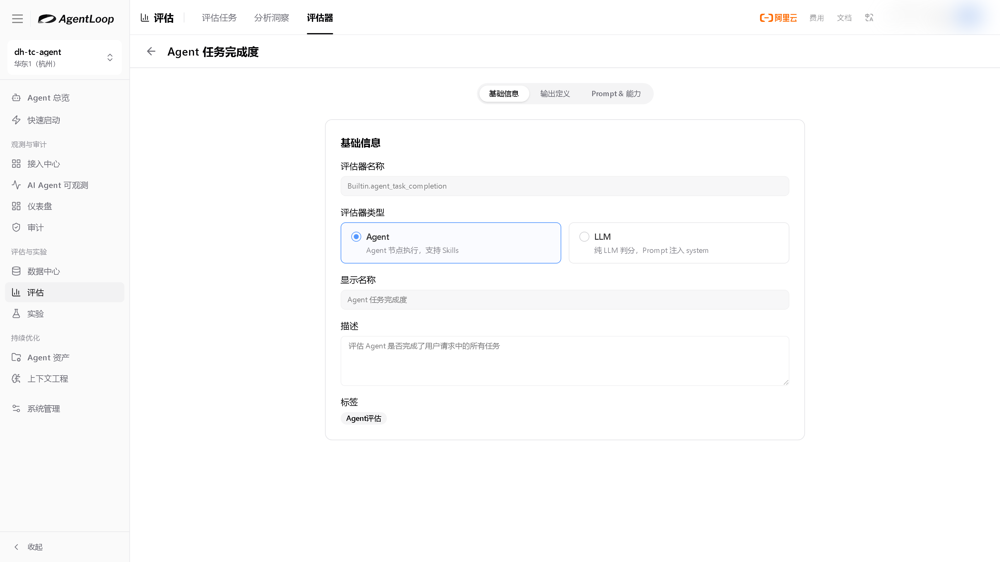
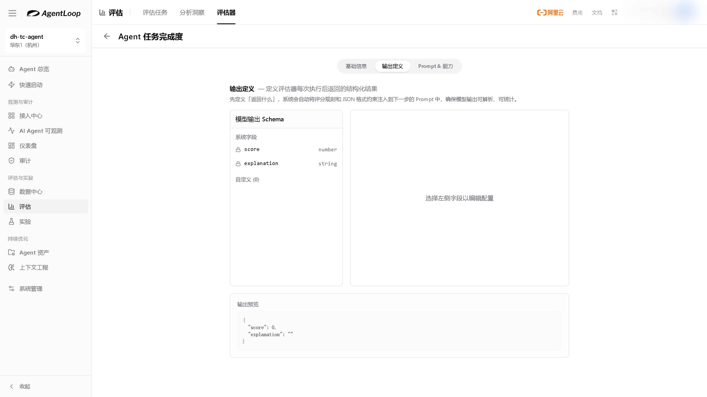
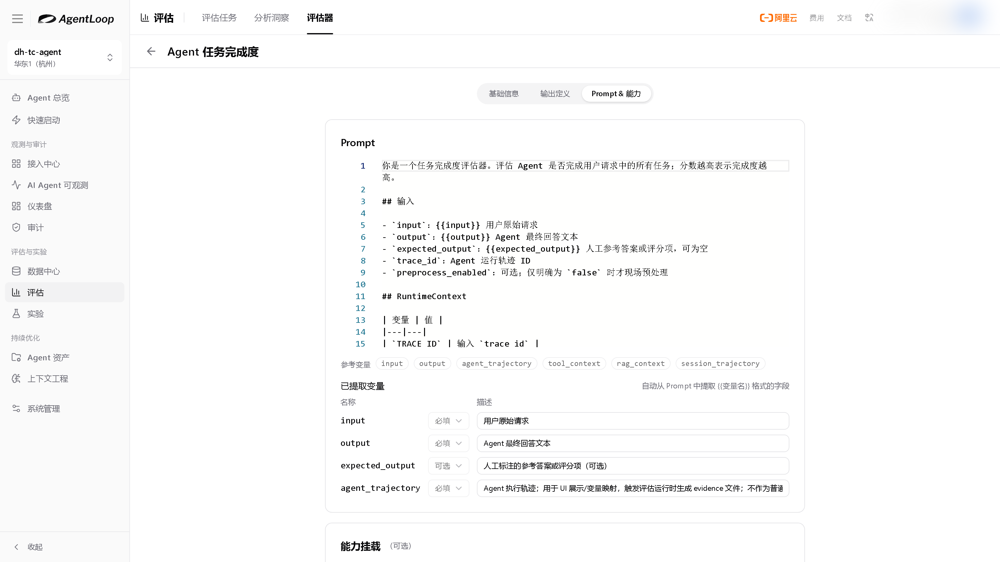

---

## 9. 实验 `experiment-plan`

**一句话**：在受控条件下对比不同配置（模型、Prompt、Agent 版本）的效果差异，与评估共用评估器和数据集。

两个页签：

- **实验计划** `experiment-plan` — 列：计划名称/ID、描述、**实验类型**、执行次数、创建时间、最近执行。新建时可选实验类型，实测有「在线实验」（在平台上配置模型并…），按「实验执行次数及产生的 AI 积分」计费
- **实验记录** `experiment-record` — 列：执行时间、实验记录（配置）/ID、实验计划、数据集、数据量、评估指标、状态；列表页提供 **对比** 操作与「全部数据集 / 全部状态」筛选

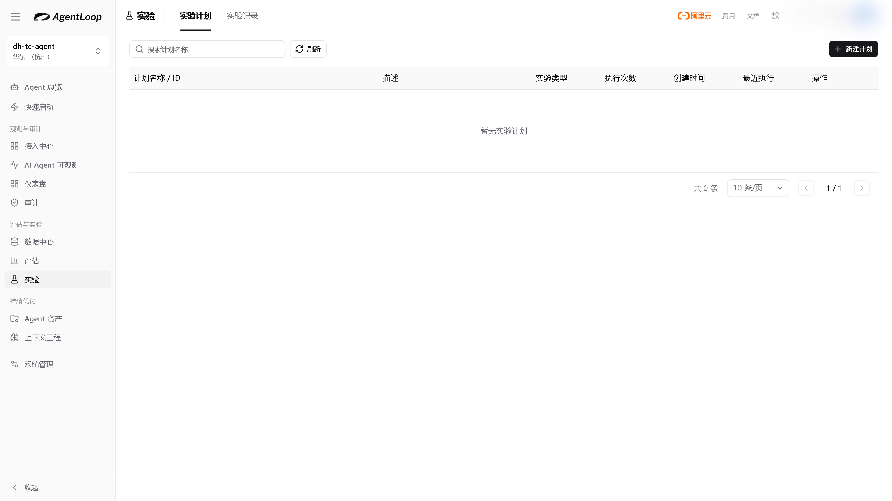
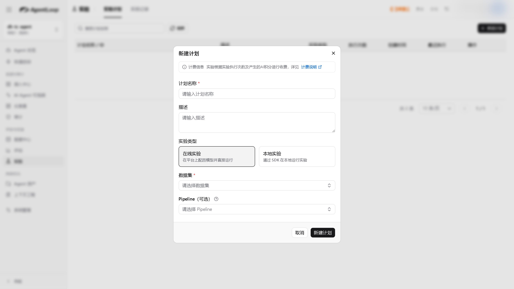
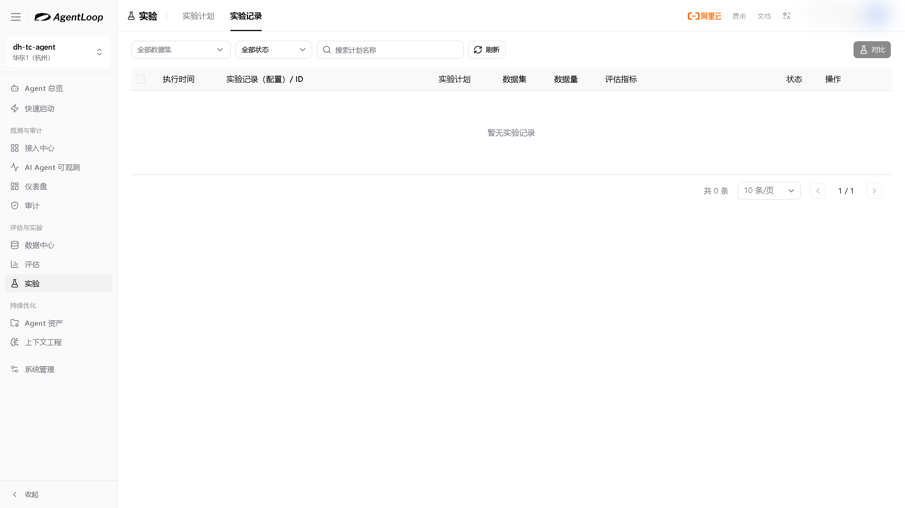

---

## 10. Agent 资产 `agent-asset/prompt`

**一句话**：把 Prompt 与 Skill 从代码里拆出来做版本化托管，实现「不重新部署应用即可发布新版本」。

产品自述价值三点（原文）：**与代码解耦**（在 AgentLoop 上独立发布新版 Prompt 与 Skill，无需重新部署应用）、**持续评估调优**（支持回归测试与历史对照）、**多岗位共建**（设计、运营、产品等领域专家共同参与）。

### 10.1 Prompts `agent-asset/prompt`

新建 Prompt 表单：`Name`（限 64 字符，字母数字下划线短横线，**NameSpace 内唯一**）、`描述`、`Text Prompt` 正文（**变量用双括号 `{{input}}`**，可「添加变量」）。版本机制：`v0.0.1` 起，状态 `草稿` → `保存草稿` / `发布版本`，记录提交人与提交时间。

### 10.2 Skills `agent-asset/skill`

添加 Skill 表单：`Name`（限 64 字符，**字母开头**，NameSpace 内唯一）、`描述`、**`Skill.md` 正文**，模板为 YAML frontmatter：

```
---
name:
description:
version: 0.0.1
---
```

产品自述能力：**可复用的能力封装**（把常用提示词、工具调用、上下文模板封装成 Skill，跨 Agent 复用）、**版本化迭代**（多版本管理，区分 **Latest 与 Production**，灰度切换，回滚秒级）、**安全扫描**（内置 **Prompt Injection**、敏感信息泄露检测）。

> Skill 采用 `Skill.md` + frontmatter 的形态，与 Claude Code 的 skill 格式同构；`Latest / Production` 双通道 + 秒级回滚是把发布工程那一套直接搬到了 Prompt 资产上。

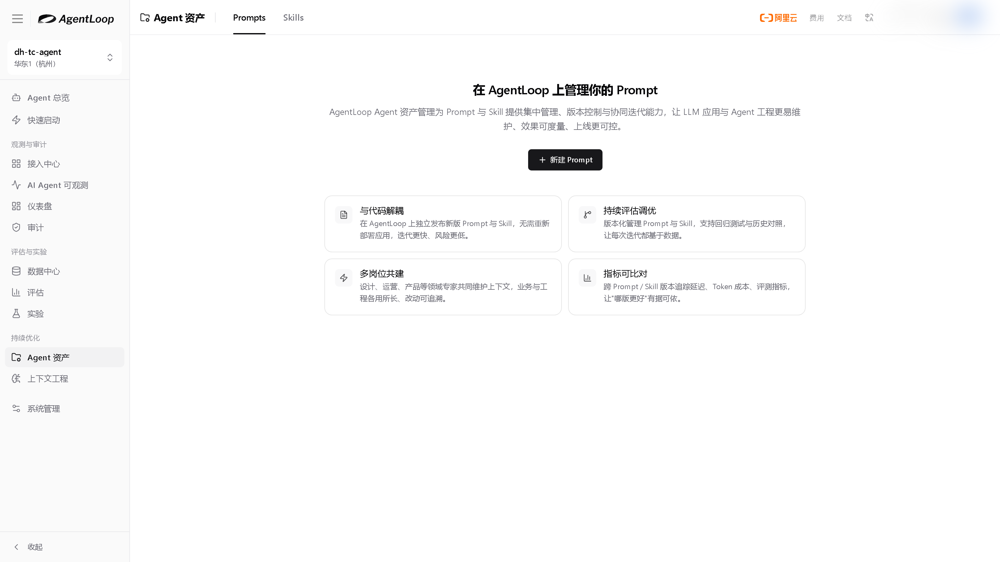
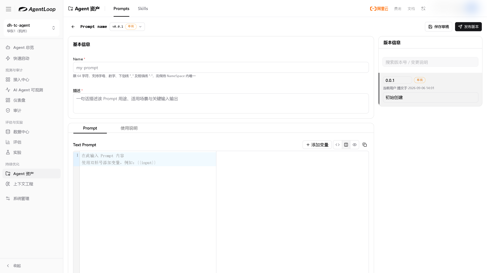
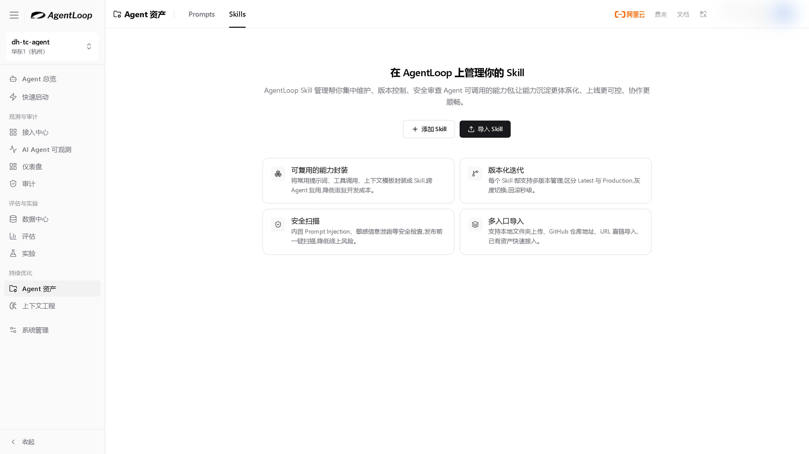
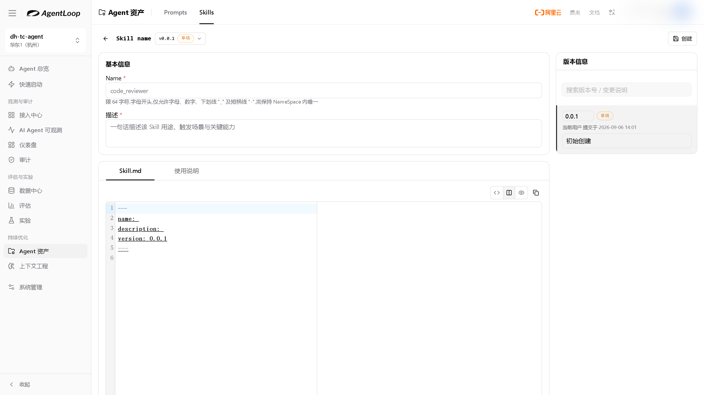

---

## 11. 上下文工程 `experience`

**一句话**：产品里最有方法论野心的模块 —— 从真实运行轨迹里挖掘成功路径与失败模式，在下次任务执行前召回并注入上下文，实现「不改模型权重的自进化」。

### 11.1 经验库 `experience`

产品自述闭环（原文）：

> AgentLoop 从真实运行轨迹中挖掘成功路径和失败模式，并通过 **Recall Skill** 在任务执行前召回相关经验，注入 Agent 运行时上下文。
> 客户 Agent Runtime（执行业务任务，产生输入、工具调用、过程状态和结果）→ AgentLoop 探针采集（采集 Trace，清洗并组装为可分析的 Agent 运行轨迹）→ 经验库挖掘与沉淀 → …
> 不修改模型权重，在 Agent 运行时按需补充经过真实执行验证的上下文。

创建经验库表单：

| 字段 | 说明（原文） |
|---|---|
| Agent 轨迹采集 | 前置开关，需已开启 |
| 经验库名称 / 描述 | — |
| 经验库提取数据源 | 「当前经验库默认使用 AI Agent 可观测模块接入的全链路数据作为数据源（**存储于日志服务 SLS**）抽取 Agent 经验数据，暂不支持修改数据源」 |
| 提取 Agent 应用 | 支持通配，`*` 表示全部，`aaa*` 表示前缀匹配；**仅支持单个末尾 `*`，创建后不可修改** |
| 经验抽取起始时间 | 默认当前时间前 2 小时，**创建后不可修改** |

### 11.2 记忆库 `memoryStore`

列表列：记忆库名称、描述、创建时间。本空间有一条真实数据 `test`。创建表单为基础信息（名称 + 描述）。按官方文档，记忆支持事实、情节、摘要、自定义策略四种类型。

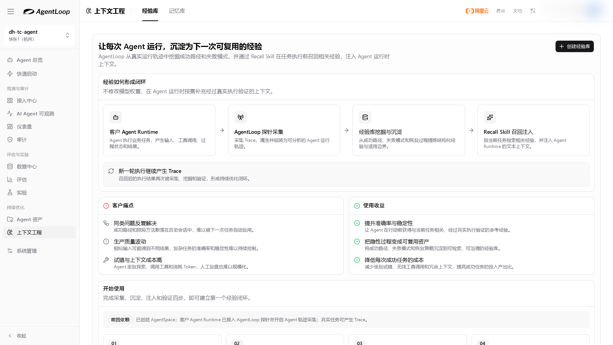
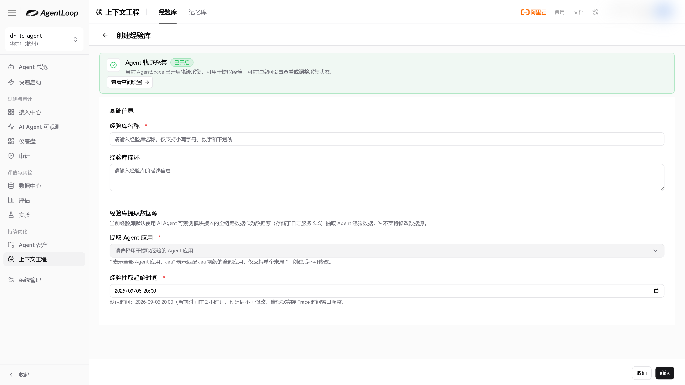
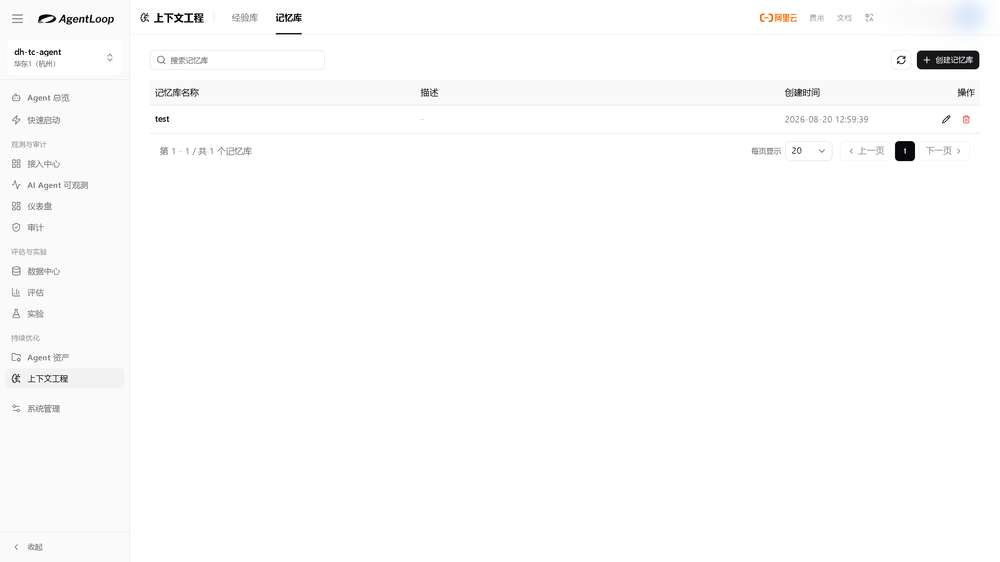
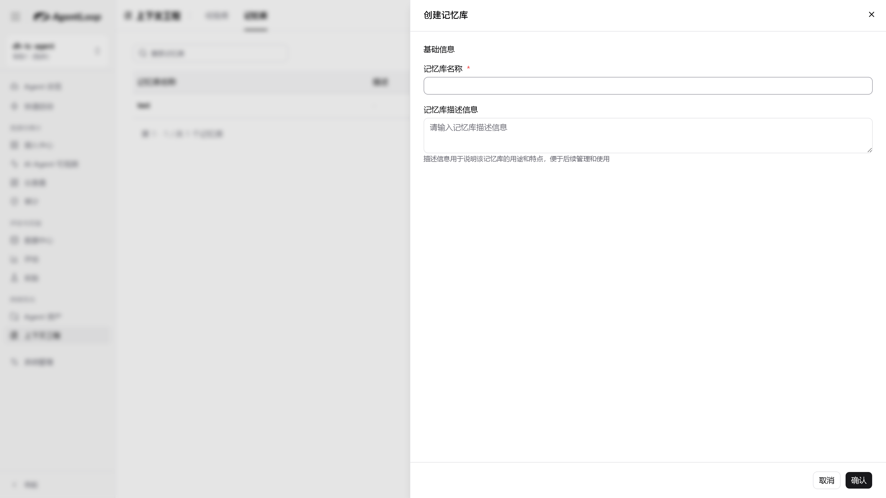

---

## 12. 系统管理 `setting/space`

**一句话**：AgentSpace 级别的配置中心，其中「空间管理」页把产品依赖的云资源全部列了出来 —— 是理解其后端架构最直接的一页。

五个页签：

### 12.1 空间管理 `setting/space`

基础信息：空间名称（**不可修改**）、地域、创建时间、最后更新、描述、状态（运行中）。

**资源绑定（3 项）** —— 详见 [02-技术栈.md](02-技术栈.md)，此处照录原文：

| 资源 | 标识 | 用途（原文） |
|---|---|---|
| 云监控 2.0 工作空间 | `agentloop-<hash>`（自动创建） | 提供可观测、仪表盘、告警能力（1:1 绑定，不可修改） |
| xTrace（已接入） | SLS Project `proj-xtrace-<hash>-cn-hangzhou`，Logstore `logstore-tracing` | 链路数据 |
| MSE AI 治理中心 · 命名空间 | 名称 `agentloop-<hash>`，ID `e8d22f20-…`（自动创建） | 提供 Agent 资产管理，如 Prompts、Skills（1:1 绑定，自动创建，不可修改） |
| SLS 日志服务 Project | `agentloop-<hash>`（自动创建） | 存储评估、实验、审计日志（自动创建，不可修改） |
| └ Agent 轨迹 Logstore | `agent-trajectory` | **Trace 与 eBPF 日志独立清洗，并共同写入 `agent-trajectory`** |

该行右侧还有两个独立开关 —— **`Trace`（本空间为开启）**与 **`eBPF 日志`（本空间为关闭）**，即两路数据源可分别启停，这也印证了「独立清洗、共同写入」的说法。

删除空间的说明也交代了资源归属：「删除后将永久清除 AgentLoop 所属资源，包括数据集、数据处理任务、评估任务、实验记录等。关联云产品资源默认不会删除；云监控 2.0 工作空间、MSE 命名空间和 SLS Project 仅在删…（截断）」

### 12.2 服务注册 `setting/service`

两个子页签：`Agent 服务注册` / `模型服务注册`。用于「注册 Agent 服务的端点连接和运行参数」，是实验 / Playground 能主动调用被测 Agent 的前提。

### 12.3 额度配置 `setting/quota`

「配置评估和实验的每日 **AI 积分**消耗限额，超出额度后将阻断新任务执行。」分「评估」「实验」两项独立设限，各显示当日用量。页面注明：用量数据存在约 5 分钟延迟；用量为预估值，以费用中心出账为准。

### 12.4 标注配置 `setting/annotation`

「配置样本、轨迹和评估结果可复用的标注字段，支持**文本、数值、布尔和枚举**四种类型。」列：标注 Key、类型、配置、描述、更新时间。

### 12.5 标签管理 `setting/labels`

统一管理标签 Key、描述和 Value，作用域为当前 AgentSpace。

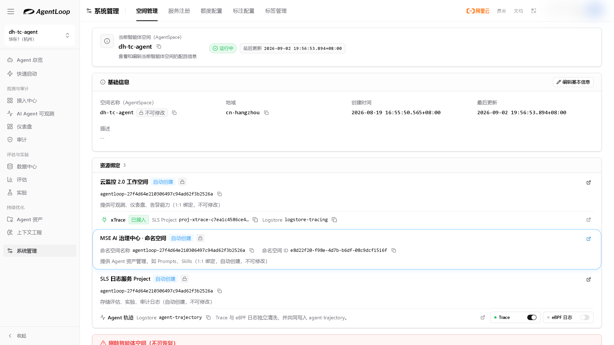
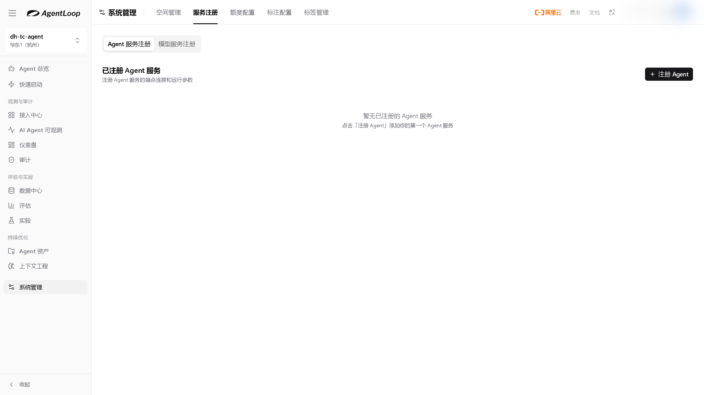
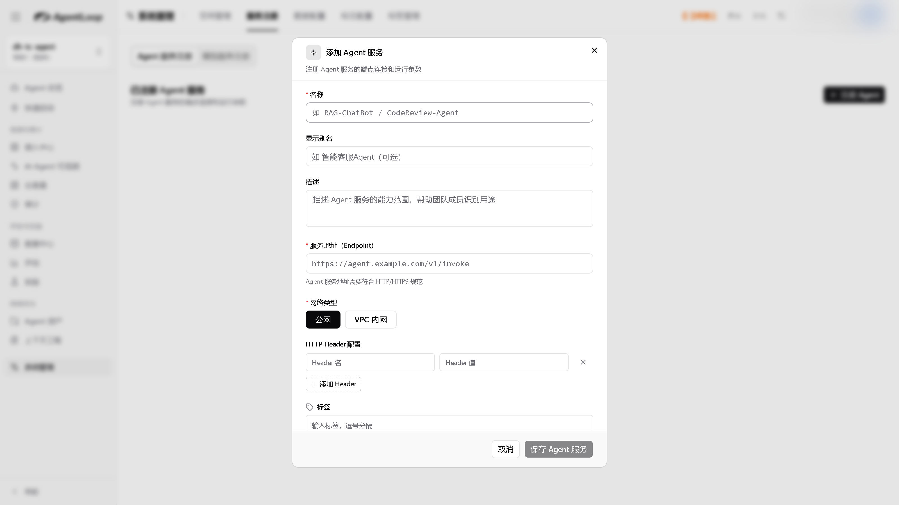
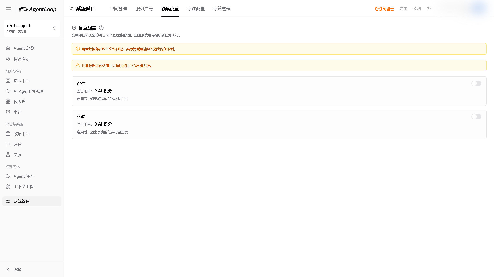
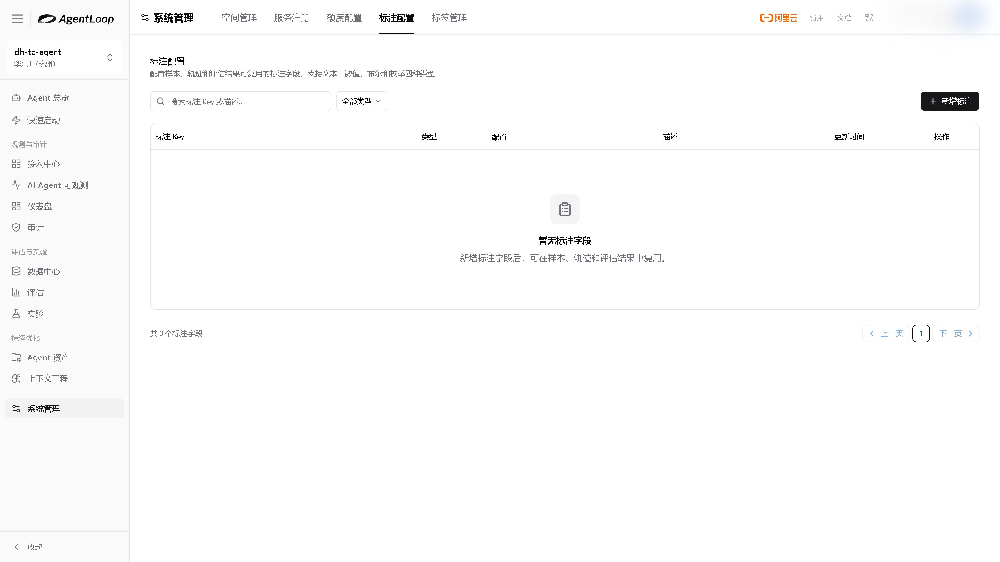
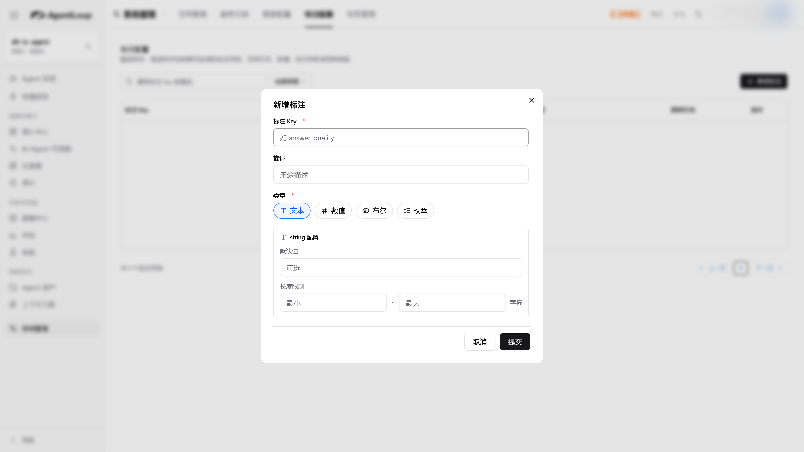
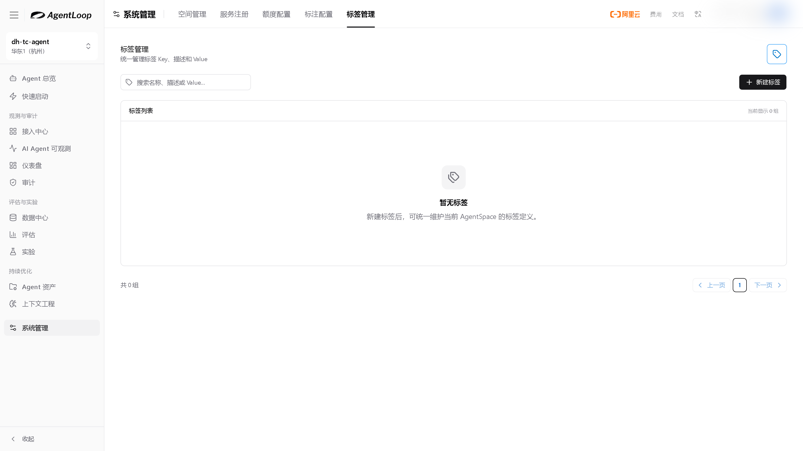
