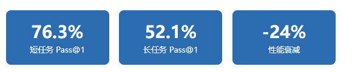

# 一篇文章讲明白：Agent评测怎么做？与LLM评测的区别是什么？

> **原文存档** —— 全文抓取，未做删改、摘要或解读。
>
> - 原文链接：https://mp.weixin.qq.com/s/WeCvRp1bx6JeeI7bycVPQQ
> - 公众号：大模型评测学习
> - 发布日期：2026-08-07
> - 抓取日期：2026-08-11
> - 随文图片：1 张，存于 `assets/14-Agent评测怎么做与LLM评测的区别/`

---
— 大模型评测实战系列 · 进阶分支 —

上一篇《黑话指南2.0》讲完了 Agent 的基础术语——Function Calling、Planning、Memory、Multi-Agent，评论区有人问：**"术语我懂了，但 Agent 到底怎么评？"**

好问题。这个问题比你想的复杂得多。

Agent 评测和普通的大模型评测，根本不是一回事。**用评 LLM 的方法去评 Agent，就像用驾考科目一的笔试成绩，去判断一个人能不能开 F1 赛车**——试卷满分不代表上路不出事。

这篇就从 Agent 是什么、架构长什么样、为什么评测方法完全不同，一直讲到 5 大评测维度、长程短程的分水岭，最后给你一张主流 Benchmark 全景图。

## 一、Agent 到底是什么？

先说清楚一个最基础但最多人搞混的问题：**Agent 和 LLM 到底什么区别？**

LLM = 嘴巴

-   你问它答，一轮搞定

-   不会主动行动

-   不能调用外部工具

-   没有记忆（每次对话独立）

-   **本质：文本生成器**

Agent = 手脚

-   自己拆任务、自己执行

-   能主动调用工具和 API

-   能观察结果、调整策略

-   有记忆，能跨轮积累信息

-   **本质：自主行动系统**

一句话总结：**LLM 是"会说话"的 AI，Agent 是"会干活"的 AI**。

你让 LLM "帮我订一张明天去北京的机票"，它会给你写一段漂亮的回复，告诉你应该怎么订。但 Agent 会真的去查航班、选座位、完成支付——它不只是回答问题，它是**执行任务**。

**代表选手**：Manus、AutoGPT、Devin、Claude Code、Codex、Cursor Agent、Dify 工作流……这些都能自主规划+调用工具+多步执行，都是 Agent。

## 二、Agent 的 5 层架构

要理解 Agent 评测，你得先理解 Agent 的架构。一个完整的 Agent 系统，通常由 5 个核心组件构成：

感知 Perception

 →

规划 Planning

 →

记忆 Memory

 →

行动 Action

 →

反思 Reflection

↻ 循环往复，直到任务完成

| 组件 | 做什么 | 类比 |
| --- | --- | --- |
| 感知 | 接收用户指令、环境反馈、工具返回结果 | 眼睛和耳朵 |
| 规划 | 把大目标拆成可执行的子步骤 | 大脑做计划 |
| 记忆 | 存储上下文、中间结果、历史交互 | 笔记本 |
| 行动 | 调用工具、执行 API、操作界面 | 手脚 |
| 反思 | 检查结果是否正确，决定是否调整 | 自我纠错 |

关键在于：**这 5 个组件不是线性的"走一遍就完"，而是循环的**。Agent 感知到信息 → 规划下一步 → 调用工具行动 → 观察结果 → 反思是否正确 → 再规划下一步……这个循环可能重复几十次甚至上百次。

这就是 Agent 评测难的根本原因：**你要评的不只是"最终答案对不对"，而是这个循环过程中每一步走得对不对**。一个"碰巧走对了"的 Agent 和一个"每步都走对了"的 Agent，最终结果可能一样，但可靠性天差地别。

## 三、为什么 Agent 评测和 LLM 评测完全不同？

很多人觉得"Agent 不就是 LLM 加了工具吗，评测方法差不多吧"——这是最危险的误解。

差异 1

单轮 vs 多轮：路径比结果更重要

LLM 评测是**单轮**的：给一个输入，看输出对不对。像考试做选择题，ABCD 选对了就行。

Agent 评测是**多轮**的：Agent 可能要走 30 步才能完成任务。同样的终点，一个 Agent 走了 30 步，另一个走了 5 步——你说哪个好？

**Agent 评测要看"轨迹"，不只是看"终点"**。一个绕了远路但到了的 Agent，和一个直奔目标的 Agent，用户体验完全不同。

差异 2

静态 vs 动态：环境会变，工具会出错

LLM 评测的环境是**静态**的：题目固定，你随时重跑都一样。

Agent 评测的环境是**动态**的：API 可能超时，网页可能改版，数据库可能更新。同一个任务，今天跑通了，明天可能就失败。

这就引出了一个 LLM 评测不需要操心的问题：**可靠性**。一次跑通不算本事，次次跑通才算。

差异 3

结果 vs 过程：怎么到的比到了没更重要

LLM 评测只看结果：答案对了就是对了。

Agent 评测要看过程：

-   它选对工具了吗？

-   它的规划合理吗？

-   它有没有中途跑偏？

-   它遇到错误时恢复了吗？

-   它有没有做不可逆的危险操作？

**一个 Agent 可能"蒙对了"最终结果，但中间调错了 5 次工具、绕了 20 步弯路——这在生产环境是不可接受的**。

## 四、Agent 评测的 5 大维度

搞清楚了"为什么不同"，接下来看"评什么"。Agent 评测的核心维度可以归纳为 5 个：

1任务完成率（Success Rate）

SR Pass@1 Pass@k

最基础的指标：**Agent 有没有完成任务**。

注意，"完成"的定义必须精确。比如"帮我订机票"——是选了航班算完成？还是完成支付算完成？**定义不清楚，评测结果就没意义**。

常用指标：

-   `Pass@1`

    ：跑 1 次成功的概率

-   `Pass@k`

    ：跑 k 次中至少 1 次成功的概率

**坑**：Pass@1 高不代表可靠。一个 Pass@1=70% 的 Agent，意味着每 3 次有 1 次失败——你敢上生产吗？

2工具调用准确率（Tool Call Accuracy）

工具选择正确率 参数正确率 调用效率

Agent 最大的特点就是**能调用工具**。工具调用评 3 个层面：

-   **选对了吗**

    ：该用搜索 API 的时候有没有用搜索

-   **参数对了吗**

    ：查询日期、城市名有没有传错

-   **效率高吗**

    ：有没有重复调用同一个工具、有没有调了不必要的工具

一个常见问题：**Agent 在任务前半段工具调用很准，到后半段就开始"退化"**——JSON 格式写错、调用顺序混乱、甚至开始"幻觉"工具返回值（自己编一个不存在的返回结果）。这个问题只在长任务中才会出现。

3规划能力（Planning）

Progress Rate Step Success Rate Plan Similarity

Agent 能不能把一个大目标拆成合理的子步骤？拆解后每一步走得对不对？

常用指标：

-   `Progress Rate（进度率）`

    ：Agent 完成了多少比例的子目标

-   `Step Success Rate`

    ：每一步执行成功的比例

-   `Plan Similarity`

    ：Agent 的规划和"标准规划"有多相似

规划能力差的典型表现：**原地打转**。Agent 反复执行同一个动作，陷入死循环却不自知。

4记忆能力（Memory）

Factual Recall Consistency Score Memory Span

Agent 在长任务中能不能记住前面获取的信息？会不会前后矛盾？

这个维度在**长程任务**中尤为关键。一个 30 步的任务，Agent 在第 3 步获取的信息，到第 25 步还需要用到——它记住了吗？

-   `Factual Recall`

    ：能准确回忆之前获取的事实吗

-   `Consistency Score`

    ：前后回答一致吗，有没有自相矛盾

-   `Memory Span`

    ：能保持多长的记忆

**反直觉发现**：2026 年的研究发现，**给 Agent 加更多记忆模块，反而可能降低长程任务表现**。因为记忆越多，干扰也越多——Agent 被无关信息带偏的概率增加了。记忆管理的核心不是"记得多"，而是"记得准、忘得对"。

5可靠性（Reliability）

Pass^k Consistency Robustness

这是 Agent 评测**最容易被忽视、但生产环境最重要**的维度。

Pass@k 和 Pass^k 看着像，意思完全相反：

-   `Pass@k`

    ：跑 k 次，**至少 1 次**成功 → 衡量"能力上限"

-   `Pass^k`

    ：跑 k 次，**全部**成功 → 衡量"可靠性下限"

举个例子：一个 Agent 跑 8 次，4 次成功 4 次失败。

-   Pass@8 = 100%（至少有 1 次成功）→ 看起来完美

-   Pass^8 = 0%（不是全部成功）→ 真相暴露

**生产环境要看 Pass^k，不是 Pass@k**。你不会希望你的客服 Agent "偶尔"能处理退换货——你要的是"每次"都能处理。

τ-bench（Tau-bench）这个 Benchmark 专门测可靠性，研究发现 GPT-4o 在客服场景的 Pass@1 约 50%，但 Pass^8 只有 25%——**这意味着它"偶尔能做好"，而不是"稳定能做好"**。

· · ·

## 五、长程 vs 短程 Agent——评测的分水岭

如果你只能记住这篇文的一个概念，就记住这个：**长程 Agent 和短程 Agent 的评测方法完全不同**。

### 定义对比

| 维度 | 短程 Agent（Short-horizon） | 长程 Agent（Long-horizon） |
| --- | --- | --- |
| 步数 | 1 ~ 几步 | 几十 ~ 几百步 |
| 典型任务 | "修这个函数的 bug" | "读完整个仓库，加一个新功能" |
| 上下文依赖 | 低，信息基本在初始输入里 | 高，后续步骤依赖前面收集的信息 |
| 错误影响 | 可控，错了重来就行 | 不可逆，早期错误会层层放大 |
| 评测重点 | 能力：能不能做对 | 可靠性：能不能持续做对 |
| 核心指标 | Pass@1 | Pass^k + 进度率 + 轨迹分析 |

### 长程任务的 4 种"崩溃模式"

长程 Agent 最可怕的不是"做不了"，而是<strong>"做着做着就崩了"</strong>。2026 年的研究总结了 4 种典型的长程崩溃模式：

崩溃 1

错误累积（Compounding Errors）

每一步都有很小的错误概率，但错误会**叠加**。

假设每步成功率 95%，听着很高对吧？但 20 步的链条，整体成功率只有 `0.95^20 = 36%`。**20 步里 64% 的概率会失败**——这就是为什么长程任务这么难。

崩溃 2

状态漂移（State Drift）

Agent 没有"忘了"任务——任务还在上下文窗口里——但它的**注意力逐渐偏移**，开始优化局部连贯性而非全局目标。

就像你本来要去超市买菜，路上看到奶茶店买了杯奶茶，又看到书店进去翻了翻书，最后回家发现菜没买——每一步都"合理"，但整体跑偏了。

崩溃 3

崩溃行为（Meltdown）

Agent 从"虽然走错了但还在推理"变成**彻底失去理智**：

-   反复调用同一个失败的工具，陷入死循环

-   自相矛盾——第 10 步说的和第 5 步说的完全相反

-   "幻觉"工具返回值——工具根本没返回，Agent 自己编了一个

这种模式在短程评测中**永远不会出现**，只在长程任务中暴露。

崩溃 4

工具使用退化（Tool Degradation）

Agent 在任务前半段工具调用很规范——选对工具、参数正确、格式合法。但**走到后半段开始"疲劳"**：

-   JSON 参数格式写错（多了括号、少了引号）

-   该用写工具的时候调了读工具

-   输出结构越来越混乱

这种退化在 1-2 步的短任务中看不到，**只有在十几步以上的长任务中才会浮现**。

### 一个让所有人沉默的数据

这组数据来自 2026 年一项覆盖 23,392 个任务 episode 的可靠性研究。**同样的模型，从短任务到长任务，Pass@1 从 76.3% 暴跌到 52.1%**——24 个百分点的衰减，而且是**超线性衰减**（比线性预测更差）。

更扎心的是：在软件工程场景，"优雅降级分数"（Graceful Degradation Score）从 0.90 跌到 0.44——**Agent 不是"多犯了几个小错"，而是整体行为质量崩塌**。

**结论**：如果你的 Agent 只在短程 Benchmark 上测过，**你根本不知道它在长程任务中会怎样**。生产环境的任务，绝大多数都是长程的。

· · ·

## 六、主流 Agent 评测 Benchmark 一览

理论讲完了，看实战。目前主流的 Agent 评测 Benchmark 有这些：

| Benchmark | 领域 | 任务数 | 核心指标 | 特点 |
| --- | --- | --- | --- | --- |
| SWE-bench | 软件工程 | 2,294 题 | % Resolved | 真实 GitHub issue 修复，最被引用的 Agent Benchmark |
| GAIA | 通用助手 | 466 题 | Accuracy | 真实世界多步骤任务，人类 92% vs GPT-4 仅 15% |
| WebArena | 网页导航 | 812 题 | Task SR | 在真实网站（电商/论坛/GitLab）上完成任务 |
| τ-bench | 客服场景 | 多轮对话 | Pass^k | 专测可靠性，"偶尔做对"和"稳定做对"一目了然 |
| AgentBench | 综合评测 | 8 大环境 | 各环境 SR | 覆盖 OS/数据库/知识图谱/游戏等 8 个场景 |
| OSWorld | 桌面操作 | 369 题 | Task SR | 在真实操作系统上完成 GUI 任务 |

**怎么选？**
→ 测代码能力：SWE-bench
→ 测通用助手：GAIA
→ 测网页操作：WebArena
→ 测可靠性：τ-bench
→ 测综合能力：AgentBench
**别只跑一个**——一个 SWE-bench 满分的 Agent，在 WebArena 上可能只有 15%。

## 七、3 步开始你的 Agent 评测

**Step 1：先定义"成功"长什么样**

这是最基本但最容易跳过的一步。"帮我订机票"——什么算成功？
→ 选了航班？
→ 完成了支付？
→ 用户确认了订单？

**定义不清，评测结果就是垃圾**。把"成功条件"写下来，用代码能验证的那种。

**Step 2：选对 Benchmark 切片**

不要一上来就跑全量 Benchmark。先从你的业务场景出发，选一个最相关的 Benchmark，再从中挑一个**子集**。

比如你做客服 Agent，就选 τ-bench，先跑 20 个任务看看。跑通了再扩到 100 个、500 个。**渐进式扩展，别一上来就全量**——你会被环境的复杂度淹没。

**Step 3：跑 Pass^k 看可靠性**

同一批任务，跑 5-8 次，看 Pass^k。

如果 Pass@1 = 70% 但 Pass^5 = 20%，说明你的 Agent **"偶尔能做好"但不稳定**——这时候你应该优化的是**一致性**，不是能力。

记住：**生产环境看 Pass^k，开发阶段看 Pass@1**。两个指标都要跑，但决策时以 Pass^k 为准。

## 八、Agent 评测 vs LLM 评测：对红队的不同要求

LLM 的红队评测和 Agent 的红队评测，**完全不是一个量级的挑战**：

| 维度 | LLM 红队 | Agent 红队 |
| --- | --- | --- |
| 攻击面 | 只有"文本输入" | 文本+工具调用+API+文件系统+网络 |
| 风险类型 | 说错话、泄隐私、有偏见 | 做错事：删数据、转账、发邮件、改代码 |
| 可逆性 | 基本可逆（删掉重生成） | 不可逆（钱转了就没了，代码推了就推了） |
| 攻击路径 | 直接 prompt 注入 | 间接注入：通过工具返回值、网页内容、文件内容 |
| 影响范围 | 单次对话 | 可能影响整个系统（权限提升、数据泄露） |

**核心区别一句话**：LLM 红队测的是"它会不会说不该说的"，Agent 红队测的是"它会不会**做**不该做的"。后者危险得多——因为 Agent 有**执行权限**。

## 总结：一张图记住 Agent 评测

| 如果你… | 你应该看… |
| --- | --- |
| 刚开始了解 Agent 评测 | 第 1-3 章：Agent 是什么、架构、和 LLM 评测的区别 |
| 要设计评测方案 | 第 4 章：5 大维度 + 第 6 章：Benchmark 选型 |
| Agent 总出问题 | 第 5 章：长程崩溃的 4 种模式 + Pass^k |
| 要上生产了 | 第 7 章：3 步实操 + Pass^k 可靠性 |
| 做安全合规 | 第 8 章：Agent 红队 vs LLM 红队 → 下一篇红队实操 |

Agent 评测的核心不是"它能不能做"，而是"它**稳不稳**"。
短程看能力，长程看可靠性。
能力用 Pass@1 测，可靠性用 Pass^k 测。
**别拿短程的成绩去赌长程的生产环境**。

— 大模型评测实战系列 · 持续更新中 —

觉得有用？点赞、在看、转发三连，让更多人看到 👇
