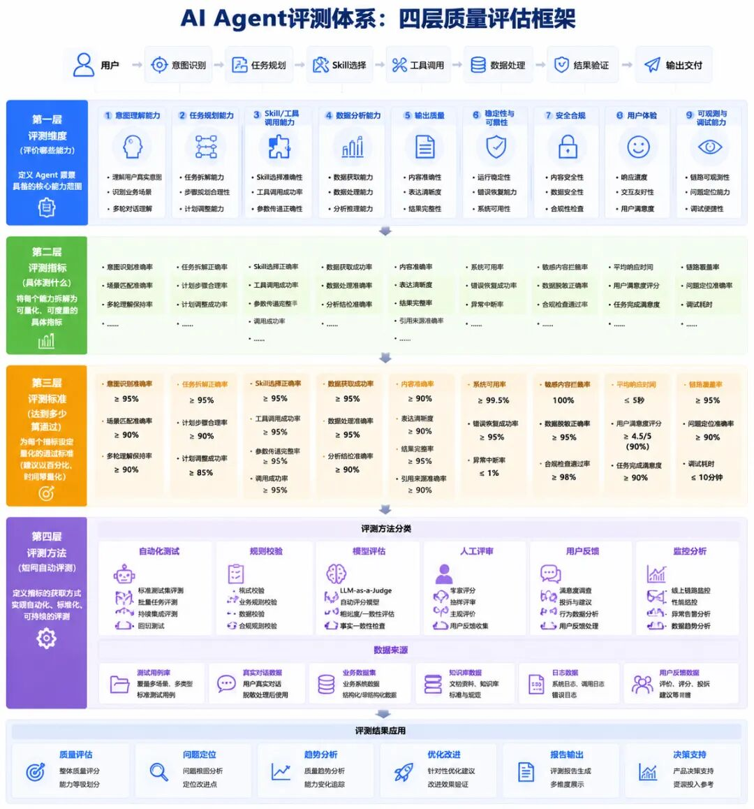

# AI Agent评测体系：四层质量评估框架

> **原文存档** —— 全文抓取，未做删改、摘要或解读。
>
> - 原文链接：https://mp.weixin.qq.com/s/2aYxkiWa89pr9lcSwgKbpw
> - 公众号：MMAI未来探索者
> - 发布日期：2026-07-11
> - 抓取日期：2026-08-11
> - 随文图片：1 张，存于 `assets/15-AI-Agent评测体系-四层质量评估框架/`

---
随着 AI Agent 从“智能问答”逐渐走向“任务执行”，企业关注的重点已经不再只是模型回答是否准确，而是 Agent 能否真正完成复杂任务。

一个成熟的 AI Agent，需要具备理解用户意图、规划任务流程、调用工具、处理数据、验证结果以及交付业务价值的完整能力。

因此，企业需要建立一套系统化的 Agent 评测体系，对 Agent 的能力、质量和稳定性进行全面评估。

---

## **一、为什么需要 Agent 评测体系？**

传统 AI 应用主要关注：

-   模型准确率
-   回复质量
-   响应速度

但 Agent 与传统 AI 最大的区别在于：

它不是一次性的回答，而是一条完整的智能执行链路。

例如：

用户提出需求
↓
Agent理解意图
↓
制定任务计划
↓
选择 Skill / 工具
↓
调用数据和模型
↓
分析处理结果
↓
验证结果可靠性
↓
输出最终交付内容

任何一个环节出现问题，都可能导致任务失败。

因此，Agent 评测需要从“单点能力评价”升级为“全流程质量评价”。

---

# **二. 四层质量评估框架**

## **第一层：评测维度——评价 Agent 具备哪些能力**

第一层解决的问题是：

**一个优秀的 Agent，需要具备哪些核心能力？**

围绕 Agent 工作链路，可以从以下维度进行评价：

### **1\. 意图理解能力**

判断 Agent 是否准确理解用户需求、识别业务场景。

### **2\. 任务规划能力**

判断 Agent 是否能够拆解任务，并制定合理执行路径。

### **3\. Skill / 工具调用能力**

判断 Agent 是否能够选择正确能力，并完成可靠调用。

### **4\. 数据分析能力**

判断 Agent 是否能够获取、处理和分析业务数据。

### **5\. 输出质量**

判断最终结果是否准确、完整、符合业务要求。

### **6\. 稳定性与可靠性**

判断 Agent 在复杂任务中的运行稳定性。

### **7\. 安全合规能力**

判断 Agent 是否满足数据安全、权限控制等要求。

### **8\. 用户体验**

判断交互是否自然、高效。

### **9\. 可观测与调试能力**

判断是否能够追踪任务链路、定位问题并持续优化。

---

## **第二层：评测指标——具体测什么**

明确能力之后，需要进一步拆解成可量化指标。

例如：

**意图理解能力**

对应指标：

-   意图识别准确率
-   场景匹配准确率
-   多轮对话一致性

**任务规划能力**

对应指标：

-   任务拆解正确率
-   规划路径合理性
-   任务完成率

**工具调用能力**

对应指标：

-   Skill选择准确率
-   参数传递完整率
-   工具调用成功率

**输出质量**

对应指标：

-   内容准确率
-   信息完整率
-   结果一致性

通过指标体系，让 Agent 能力从“主观感受”变成“数据衡量”。

---

## **第三层：评测标准——达到多少算通过**

只有指标还不够，还需要明确质量标准。

例如：

-   意图识别准确率 ≥95%
-   Skill调用准确率 ≥95%
-   内容准确率 ≥90%
-   数据处理准确率 ≥95%
-   平均响应时间 ≤5秒
-   用户满意度 ≥90%

不同业务场景，可以根据实际要求制定不同验收等级：

优秀、良好、合格、不合格。

通过标准化门槛，保证 Agent 上线质量。

---

## **第四层：评测方法——如何自动评测**

最后需要解决：**如何持续、高效地评价 Agent？**

主要包括：

### **自动化测试**

通过测试集、Benchmark 数据集进行批量测试。

### **规则校验**

通过业务规则检查格式、字段、逻辑一致性。

### **模型评估**

利用 LLM-as-a-Judge 对结果进行自动评分。

### **人工评审**

由专家进行复杂任务质量评价。

### **用户反馈与线上监控**

基于真实使用数据持续优化。

最终形成：

测试 → 发现问题 → 分析原因 → 优化 Agent → 再测试

的持续改进闭环。

---

# **三. Agent评测的核心，不是评价“会不会回答”，而是评价“能不能完成任务”**

未来企业级 Agent 的竞争，不只是模型能力的竞争，更是：

-   任务执行能力
-   工具协同能力
-   结果可靠能力
-   持续优化能力

的综合竞争。

建立完善的 Agent 评测体系，才能让 AI Agent 从“Demo可用”走向“企业可信赖”。
