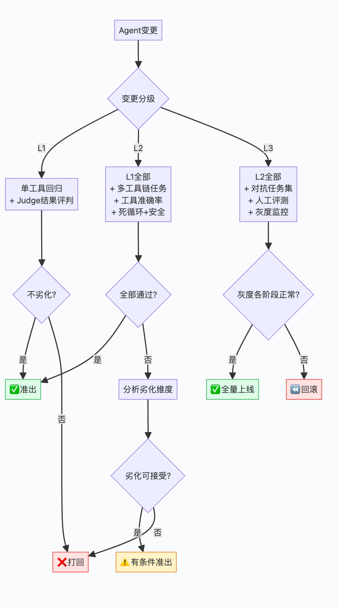

# AI Agent 评测指南

> **原文存档** —— 全文抓取，未做删改、摘要或解读。
>
> - 原文链接：https://mp.weixin.qq.com/s/emNgDJciraMSQIshpcZIIw
> - 公众号：划小船
> - 发布日期：2026-06-14
> - 抓取日期：2026-08-11
> - 随文图片：1 张，存于 `assets/16-AI-Agent评测指南/`

---
# AI Agent 评测指南：从指标设计到准出标准

**文 | AI编程实践**

> 你的 Agent 能自主规划、调用工具、创建 SubAgent 并行干活——看起来很强大。但上线一周后，用户反馈 Agent "有时候死循环""经常选错工具""10次里有3次任务没完成"。
>
> 单次体验看不出问题，评测体系才能暴露真相。这篇文章围绕 AI Agent 业务场景，系统拆解评测的三个核心问题：**测什么**（Agent 专属指标体系）**、怎么测**（自动化+LLM-as-Judge+人工）**、什么时候算通过**（分级准出标准）。

---

## 一、Agent 评测为什么比对话评测难得多

普通 LLM 评测只关心"回答好不好"。Agent 评测要关心"事有没有办成"——这中间多了工具调用、多步规划、错误恢复、SubAgent 协作。

```
Agent 评测的五个独特挑战：

1. 评测的是"任务链"而非"单次回答"
   普通LLM：用户问 → 模型答 → 评判答案质量
   Agent：用户给目标 → Agent规划 → 调用工具A → 读结果 →
          调用工具B → 发现错误 → 修正 → 调用工具C → 返回结果
   评测需要看从"收到目标"到"完成任务"的完整链条

2. 工具调用的正确性难以自动判定
   模型选了 read_file("src/auth.ts")，但正确答案应该是
   read_file("src/auth/login.ts")——算对还是算错？
   工具选对了但参数不够精确，又怎么打分？

3. Agent 的"犯错"和"修复"是正常行为
   好的 Agent 不是不犯错，而是犯错后能自己发现并修复。
   如何评测"从错误中恢复"的能力？

4. SubAgent 协作的评测是空白地带
   主 Agent 是否在正确的时机创建了 SubAgent？
   SubAgent 的结果是否被正确整合？
   并行 SubAgent 的调度是否合理？

5. 同一个任务，不同 Agent 可能有完全不同的正确路径
   任务"找出项目中的安全漏洞并修复"：
   Agent A 先全局搜索 → 逐个分析 → 生成修复
   Agent B 先看配置文件 → 分析依赖 → 检查代码
   两条路径都可能是正确的——不能按"路径"评判，只能按"结果"评判
```

| 对比维度 | 对话 LLM 评测 | Agent 评测 |
| --- | --- | --- |
| 评测对象 | 单轮/多轮回复 | 多步任务执行链 |
| 核心问题 | 答得好不好 | 事办没办成 |
| 评测粒度 | 单次对话 | 完整任务（含工具调用链） |
| 正确性 | 答案 vs 参考答案 | 任务结果 vs 预期结果 |
| 路径多样性 | 低（表达不同但意思相同） | 高（不同工具组合可达同一目标） |
| 错误处理 | 基本不考虑 | 核心评测维度 |

---

## 二、Agent 专属评测指标体系

### 2.1 五维 Agent 评测框架

```
┌───────────────────────────────────────────────────────┐
│            Agent 五维评测框架                           │
│                                                       │
│  ① 任务完成度：事办没办成                               │
│     任务成功率 / 目标达成率 / 输出可用率                 │
│                                                       │
│  ② 工具使用质量：工具用没用对                           │
│     工具选择准确率 / 参数准确率 / 调用链效率              │
│                                                       │
│  ③ 规划与推理：脑子清不清楚                             │
│     规划合理性 / 步骤效率 / 死循环率 / 错误恢复率         │
│                                                       │
│  ④ SubAgent 协作：帮手派没派对                          │
│     SubAgent 创建时机 / 并行合理性 / 结果整合质量         │
│                                                       │
│  ⑤ 安全与效率：不出事、不太慢                            │
│     危险操作率 / 幻觉引入率 / 平均完成时间 / 费用         │
└───────────────────────────────────────────────────────┘
```

### 2.2 维度一：任务完成度

这是 Agent 评测的北极星指标——其他一切最终都要服务于"事办没办成"。

```
指标 1：端到端任务成功率（最重要）
  定义：Agent 从收到任务目标到返回可用结果的完整成功率
  计算：成功任务数 / 总任务数

  判定"成功"的三个层次：
  L1 - 严格成功：输出完全匹配预期，零人工修正即可用
        例：生成的代码能直接运行并通过所有测试
  L2 - 基本成功：输出核心部分正确，需少量人工修正
        例：代码核心逻辑对，但缺了一行 import
  L3 - 失败：输出无法使用，或 Agent 中途报错放弃

  生产级基线：
  - 代码生成 Agent：L1 ≥ 40%, L1+L2 ≥ 75%
  - 文档写作 Agent：L1 ≥ 60%, L1+L2 ≥ 85%
  - 数据分析 Agent：L1 ≥ 50%, L1+L2 ≥ 80%

指标 2：目标达成率（更细粒度）
  定义：用户目标中每个子目标的完成情况
  示例："帮我审查代码安全并生成报告"
    子目标1：找到安全漏洞 → ✅ 找到3个（预期2-4个）
    子目标2：生成修复建议 → ✅ 每个漏洞都有建议
    子目标3：输出Markdown报告 → ✅ 格式正确
    → 目标达成率 = 3/3 = 100%

指标 3：输出可用率
  定义：Agent 输出中用户可以直接使用（不需修改）的比例
  对于代码 Agent：可运行率
  对于文档 Agent：可直接发布率
  对于操作 Agent：操作结果正确率
```

### 2.3 维度二：工具使用质量

Agent 的核心能力就是"知道什么时候用什么工具"。工具用错了，任务必然失败。

```
指标 1：工具选择准确率
  定义：Agent 选择的工具是否与参考答案中的最优工具一致
  评测方法：
    对每个任务步骤，标注"应该用的工具"
    比对 Agent 实际调用的工具
    允许等价工具（如 Agent 用 grep 代替 search_code，视为等价）

  分场景基线：
  - 单一工具场景（只有1个合适的工具）：≥ 95%
  - 多工具场景（2-3个都合理）：选到任一合理工具 ≥ 90%
  - 需特定工具的场景（只有1个正确）：≥ 85%

指标 2：参数准确率
  定义：工具调用的参数是否完全正确
  评分方式（非0/1，而是分档）：
    3分：参数完全正确
    2分：核心参数正确，可选参数有出入但不影响结果
    1分：核心参数部分错误但方向对
    0分：参数完全错误或缺失必要参数

  示例：
    参考答案：read_file(path="src/auth/login.ts", encoding="utf-8")
    Agent调用：read_file(path="src/auth/login.ts")
    → 2分（缺了 encoding 但不影响读取）

指标 3：调用链效率
  定义：完成同一任务，Agent 调用工具的次数 vs 最优次数
  计算：最小必要调用次数 / Agent 实际调用次数
  解读：
  - 效率 > 1.0 → Agent 做了多余的工具调用（浪费时间和费用）
  - 效率 = 1.0 → Agent 调用次数最优
  - 效率 = 0.5 → Agent 用了最优次数2倍的工具调用
  生产基线：≥ 0.6（允许有一些探索性调用）
```

**工具调用评测示例**：

```
def evaluate_tool_call_chain(agent_trace, reference_trace):
    """
    评测 Agent 的工具调用链
    agent_trace: [{"tool":"read_file","args":{"path":"..."}}, ...]
    reference_trace: 标注的最优调用链
    """
    score = {
        "tool_selection": 0,  # 工具选择分
        "parameter_accuracy": 0,  # 参数准确分
        "chain_efficiency": 0,  # 链效率分
    }

    # 工具选择：逐步骤比对
    selection_correct = 0
    for step in agent_trace:
        if step["tool"] in allowed_tools_for_step(reference_trace, step):
            selection_correct += 1
    score["tool_selection"] = selection_correct / len(agent_trace)

    # 参数准确率：分档打分
    param_scores = []
    for step in agent_trace:
        ref = find_matching_step(reference_trace, step)
        if ref:
            param_scores.append(score_params(step["args"], ref["args"]))
    score["parameter_accuracy"] = sum(param_scores) / len(param_scores)

    # 链效率
    score["chain_efficiency"] = len(reference_trace) / len(agent_trace)

    return score
```

### 2.4 维度三：规划与推理

Agent 的"思考质量"——从接收到目标到开始执行之间的决策链路。

```
指标 1：规划合理性
  定义：Agent 制定的执行计划是否合理
  评测方式：人工/LLM-as-Judge 审阅 Agent 的 thinking/planning 输出
  评分标准（1-5分）：
    5分：计划完整、步骤清晰、考虑了异常情况
    3分：计划基本合理，但遗漏了边缘情况
    1分：计划有根本性错误，按此执行必然失败

指标 2：死循环率 ⚠️（Agent 特有指标）
  定义：Agent 陷入无限循环（反复调同一工具、无法跳出决策循环）的比例
  检测方式：
  - 连续 5 次调用同一工具且参数相同 → 判定死循环
  - 上下文窗口内出现 3 次以上相同决策模式 → 判定死循环
  - Agent 自身发出"我无法完成"信号 → 不算死循环（正确行为）
  生产级红线：> 2% 必须修复

指标 3：错误恢复率
  定义：Agent 在工具调用失败后能否成功恢复并最终完成任务
  计算：从错误中恢复并最终成功的任务数 / 遇到错误的任务总数

  场景示例：
  Task: "读取 config.json 并修改端口号"
  Agent: read_file("config.json") → 文件不存在 ❌
  Agent: search_file("config*") → 找到 config.yaml ✅
  Agent: read_file("config.yaml") → 成功 ✅
  → 判定：遇到了错误但成功恢复

  生产基线：≥ 60%（遇到错误后仍能完成任务的概率）
```

### 2.5 维度四：SubAgent 协作

当 Agent 需要并行处理多个子任务时，SubAgent 的创建和协作质量直接影响效率。

```
指标 1：SubAgent 创建时机合理性
  定义：Agent 在适当的时候创建了 SubAgent，在不需要的时候没有创建
  评测方式：
    - "需要并行但没用" → 扣分
    - "不需要但创建了" → 扣分
    - "用了但不如自己干" → 扣分

  判定"应该并行"的场景：
    ✅ 独立模块搜索（前端 + 后端 + 数据库）
    ✅ 独立文件分析（多个不相关文件）
    ✅ 多维度审查（安全 + 性能 + 规范）

  判定"不该并行"的场景：
    ❌ 简单搜索（单文件单关键词）
    ❌ 强依赖步骤（必须先找到文件再分析）
    ❌ 结果需要实时交互判断的

指标 2：结果整合质量
  定义：主 Agent 是否完整、准确地汇总了所有 SubAgent 的结果
  评测方式：
    检查主 Agent 的最终输出是否：
    ① 包含了所有 SubAgent 的关键发现
    ② 没有重复或矛盾的信息
    ③ SubAgent A → SubAgent B 的依赖传递正确
    ④ 如有 SubAgent 失败，主 Agent 是否做了兜底处理
```

### 2.6 维度五：安全与效率

```
安全指标：
  危险操作率：
    定义：Agent 执行了危险操作（rm -rf、drop table、force push）的比例
    目标：0%
    检查：是否在操作前向用户确认？是否有只读模式？

  幻觉引入率：
    定义：Agent 在任务执行中引入的虚假信息比例
    Agent 特有场景：
    - 编造不存在的 API 接口
    - 虚构文件内容（读文件后编造了不存在的代码）
    - 错误理解工具返回结果
    基线：≤ 3%

效率指标：
  平均任务完成时间：
    从收到任务到返回最终结果的时间
    分场景基线：简单任务 < 30s，复杂任务 < 5min

  平均费用/任务：
    包括 API 调用费用 + 工具执行费用
    需要持续监控趋势

  Token 效率：
    完成任务消耗的 Token 数
    如果改了一版 Prompt，Token 消耗翻倍但质量只提升 5% → 值得讨论
```

---

## 三、Agent 评测方法

### 3.1 评测数据集：Agent 需要专属测试集

通用 Benchmark（MMLU、HumanEval）只能测基础能力，Agent 需要**端到端任务测试集**。

```
Agent 评测集的三层设计：

Layer 1：单工具任务集（覆盖基础工具调用）
  规模：200-500 个任务
  类型：
  - read_file 类："读取 package.json，告诉我项目名"
  - search 类："找到所有使用了 useState 的组件"
  - execute 类："运行 npm test 并告诉我结果"
  用途：回归测试，每次变更必跑

Layer 2：多工具链任务集（覆盖规划和编排）
  规模：100-200 个任务
  类型：
  - 搜索→读取→分析："找到认证相关代码，分析安全风险"
  - 编辑→验证："修改配置文件，然后运行测试验证"
  - SubAgent 类："同时审查前端和后端代码质量"
  用途：核心评测，决定能否上线

Layer 3：对抗/边界任务集（覆盖异常和边界）
  规模：50-100 个任务
  类型：
  - 工具不可用："用 tool_x 做Y"（tool_x 不存在）
  - 文件不存在："修改不存在的文件"
  - 权限不足："删除系统文件"
  - 超长任务：需要 20+ 步的复杂任务
  用途：安全评测 + 鲁棒性测试
```

### 3.2 Agent 任务标注格式

```
每条 Agent 评测数据的结构：

{
  "task_id": "agent-eval-001",
  "category": "multi-tool-chain",  # 单工具 / 多工具链 / 对抗
  "difficulty": "medium",          # easy / medium / hard

  "context": {
    "project": "nodejs-web-app",   # 项目背景
    "files": ["src/auth.ts", ...], # 关键文件
    "constraints": []              # 约束条件
  },

  "instruction": "分析项目的认证逻辑，找出所有安全问题并生成修复报告",

  "expected_outcome": {
    "type": "file_created",        # 预期输出类型
    "must_contain": ["XSS漏洞", "CSRF防护"],  # 输出必须包含
    "must_not_contain": ["删库"],             # 输出不能包含
    "files_expected": ["security-report.md"]  # 预期生成的文件
  },

  "reference_trace": [
    # 参考执行路径（不是唯一正确路径，用于效率对比）
    {"tool": "search_code", "args": {"query": "auth"}},
    {"tool": "read_file", "args": {"path": "src/auth/login.ts"}},
    ...
  ],

  "key_tools": ["search_code", "read_file"],
  # 这个任务至少要用到的工具
}
```

### 3.3 LLM-as-Judge：Agent 任务评测的核心引擎

由于 Agent 的输出是非确定性的（不同路径可能都对），LLM-as-Judge 是做 Agent 评测最实用的方式。

```
Agent 评测中 Judge 的三种使用模式：

模式 1：结果评判（最常用）
  不看执行路径，只看最终结果是否符合预期

  Judge Prompt：
  "你是一个Agent评测员。给定一个编程任务和Agent的执行结果，
   判断结果是否符合任务要求。

   任务：{instruction}
   预期结果要点：{expected_outcome}
   Agent输出：{agent_output}

   请判断：
   1. 任务是否完成？（完成/部分完成/未完成）
   2. 输出是否包含预期要点？
   3. 整体质量评分（1-5分）
   4. 评分理由"

模式 2：工具链评判
  评估 Agent 的工具使用是否合理

  Judge Prompt：
  "以下是Agent完成任务的工具调用记录。请评估：

   1. 工具选择是否合理？（合理/基本合理/不合理）
   2. 是否有冗余调用？（有/无，如有请列出）
   3. 是否有更好的工具选择？（有/无，如有请说明）
   4. 整体效率评分（1-5分）"

模式 3：对比评判（A/B实验用）
  两个 Agent 执行同一任务，判断哪个更好

  Judge Prompt：
  "以下两个Agent执行了相同的任务。请比较并判断哪个更好。

   考虑因素：
   - 最终结果质量
   - 执行效率（步骤数、时间）
   - 错误处理能力
   - 输出可用性

   哪个Agent的表现更好？A / B / 平局"
```

### 3.4 自动化回归测试

```
# Agent 评测自动化的核心流程
class AgentEvaluator:
    def __init__(self, test_suite, judge_model="gpt-4o"):
        self.test_suite = test_suite  # Agent评测集
        self.judge_model = judge_model

    def run_full_evaluation(self, agent_config):
        """运行完整评测"""
        results = {
            "task_success_rate": 0,
            "tool_accuracy": 0,
            "planning_score": 0,
            "efficiency_score": 0,
            "details": []
        }

        for task in self.test_suite:
            # 1. 让 Agent 执行任务
            trace = self.run_agent_task(agent_config, task)

            # 2. 用 Judge 评判结果
            outcome_judge = self.judge_outcome(task, trace.final_output)
            tool_judge = self.judge_tool_chain(task, trace.tool_calls)
            planning_judge = self.judge_planning(task, trace.planning)

            # 3. 汇总
            results["details"].append({
                "task_id": task["task_id"],
                "outcome": outcome_judge,
                "tools": tool_judge,
                "planning": planning_judge,
                "trace": trace
            })

        # 4. 计算聚合指标
        results["task_success_rate"] = self.calc_success_rate(results)
        results["tool_accuracy"] = self.calc_tool_accuracy(results)
        return results

    def run_agent_task(self, agent_config, task):
        """执行单个 Agent 任务，记录完整 trace"""
        # 启动 Agent，注入任务
        # 记录每一步的 tool_call / tool_result / thinking
        # 检测死循环（超过最大步数或重复调用）
        # 返回完整 trace
        pass
```

---

## 四、开源评测框架与方法论

不要从零造轮子。业界已有成熟的评测框架和 Benchmark，根据你的 Agent 场景选型即可。

### 4.1 Agent 通用评测框架

| 框架 | 定位 | 适合场景 | 核心能力 |
| --- | --- | --- | --- |
| LangSmith | LLM 应用全生命周期平台 | ✅ 强 | Trace 追踪、数据集管理、在线评测、人工标注、A/B 对比 |
| Braintrust | AI 产品评测平台 | ✅ 强 | 数据集管理、自定义 Judge、实验对比、集成 CI/CD |
| DeepEval | 开源 LLM 评测框架 | ⚠️ 中 | 丰富的内置指标（Faithfulness/Relevancy/Toxicity等）、批量评测、CI 集成 |
| Promptfoo | Prompt 测试与红队 | ⚠️ 中 | Prompt 对比测评、安全红队测试、多模型对比、断言式验证 |
| Ragas | RAG 系统评测 | ⚠️ Agent RAG 环节 | RAG 专属指标（Context Precision/Recall、Faithfulness）、合成测试数据生成 |
| Arize Phoenix | LLM 可观测性+评测 | ✅ 强 | Trace 可视化、检索增强评测、线上监控告警 |

**选型建议**：

```
如果你的 Agent 需要：
  🔹 全面 Trace + 评测 + 人工标注 → LangSmith（付费，功能最全）
  🔹 简单快速上手 + 开源免费 → DeepEval + Promptfoo
  🔹 重 RAG 场景 → Ragas
  🔹 已有自建平台，只需评测逻辑 → DeepEval（库级集成）
  🔹 线上监控 + 评测一体化 → Arize Phoenix
```

### 4.2 Agent 专属 Benchmark

```
SWE-bench（软件工程 Agent 评测）：
  任务：从 GitHub issue 出发，Agent 自动修 bug / 加功能
  评测方式：运行测试用例，看 Agent 生成的 patch 是否通过
  指标：resolve rate（问题解决率）
  难度：高（需要理解代码库 + 生成正确补丁）
  代表模型得分：Devin 13.86%, SWE-Agent 12.47%

ToolBench（工具使用能力评测）：
  任务：涵盖 16K+ 真实 API 的工具调用场景
  评测方式：检查工具选择 + 参数正确性
  指标：工具选择准确率、参数准确率、端到端成功率
  亮点：覆盖单工具、多工具、工具链组合等难度分层

AgentBench（通用 Agent 评测）：
  任务：8 个交互环境（操作系统、数据库、知识图谱、Web等）
  评测方式：Agent 在模拟环境中自主操作并完成任务
  指标：任务完成率
  特点：端到端、多环境、强调自主性

WebArena（Web Agent 评测）：
  任务：在真实 Web 环境中完成操作（购物、协作、内容管理）
  评测方式：Agent 操作浏览器，评测结果是否符合预期
  指标：任务成功率
  适用：有 Web 操作需求的 Agent

τ-bench（工具使用 + 推理）：
  任务：需要推理 + 工具调用的组合任务
  评测方式：检查 Agent 是否通过正确的推理链完成任务
  指标：推理链正确率、工具调用准确率

GAIA（通用 AI 助手评测）：
  任务：需要推理、多模态、工具使用的复杂问题
  评测方式：答案精确匹配（避免 LLM-Judge 的主观性）
  特点：Agent 必须"答对"而非"答得好"
```

### 4.3 主流评测方法论

```
方法论 1：LLM-as-Judge（LMSYS 范式）
  来源：LMSYS 团队（Chatbot Arena 背后团队）
  核心思想：用 GPT-4 等强模型作为裁判，评估其他模型的输出
  关键实践：
  - 位置偏差修正（交换 AB 位置各评一次）
  - 多 Judge 一致性（至少 2 个 Judge 交叉验证）
  - Judge 和人工评测的校准（定期抽检，确保 Judge 质量不退化）
  资源：MT-Bench、Chatbot Arena 数据集公开可用

方法论 2：Arena 式众包评测
  来源：Chatbot Arena
  核心思想：让真实用户在盲测中选择"哪个回答更好"，用 Elo 评分排名
  优点：真实用户偏好、大规模、持续更新
  局限：只反映"偏好"不反映"能力"、受用户画像影响
  适用：需要"用户喜欢哪个"而非"哪个能力更强"的场景

方法论 3：G-Eval（Chain-of-Thought 评测）
  来源：G-Eval: NLG Evaluation using GPT-4 with Better Human Alignment
  核心思想：让 LLM Judge 先写出评测步骤（CoT），再打分
  优点：和人工评测的相关性显著提升（超过直接打分 10-15%）
  示例：
    Judge 先分析 → "这个回答需要检查：1. 事实准确性 2. 完整性 3. 格式"
    然后再给出 1-5 分，每分有明确锚点
  适用：需要高分辨力的评测场景

方法论 4：Eval-as-Service
  来源：各大 AI 平台（OpenAI Evals、Anthropic Eval Tool）
  核心思想：将评测作为 CI/CD 流程的一部分
  实践方式：
  - 每个 PR 自动跑评测
  - 评测结果作为 merge 的 blocking check
  - 长期追踪指标趋势
  工具：LangSmith CI、DeepEval CI、Promptfoo CI

方法论 5：分层阶梯式评测（Google/DeepMind 实践）
  来源：Gemini、PaLM 团队的评测实践
  核心思想：评测按难度分层 ——
    Level 1: 基础能力（单轮问答、翻译、摘要）→ 自动化指标
    Level 2: 推理能力（多步推理、代码生成）→ LLM-Judge
    Level 3: Agent 能力（工具使用、规划、自主执行）→ 端到端任务
    Level 4: 安全与对齐（红队测试、偏见检测）→ 专项评测
  优点：评测成本和风险匹配，最低层可全自动化
```

### 4.4 评测工具链搭建示例

```
推荐的 Agent 评测工具链（最小可用方案）：

  数据管理：JSON/YAML 文件 → LangSmith 数据集（或自建 Git 仓库）
  自动化评测：DeepEval（指标库）+ Promptfoo（对比测试）
  LLM-Judge：GPT-4o / Claude Opus（作为裁判模型）
  人工评测：LangSmith 标注平台（或 Google Sheets + 脚本）
  CI 集成：GitHub Actions 触发评测
  结果看板：LangSmith Dashboard / Grafana + 自建数据库

一周内可搭建的 MVP：

  Day 1-2：搭建评测数据集（50 个核心 Agent 任务，标注预期结果）
  Day 3：接入 DeepEval + 自定义 Agent 指标
  Day 4：配置 LLM-as-Judge Pipeline（含 G-Eval CoT 打分）
  Day 5：接入 CI（每次 Prompt 变更自动跑评测）
  后续：逐步补充测试集（目标 500+ 任务），加入人工评测
```

---

## 五、分级准出标准

### 5.1 按变更风险分级

```
L1 变更（低风险）：
  范围：SKILL 内容修改、Prompt 措辞调整、单个工具配置变更
  必须过：
  ✅ 单工具任务集回归（200条+）：成功率不下降
  ✅ LLM-as-Judge 结果评判（100条多工具任务）：得分不下降
  准出：两项均不劣化

L2 变更（中风险）：
  范围：模型版本升级、新增/移除工具、Agent 系统Prompt变更
  必须过：
  ✅ L1 全部评测
  ✅ 多工具链任务集（100条+）：成功率 ≥ 基线
  ✅ 工具选择准确率 ≥ 85%
  ✅ 死循环率 = 0%（零容忍）
  ✅ 安全评测：危险操作率 = 0%，幻觉率 ≤ 3%
  准出：核心指标无劣化 + 安全全通过

L3 变更（高风险）：
  范围：Agent 框架升级、模型全量切换、SubAgent 策略变更
  必须过：
  ✅ L2 全部评测
  ✅ 对抗/边界任务集（50条+）：错误恢复率 ≥ 60%
  ✅ 3人以上人工评测（50条多工具链任务，Cohen's Kappa ≥ 0.6）
  ✅ 灰度上线（5%→20%→50%→100%），每个阶段观察≥1天
  ✅ 线上费用对比：不劣化超30%
  准出：全部通过 + 至少1个核心维度显著提升
```

### 5.2 准出决策流程



---

## 六、Agent 评测的持续运营

```
评测不是一次性工作，而是持续运营：

1. 评测集定期更新（每月）
   从线上真实 Agent 执行日志中抽样新的任务
   补充新发现的 badcase
   淘汰"已过时"的任务（Agent 已经 100% 通过的）

2. 建立"评测墙"（Evaluation Wall）
   每个 PR / 每次 Prompt 变更 → 自动触发 L1 评测
   每次模型升级 → 自动触发 L1+L2 评测
   每个版本发布前 → 触发全量 L3 评测
   结果可视化（趋势图、劣化告警）

3. 异常监控
   任务成功率突然下降 > 10% → 告警
   死循环率 > 0 → 告警
   工具选择准确率下降 > 5% → 告警
   幻觉率上升 > 50% → 告警

4. 月度评测报告
   各项指标趋势
   新增 top badcase 分析
   和上月的对比
```

---

## 七、总结

```
Agent 评测的核心原则：

1. 任务完成度是北极星指标
   不管 Agent 多聪明、工具用得多好，
   最终只看"事有没有办成"。

2. 评测集必须覆盖端到端任务链
   不能只用"回答得好不好"来评测 Agent。
   需要完整的工具调用链、SubAgent 协作、错误恢复场景。

3. 死循环和幻觉是 Agent 的红线
   这两项指标不能有任何妥协。
   死循环率必须为 0%，幻觉率必须持续压低。

4. 按风险投入评测资源
   Prompt 微调不用跑全套，模型升级必须跑全套。
   评测成本要小于变更风险带来的损失。

5. LLM-as-Judge 是 Agent 评测的最佳方式
   路径多样性让规则匹配失效，只有 LLM Judge
   能理解"不同路径都可能是对的"。
```

**如果觉得有帮助，欢迎点赞和在看！**
