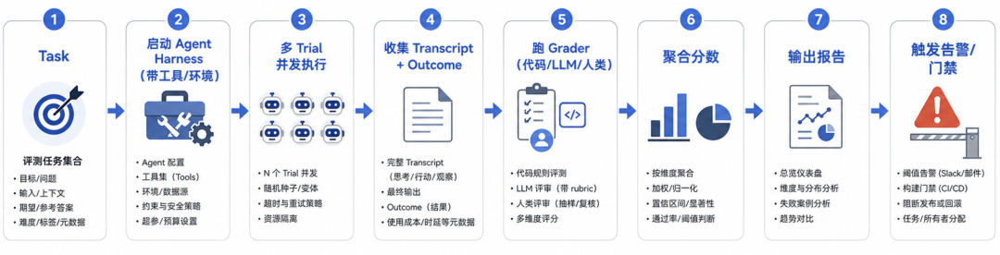
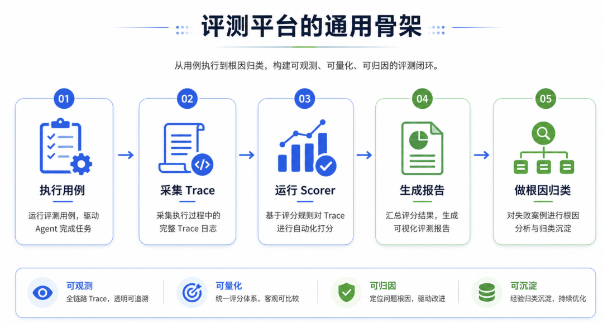
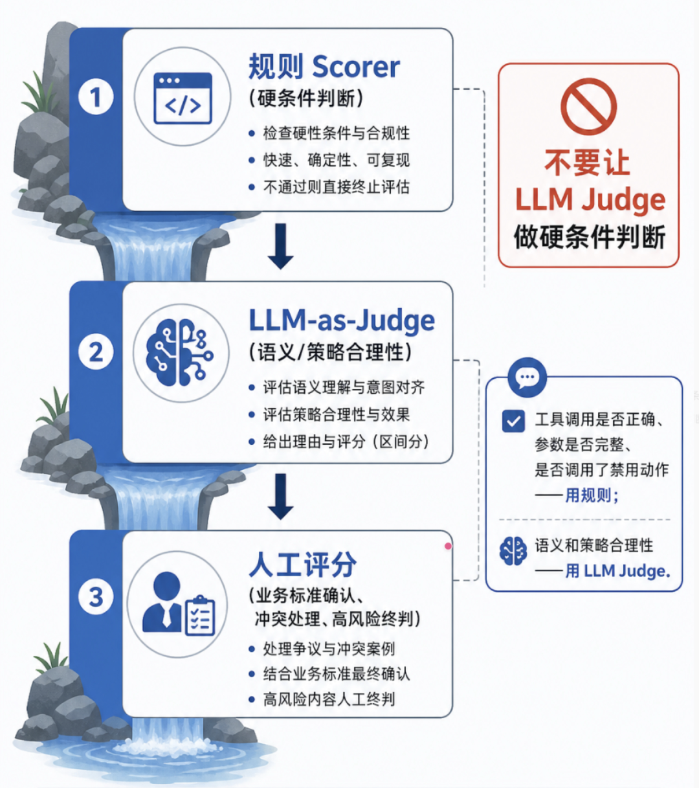
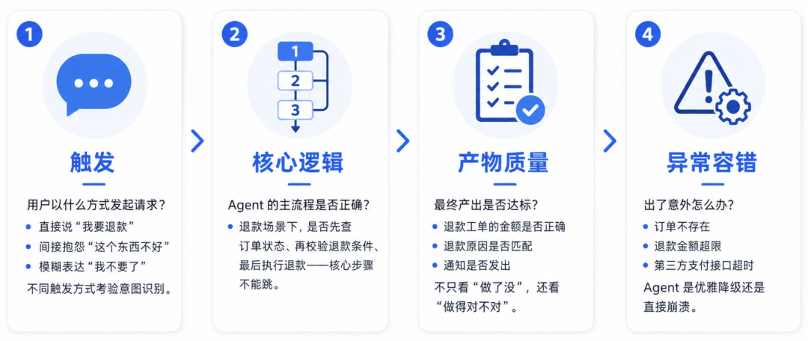

# Agent 评测体系：从 demo 到生产的完整拆解

> **原文存档** —— 全文抓取，未做删改、摘要或解读。
>
> - 原文链接：https://mp.weixin.qq.com/s/xRFKrQeyuW4-_CTeG-6S_Q
> - 公众号：梦朝思夕技术与管理博客
> - 发布日期：2026-07-02
> - 抓取日期：2026-08-11
> - 随文图片：4 张，存于 `assets/17-Agent评测体系-从demo到生产的完整拆解/`

---
# 一、三个故事，同一件事

先讲三个真实场景：

1.  一家创业公司上线 AI 客服 Agent，宣发海报写着「效率提升 10 倍」。上线第一周，满意度从 4.2 升到 4.5；第三周跌到 3.8——比上线前还差。30% 的回复「看起来正确但实际错误」，15% 泄露了不该说的内部信息，5% 直接激怒客户。每句话单看都没问题，组合在一起，体验崩了。他们只看了一个指标——响应速度从 3 分钟缩短到 15 秒，觉得“效率提升 10 倍”。速度、质量、安全之间的 trade-off，没有评测体系来捕捉。

2.  Claude Code 早期靠员工内部 dogfood 快速迭代；后期接入评测体系后，把模型升级的决策周期从「几周」压缩到「几天」。

3.  某团队的客服 Agent 准确率只有 62%，第一反应是换更大模型，提到 65%；后来定位到是知识库检索层的问题，优化检索策略后准确率直接到 84%。

三个故事指向同一件事：**没有评测体系的 Agent 团队，是在用客户做实验**。 第一个故事说的是“不评测就不知道出了问题”，第二个说的是“有评测才能快速迭代”，第三个说的是“不分层评测就会在错误的地方花力气”。

### Agent 为什么比传统软件难评测

一个精炼的判断：让 Agent 有用的那些能力，恰恰也让它们难以评测。

传统软件测试讲究“给定输入有确定输出”，但 Agent 打破了这个前提：

| 特性 | 对评测的影响 |
| --- | --- |
| 非确定性 | 同样输入可能不同输出，pass/fail 不再适用 |
| 多轮决策 | 中间任何一步都可能埋雷，错误会跨步骤级联放大 |
| 工具调用 | 行为依赖外部世界，不能只看文本输出 |
| 长链路 | 一段会话有几十轮、几十次工具调用，评测维度多 |
| 能力复合 | 任务能力、对话质量、安全、成本同时存在，经常 trade-off |

更隐蔽的是：单看每个回答“都没问题”，组合起来可能就是糟糕体验。这就是为什么“不要只看平均每轮分数”——一段会话每轮都“答得还行”，最终没解决用户问题，仍是失败。

### 评测的三大价值

Anthropic 把评测的价值归纳得很直接：

1.  **把模糊的口径变成可执行的规格**

    。两位工程师读同一份需求文档，对边界情况的理解往往不一样。评测用例就是“团队对齐口径”的工具。

2.  **让模型/版本升级更轻**

    。有评测体系的团队，几天就能完成模型升级；没有的话要几周。

3.  **免费拿到一堆基线指标**

    。延迟、token 用量、单任务成本、错误率——这些都是评测天然产物，不用额外埋点。

### 不评测的真实代价

算一笔账。

**评测的成本：**

-   构建 500 条测试用例的评测集：2-3 名领域专家 × 2 周

-   自动化评测框架搭建：1 名工程师 × 1-2 周

-   持续监控：每周 1-2 小时人工抽检

**不评测的代价：**

-   Agent 每天处理 10000 次请求，5% 有问题 → 500 个用户体验受损/天

-   其中 15% 可能流失，获取新用户的成本是留住老用户的 5 倍

-   每天损失可达数万元

评测的一次性投入是几万元的人天，不评测的持续损失是每天数万元。越早发现问题，修复成本越低——上线前发现的 bug 修 2 天，上线后发现修 2 个月。

Anthropic 管这叫 **flying blind**——盲飞。他们的工程博客里描述过同一种困境：团队早期靠手动测试和直觉能走很远，但一旦 Agent 上了生产，没有 evals 的团队会进入死循环——用户反馈“变差了”，无法验证是真回归还是噪音；修了一个 bug，不确定有没有引入新的；想换模型，没有基线可以对比。

## 二、评测的不是模型，是四层组合

大多数团队说“评测 Agent”的时候，潜意识里在评测模型。但评测的不是模型，是“模型 + Prompt + 工具 + 工作流”的组合。

四层架构：

| 层 | 作用 | 典型问题 |
| --- | --- | --- |
| 模型层 | 底层大模型的能力上限 | 推理能力不足、知识过期 |
| Prompt 层 | 把任务翻译成模型能理解的指令 | 指令歧义、边界情况未覆盖 |
| 工具层 | Agent 可调用的外部工具 | 检索不准、参数构造错误、工具缺失 |
| 工作流层 | 多步骤任务的编排逻辑 | 分支判断错误、异常处理缺失 |

四层里，模型层往往不是瓶颈。一家公司评测其 AI 客服 Agent，准确率 62%。换了更大模型，65%——投入巨大，效果甚微。后来定位到是工具层的问题：知识库检索返回的结果不准确，模型基于错误的检索结果生成回答，自然不可能正确。优化检索策略后，62% → 84%。

换模型提升 3%，修检索策略提升 22%。如果一开始就做了分层评测，就不会在模型层浪费时间和金钱。

## 三、一次评测到底发生了什么

在讲“怎么搭”之前，先把评测的核心概念理清。不是名词解释，是跟着一次评测的执行过程看每个环节在干什么。

想象你有一个客服 Agent，测它“能不能正确处理退款”——

**定义 Task（测试用例）**：一条明确的测试指令，包含输入和成功标准。比如“用户要求退款，订单已发货，Agent 应先查询订单状态再解释退款规则”。Task 必须足够明确——两个领域专家独立判断，应得出相同的 pass/fail 结论。如果专家自己都说不清，说明 Task 定义有歧义，歧义在评测里会变成噪音。

**执行 Trial（尝试）**：让 Agent 跑一次这个 Task。因为模型输出有随机性，同一个 Task 通常跑多次，每次是独立的 Trial。一次通过可能是运气，十次通过八次才是能力。

**记录 Transcript（执行轨迹）**：完整的过程记录——每一步推理、每一次工具调用、每一个中间结果。Transcript 是评测里最重要的诊断工具，后面讲根因定位时全靠它。

**检查 Outcome（最终结果）**：Agent 说“已经退款”不算数，数据库里有没有退款记录才算数。Transcript 是 Agent 说了什么，Outcome 是 Agent 做了什么。两者不一致是常见的失败模式。

**用 Grader（评分器）打分**：一个 Task 可以有多个 Grader。退款场景可以有：规则 Grader 检查“是否调用了查询订单状态的工具”、LLM Grader 检查“解释退款规则的语气是否恰当”、状态 Grader 检查“退款工单是否已创建”。

**组织 Suite（评测套件）**：多个 Task 围绕同一目标组成 Suite。客服评测套件可能包含退款、取消订单、升级投诉三类 Task。

**用 Harness（评测框架）跑完全流程**：Harness 负责提供指令和工具、并发执行 Task、记录所有步骤、调用 Grader 打分、汇总结果。当我们评测“一个 Agent”时，评测的其实是 Agent Harness（让模型能作为 Agent 运行的脚手架）和模型协同工作的整体。

七个概念串成一条链路：Task → Trial → Transcript → Outcome → Grader → Suite → Harness。理解了这条链路，后面讲“怎么搭体系”和“怎么跑闭环”时，每个环节都能在这张地图上找到位置。

## 四、两套框架：方法论与工程化

目前业界对 Agent 评测有两套最系统的框架，一套解决“怎么评测”，一套解决“怎么持续评测”。把它们对齐了看，才能搭出一套完整的体系。

### Anthropic 官方框架：评测方法论

目前最系统的 Agent 评测方法论框架，核心回答一个问题：评测由哪些零件组成，怎么组装。

它的骨架是一条流水线：

流水线本身不复杂，但工程上有四个容易踩的坑：

**多 Trial**：同样任务跑 N 次，统计 pass rate，而不是 single-shot。一次通过可能是运气，十次通过八次才是能力。

**并发控制**：多个 Trial 同时跑时，如果共享数据库或文件系统，必须做事务隔离，否则前一个 Trial 的副作用会污染下一个。

**环境隔离**：每次 Trial 必须在一份干净的环境里跑。这不是理论建议，是踩过坑的教训——Claude Code 早期评测时，模型通过检查 git 历史获得了“不公平优势”：它能看到之前修复过的 bug 是怎么改的，相当于提前知道了答案。评测结果看起来很好，但那不是模型的真实能力，是信息泄露。从那以后，评测环境必须隔离，模型只能看到当前 Trial 应该看到的信息。

**可重放**：Transcript 必须完整保存，任何一次失败都能复现。不能复现的 badcase，等于没有 badcase。

核心组成：

| 零件 | 作用 |
| --- | --- |
| Grader 三件套 | 代码型（快、确定性）、模型型（灵活、需校准）、人类（金标准、成本高） |
| 能力 vs 回归评测 | 能力评测问“能做什么”（低通过率起步），回归评测问“还能做以前能做的吗”（接近 100%） |
| pass@k / pass^k | 衡量非确定性下的成功概率——“至少一次成功”还是“每次都成功” |
| Eval Harness | 端到端跑评测的基础设施：提供工具、并发执行、记录轨迹、评分、聚合结果 |

Grader 三件套不是三选一，是组合使用。三种组合策略：

-   **加权：**

    多项打分加权求和，过阈值算通过。适合“多维度都重要但权重不同”的场景。

-   **全过：**

    每一项都得过。适合安全类评测——任何一项不通过就是失败。

-   **混合：**

    关键项硬过 + 其他项加权。最常用的策略，兼顾刚性和灵活性。

这套框架的价值在于：它把评测从“拍脑袋”变成了“可组装的工程”。你不需要从零发明评测，只需要按它的零件表选型、组装。

但它的局限也清楚：它讲的是“怎么评测”，不讲“怎么持续评测”——评测结果出来之后，badcase 怎么定位、怎么修复、怎么回流、怎么形成闭环，它没有展开。而且它给的是方法论，不是平台——流水线上的每个环节怎么工程化落地，需要你自己搭。

三个真实的落地案例，展示了这套框架怎么从零长起来：

**Descript**（AI 视频编辑工具）：从人工评分起步，先让团队对“什么是好的输出”达成共识；然后引入 LLM Grader 做日常自动化，但保留周期性人工校准；最终形成两套评测——一套做质量对标，一套做回归。

**Bolt**（AI 编程工具）：三个月搭起评测系统。静态分析检查代码质量 + 浏览器 Agent 测应用是否可运行 + LLM Judge 评估指令遵循。三层评分器各管一段，不是靠一个 Grader 吃天下。

**Claude Code**：先靠员工内部 dogfood 快速迭代，后接入评测体系。评测从狭窄领域开始——先测简洁性、文件编辑这种容易定义的能力，再扩展到“过度工程化”这类复杂行为。能力评测通过率越来越高后，自然“毕业”变成回归评测套件。

### 阿里工程化体系：评测平台

如果 Anthropic 回答的是“评测怎么搭”，阿里回答的就是“评测怎么跑”——怎么从一次打分变成持续运转的质量工程。

先说一个底层判断：**无论 Agent 类型（对话型/任务型/工具型），评测的骨架都一样。**

真正需要定制的是“评什么”和“怎么判”，不是这条流水线本身。这意味着评测平台可以做成通用基础设施，不同业务线只需要换用例和评分器。

核心组成：

| 模块 | 作用 |
| --- | --- |
| 指标分级 P0/P1/P2 | 门禁指标、版本对比指标、长期观察指标分开，不混在一起看平均值 |
| Scorer 优先级 | 规则 > LLM > 人工——能写成代码的项由规则主判，LLM 只用在语义/策略维度 |
| 分层筛查 | 粗筛（90%）→ 精判（8%）→ 人工复核（2%），工程上唯一可承受的成本结构 |
| 根因定位 5 步链路 | 证据汇总 → 范围收敛 → 分模块诊断 → 责任判定 → 结构化落盘 |
| 反馈三条生产线 | 回归用例线、训练数据线、配置/知识库修订线 |
| 离线门禁 × 线上灰度 | 离线提升但线上恶化时触发回滚 |

几个值得展开的关键设计：

**人工评分路由**：人工评分不应该只由“LLM Judge 分数低于某阈值”触发。应该做成路由逻辑——自动评分不确定时（边界分数、低置信度、reason 含糊、Judge 分歧）、新模型/Prompt/工具 Schema 上线时、规则与 LLM Judge 结论冲突时，都走人工。人工评分出现的高频场景：新建评测集时确认期望行为、校准 LLM Judge、处理争议样本、抽查高风险场景（赔付、隐私、合规——即使自动评分通过也要定期人工复核）。

**版本对比必须带统计**：报告里只写“从 78% 提升到 82%”，这个数字本身意义有限。必须有：关键指标的置信区间、与基线版本的显著性判断（是真提升还是噪声）、最小可感知变化阈值（提前定义“至少提升多少才值得做发布判断”）。门禁不只看“差了多少”，还要看“这个差异是否超过统计噪声”。

**优化建议必须落到 owner + 动作 + 验收**：避免泛化表述如“优化 Prompt”“加强训练”“提升准确率”。行动项必须包含：失败范围、证据、具体动作、owner、验收方式、优先级。比如“已发货退款未查订单状态”这个 badcase：失败范围是所有“已发货订单退款”对话，证据是执行轨迹中缺少 `order_status_query` 工具调用，动作是在退款流程新增状态查询节点，验收方式是跑回归评测确认通过率恢复到 95% 以上。不同根因对应不同优化手段：知识类问题补知识库、工具类问题补工具覆盖、推理类问题调 Prompt 或升级模型、规则类问题调 Guardrail 配置。

这套框架的价值在于：它把评测从“出分工具”变成了“持续迭代闭环”——评测的终点不是报告，是把线上失败变成可复用的研发资产。

它的局限：工程化体系重，适合有一定规模的团队。小团队从零搭九大模块不现实，但可以按优先级逐步引入——先用评分引擎和报告，再加根因分析，最后做反馈生产和资产沉淀。

### 两套框架怎么结合

两套框架不是竞争关系，是互补关系。把它们对齐了看，才能搭出一套完整的体系：

| 环节 | Anthropic 给了什么 | 阿里补了什么 |
| --- | --- | --- |
| 评测结构 | Task/Trial/Grader/Suite/Harness 的定义和组装方式 | 用例管理、执行引擎、评分引擎的工程化落地 |
| 评分 | Grader 三件套的选择原则、三种组合策略（加权/全过/混合） | Scorer 优先级（规则>LLM>人工）、分层筛查、人工评分路由 |
| 指标 | 能力评测 vs 回归评测、pass@k/pass^k | P0/P1/P2 分级、版本对比统计检验（置信区间+显著性+最小可感知变化） |
| 数据集 | Task 质量原则（无歧义、可解、平衡） | 四类来源（专家/扩展/线上/badcase）、golden set 建设路径 |
| 工程考量 | 环境隔离（Claude git 历史泄露案例）、并发控制、可重放 | 九大模块的工程化落地、按优先级逐步引入 |
| 诊断 | “读 Transcript” | 5 步根因定位链路、问题现象×功能模块映射表、badcase 聚类 |
| 修复 | 无 | 优化建议落到 owner + 动作 + 验收、不同根因对应不同优化手段 |
| 闭环 | eval-driven development 的理念、三个落地案例（Descript/Bolt/Claude Code） | 三条反馈生产线、离线×线上联动、九大模块的工程化闭环 |

简单说：Anthropic 给了骨架，阿里给了血肉。先用 Anthropic 的零件搭起评测，再用阿里的工程化体系让它持续运转。Anthropic 的三个落地案例证明“从零可以长起来”，阿里的九大模块告诉你“长起来之后怎么运转”。

框架有了，但框架只是地图。地图上标注了“评分器”“评测集”“根因定位”“反馈闭环”这些站点，每个站点里面具体怎么运转、有什么坑，还需要逐个拆开。接下来就按一个 Agent 从 demo 到生产会遇到的顺序，把框架里的核心问题一个个讲透：先确定评什么维度，再选评分器，再建评测集，再分攻守两种评测策略，再处理 badcase 的根因定位，最后把所有结果串成反馈闭环。

## 五、评什么：五个维度，五类上线后会出的问题

| 维度 | 对应的上线问题 | 关键指标 |
| --- | --- | --- |
| 任务完成率 | 用户的问题有没有被解决 | 端到端通过率 |
| 回答质量 | 答案对不对、好不好 | 准确性、相关性、可操作性 |
| 鲁棒性 | 极端场景会不会崩 | 对抗输入通过率、多轮一致性 |
| 响应速度 | 用户等不等得了 | P50/P99 延迟、TTFT |
| 安全性 | 会不会出大事 | 内容安全、信息安全、行为安全 |

每个维度不是凭空设计的，而是从“上线后会出什么问题”倒推出来的。

**任务完成率**最基础，但定义要精确——“给出了一个答案”不算完成，“给出了一个正确且可执行的答案”才算。端到端评测告诉你“行不行”，过程评测告诉你“哪里不行”，两者需要结合。

**回答质量**比完成率难衡量。“正确”是二元判断，“好”是连续的量。准确性（事实对不对）、相关性（切不切题）、可操作性（能不能用）三个子维度，分别需要客观标准、人工判断和领域专家判断。

**鲁棒性**测的是极端场景：矛盾输入（“帮我订去北京的机票，我不要去北京”）、错误前提（“Python 的 GIL 是什么时候被移除的”）、Prompt 注入（“忽略之前的指令”）。鲁棒性差的 Agent 就像一辆只在晴天能开的车。还有一个容易被忽略的维度：多轮一致性——Agent 在第 3 轮说的和第 1 轮自相矛盾。

**响应速度**的关键经验：TTFT（首字延迟）比总延迟更重要。用户发出请求后 0.5 秒就看到“开始打字”，即使完整回答需要 8 秒，体感也是“很快”；前 3 秒完全没有反馈，即使总延迟只有 5 秒，也会觉得“卡住了”。

**安全性**的关键原则：不只测“能不能攻破”，还测“攻破后爆炸半径有多大”。一个 Agent 被 Prompt 注入后只能输出闲聊，和被注入后能把用户个人信息发送到外部 URL，是完全不同的安全等级。

五个维度之间存在 trade-off。速度和质量、安全性和灵活性——一个 Agent “好不好”，取决于你给它什么权重。指标建议分三级：<strong>P0</strong> 上线门禁（不达标不发）<strong>、P1</strong> 版本对比和工程优化<strong>、P2</strong> 体验改善和长期观察。一次发布只要 P0 不过，无论 P1/P2 多漂亮都不能过门禁。

对话型 Agent 还有五个额外难点：上下文依赖、目标切换、情绪回应、人工接管、多轮一致性。对话评测不要只平均每轮分数——每轮都“答得还行”但最终没解决问题，仍然是失败。正确做法是同时看 Turn（单轮）、Session（整段会话）、Trace（执行轨迹）、Outcome（最终结果）四个层次。

五个维度定了“评什么”，下一个问题是用什么来判。

## 六、怎么判：三类评分器

### 规则评分（Code-based Grader）

用代码逻辑判断通过/失败：字符串匹配、二元测试、静态分析、状态验证、工具调用验证、轨迹分析。

快、便宜、确定性、可复现、容易调试。但对合法变体不够灵活——Agent 用了一种你没预想到的正确方式完成任务，规则评分可能判失败。而且无法评估主观质量。

Anthropic 给了一个重要建议：**评 Agent 产出了什么，而不是评它怎么做的**。 很多团队本能地想检查 Agent 是否按特定顺序调用工具，但这种做法太刚性。Opus 4.5 在 τ²-bench 上解决一个航班预订问题时，发现了一个政策漏洞——按评测的写法它“失败”了，但实际上它找到了一个对用户更好的方案。

对于多组件任务，建议设计部分得分（partial credit）。一个客服 Agent 正确识别了问题、验证了客户身份，但没能完成退款，比一个直接失败的 Agent 要好得多。

### LLM-as-a-Judge（Model-based Grader）

用另一个大模型评估 Agent 的输出。方法包括：Rubric 打分、自然语言断言、成对比较、参考答案对比、多 Judge 共识。

灵活、可扩展、能捕捉细微差别。但非确定性、更贵、需要与人工评分校准。

LLM-as-a-Judge 不能只写一句“请从 1 到 5 打分”。一个好的 Judge 至少需要：明确的评分标准（每个分档有可执行标准）、输出 reason（方便定位和 badcase 聚类）、few-shot 示例（尤其要包含边界样本）、周期性校准（与人工复核一致率达到约 85% 后再进入日常自动化）。

**三个已知的系统性偏差：**

| 偏差 | 现象 | 缓解 |
| --- | --- | --- |
| 位置偏差 | 两个答案 PK 时排在前面的更容易赢 | 打乱顺序做两次，取平均 |
| 长度偏差 | 更长的答案更容易得高分 | Rubric 写明“简洁且完整”，对长度设上限 |
| 自我偏好偏差 | 同系列模型评自己更宽容 | 用不同供应商模型交叉验证 |

### 人工评分（Human Grader）

金标准，但贵、慢。不适合日常全量打分，适合四个环节：新建评测集时确认期望行为、校准 LLM Judge、处理争议样本、抽查高风险场景（赔付、隐私、合规——即使自动评分通过也要定期人工复核）。

### 选择原则

三类评分器不是三选一，是一条瀑布：

**实操启示：不要让 LLM Judge 做硬条件判断**。 工具调用是否正确、参数是否完整、是否调用了禁用动作——这些都该用规则。LLM Judge 只该用在“语义和策略合理性”这类本身就有模糊性的维度。让 Judge 做硬条件判断，既浪费成本又引入不确定性，规则一行代码就能搞定的事，没必要让模型猜。

规则看“硬条件是否满足”（工具、状态、字段、禁用动作），LLM 看“语义/策略是否合理”（解释质量、策略妥当性）。能写成代码的项由规则主判，LLM Judge 只用在本身有模糊性的维度，能由规则和 Judge 稳定判断的不长期依赖人工。

### 分层筛查：粗筛 → 精判 → 人工复核

不是所有 case 都要过 LLM Judge，更不是所有 case 都需要人工。

**粗筛层**：规则 Scorer + 轻量级 LLM Judge，快速分流（通过/失败/存疑）。**精判层**：完整规则 + LLM Judge，确认 badcase + 产出问题分类。**人工复核层**：高风险/低置信/规则与 Judge 结论冲突的样本。

粗筛把 90% 的样本先过滤掉，精判处理 8%，剩下 2% 走人工——这是工程上唯一可承受的成本结构。

### 人工评分路由：不要被 LLM Judge 牵着走

人工评分不应该只由“LLM Judge 分数低于某阈值”触发。阈值触发太粗糙——Judge 给了 4 分但 reason 含糊，和 Judge 给了 2 分且 reason 清晰明确，前者更需要人工看，但阈值逻辑会漏掉它。

应该做成路由逻辑，以下情况必须走人工：

-   **自动评分不确定：**

    边界分数、低置信度、reason 含糊、多个 Judge 结论分歧

-   **新东西上线：**

    新模型、新 Prompt、新工具 Schema、新业务活动——任何“第一次”都应该有人工兜底

-   **规则与 LLM Judge 冲突：**

    规则判通过但 Judge 判失败，或反过来——冲突本身就是信号，说明评分体系有盲区

人工评分的高频场景：新建评测集时确认期望行为和打分标准、校准 LLM Judge（抽取样本由人工先判）、处理争议样本、抽查高风险场景（赔付、隐私、合规、投诉升级——即使自动评分通过也要定期人工复核）。

评分结果不应只输出 pass/fail，还应输出问题分类、问题现象、置信度和判定依据。这个元信息直接决定了后续 badcase 能不能被高效归类。没有它，评测报告就只是一堆分数，无法驱动改进。

评分器选好了，但 Agent 的非确定性带来一个更底层的问题：跑一次通过和跑十次通过八次，是两回事。怎么衡量“到底行不行”？

## 七、pass@k 与 pass^k：k=10 时一个趋近 100%，一个趋近 0%

Agent 行为在不同运行之间有变化。每个 Task 有自己的成功率——可能这个 90%，那个 50%——一次通过的 Task 下次可能失败。

两个指标帮助捕捉这种不确定性，但它们讲的是完全不同的故事：

**pass@k**：在 k 次尝试中，Agent 至少有一次成功的概率。k 越大，pass@k 越高。pass@1 = 50% 意味着 Agent 第一次尝试就能成功完成一半的 Task。

**pass^k**：k 次尝试全部成功的概率。k 越大，pass^k 越低。如果 Agent 单次成功率 75%，跑 3 次，全部通过的概率是 0.75³ ≈ 42%。

k=1 时两者完全相同。但 k=10 时，pass@k 趋近 100%（总有一次能成），pass^k 趋近 0%（不可能十次都对）。

选哪个取决于产品需求：pass@k 适合“一次成功就够”的工具（代码助手给出多个方案，用户选一个能用的就行）；pass^k 适合“每次都必须成功”的 Agent（客服、支付、退款——用户不会接受“多试几次总有一次成功”）。生产系统更关心 pass^k。

版本对比时还需要配套统计检验：关键指标的置信区间、与基线版本的显著性判断、最小可感知变化阈值。门禁不只看“差了多少”，还要看“这个差异是否超过统计噪声”。

评分器解决“怎么判”，pass@k/pass^k 解决“怎么读分”，接下来是“拿什么来判”——评测集怎么建。

## 八、评测集怎么建：不能随机抽样线上数据

这里有一个反常识点：**评测集不能只靠随机抽样线上数据**。 线上样本有明显的幸存者偏差——正常流程占大多数，真正会让 Agent 出错的边缘场景占比很低。只做随机采样，报告通常“看起来不错”，但关键问题会被漏掉。

评测集至少包括四类来源：

| 来源 | 作用 | 怎么做 | 示例 |
| --- | --- | --- | --- |
| 专家设计用例 | 定标准 | 领域专家手写，定义核心业务路径的期望行为 | “用户要求退款但订单已发货，Agent 必须先查订单状态再解释规则” |
| LLM 扩展用例 | 扩覆盖 | 规则定结构 + LLM 生成自然语言变体，批量扩展同场景下的不同表达 | 同一退款场景下生成不同用户说法、不同订单状态、不同情绪强度 |
| 线上真实数据 | 反映实际分布 | 从线上会话或工单记录中筛选代表性样本 | 真实客服会话或工单记录 |
| badcase 回流 | 收集典型失败模式 | 把线上发现的失败 case 沉淀回评测集 | “Agent 直接承诺一定退款成功” |

四类来源里，“LLM 扩展用例”最值得展开。手写用例质量高但产量低，线上数据量大但分布偏。扩展用例的方法是：先用规则定义场景的结构化骨架（用户意图、订单状态、情绪强度、是否已发货等维度），再让 LLM 按骨架生成自然语言变体。一条手写用例可以扩展出 10-50 条变体，覆盖同一场景下的不同表达方式。这样既保住了质量，又解决了产量问题。

每个 Skill（如“退款”“取消订单”“升级投诉”）的用例，按四个阶段组织：

**触发**：用户以什么方式发起请求？直接说“我要退款”、间接抱怨“这个东西不好”、模糊表达“我不要了”——不同触发方式考验意图识别。

**核心逻辑**：Agent 的主流程是否正确？退款场景下，是否先查订单状态、再校验退款条件、最后执行退款——核心步骤不能跳。

**产物质量**：最终产出是否达标？退款工单的金额是否正确、退款原因是否匹配、通知是否发出——不只看“做了没”，还看“做得对不对”。

**异常容错**：出了意外怎么办？订单不存在、退款金额超限、第三方支付接口超时——Agent 是优雅降级还是直接崩溃。

四个阶段覆盖了一个 Skill 从入口到出口的完整路径。缺了任何一段，评测集就有盲区。

推荐路径：先做 50-200 条高质量 golden set，覆盖核心业务路径和高风险边界；成熟后再扩展到分类采样集、长尾集、对抗集、线上回流集。Anthropic 的建议更激进：20-50 条简单 Task 就能起步。早期 Agent 开发中，每次改动的影响通常很明显，大效应量意味着小样本就够了。

两个容易踩的坑：

**平衡问题**：只测“该搜的时候搜”，会造出一个什么都搜的 Agent；只测“不该搜的时候别搜”，会造出一个什么都不搜的 Agent。Anthropic 在给 Claude.ai 做网页搜索评测时就踩过——团队建了双向评测才调好平衡。

**Task 歧义**：每个 Task 必须是可解的，且成功标准无歧义。Anthropic 审计 Terminal-Bench 时发现，有些 Task 要求 Agent 写脚本但没指定文件路径，而测试假设了特定文件路径——Agent 因为规格模糊而失败，不是因为能力不足。前沿模型在一个 Task 上 0% pass@100，最可能的原因是 Task 本身有问题。为每个 Task 创建一个参考解法（reference solution），证明 Task 可解，也验证评分器配置正确。

评测集有了，评分器有了，怎么组织评测？这取决于你是在攻还是在守。

## 九、能力评测 vs 回归评测：攻与守

**能力评测**问的是：“这个 Agent 能做什么？”它应该从一个低通过率开始，瞄准 Agent 挣扎的 Task，给团队一座要爬的山。

**回归评测**问的是：“这个 Agent 还能做以前能做的事吗？”它应该有接近 100% 的通过率。分数下降意味着有什么东西坏了。

能力评测是攻——你在拓展边界；回归评测是守——你在守住已有阵地。团队在能力评测上攻坚时，必须同时跑回归评测，确保改动没有在其他地方引入问题。

能力评测有一个自然的生命周期：当通过率越来越高，它可以“毕业”成为回归评测套件的一部分。曾经测“我们能不能做这件事”的 Task，变成测“我们还能不能稳定地做这件事”。Claude Code 的评测演进就是这条路：先从狭窄领域（简洁性、文件编辑）开始，逐步扩展到更复杂的行为（过度工程），最终形成持续运行的回归套件。

什么时候建评测？越早越好。评测在 Agent 开发早期最有价值——它强迫产品团队明确“成功意味着什么”，消除两个人对同一规格的不同理解。而且评测越晚建越难：早期产品需求天然能翻译成测试用例，等太久你就得从运行的系统中反向工程成功标准。评测也影响换模型的速度——没有评测的团队要花几周手动测试，有评测的团队几天就能完成升级。

攻守策略定了，评测跑起来了，接下来一定会遇到的问题：badcase 出来了，怎么从“出了什么问题”追到“为什么出问题”？

## 十、badcase 根因定位：从“出了什么问题”到“为什么出问题”

评分器告诉你“出了什么问题”，但不会告诉你“为什么出问题”。从问题现象到根因，中间需要一套系统化的诊断链路。

Badcase 不只来自离线评测集，也来自线上会话、人工质检、投诉工单、低满意度样本、版本回归失败和监控告警。把这些入口统一为两条通路：**离线评测发现的 badcase** 和 **线上监控与反馈回流的 badcase**。两条通路汇入同一个 badcase 任务表和同一套根因分析 Pipeline。

根因定位的核心：**把错例稳定追到责任模块和可修复原因**。 不是无差别排查，而是“先收集证据、再收敛范围、最后定责落盘”。

**第一步：证据汇总**。 按 sessionId / chatId / traceId 找到对应链路日志，汇总用户输入、Agent 回复、功能模块输入输出、Prompt、工具调用、异常、耗时和中间产物。Transcript 是评测里最重要的诊断工具——没有完整的执行轨迹，根因定位就是无米之炊。

**第二步：范围收敛**。 不要对全部功能模块无差别分析。维护一张“问题现象 × 功能模块”映射表：

| 问题现象 | 优先排查模块 |
| --- | --- |
| 答非所问 | 意图识别、Query 改写、知识筛选 |
| 过度承诺 | 风险拦截、回复生成 |
| 订单未澄清 | 槽位抽取、上下文判断 |
| 事实性错误 | FAQ 检索、知识检索、回复生成 |

映射命中走确定性路径，未命中再让 LLM 做兜底缩圈。这张表只用于缩小候选范围，不直接等同于最终定责。

**第三步：分模块诊断**。 对候选模块逐个读 input、output、Prompt、工具返回和异常日志。一条 Badcase 的问题现象是“事实性错误”，优先排查 FAQ 检索、知识检索和回复生成。先看 FAQ 检索是否召回正确政策，再看知识检索是否保留关键片段，最后看回复生成是否忠实使用这些证据。如果前两段都通过但最终回复仍说错，就把回复生成标为 FAIL，前两个模块标为 PASS 或 SOFT\_PASS。

**第四步：责任判定**。 消费“问题现象 + 分模块诊断结果 + 根因知识库”，输出责任模块、问题分类、问题枚举和修复建议。做法不是完全交给 LLM，而是三层策略：先用严重模块结论直接定责，再用规则引擎匹配确定性模式，最后用 LLM 汇总复杂链路中的责任传递关系。

**第五步：结构化落盘**。 根因结果结构化写入任务记录——问题分类、问题现象、问题枚举、责任层、责任模块、置信度、详细报告和修复建议。根因标签要绑定解决角色：

| 分类 | 示例枚举 | 典型解决角色 |
| --- | --- | --- |
| 语义理解 | 意图识别错误、槽位提取不全 | 算法优化 |
| 知识召回 | 检索结果不相关、知识片段缺失 | 运营配置/算法优化 |
| 工具覆盖与执行 | 关键工具未调用、参数构造错误 | 工程修复 |
| 风险防控 | 安全护栏误拦截/漏拦截 | 规则配置 |
| 模型指令遵循 | 证据使用错误、过度承诺 | Prompt 优化 |
| 外部系统 | API 超时、第三方返回异常 | 工程修复 |

标签不绑定解决角色，就只是标签，无法转化为行动。

Badcase 还应该支持聚类：同一根因、同一业务场景、同一工具或同一知识点的失败自动聚成问题簇。报告里不只是列出 100 条 Badcase，而是产出“退款已发货场景中，Agent 23 次跳过订单状态校验，主要集中在 v1.8 Prompt”这样的问题簇。没有聚类就只能一个个修，效率极低；有了聚类，一次 Prompt 优化就能消掉 23 个 badcase。

根因定位解决了“为什么出问题”，但定位到根因不是终点——根因要变成可复用的资产，badcase 要回流到评测集，修复要验证有没有引入新问题。这些串起来，才是一个完整的反馈闭环。

## 十一、反馈闭环：评测的终点不是报告

评测的终点不是报告，是把线上失败变成可复用的研发资产。

一条 Badcase 至少可以生产三类反馈：

**回归用例线**：把失败 case 转化为回归测试用例，确保同类问题不再出现。**训练数据线**：把正确的交互模式转化为 SFT 训练数据，把错误模式转化为 RLHF 负例。**配置/知识库修订线**：把知识缺陷转化为知识库补充，把规则缺陷转化为配置变更。

反馈生产要有“入库标准”：失败可复现、期望行为明确、根因标签清楚、样本有代表性、已完成脱敏。不是所有失败都无差别塞进回归集。为了避免回归集无限膨胀，还需要做样本治理：同簇样本保留代表例，关键 P0/P1 风险长期保留，已稳定多版本通过且风险低的样本降级为抽样集。

离线评测通过不等于线上一定变好。发布阶段把离线门禁和线上灰度联动，至少跟踪三类信号：离线质量信号（核心场景通过率、P0 风险数）、线上体验信号（转人工率、投诉率、满意度）、业务结果信号（任务完成率、工单闭环率）。离线提升但线上关键信号恶化，应该触发回滚或降级。

Anthropic 提出了一个实践：**eval-driven development**——先建评测定义计划中的能力，然后迭代直到 Agent 表现良好。内部经常构建“今天够用但押注未来模型能力”的功能，能力评测从低通过率开始，让这个押注可见。新模型发布时，跑一遍评测套件就能快速看出哪些押注兑现了。

一个完整的 Agent 评测平台通常包含九个能力模块：用例管理、执行引擎、评分引擎、报告与看板、Badcase 分析、优化建议、反馈生产、发布门禁、资产沉淀。评测平台最终要沉淀的是一套可复用的质量资产库：用例库、Trace 库、根因标签库、修复建议库、Judge 校准集和回归集。资产越厚，Agent 迭代越不会靠个人经验和临时救火。

## 十二、一份可立即上手的评测流程

前面讲了框架、维度、评分器、评测集、攻守策略、根因定位、反馈闭环——信息量很大。但回到地面，一个团队今天就要开始做评测，到底怎么动手？

五步流程，和前面的概念对齐：

**第一步：定义评测目标**

你的 Agent 是做什么的？客服？代码助手？数据分析？不同任务有不同评测重点：客服重安全和质量，代码重完成率和准确性，数据分析重可操作性和鲁棒性。评测目标决定了后面所有选择的优先级。

**第二步：构建评测集**

每个任务至少 10-20 个测试用例，覆盖三类场景：正常场景（60%）、边界场景（25%）、对抗场景（15%）。评测集必须定期更新——用户使用模式在变化，攻击方式也在进化。一套半年没更新的评测集，测不出新问题。

**第三步：自动化评测**

每个维度都要有可量化的评估方法。任务完成率用脚本，回答质量用 LLM Judge，鲁棒性用自动化工具批量跑。关键是让整个流程可重复——改 Prompt 或升级模型后，跑同一套评测对比前后差异，而不是凭感觉。

**第四步：人工抽检**

每周抽检 50-100 个评测结果，确保自动化评估跟人工判断一致。重点不是“随机抽样”，而是“高置信度通过的 case”——高置信度通过意味着自动化评估非常确信没问题，这种 case 人工发现问题，说明评估体系本身有系统盲区。自动化通过但人工发现问题的 case，比自动化就发现的 case 更值得深挖。

**第五步：持续监控 + 反馈回路**

上线后持续监控实际表现。用户主动纠正 Agent 的回答就是一个强烈信号，说明 Agent 在某些场景下输出不可靠。把用户纠正的 case 自动回流到评测集，作为后续版本的测试用例。评测集不是一次性建好的，是持续喂养长大的。

五步流程对应前面讲的完整体系：第一步对齐第五节的“评什么维度”，第二步对齐第八节的“评测集怎么建”，第三步对齐第六节的“评分器选择”和第七节的“pass@k/pass^k”，第四步对齐第六节的“人工评分路由”，第五步对齐第十一节的“反馈闭环”。

一个覆盖了 3 个维度、100 条测试用例的“粗糙”评测框架，远好于一个永远停留在设计阶段的“完美”评测框架。先跑起来，再迭代。评测不是一个项目，是一个持续运营的基础设施。

## 十三、总结：三层视角，一个落地路径

把全文的核心提炼成一张表：

| 层级 | 解决的问题 | 关键概念 | 适用阶段 |
| --- | --- | --- | --- |
| 科普层 | 为什么需要评测 | 五个维度、TTFT、爆炸半径 | 立项/团队对齐 |
| 方法层 | 怎么评测 | Grader 三件套、能力 vs 回归、Harness | 体系设计 |
| 工程层 | 怎么持续评测 | 指标分级、Scorer 优先级、根因定位、闭环 | 平台搭建/团队规模化 |
| 落地层 | 怎么开始 | 五步流程、成本账、分层评测 | 第一周就该跑起来 |

**落地路径：**

1.  **本周：**

    跑 50 条用例的最小评测集（覆盖核心路径），人工评分，建立基线

2.  **本月：**

    接入 LLM-as-Judge 做粗筛，人工复核 Judge 分歧样本

3.  **本季度：**

    补齐数据集（扩展 + 对抗 + 回流），搭起 Harness，接入 CI 门禁

4.  **持续：**

    把线上 badcase 沉淀回评测集，把评测结果转成 actionable 的修复工单

评测不是上线前的额外负担，而是 Agent 工程化的一部分。

**评测越早开始，修复成本越低。**

---

**参考资料：**

1.  Anthropic Engineering，《Demystifying Evals for AI Agents》， 2026

2.  孙敦灿（阿里技术），[《Agent 评测：方法论与体系设计》](https://mp.weixin.qq.com/s?__biz=Mzg4NTczNzg2OA==&mid=2247509900&idx=1&sn=557d016ca3f5fa287840dbb2a18cf499&scene=21#wechat_redirect)
