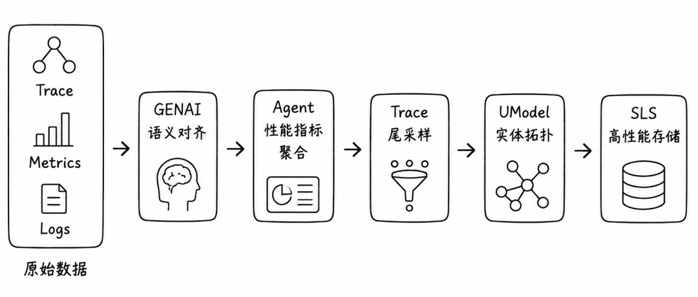
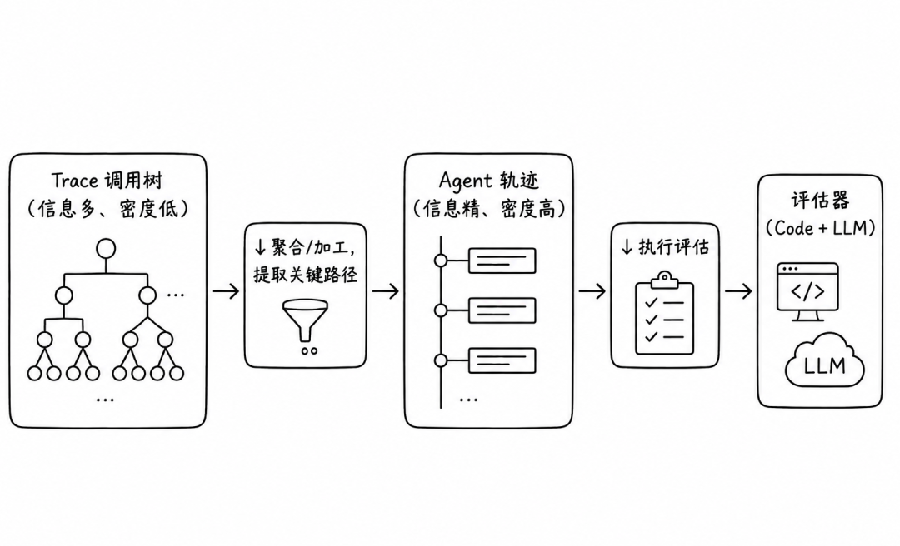
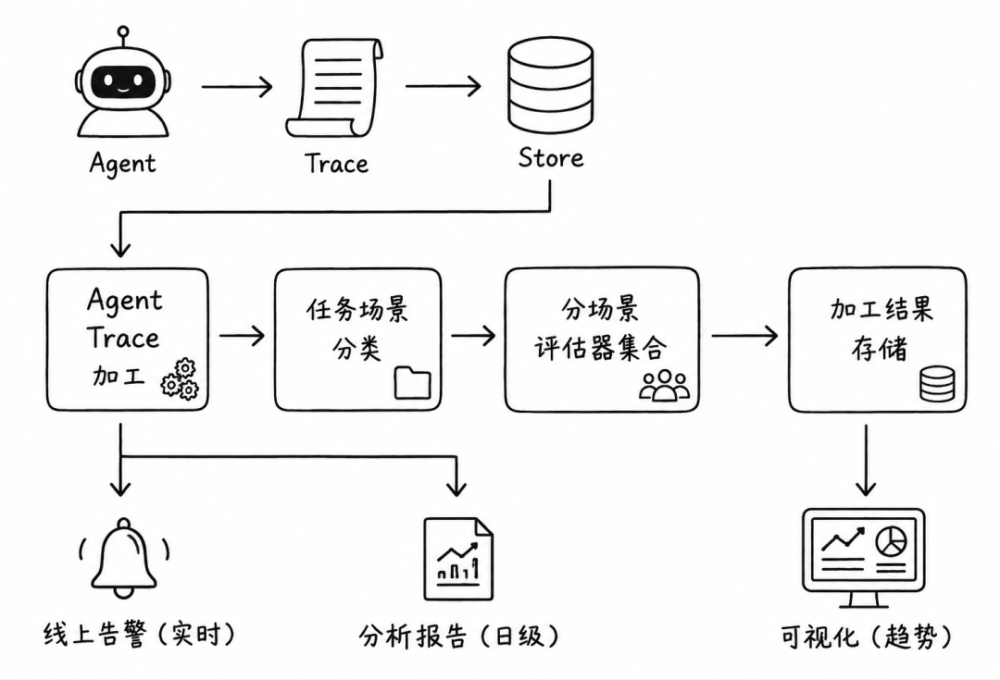
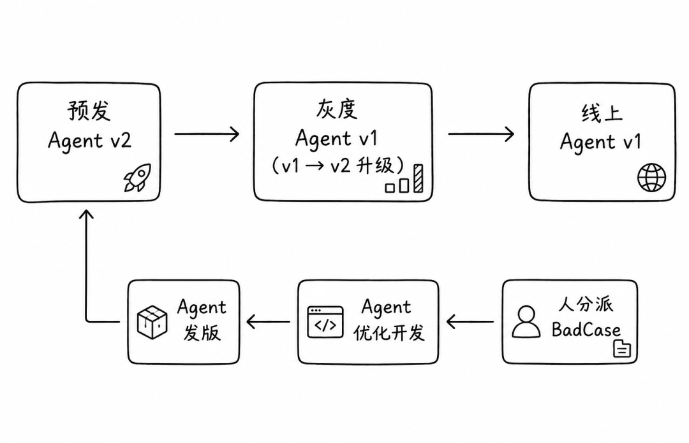

# Agent 可观测与质量评测体系：从数据采集到数据飞轮的完整实践

> **原文存档** —— 全文抓取，未做删改、摘要或解读。
>
> - 原文链接：https://mp.weixin.qq.com/s/RvdRQe_5O2ZpW8YmZaOe4w
> - 公众号：AI Engineer编程
> - 发布日期：2026-07-12
> - 抓取日期：2026-08-11
> - 随文图片：4 张，存于 `assets/18-Agent可观测与质量评测体系-从数据采集到数据飞轮/`

---
# Agent 可观测与质量评测体系：从数据采集到数据飞轮的完整实践

>
>
> > https://www.bilibili.com/video/BV1aq7P6LE3t/?spm\_id\_from=333.1391.0.0&vd\_source=d9fe78b79ffc99c5a38711b5684e74fc
> >
> > 来源
>
> 基于Agent 可观测技术分享的系统性技术笔记
>
>

---

## 一、背景：Agent 时代的数据采集新挑战

随着大模型 Agent 从 Demo 走向生产，传统的可观测与质量保障体系面临根本性重构。Agent 系统的特殊性带来了四大全新挑战：

**1\. 应用框架碎片化与快速迭代**
LangChain、LlamaIndex、Dify、Spring AI 等框架百花齐放，各自的抽象层次、调用方式和上下文传递机制迥异，导致埋点方式难以统一，SDK 需要持续跟进适配。

**2\. 推理执行链路复杂、协议多样**
RAG、Function Calling、MCP（Model Context Protocol）、A2A（Agent-to-Agent）协议等构成了多步骤、多组件编排的复杂链路，传统的 APM 追踪模型已无法覆盖。

**3\. 性能指标维度扩展**
除了传统的延迟和吞吐量，Agent 场景引入了 TTFT（首 Token 延迟）、TPOT（每输出 Token 耗时）、SSE 流式输出质量、对话轮次等全新指标，直接关联用户实时体验。

**4\. 数据采集目标多元化**
Token 消耗、文本、图片、音频、视频等多模态内容的采集，涉及大体积数据的采样压缩、敏感内容脱敏等全新问题。

---

## 二、全链路可观测架构：三层设计

面对上述挑战，构建面向 Agent 原生的全链路可观测体系，分为三层：

### 接入层：多形态、无侵入、标准化

| 接入形态 | 代表框架 | 策略 |
| --- | --- | --- |
| 高代码 | LangChain，LlamaIndex、AutoGen、Spring AI | SDK 深度埋点 |
| 低代码 | Dify、Langflow | 平台扩展机制注入 |
| 通用 Agent | OpenClaw | 运行时统一采集 |
| 多语言 | Python/Node.js/Java/Go | 字节码增强/eBPF 无侵入埋点 |

**关键设计**：基于 OTEL 标准保证生态兼容性，同时推出 LoongSuite 开源方案进行 GenAI 语义扩展，实现框架无关的埋点抽象。

### 计算 & 存储层：Agent 原生数据处理



-   GENAI 语义对齐：将技术 Span 转化为语义角色（llm\_call、retriever\_search、tool\_execution），实现从"函数调用"到"Agent 决策"的语义跃迁。
-   Trace 尾采样：基于错误、慢请求、异常模式等聚合结果做尾部采样，平衡高成本场景下的存储效率。
-   UModel 实体拓扑：构建 LLM 模型、Tool、Knowledge Base、Agent 实例的关联图谱，实现从"链路追踪"到"系统理解"的升级。

### 应用层：三维分析

| 维度 | 分析内容 | 业务价值 |
| --- | --- | --- |
| 性能分析 | Token 消耗、LLM/工具调用耗时、平均推理轮次 | 优化用户体验 |
| 安全审计 | 敏感信息泄露、越权工具调用、Prompt 注入 | 合规与风控 |
| 成本分析 | 模型调用费用趋势、会话成本核算 | FinOps 决策 |

---

## 三、离线评测体系：Agent "智力退化"的防线

### 3.1 评测流水线设计

Agent 的行为具有非确定性，传统"断言通过/失败"的单元测试模型基本失效。 将自动化评测嵌入 CI/CD 流水线，以质量门禁拦截回归风险：

`评测集维护 → 环境准备 → 用例执行 → 评估执行 → 评估结果 → 质量门禁`

**质量门禁的三类机制**：

-   基线对比：新版本 vs 旧版本的指标 Diff，检测回归
-   质量卡点：核心用例必须 100% 通过，边缘用例允许容错
-   门禁规则：硬性阈值（阻断发布）vs 软性阈值（告警通知）

### 3.2 评测集构建：三要素模型

高质量评测用例包含三个核心要素：

| 要素 | 内容 | 关键设计 |
| --- | --- | --- |
| 任务输入 | 提问/多轮上下文、场景分类标签 | 多轮对话需精确复现对话状态 |
| 运行环境配置 | 状态类型与参数、Mock 服务 | 任何可能影响 Agent 行为的配置必须显式声明 |
| Ground Truth | 期望结果、关键证据、必/禁调工具 | 不仅验证"做了什么"，还验证"没做什么" |

**维护形式**：支持类 Excel 工具（快速录入）和 Git 仓库维护（工程化版本管理）两种模式。Git 仓库结构标准化：

```
skill-name/
├── files/          # 评测用的文件
├── tests/          # Code 评估脚本
├── eval.json       # 定义评测任务
└── setup.yaml      # 定义环境配置
```

**高质量评测集的核心特征**：

-   场景覆盖度：对齐线上真实任务分布，核心场景优先覆盖
-   环境可复现性：用例绑定环境快照，不依赖实时接口
-   动态更新机制：线上真实 case 脱敏回流，持续补全评测集

### 3.3 仿真环境：确定性保障

Agent 的副作用（文件修改、API 调用）要求评测环境必须隔离。将外部依赖抽象为三类接口：

| 接口类型 | 特征 | 隔离策略 |
| --- | --- | --- |
| 静态只读接口 | 文档查询类，数据不变 | 本地镜像/版本化索引 |
| Mock 服务 | 有状态/时效性工具 API | 录制真实响应，回放固定数据 |
| 沙箱环境 | 可在隔离环境运行工具 | Docker 容器 + OverlayFS + 网络命名空间 |

**沙箱的核心价值**：以文件修改类任务为例，无沙箱时文件被永久修改且多任务互相干扰；有沙箱后所有操作限制在容器内 `/workspace`，支持 100 个任务并行互不干扰。

### 3.4 评估器：Agent 的"裁判"系统

评估器采用**分层策略**，根据任务特性选择最合适的方法：

| 评估器类型 | 评估方法 | 特点 | 适用场景 |
| --- | --- | --- | --- |
| 人工评估 | 专家审查、客户反馈 | 高精度、高成本 | 基准标注、争议仲裁 |
| Code 评估 | 单元测试、字符串相似性、轮次、Token、必/禁调工具 | 低成本、稳定 | 确定性任务、CI 门禁 |
| LLM/Agent 评估 | 量表评分、断言评分、参考评分、对比评分 | 灵活、易波动、成本较高 | 开放性任务 |

**LLM 评估的四种方法**：

-   量表评分：多维度 1-5 分制，适合细粒度质量分析
-   断言评分：布尔断言集合，比量表更客观
-   参考评分：与 Ground Truth 做语义匹配（非字面匹配）
-   对比评分：Pairwise 比较，消除绝对评分尺度问题

**波动性问题解决方案**：多次评估投票（N-shot）+ 人工校准 + 迭代优化。

### 3.5 Agent 轨迹评估：从 Trace 到可评估数据

原始 Trace 信息多、密度低，直接输入 LLM 会超出上下文限制。设计了**三阶段加工流水线**：



**轨迹提取策略**：保留 LLM 决策逻辑和工具调用关系，丢弃耗时、Token 数、框架内部细节等技术噪音。工具返回压缩为 `${response}` 占位，保留调用结构。

### 3.6 Skills 仓库评测实践

评测对象是 **Skill**（技能/工具）级别，采用**多 Agent 协作架构**：

-   主 Agent：评测 orchestrator，负责任务分发
-   Task 子 Agent：执行具体用例任务
-   Eval 子 Agent：对输出结果进行评估

这种"用 Agent 评测 Agent"的元设计，实现了评估系统的可扩展性和一致性。

---

## 四、在线评估体系：跨越仿真与现实的鸿沟

### 4.1 静态 Benchmark 的四大局限性

| 局限性 | 具体表现 | 根本原因 |
| --- | --- | --- |
| 依赖漂移 | 第三方 API 升级/限流 → 线上失败 | Mock 的是快照，线上 API 持续演进 |
| 长尾输入 | 任务模糊多意图 → Agent 运行走偏 | 评测集是"精心构造"，线上是开放域 |
| 会话状态累积 | Token 超限/记忆冲突 → 能力骤降 | 离线是短会话，线上是长会话累积效应 |
| 测试用例难以全面覆盖 | 边界/异常/组合场景 → 盲区频发 | 组合爆炸，评测集覆盖率 < 1% |

### 4.2 两大支柱：实时告警与 Badcase 挖掘

```
在线评估
    1）实时告警与监测（Reactive：发现问题，快速止损）
    2）Badcase 挖掘（Proactive：发现盲区，补全评测集）
```

**实时告警策略**：基于 TTFT、TPOT、Token 消耗、工具调用成功率、用户反馈差评率等指标，设置动态阈值和趋势检测。

**Badcase 挖掘流程**：

`线上流量 → 异常检测 → 聚类分析 → 根因分类 → 脱敏回流 → 评测集更新 → 离线验证 → 发布新版本`

### 4.3 在线加工引擎：技术实现

在线加工引擎是一个**高性能流式数据处理 Pipeline**：



**关键设计**：

-   CPU + GPU 混合计算：CPU 负责 Trace 聚合、规则匹配；GPU 负责 LLM 评估器推理和意图分类
-   场景化评估：基于意图的自动分类 + 动态标签体系，不同场景路由到不同的评估器集合
-   语义去重：基于 Embedding 的聚类，将 10000 条 Trace 去重为约 150 个候选样本，使人工审核可行

---

## 五、数据飞轮：质量提升的永动机

### 5.1 四阶段循环

数据飞轮将前面的所有模块整合为自增强的闭环系统：

`全链路观测 → Trace 评估 → 迭代优化 → 实验评测 → （回到全链路观测）`

| 阶段 | 核心能力 | 产出 |
| --- | --- | --- |
| 全链路观测 | 深度还原轨迹、性能/成本/安全度量 | 原始数据燃料 |
| Trace 评估 | 任务完成度、轨迹效率、异常 Case 筛选 | 可行动的评估结果 |
| 迭代优化 | 基于评估与 Trace 确定优化方向、产出优化建议 | 具体的修复动作 |
| 实验评测 | 发版前质量门禁、基于线上数据丰富评测集 | 验证效果 + 知识沉淀 |

### 5.2 AIOps Agent 迭代飞轮：工程落地

在 AIOps 场景下，飞轮具体化为完整的工程实践：

**分级发布流程**：



**关键增强**：

-   Chaosblade 故障注入：模拟网络延迟、服务宕机、资源耗尽等异常场景，验证 Agent 的韧性
-   线上问题回放：将历史线上问题在灰度环境重新执行，验证修复效果
-   人机协作边界：自动化处理"量"（海量 Trace 加工），人工处理"质"（根因判断、优先级排序）

### 5.3 三类任务的差异化评估

AIOps Agent 按数据形态分为三类，评估方法截然不同：

| 任务类型 | 适用场景 | 评估体系 | 核心方法 |
| --- | --- | --- | --- |
| 数值/时序类 | 指标查询 | Coverage、Point Pass、Pearson、NRMSE | Code 评估 |
| 工具链/结构类 | Trace/日志/事件 | 预期工具调用、查询语句合理性、工具链-意图匹配度 | Code + LLM 评估 |
| 语义/回答质量类 | 咨询/泛问题 | LLM Judge + tool_list 验证 + 运行轨迹辅助 | LLM 评估 |

### 5.4 三阶段演进路径

| 阶段 | 特征 | 关键能力 |
| --- | --- | --- |
| 冷启动 | 人工驱动，依赖专家经验和基础样本 | 人工抽查、专家审核 |
| 自动化回归 | 模板驱动，建立自动化能力 | 问题模板、自动回归、分析大盘 |
| 工程化持续评估 | 系统驱动，形成完整流水线 | Trace 提取→分析对比→范围过滤→语义去重→候选样本 |

右侧趋势图展示了质量评分从初期波动（4-6 分）到中期快速上升（5→8 分）再到后期稳定高位（8-9 分）的飞轮效应。

---

## 六、总结：核心设计哲学

### 1\. 离线 + 在线互补，而非替代

-   离线评测：确定性、可控、可复现，解决"已知风险"
-   在线评估：实时、动态、自适应，应对"未知风险"
-   两者通过 Badcase 回流形成闭环

### 2\. 分层信息处理

从原始 Trace → 结构化轨迹 → 评估结果，每层都有明确的信息过滤策略：

-   保留决策逻辑，丢弃执行细节
-   Code 评估效率指标，LLM 评估语义质量

### 3\. 评估的分化策略

拒绝"一刀切"，按任务类型设计差异化评估：

-   数值类：数学指标，追求精确
-   工具链类：规则匹配，追求合规
-   语义类：LLM 理解，追求合理

### 4\. 数据飞轮 > 单点优化

每次循环都让系统更强：

-   评测集逼近真实分布
-   评估器基于更多数据校准
-   同类问题的根因模式被识别，修复效率提升

---

## 七、关键术语索引

| 术语 | 说明 |
| --- | --- |
| TTFT | Time To First Token，首 Token 延迟 |
| TPOT | Time Per Output Token，每输出 Token 耗时 |
| MCP | Model Context Protocol，Anthropic 推出的模型上下文协议 |
| A2A | Agent-to-Agent，Google 推出的 Agent 间通信协议 |
| OTEL | OpenTelemetry，开源可观测标准 |
| LoongSuite | GenAI 语义扩展 SDK |
| UModel | 实体拓扑模型，用于构建 Agent 系统的关系图谱 |
| SLS | 阿里云 Log Service，高性能日志存储 |
| Chaosblade | 阿里开源的混沌工程工具 |
| N-shot Voting | 多次 LLM 评估采样后投票聚合，降低波动性 |
| Pairwise Comparison | 对比评分，让 LLM 比较两个输出的优劣 |
| Ground Truth | 评测用例的期望结果或正确行为模式 |

---

> **https://www.bilibili.com/video/BV1aq7P6LE3t/?spm\_id\_from=333.1391.0.0&vd\_source=d9fe78b79ffc99c5a38711b5684e74fc**
>
> 来源，侵删~
