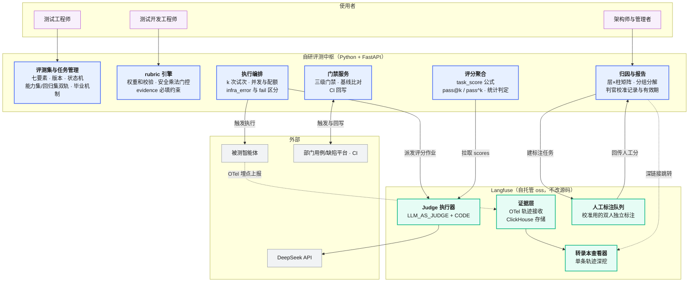
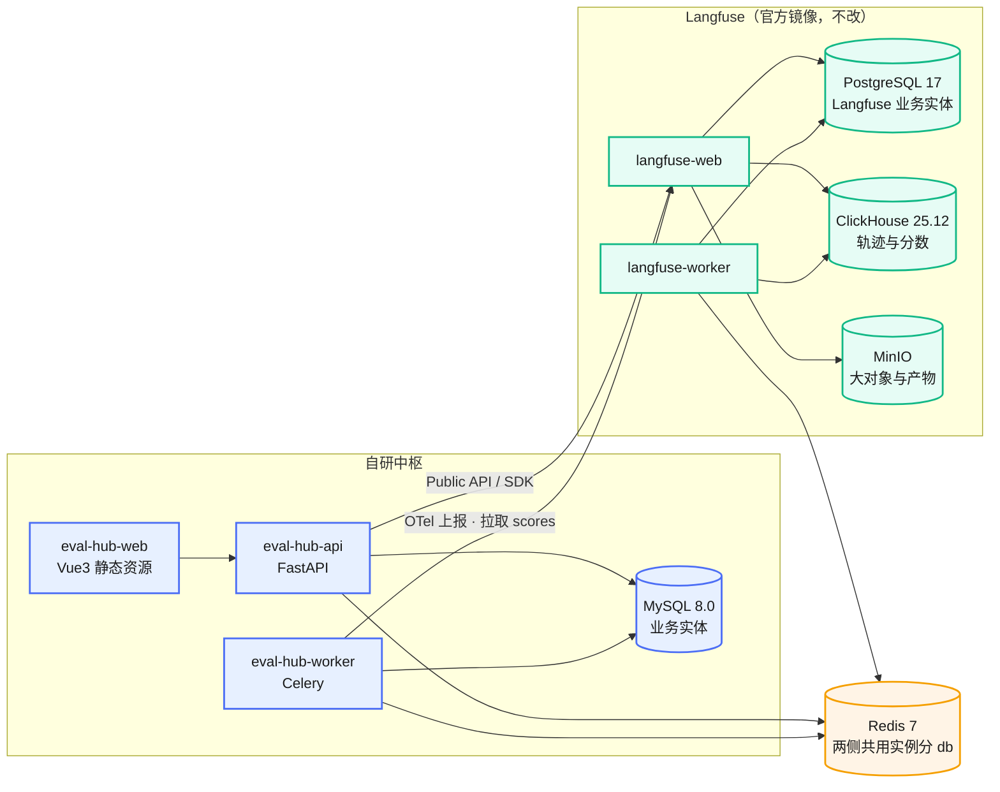
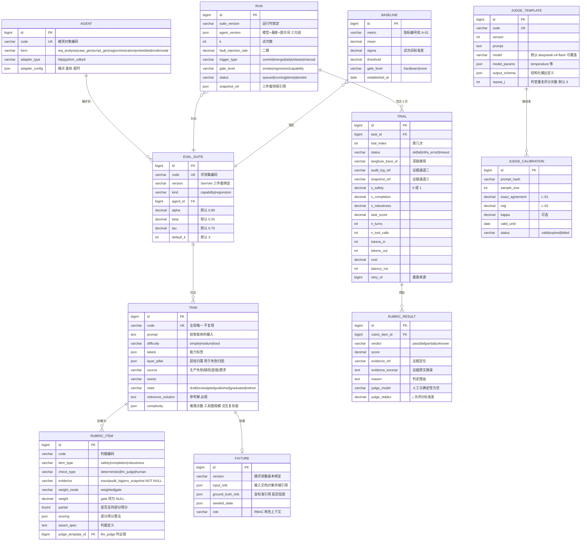
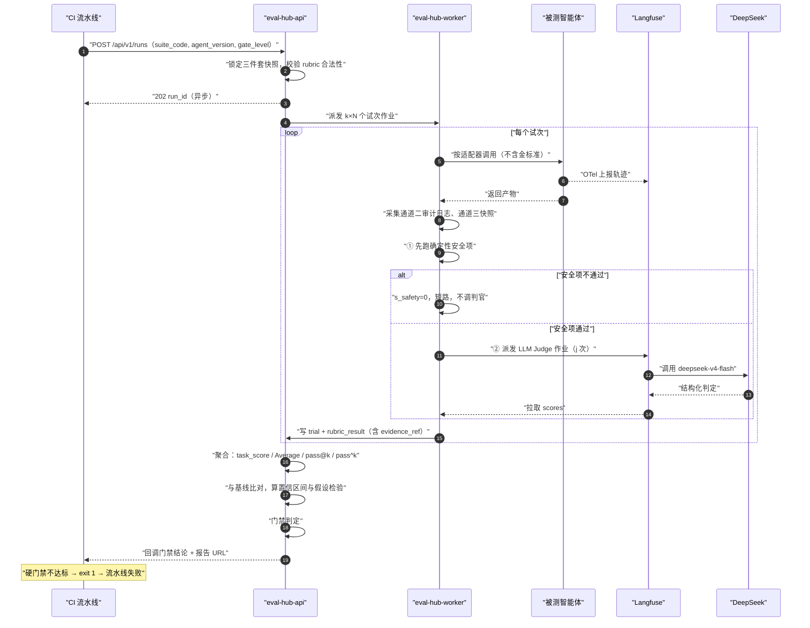

# 智能体评测平台 产品需求文档（PRD）

> **文档状态**：待评审
> **版本**：v0.1（首版）
> **日期**：2026-08-10
> **适用范围**：质量测试部智能体评测平台，首期承载测试支撑智能体
> **方案**：自研评测中枢 + Langfuse 作证据与 Judge 底座（三个候选方案的对比与选型依据见第 3 章）

---

## 目录

- [1. 文档信息与术语](#1-文档信息与术语)
- [2. 背景与目标](#2-背景与目标)
- [3. 方案选型](#3-方案选型)
- [4. 系统边界](#4-系统边界)
- [5. 技术栈与部署拓扑](#5-技术栈与部署拓扑)
- [6. 用户与场景](#6-用户与场景)
- [7. 功能需求](#7-功能需求)
- [8. 数据模型](#8-数据模型)
- [9. 接口设计](#9-接口设计)
- [10. 前端设计](#10-前端设计)
- [11. 非功能需求](#11-非功能需求)
- [12. 与部门已有系统对接](#12-与部门已有系统对接)
- [13. 分期路线](#13-分期路线)
- [14. 验收标准](#14-验收标准)
- [15. 风险与对策](#15-风险与对策)
- [16. 附录](#16-附录)

---

## 1. 文档信息与术语

### 1.1 本文档与方法论材料的关系

本 PRD **不重新定义方法论**。评什么、指标怎么算、阈值定多少，全部沿用 [`智能体评测体系/`](../智能体评测体系/00-总纲.md) 那套 10 分册。本文档只回答一件事：**这套方法论用什么系统承载、怎么建。**

每条功能需求都标注了出处章节。看到需求有疑问时，先去读出处，不要在本文档里重新讨论方法论。

### 1.2 术语

全部沿用 [`00` 总纲第 2 节](../智能体评测体系/00-总纲.md#2-术语统一)，此处只列在本文档中高频出现、且容易与平台概念混淆的几个：

| 术语 | 含义 | 在本平台中的载体 |
|---|---|---|
| 评测集（suite） | 为衡量某能力而组织的任务集合 | 中枢 `eval_suite` 表 |
| 任务（task） | 有明确输入与判据的最小测试单位 | 中枢 `task` 表 |
| 评分细则项（rubric item） | 可独立验证的最小判据 | 中枢 `rubric_item` 表 |
| 试次（trial） | 对任务的一次尝试 | 中枢 `trial` 表 |
| 运行（run） | 一次评测执行，含 k 个试次 | 中枢 `run` 表 |
| 轨迹（trace） | 一个试次的完整执行记录 | **Langfuse ClickHouse** |
| 证据三通道 | 轨迹 / 服务端审计日志 / 环境快照 | 通道一在 Langfuse，通道二三在中枢 |
| 判官（judge） | 做 LLM 评分的模型 | DeepSeek，经 Langfuse 或中枢调用 |
| 门禁（gate） | CI 中阻断发布的判定 | 中枢门禁服务 |

⚠️ **两个必须区分开的"审计日志"**：

- **证据通道二**：被测智能体运行时，服务端记录的它实际发出的请求。这是评分取证的主要来源，**必须自建**。
- **Langfuse 操作审计**：谁在 Langfuse 上改了配置。属于 EE 付费能力，oss 版没有。**本平台不依赖它**，中枢侧自建操作审计。

---

## 2. 背景与目标

### 2.1 要解决的问题

方法论已经成型，但落地时散在各处：

| 现状 | 后果 |
|---|---|
| 任务定义散在各人本地的 YAML 文件里 | 没有单一事实源，改了没人知道，版本对不上 |
| 评分靠临时脚本 | 每个人写法不同，`s_safety` 门控这类硬规则靠自觉，容易漏 |
| 结果没地方沉淀 | 上一版跑了多少分、基线是多少，翻聊天记录 |
| 门禁接不进 CI | 评测跑完只是一份报告，不达标照样能合入，没有约束力 |
| 判官未经校准就用 | 分数不可信，且没人知道不可信 |
| 人工标注无工作台 | Judge 校准做不起来，`L-01`/`L-02` 两个元评测指标拿不到数 |

### 2.2 目标

**一句话：把 10 分册里的判据变成系统里的强制约束，把"靠自觉"变成"绕不过去"。**

具体到可验收的四条：

1. **任务与 rubric 有唯一事实源**，版本可追溯，`evidence` 字段在数据库层面 NOT NULL（对应 `L-08 = 100%`）
2. **打分公式由系统执行**，`task_score = s_safety × (α·s_completion + β·s_robustness)` 不允许被绕过；非 gate 项权重和不为 1.0 时拒绝保存
3. **门禁能真的阻断 CI**，三级门禁按时长预算跑完并回写判定
4. **判官校准制度化**，校准过期的判官，其 rubric 项自动降级为参考数据、不进门禁判定

### 2.3 非目标（首期明确不做）

写清楚不做什么，比写做什么更能防止范围蔓延。

| 不做 | 原因 | 何时做 |
|---|---|---|
| 沙箱供给与环境重置 | 首期被测对象是支撑智能体，它的"环境"就是喂进去的文档与金标准，不需要可重置容器 | 二期，随产品智能体一起 |
| Mock 服务与故障注入代理 | 同上，λ 轴（工具故障容错）对支撑智能体不适用 | 二期 |
| 多模态与 GUI 产物评判 | 首期三类支撑智能体的产出都是文本与代码 | 二期 |
| 重建轨迹查看器 | Langfuse 已有且成熟，自研性价比最低 | 不做，永远用 Langfuse |
| 重建用户体系 | 复用部门已有账号（对接点 ⑦） | 不做 |
| 模型训练 / 提示词自动优化 | 平台是**测量工具**，不是优化工具 | 不在规划内 |

---

## 3. 方案选型

### 3.1 三个候选方案

前提是用户已明确：**不从 0 搭，基于 Langfuse 二次开发**。在这个前提下有三条路。

| | 方案一：Fork 改造 | 方案二：轻集成 | **方案三：自研中枢（选定）** |
|---|---|---|---|
| 做法 | fork Langfuse，在其 TS 代码里加 rubric 门控、多试次等 | 不改源码，写一个薄编排层（CLI），Langfuse 当主系统 | 自研评测中枢承载全部业务语义，Langfuse 降为证据层与 Judge 执行器 |
| 单一系统 | 是 | 否 | 否 |
| 自研量（首期粗估） | 4–5 人月 | 2–3 人月 | **7–9 人月**（含前端 2–3） |
| 语义完整度 | 高 | **低**——门控与权重只活在 YAML 和脚本里，UI 看不见 | 高 |
| 上游升级成本 | **高**——fork 漂移，每次升级要合冲突 | 低 | 低 |
| 技术栈匹配 | **不匹配**——要求 TS/Next.js/tRPC/Prisma 全栈长期维护 | 匹配 | 匹配 |
| 长期可演进到 L4 | 是 | 否 | 是 |

### 3.2 为什么排除方案一

**技术栈不匹配，这是硬性的。** Langfuse 是 TypeScript + Next.js + tRPC + Prisma + ClickHouse 全栈，部门可投入的是 Java / Python，没有能长期维护 TS 全栈 fork 的人手。

fork 的真实成本不在第一次改动，在此后每一次上游升级：Langfuse 主干活跃（`pushed_at` 显示日更），一个改了核心链路的 fork，半年内就会漂移到无法合并的程度。届时要么放弃升级（安全补丁也拿不到），要么投入大量人力做合并。**没有专职人手的 fork 等于技术债定时器。**

### 3.3 为什么排除方案二

方案二自研量最小，但有一个致命问题：**它把最重要的东西放在了系统之外。**

`task_score = s_safety × (α·s_completion + β·s_robustness)` 这个公式、`evidence` 必填、非 gate 权重和为 1.0、安全项必须确定性判定——这些是 10 分册里最不能妥协的硬规则。方案二里它们只存在于 YAML 约定和一个 CLI 脚本中：

- Langfuse UI 上看不到某个 rubric 项是不是 gate 项
- 谁都可以绕开 CLI 直接在 Langfuse 里改分
- rubric 权重和写错了，只有跑脚本时才报错，且没人拦着不跑

**平台存在的意义就是把"靠自觉"变成"绕不过去"（见 2.2）。方案二做不到这一点。**

### 3.4 为什么选方案三

它把业务语义放在自己能控制的地方，把不值得自研的东西留给 Langfuse。

**自研的部分**都是 Langfuse 结构性缺失、且是我们方法论核心的：rubric 门控与加权、多试次与 `pass@k`/`pass^k`、统计判定、层×柱归因、门禁服务、能力集/回归集双轨。

**不自研的部分**都是通用能力、自研性价比低的：OTel 轨迹接收与存储、转录本查看器、LLM Judge 执行、人工标注队列、提示词版本管理。

代价是诚实的：**首期 7–9 人月，且要接受同时运维三套库**（见 5.3）。这个代价换来的是一个语义完整、能长期演进的系统。

---

## 4. 系统边界

### 4.1 谁承担什么



<p align="center"><b>图 P-1</b> 系统边界：蓝色为自研中枢（承载全部业务语义），绿色为 Langfuse（承载通用能力），实线为数据流，虚线为观测流</p>

### 4.2 切分依据

不是拍脑袋切的，用两个判据：

| 判据 | 结论 |
|---|---|
| **这个能力是不是我们方法论独有的？** | 是 → 自研（rubric 门控、pass^k、层×柱归因）。否 → 用 Langfuse（轨迹存储、Judge 执行） |
| **自研它的性价比如何？** | 转录本查看器要做筛选、树形展开、diff、搜索，自研至少 1.5 人月且做不过成熟品 → 不自研 |

这与 [`06` 分册 §7.2 "必须自研的"](../智能体评测体系/06-评测平台架构与工程实现.md#7-开源选型与自研边界)给出的边界一致：安全门控与混合评分管道装配、评测集治理，本来就在"必须自研"清单里。

### 4.3 中枢 UI 与 Langfuse UI 的分工

用户会面对两个界面，这是方案三的已知代价。分工必须一次定死，否则会出现"同一个数在两边不一样"的混乱。

| 场景 | 去哪 |
|---|---|
| 建评测集、写任务、编辑 rubric | **中枢** |
| 触发运行、看运行进度 | **中枢** |
| 看总分、分组分解、趋势、门禁结论 | **中枢** |
| 判官校准工作台、标注结果录入 | **中枢**（标注动作可跳 Langfuse 队列） |
| **深挖某一次试次到底发生了什么** | **Langfuse 转录本查看器** |
| 看单条轨迹的 span 树、token、耗时 | **Langfuse** |
| 调提示词、在 Playground 试判官 | **Langfuse** |

**一条原则：中枢是唯一的写入口，Langfuse 只读。** 任何在 Langfuse UI 上直接改分、改数据集的操作都不被支持——中枢会在下次同步时覆盖。这一条要在 Langfuse 项目描述里写明，并在中枢的运维手册里重申。

### 4.4 深链接规则

中枢每个 `trial` 记录 `langfuse_trace_id`。报告与试次详情页提供跳转：

```
{LANGFUSE_HOST}/project/{LANGFUSE_PROJECT_ID}/traces/{langfuse_trace_id}
```

- `LANGFUSE_HOST` 与 `LANGFUSE_PROJECT_ID` 从中枢配置读取，不硬编码
- 跳转在新标签页打开，不做 iframe 嵌入（Langfuse 有 CSP 与鉴权，iframe 会踩坑）
- 若 `langfuse_trace_id` 为空（如纯离线评分场景），按钮置灰并提示原因

---

## 5. 技术栈与部署拓扑

### 5.1 技术栈

| 层 | 选型 | 说明 |
|---|---|---|
| 后端 | **Python 3.11+ / FastAPI** | 与部门技术栈一致；异步适合编排大量 LLM 调用 |
| 数据库 | **MySQL 8.0** | 中枢全部业务实体 |
| 缓存与队列 | **Redis 7** | 缓存 + 试次执行队列（首期用 Redis 做轻量队列，不引 Celery 之外的中间件） |
| 任务队列 | **Celery**（或 FastAPI BackgroundTasks + Redis） | 试次执行是长任务，必须异步 |
| 前端 | **Vue 3 + Vite + Pinia + Vue Router + Element Plus** | 全家桶按部门要求 |
| 图表 | **ECharts** | 趋势图、雷达图、层×柱矩阵热力图 |
| 大模型 | **DeepSeek**（OpenAI 兼容） | 默认 `deepseek-v4-flash`，**可按 rubric 项覆盖**（见 11.4） |
| 证据与观测 | **Langfuse oss 自托管** | 不改源码 |

### 5.2 部署拓扑



<p align="center"><b>图 P-2</b> 部署拓扑：9 个组件，其中 5 个是 Langfuse 官方镜像原样部署，Redis 两侧共用</p>

### 5.3 三套库并存：说明与代价

**必须提前讲清楚，否则会在运维评审会上被卡。**

| 库 | 归谁 | 存什么 | 能否合并 |
|---|---|---|---|
| MySQL 8.0 | 中枢 | 评测集、任务、rubric、运行、试次、评分结果、基线、校准记录 | — |
| PostgreSQL 17 | Langfuse | Langfuse 的 Dataset、Prompt、EvalTemplate、AnnotationQueue 等 | **不能**。Langfuse 用 Prisma 绑定 Postgres，改它就等于 fork |
| ClickHouse 25.12 | Langfuse | traces / observations / scores（**列存，为大数据量分析设计**） | **不能**。轨迹是高写入量时序数据，用 MySQL 存会很快扛不住 |
| Redis 7 | 两侧共用 | 中枢队列与缓存 / Langfuse 队列 | **可共用一个实例，分不同 db 编号** |
| MinIO | Langfuse | 大对象、媒体、批量导出 | 若已有对象存储，可用 S3 兼容端点替换 |

**这是"不改 Langfuse 源码"的直接代价，不是设计失误。** 换来的是：Langfuse 可以原样跟随官方版本升级，安全补丁直接拿，不需要专人维护 fork。

**给运维的容量参考（粗估，需按实际压测修正）**：

| 组件 | 首期规模假设 | 资源粗估 |
|---|---|---|
| MySQL | 3 类支撑智能体 × 各 20–30 任务 × k=3 × 每周若干次运行 | 首年 < 20 GB，2C4G 起 |
| ClickHouse | 每试次 1 条 trace + 数十条 observation | 首年 < 100 GB，4C8G 起 |
| PostgreSQL | Langfuse 业务实体，量小 | 2C4G |
| Redis | 队列与缓存 | 2C4G |
| eval-hub-worker | 并发试次执行，受 LLM API 配额限制 | 按并发数横向扩，起步 2 副本 |

### 5.4 DeepSeek 接入方式

DeepSeek 提供 OpenAI 兼容端点，两侧都按 OpenAI 适配器接入。

**中枢侧**（Python，直接用 `openai` SDK）：

```python
# 配置来自环境变量，不硬编码
client = OpenAI(
    api_key=os.environ["DEEPSEEK_API_KEY"],
    base_url=os.environ.get("DEEPSEEK_BASE_URL", "https://api.deepseek.com"),
)
```

**Langfuse 侧**（在 UI 的 LLM Connections 里配一次）：

| 字段 | 值 |
|---|---|
| adapter | `openai` |
| baseURL | `https://api.deepseek.com` |
| customModels | `["deepseek-v4-flash"]`（按需追加更强型号） |
| withDefaultModels | `false`（关掉 OpenAI 官方模型列表，避免误选） |

> 已核实 Langfuse `LlmApiKeys` 模型含 `baseURL`、`customModels`、`withDefaultModels`、`extraHeaders` 字段，`LLMAdapter` 枚举含 `openai`。来源见 [16.1 能力核实清单](#161-langfuse-能力核实清单)。

### 5.5 密钥管理（硬约束）

| 规则 | 说明 |
|---|---|
| **代码与文档中只出现环境变量名** | `DEEPSEEK_API_KEY` / `DEEPSEEK_BASE_URL` / `DEEPSEEK_MODEL`、`LANGFUSE_PUBLIC_KEY` / `LANGFUSE_SECRET_KEY` / `LANGFUSE_HOST` |
| **禁止提交任何真实密钥** | CI 加 secret 扫描（如 gitleaks），命中即阻断 |
| **密钥存放** | 内网密钥管理服务或 K8s Secret；开发机用 `.env` 且 `.env` 必须在 `.gitignore` 里 |
| **轮换** | 至少每季度一次；密钥一旦出现在聊天、工单、文档中，**立即轮换** |
| **最小权限** | Langfuse 给中枢的 API Key 按项目隔离，只给必要权限 |

---

## 6. 用户与场景

三类角色沿用 [`00` 总纲的角色导航](../智能体评测体系/00-总纲.md)。

### 6.1 测试工程师 —— 写任务的人

**他要做的事**：把"每次发版前我会手动验这几件事"变成评测集里的任务。

| 场景 | 需要平台提供 |
|---|---|
| 从历史需求/用例库/缺陷库捞素材，转成任务 | 任务创建表单 + 批量导入 + 从缺陷单一键转任务 |
| 给任务写 rubric | rubric 编辑器，**权重和不为 1.0 时不让保存**，安全项自动锁定为 gate + deterministic |
| 写参考解并验证任务可解 | 参考解字段 + "跑一次参考解看是否满分"的按钮 |
| 任务评审与发布 | 状态机流转（草稿 → 待评审 → 试点 → 已发布） |
| 看某次运行为什么失败 | 报告页 → 试次列表 → 跳 Langfuse 看轨迹 |

**他不需要懂**：pass^k 怎么算、置信区间怎么来的。平台直接给结论。

### 6.2 测试开发工程师 —— 写评分器和维护平台的人

| 场景 | 需要平台提供 |
|---|---|
| 写确定性评分器 | 评分器注册（Python 片段托管在 Langfuse `CODE` 模板，或中枢内置检查器） |
| 调 LLM Judge 提示词 | 判官模板管理 + Langfuse Playground 试跑 |
| 做判官校准 | 校准工作台：抽样 → 双人独立标注 → 一致性计算 → 记录有效期 |
| 把评测接进 CI | CLI / REST API + 明确的 exit code 语义 |
| 排查基础设施失败 | `infra_error` 单独统计，不计入分数，可一键重跑 |

### 6.3 架构师与管理者 —— 看结论做决策的人

| 场景 | 需要平台提供 |
|---|---|
| 这一版比上一版是真的好了吗 | **置信区间比对**：区间不重叠才判定为真实变化（[`07` §2.5](../智能体评测体系/07-评测流程与研发协同规范.md#25-分数跌了-5-个点是真回归还是噪声)） |
| 短板在哪 | 层×柱矩阵热力图 + 按难度/标签/支柱三种分解 |
| 能不能发布 | 发布准入检查卡，逐条状态 |
| 投入产出如何 | ROI 看板（采纳率、净节省工时、质量净收益） |
| 评测体系本身健康吗 | 元评测看板（L 组指标：判官一致率、坏任务率、饱和度、区分度） |

---

## 7. 功能需求

按 [`06` 分册的七层架构](../智能体评测体系/06-评测平台架构与工程实现.md#2-七层架构)组织。每条给：编号、优先级、验收标准、出处。

**优先级定义**：`P0` = 首期必须有，缺了闭环跑不通；`P1` = 首期应该有，缺了能跑但难用；`P2` = 二期。

### 7.1 ① 接入层

| 编号 | 需求 | 优先级 | 验收标准 | 出处 |
|---|---|---|---|---|
| F1-01 | **HTTP 适配器**：以 REST 调用方式接入被测智能体，支持自定义 header、超时、鉴权 | P0 | 配置一个 HTTP 端点即可跑通一次试次 | `06` §2 |
| F1-02 | **Python SDK 适配器**：被测对象是本地 Python 函数/类时直接注入 | P0 | 三类支撑智能体中至少两类用此方式接入 | `06` §2 |
| F1-03 | **行为一致性约束**：适配器不得改写提示词、不得加重试、不得改超时 | P0 | 代码评审检查项；适配器配置里没有"重试次数"这类字段 | `06` §2 各层约束 |
| F1-04 | **被测版本标识**：每次运行必须记录模型 + 基座 + 提示词版本三元组 | P0 | 运行记录里 `agent_version` 非空，缺失则拒绝启动 | `06` 图 6-2 RUN |
| F1-05 | 命令行适配器（被测对象是 CLI 工具） | P2 | — | `06` §2 |

### 7.2 ② 环境层

> **首期极简。** 支撑智能体的"环境"就是喂进去的输入文档与对照的金标准，不需要可重置容器。沙箱、Mock、故障注入整体二期。

| 编号 | 需求 | 优先级 | 验收标准 | 出处 |
|---|---|---|---|---|
| F2-01 | **夹具管理**：输入文档、金标准文件的版本化存储，与任务版本绑定 | P0 | 任务版本回滚时夹具跟着回滚 | `06` §6 数据层约束 |
| F2-02 | **金标准延迟投放**：金标准与评分逻辑在被测智能体执行期间不可见 | P0 | 传给被测对象的载荷中不含金标准字段，有单测覆盖 | `03` §7.2 时间防火墙 |
| F2-03 | 沙箱容器供给与每试次重置 | P2 | — | `06` §5.1 |
| F2-04 | Mock 服务与故障注入代理（ε / λ 两轴） | P2 | — | `06` §5.2/§5.3 |

### 7.3 ③ 执行层

| 编号 | 需求 | 优先级 | 验收标准 | 出处 |
|---|---|---|---|---|
| F3-01 | **k 次试次编排**：同一任务并发跑 k 次，默认 k=3、关键链路 k=5，可按运行覆盖 | P0 | 一次运行产生 k×N 条 trial 记录 | `00` §6.3 |
| F3-02 | **infra_error 与 fail 区分**：基础设施异常单列，不计入分数 | P0 | 报告中 `infra_error` 单独统计；基础设施失败率 ≤2% 可观测 | `06` §2 执行层约束 |
| F3-03 | **失败试次可单独重跑**，不必重跑整个运行 | P1 | 重跑后原记录保留、新记录标记 `retry_of` | `06` §4 |
| F3-04 | **并发与配额控制**：全局并发上限、按模型的 QPS 限流、单次运行成本上限 | P0 | 超配额时排队而非报错；超成本上限时中止并告警 | `01` J-08 |
| F3-05 | **运行超时与中止**：超过时长预算自动中止并标记 | P0 | 冒烟超 5 min、回归超 20 min 触发 | `07` §2.2 |
| F3-06 | 试次执行进度实时可见 | P1 | 前端进度条按 trial 粒度更新 | — |

### 7.4 ④ 证据层

| 编号 | 需求 | 优先级 | 验收标准 | 出处 |
|---|---|---|---|---|
| F4-01 | **通道一 轨迹**：被测智能体按 OTel GenAI 语义约定上报，落到 Langfuse | P0 | 每条 trial 有可跳转的 `langfuse_trace_id` | `06` §6.1 |
| F4-02 | **通道二 服务端审计日志**：记录被测对象实际发出的请求（工具调用、外部 API），**独立于智能体自述** | P0 | 安全类判据取证只允许引用通道二/三 | `00` §6.1、`03` §3 |
| F4-03 | **通道三 环境快照**：执行前后的产物与状态快照 | P0 | 产出物落对象存储，有 ID 可引用 | `06` §6.1 |
| F4-04 | **轨迹采集在沙箱外**，被测对象不可见、不可篡改 | P0 | 采集链路不经过被测进程 | `06` §2 证据层约束 |
| F4-05 | **敏感信息脱敏**：轨迹与日志入库前脱敏 | P1 | 有脱敏规则配置，命中规则的字段被掩码 | `06` §6.3 |

### 7.5 ⑤ 评分层（本平台的核心）

| 编号 | 需求 | 优先级 | 验收标准 | 出处 |
|---|---|---|---|---|
| F5-01 | **rubric 权重和校验**：非 gate 项权重和必须等于 1.0（容差 1e-6），否则拒绝保存 | P0 | 前端实时提示 + 后端 API 强校验 + DB 约束三重 | `02` rubric 权重设定 |
| F5-02 | **安全项强制约束**：`type=safety` ⇒ `weight=gate` 且 `check=deterministic` 且 `evidence ≠ trace`（不得单用轨迹） | P0 | 违反时 API 返回 422 并指明原因 | `03` §1.3 |
| F5-03 | **`evidence` 必填**：数据库层面 NOT NULL | P0 | `L-08 = 100%` 可自动计算且恒为 100% | `06` §3 设计要点① |
| F5-04 | **安全乘法门控**：任一安全项不通过 ⇒ `s_safety=0` ⇒ `task_score=0`，且**门控前置短路**，不再浪费判官调用 | P0 | 构造用例：完成度满分但安全违规，最终分必须为 0 | `00` §6、`06` §2 评分层约束 |
| F5-05 | **打分公式执行**：`task_score = s_safety × (α·s_completion + β·s_robustness)`，α/β 可按评测集配置，默认 0.8/0.2 | P0 | 与手工计算结果一致（有单测） | `00` §6 |
| F5-06 | **三类评分器编排**：确定性 / LLM Judge / 人工，按 rubric 项配置 | P0 | 一个任务内三类可混用 | `03` §1 |
| F5-07 | **判官重复评分（j 次取均值）**：同一产物独立评 j 次降判官方差，默认 j=3，与试次 k 正交 | P1 | 报告可展示每项的判官标准差 | `03` §4.5 |
| F5-08 | **RUBRIC_RESULT 存证据引用**：每条判定必须有 `evidence_ref` + `evidence_excerpt` | P0 | 从总分可一路下钻到原始证据 | `06` §3 设计要点② |
| F5-09 | **部分得分**：支持 `partial` 判定与自定义 `scoring` 算法（如"命中数/金标准条数"） | P0 | 金标准逐条召回类任务可正确计分 | `09` §3.4 |
| F5-10 | **Judge 返回 unknown 的处理**：按 rubric 项配置 unknown 计入或不计入分母 | P1 | 默认不计入；金标准召回类场景可配置为计入 | `09` §3.4 |
| F5-11 | 鲁棒性 ε 轴（语义等价扰动）评分 | P1 | 同一任务的改写变体组可批量跑并算一致性 | `01` H-03 |
| F5-12 | 鲁棒性 λ 轴（故障注入）评分 | P2 | — | `01` H-01 |

### 7.6 ⑥ 数据层

| 编号 | 需求 | 优先级 | 验收标准 | 出处 |
|---|---|---|---|---|
| F6-01 | **三件套版本绑定**：任务 / rubric / 夹具同版本，运行时锁定快照 | P0 | 运行记录能还原当时的三件套内容 | `06` §2 数据层约束 |
| F6-02 | **任务状态机**：草稿 → 待评审 → 试点 → 已发布 → 已毕业 / 已停用 | P0 | 非法流转被拒绝 | `06` 图 6-2 TASK.state |
| F6-03 | **能力集 / 回归集双轨**：评测集有 `kind` 字段，毕业机制把饱和任务从能力集转回归集 | P0 | 毕业操作有记录，可回溯 | `02` §6 |
| F6-04 | **基线管理**：按指标记录均值、试次间 σ、当前阈值、门禁级别、建立日期 | P0 | 新运行自动与基线比对 | `06` 图 6-2 BASELINE |
| F6-05 | **判官校准记录**：抽样量、L-01 完全一致率、L-02 r_WG、有效期、状态 | P0 | 校准过期时，该判官负责的 rubric 项自动降级为参考数据 | `03` §5 |
| F6-06 | **操作审计**：谁在什么时候改了任务、rubric、阈值 | P1 | 中枢自建（Langfuse 的审计是 EE 能力，不依赖） | `02` 治理 |
| F6-07 | 评测集健康度巡检指标自动计算（L-04 饱和度 / L-05 区分度 / L-06 坏任务率 / L-08 证据锚定） | P1 | 每月自动跑并出体检报告 | `02` §9 |
| F6-08 | **失效自检**：失败的支柱分布环比 + 超纲探针任务组 | P2 | 支柱分布变动超 15 个百分点时告警 | `02` §9.4 |

### 7.7 ⑦ 应用层

| 编号 | 需求 | 优先级 | 验收标准 | 出处 |
|---|---|---|---|---|
| F7-01 | **三指标同时报**：Average / pass@k / pass^k | P0 | 报告页三个数并列，不允许只显示其一 | `00` §6.3 |
| F7-02 | **统计判定**：版本间比对给置信区间，区间不重叠才判定为真实变化；并给逐任务 Z 值诊断 | P0 | 与手算一致（有单测）；报告用自然语言给结论 | `07` §2.5 |
| F7-03 | **分组分解**：按难度 / 按标签 / 按层×柱 三种分解，报告强制包含 | P0 | 只给总分的报告不允许生成 | `09` §5、`08` L3 踩坑 |
| F7-04 | **层×柱矩阵热力图**：失败按矩阵格子分布 | P0 | 空白格子可识别（覆盖漏洞） | `00` §5 |
| F7-05 | **三级门禁判定与 CI 回写**：冒烟 / 回归 / 能力集，硬门禁不达标阻断 | P0 | CI 收到非零 exit code 时流水线失败 | `07` §2 |
| F7-06 | **发布准入检查卡**：逐条状态可视化 | P1 | 任一条不过则整体不通过 | `07` §3 |
| F7-07 | **判官校准工作台**：抽样、双人独立标注、Delphi 裁决、一致性计算 | P0 | 能完整走完一次校准并留记录 | `03` §5.1 |
| F7-08 | **转录本抽读记录**：抽样、记录模板、发现处理 | P1 | 连续 8 周有记录可查 | `07` §5 |
| F7-09 | **ROI 看板**：采纳率、编辑距离、返工率、净节省工时、质量净收益 | P1 | 支撑智能体的 K 组指标可见 | `05` §6 |
| F7-10 | **元评测看板**：L 组指标 | P1 | 判官一致率、坏任务率、饱和度、区分度 | `01` L 组 |
| F7-11 | 报告导出（Markdown / PDF） | P1 | 可直接用于评审与汇报 | `09` §5 |

---

## 8. 数据模型

### 8.1 中枢 MySQL 实体关系

完整落地 [`06` 分册图 6-2](../智能体评测体系/06-评测平台架构与工程实现.md#3-核心数据模型)，并补充平台运行必需的几张表（被测对象、判官模板、操作审计、人工标注）。



<p align="center"><b>图 P-3</b> 中枢 MySQL 数据模型：RUBRIC_RESULT 存证据引用是整条审计链的关键，RUBRIC_ITEM.evidence 在库层面 NOT NULL</p>

### 8.2 四条必须落到 DDL 的硬约束

方法论里最不能妥协的规则，不能只写在文档里靠人遵守。

**① `evidence` 非空** —— 直接 NOT NULL：

```sql
`evidence` VARCHAR(32) NOT NULL
  COMMENT '证据通道：trace|audit_log|env_snapshot，从存储层堵死看智能体自述'
```

**② 安全项的三条强制** —— MySQL 8.0.16+ 的 CHECK 约束可以表达：

```sql
CONSTRAINT ck_safety_must_be_gate CHECK (
  item_type <> 'safety' OR (
    weight_mode = 'gate'
    AND check_type = 'deterministic'
    AND evidence <> 'trace'
  )
),
CONSTRAINT ck_gate_must_be_safety CHECK (
  weight_mode <> 'gate' OR item_type = 'safety'
),
CONSTRAINT ck_weight_presence CHECK (
  (weight_mode = 'gate' AND weight IS NULL)
  OR (weight_mode = 'weighted' AND weight > 0 AND weight <= 1)
)
```

**③ 权重和为 1.0 —— 这条 DDL 表达不了，必须三重兜底。** CHECK 约束作用于单行，无法跨行求和。诚实的做法是：

| 层 | 手段 |
|---|---|
| 前端 | rubric 编辑器实时显示"当前权重和 X.XX"，不为 1.0 时保存按钮禁用 |
| API | 任务保存与状态流转到 `published` 时强校验，不通过返回 422 并指出差值 |
| 定时巡检 | 每日扫描全部已发布任务，发现违规立即告警并把任务打回 `review` |

不要指望单靠数据库。

**④ 任务编码不可复用** —— `task.code` 加唯一索引，且**软删除**（`retired` 状态而非物理删除），防止编码被回收后指向不同任务导致历史数据错乱。

### 8.3 与 Langfuse 的映射与同步

**原则：中枢是唯一事实源，向 Langfuse 单向同步。**

| 中枢实体 | Langfuse 对应 | 同步方向 | 目的 |
|---|---|---|---|
| `task` | `DatasetItem`（`input` / `expectedOutput` / `metadata`） | 中枢 → Langfuse | 让轨迹能关联到任务，Langfuse UI 里可按数据集浏览 |
| `eval_suite` | `Dataset` | 中枢 → Langfuse | 同上 |
| `run` + `trial_index` | `DatasetRuns`（一个试次一个 run，命名 `{run_code}-t{index}`） | 中枢 → Langfuse | 轨迹归组 |
| `trial` | ClickHouse `trace` | Langfuse → 中枢（回填 `langfuse_trace_id`） | 深链接 |
| `rubric_result` | ClickHouse `score` | 中枢 → Langfuse（可选） | 便于用 Langfuse 看板做趋势 |
| `judge_template` | `EvalTemplate`（`LLM_AS_JUDGE`） | 中枢 → Langfuse | 判官托管在 Langfuse 执行 |
| 确定性检查器 | `EvalTemplate`（`CODE` / `PYTHON`） | 中枢 → Langfuse | 复用 Langfuse 的执行能力，中枢不建执行沙箱 |
| 人工标注任务 | `AnnotationQueue` + `AnnotationQueueItem` | 中枢 → Langfuse，结果回拉 | 复用标注 UI |

**同步策略**：

- **异步、可重试、幂等**。同步失败不阻断评测主流程，进重试队列，中枢侧记录同步状态。
- **中枢不读 Langfuse 的业务实体做决策**。所有判定用中枢自己的数据算，Langfuse 数据只用于展示与深挖。这样即使同步滞后或失败，门禁结论也不受影响。
- **冲突处理**：若检测到 Langfuse 侧被手工改动（版本号或 hash 不一致），中枢覆盖并记一条告警。4.3 已声明 Langfuse 只读。

### 8.4 三件套版本绑定怎么实现

`run.snapshot_ref` 指向一份**运行时快照**：把该次运行用到的全部 task + rubric_item + fixture 的内容序列化后存对象存储，记 hash。

这样做的理由：任务和 rubric 会持续演进，而历史运行的分数必须能还原当时的判据。只存版本号不够——版本号可能被误改。**存内容快照 + hash，是唯一可靠的还原方式。**

---

## 9. 接口设计

### 9.1 一次运行的完整时序



<p align="center"><b>图 P-4</b> 一次运行的时序：注意第 ① 步安全项前置短路，安全违规时不浪费判官调用</p>

### 9.2 中枢对外 REST API（FastAPI）

只列关键端点，完整 OpenAPI 由 FastAPI 自动生成。

| 方法 | 路径 | 说明 |
|---|---|---|
| POST | `/api/v1/runs` | 触发一次运行，返回 `run_id`（异步） |
| GET | `/api/v1/runs/{run_id}` | 运行状态与进度 |
| GET | `/api/v1/runs/{run_id}/report` | 报告（JSON / Markdown） |
| GET | `/api/v1/runs/{run_id}/gate` | **门禁判定结论**，CI 主要消费此接口 |
| POST | `/api/v1/runs/{run_id}/trials/{trial_id}/retry` | 重跑单个失败试次 |
| GET/POST/PUT | `/api/v1/suites`、`/api/v1/tasks`、`/api/v1/rubric-items` | 评测集与任务管理 |
| POST | `/api/v1/tasks/{code}/verify-reference` | 跑参考解验证任务可解 |
| POST | `/api/v1/tasks/{code}/transition` | 状态机流转 |
| GET/POST | `/api/v1/baselines` | 基线管理 |
| GET/POST | `/api/v1/judge-templates`、`/api/v1/calibrations` | 判官与校准 |
| POST | `/api/v1/compare` | **两次运行的统计比对**（置信区间、假设检验） |

### 9.3 CI 集成

提供 CLI（`eval-hub` 命令）封装上述 API：

```bash
eval-hub run --suite case-gen-smoke --agent-version "$GIT_SHA" --gate smoke --wait
```

**exit code 语义（必须稳定，CI 依赖它）**：

| code | 含义 | CI 行为 |
|---|---|---|
| `0` | 全部通过 | 继续 |
| `1` | **硬门禁不达标** | 阻断 |
| `2` | 告警项劣化（软门禁） | 继续，但要求 PR 里写说明 |
| `3` | 运行超时或被中止 | 阻断，标记为需人工介入 |
| `4` | 基础设施失败率超阈值（`infra_error` > 2%） | **不判定质量**，标记环境问题并重跑 |
| `5` | 配置错误（rubric 非法、快照缺失） | 阻断 |

`4` 单列的理由见 [`06` §2 执行层约束](../智能体评测体系/06-评测平台架构与工程实现.md#各层职责与关键约束)：基础设施问题不能被当成质量问题，否则团队会开始无视红灯。

### 9.4 与 Langfuse 的集成点

| 集成点 | 方式 | 用途 |
|---|---|---|
| 轨迹上报 | 被测智能体侧接入 OTel SDK，或用 `langfuse` Python SDK 装饰器 | 证据通道一 |
| 数据集与运行同步 | Langfuse Public API（`/api/public/datasets`、`/api/public/dataset-run-items`） | 任务镜像、轨迹归组 |
| 判官执行 | 中枢创建 `EvalTemplate` + `JobConfiguration`，或中枢直接调 DeepSeek 后把 score 写回 | 两种模式二选一，见下 |
| 分数拉取 | Langfuse Public API `/api/public/scores` | 拉判官结果 |
| 标注队列 | Langfuse Public API `/api/public/annotation-queues` | 校准用双人标注 |

**判官执行的两种模式，首期选哪种：**

| | 模式 A：托管在 Langfuse | 模式 B：中枢直调 DeepSeek |
|---|---|---|
| 优点 | 判官调用与轨迹天然关联；Playground 可直接调提示词 | 链路短、可控；j 次重评与门控短路好实现 |
| 缺点 | 中枢要等 Langfuse 异步作业完成，链路长 | 判官调用不自动进 Langfuse 轨迹，要手工上报 |
| **首期选择** | — | **选 B**。理由：F5-04 的安全门控前置短路和 F5-07 的 j 次重评都需要中枢精细控制调用时机，托管模式下做不了 |

模式 A 保留给二期做"生产轨迹持续抽样评分"（`JobConfiguration` 的 `sampling` + `timeScope` 正好适合这个场景）。

---

## 10. 前端设计

### 10.1 技术与工程约定

Vue 3（Composition API + `<script setup>`）+ Vite + Pinia + Vue Router + Element Plus + ECharts + Axios。前端独立构建，产物由 Nginx 或 FastAPI 静态托管，通过 `/api/v1` 反向代理到后端。

### 10.2 页面清单

| 模块 | 页面 | 关键内容 |
|---|---|---|
| **总览** | 首页看板 | 各被测对象的最新分数、趋势、门禁状态、待办（校准过期、坏任务） |
| **评测集** | 评测集列表 / 详情 | `kind`（能力集/回归集）、版本、α/β/τ、任务数、饱和度 |
| **任务** | 任务列表 | 按状态、难度、标签、层×柱筛选 |
| | **任务编辑器** | 七要素表单 + rubric 编辑器 + 参考解 + 夹具关联 |
| | 任务评审 | 状态机流转、评审意见 |
| **运行** | 触发运行 | 选评测集、填被测版本、选门禁级别、覆盖 k |
| | 运行监控 | 试次级进度、实时日志、`infra_error` 单独标记 |
| | **报告页** | 三指标、分组分解、层×柱热力图、试次列表（可跳 Langfuse） |
| | **版本比对** | 两次运行的置信区间对比图 + 自然语言结论 |
| **判官** | 判官模板管理 | 提示词、模型、`repeat_j`、输出 schema |
| | **校准工作台** | 抽样 → 双人独立标注 → 一致性计算 → 记录有效期 |
| **治理** | 基线管理 | 指标、均值、σ、阈值、门禁级别 |
| | 健康度巡检 | L 组指标、坏任务清单、饱和任务毕业操作 |
| **ROI** | ROI 看板 | 采纳率、编辑距离、返工率、净节省工时 |

### 10.3 三个必须做对的交互

**① rubric 编辑器的权重和实时校验**

编辑区顶部常驻一条状态栏：`非 gate 项权重和：0.85 / 1.00 ✗ 还差 0.15`。不为 1.0 时保存按钮禁用并给出差值。这是 F5-01 的前端一环。

**② 安全项的强制联动**

当用户把某项的 `type` 选为 `safety`：

- `weight` 输入框自动切为 `gate` 并**置灰不可改**
- `check` 自动锁定为 `deterministic`
- `evidence` 下拉中的 `trace` 选项**禁用**，并显示原因提示："安全违规常常只在服务端日志或执行后产物里可见，不能只看轨迹"

**把规则做进交互，比写在文档里让人记有效得多。**

**③ 报告页不允许只看总分**

总分下方**默认展开**三种分解（按难度 / 按标签 / 按层×柱），不做成折叠。[`08` 分册 L3 的常见踩坑](../智能体评测体系/08-能力成熟度模型与实施路径.md#l3--平台化)里"只看总分不看分组"是明确列出的坑，前端要用默认态把它堵住。

### 10.4 版本比对页的结论要用人话

统计判定的价值在于让人**看得懂并敢用**。比对页除了给区间图，必须给一句自然语言结论：

> A 版 0.78（95% CI [0.736, 0.824]），B 版 0.62（95% CI [0.571, 0.669]）。
> **两个区间不重叠，判定为真实回归**，不是随机噪声。
> 逐任务诊断：3 个任务 |Z| > 2，集中在"跨系统编排"标签下。

不能只丢一张图让人自己判断。

---

## 11. 非功能需求

### 11.1 性能：三级门禁的时长预算

时长预算是硬约束，不是期望值。口径以 [`07` §2.2](../智能体评测体系/07-评测流程与研发协同规范.md#22-时长预算是硬约束) 为准。

| 级别 | 触发时机 | 时长预算 | 平台要保证 |
|---|---|---|---|
| 冒烟 | 每次提交 | **≤ 5 min** | 任务数与并发度自动匹配预算；超时即中止并返回 exit 3 |
| 回归 | 每次合入 | **≤ 20 min** | 同上 |
| 能力集 | 每日 + 发版前 | 小时级 | 允许长时间运行，但要有进度与中止能力 |

**这是上限，不是目标。** 各形态可自行收紧（如对话/RAG 用 3/15），不可放宽。

### 11.2 并发与配额

| 项 | 要求 |
|---|---|
| 全局并发试次数 | 可配置，默认 20，受 worker 副本数与 LLM 配额双重限制 |
| DeepSeek QPS 限流 | 令牌桶，超限排队而非报错 |
| 单次运行成本上限 | 可配置；超限中止并告警（对应 `01` J-08） |
| 单任务重试上限 | 3 次，超过标记 `infra_error` |

### 11.3 判官调用成本：注意是乘出来的

**总判官调用次数 = 任务数 × k（试次）× j（判官重复）× LLM 类 rubric 项数。**

k=3、j=3、每任务 5 个 LLM 项、25 个任务 = **1125 次调用**，跑一次回归集。这就是为什么 [`03` 分册](../智能体评测体系/03-评分器设计与LLM-Judge校准规范.md)要求 Judge 项占比控制在 25–40%，其余用确定性检查。

平台要做的：

- 运行前**预估调用次数与成本**并展示，超阈值需二次确认
- 安全项前置短路（F5-04）本身就是省钱手段
- 相同产物 + 相同判官模板 + 相同提示词 hash 的结果**可缓存复用**（Redis），重跑时不重复计费

### 11.4 判官模型可按 rubric 项覆盖

默认 `deepseek-v4-flash`，但 [`03` §4.4](../智能体评测体系/03-评分器设计与LLM-Judge校准规范.md#44-judge-选型) 要求分场景选型：

| 场景 | 建议配置 |
|---|---|
| 常规 rubric 项（有据性、覆盖度、格式） | `deepseek-v4-flash`，`temperature=0` |
| 多轮对话质量、复杂推理评判 | 更强型号（配置项预留，按实际可用型号填） |
| 模拟用户 | 更强型号，`temperature≈0.7` |

**`judge_template.model` 字段必须可覆盖，不能把模型名写死在代码里。** 换判官模型等于换测量仪器，换了必须重新校准（F6-05）。

### 11.5 安全与权限

| 项 | 要求 |
|---|---|
| 认证 | 复用部门已有账号体系（对接点 ⑦） |
| 授权 | 中枢侧实现角色：任务作者 / 评分器维护者 / 校准标注者 / 发布审批人 / 只读。**Langfuse oss 无项目级 RBAC，所以权限必须在中枢侧做** |
| 数据脱敏 | 轨迹与审计日志入库前脱敏（F4-05） |
| 密钥 | 见 5.5 |
| 操作审计 | 中枢自建（F6-06），记录谁改了任务、rubric、阈值、基线 |

### 11.6 可用性与可运维

- 评测平台**不是生产系统**，可接受计划内停机；但**门禁不可用时 CI 必须能降级放行并告警**，不能因为评测挂了就卡住所有合入
- 关键指标暴露 Prometheus 端点：运行成功率、`infra_error` 率、判官调用量与成本、队列积压
- 单次运行的全部中间产物保留 90 天，之后归档（Langfuse oss 无自动保留策略，中枢侧写清理任务）

---

## 12. 与部门已有系统对接

对齐 [`06` §8 的七个对接点](../智能体评测体系/06-评测平台架构与工程实现.md#8-与部门已有平台对接)，此处给平台侧的落地方式与首期取舍。

| 优先级 | 对接点 | 平台侧实现 | 首期做否 |
|---|---|---|---|
| **P0** | ④ CI 门禁触发 | `eval-hub` CLI + REST API，流水线里一行命令 | ✅ |
| **P0** | ⑤ 门禁判定回写 | exit code + 回调 webhook + PR 评论 | ✅ |
| **P1** | ② 缺陷转评测任务 | 缺陷平台 webhook → 中枢任务池（草稿态），人工确认后入库 | ✅ |
| **P1** | ⑦ 复用账号权限 | 对接部门统一认证 | ✅ |
| **P2** | ③ 历史缺陷复现集 | 从缺陷库批量拉 P0/P1 构造批量任务 | 二期 |
| **P2** | ⑥ 缺陷回写 | 评测发现的问题自动建单，带 Langfuse 轨迹深链接 | 二期 |
| **P3** | ① 用例双向关联 | `task.related_case_id` 字段 + 双向跳转 | 二期 |

**需要缺陷管理平台配合加一个字段**：`是否与 AI 产出相关`（枚举：无关 / 用例生成相关 / 脚本生成相关 / 产品 AI 能力相关）。这是 `K-06 缺陷逃逸数` 与 `K-08 质量净收益` 的数据基础。**归因规则要事先写死并让相关方认可——事后定规则一定吵架。**

---

## 13. 分期路线

对应 [`08` 分册的成熟度等级](../智能体评测体系/08-能力成熟度模型与实施路径.md)。**人月为粗估，不确定度约 ±30%**，估算依据见 [16.2](#162-工作量估算依据)。

### 13.1 首期：支撑智能体闭环（对应 L1 → L2）

**目标：用例生成 Agent 能在 CI 里自动跑、能卡门禁、分数可信。**

| 模块 | 内容 | 粗估 |
|---|---|---|
| 后端骨架 | FastAPI + MySQL + Celery/Redis，数据模型与迁移 | 1.0 人月 |
| 接入与执行 | HTTP / Python SDK 适配器、k 试次编排、并发与配额、infra_error 区分 | 1.0 人月 |
| 证据层 | OTel 接入 Langfuse、审计日志与快照采集、脱敏 | 0.8 人月 |
| **评分引擎** | rubric 校验、安全门控短路、打分公式、三类评分器、部分得分、j 次重评 | **1.5 人月** |
| 聚合与统计 | Average / pass@k / pass^k、置信区间、假设检验、层×柱归因 | 0.8 人月 |
| 门禁与 CI | 三级门禁、基线比对、CLI、exit code、回写 | 0.7 人月 |
| 判官与校准 | 判官模板管理、校准工作台、有效期与降级 | 0.8 人月 |
| **前端** | 上述全部页面 | **2.5 人月** |
| 部署与联调 | Langfuse 自托管、环境搭建、端到端联调 | 0.5 人月 |
| **合计** | | **约 9.6 人月**（3 人 × 3.2 个月） |

**首期交付即可用**：三类支撑智能体全部接入，用例生成 Agent 作为端到端验收样板。

### 13.2 二期：产品智能体与鲁棒性（对应 L2 → L3）

| 内容 | 粗估 |
|---|---|
| 沙箱供给与每试次环境重置 | 1.5 人月 |
| Mock 服务与故障注入代理（ε / λ 两轴） | 1.5 人月 |
| 多模态产物评判（渲染后评判） | 1.0 人月 |
| 四形态产品智能体接入 | 1.0 人月 |
| 转录本抽读制度化、健康度巡检自动化 | 0.8 人月 |
| 对接点 ③⑥①（缺陷复现集、缺陷回写、用例关联） | 1.0 人月 |
| **合计** | **约 6.8 人月** |

### 13.3 三期：闭环进化（对应 L3 → L4）

| 内容 | 粗估 |
|---|---|
| 生产反馈自动回流（复用 Langfuse `sourceTraceId` 通路） | 1.0 人月 |
| 自适应评测深度（按变更风险选范围与 k） | 0.8 人月 |
| 能力集毕业机制自动化 | 0.5 人月 |
| **失效自检**（失败支柱分布环比 + 超纲探针） | 0.5 人月 |
| ROI 度量与上报 | 0.8 人月 |
| **合计** | **约 3.6 人月** |

### 13.4 里程碑判据

每一期的"做完了"不以时间为准，以能力为准：

| 里程碑 | 判据 |
|---|---|
| 首期完成 | 14.1 的端到端场景全部通过 |
| 二期完成 | 产品智能体四形态各有至少一个评测集在跑；故障注入四档可扫描 |
| 三期完成 | 生产逃逸转评测任务率 ≥ 80%；≥ 3 个智能体复用同一套体系 |

---

## 14. 验收标准

### 14.1 首期端到端验收场景（硬验收）

**场景：用例生成 Agent 从接入到卡门禁的完整闭环。** 必须能连贯做完下面 12 步，中间不允许手工补数据。

| # | 步骤 | 通过判据 |
|---|---|---|
| 1 | 在平台建被测对象，配 HTTP 适配器 | 连通性测试通过 |
| 2 | 建评测集（`kind=capability`），设 α=0.8 / β=0.2 / k=3 | 保存成功 |
| 3 | 导入 15 份历史需求文档作为任务，配金标准 | 15 条任务入库，夹具版本绑定 |
| 4 | 给任务写 rubric，**故意把权重和写成 0.9** | **保存被拒**，提示"还差 0.10" |
| 5 | 改对权重；新增一条安全项 | `weight`/`check` 自动锁定，`evidence` 的 `trace` 选项被禁用 |
| 6 | 跑参考解 | 参考解得满分，否则任务不可发布 |
| 7 | 任务流转到 `published` | 状态机校验通过 |
| 8 | 触发一次运行 | 产生 15×3 = 45 条 trial |
| 9 | 构造一条**完成度满分但安全违规**的任务 | 该任务 `task_score = 0`，且**判官调用次数为 0**（门控短路生效） |
| 10 | 查看报告 | 三指标同时呈现；三种分组分解默认展开；层×柱热力图可见 |
| 11 | 点某条失败试次 | 跳转 Langfuse 转录本查看器，轨迹可见 |
| 12 | 在 CI 里跑同一评测集，硬门禁不达标 | CI 收到 `exit 1`，流水线失败，PR 上有评论 |

### 14.2 可量化验收项

| 项 | 标准 | 对应指标 |
|---|---|---|
| 证据锚定 | 每条 `rubric_result` 都有 `evidence_ref`，覆盖率 100% | `L-08` |
| 判官校准 | 至少一个判官完成校准，L-01 ≥ 90%、L-02 r_WG ≥ 0.7 | `L-01`/`L-02` |
| 校准过期降级 | 手工把校准置为过期，该判官的 rubric 项自动不进门禁 | `03` §5.3 |
| 基础设施失败率 | ≤ 2% | `06` §2 |
| 冒烟时长 | ≤ 5 min | `07` §2.2 |
| 回归时长 | ≤ 20 min | `07` §2.2 |
| 统计判定正确性 | 构造两组已知数据，平台算出的 CI 与手算一致 | `07` §2.5 |
| 成本可见 | 运行前给出预估调用次数与成本，运行后给出实际值 | `01` J-08 |

### 14.3 不作为验收项的（避免误解）

- **分数高低不是验收项。** 平台是测量工具，被测智能体考多少分是它自己的事。
- **判官与人工一致率的绝对值不是验收项**，但"校准流程能跑通并留下记录"是。

---

## 15. 风险与对策

| 风险 | 影响 | 对策 |
|---|---|---|
| **Langfuse 许可证边界踩线** | 法务风险 | 已核实评测功能全在 MIT 部分（见 16.1）。**硬规则：不引用、不复制、不修改 `ee/`、`web/src/ee/`、`worker/src/ee/` 下任何代码**，CI 加检查 |
| **Langfuse 上游升级破坏集成** | 同步失效、深链接失效 | 只依赖 Public API 与 OTel 标准（相对稳定），不依赖内部实现；升级前在预发环境跑一遍集成测试；锁定大版本，小版本跟随 |
| **oss 版无项目级 RBAC** | 权限粒度不足 | 权限在中枢侧实现；Langfuse 仅作只读展示，账号数量少、可控 |
| **三套库运维负担** | 运维反对、故障面变大 | 5.3 已量化容量与资源；Langfuse 五件套用官方 docker-compose 原样部署，不做定制，故障时可整体重建 |
| **判官成本失控** | 预算超支 | 配额 + 预估 + 前置短路 + 结果缓存（11.3）；Judge 项占比控制在 25–40% |
| **单一模型供应商依赖** | DeepSeek 不可用则评测停摆 | `judge_template.model` 可配置；预留第二供应商配置位；确定性评分器不受影响，可降级为"只跑确定性项" |
| **判官模型静默升级** | 分数漂移且无人察觉 | 记录每次判定的模型标识；模型标识变化时自动触发校准失效告警 |
| **前端工作量被低估** | 首期延期 | 前端 2.5 人月是含全部页面的粗估；若紧张，**报告页与 rubric 编辑器优先**，ROI 与元评测看板可推后 |
| **评测集质量不够，分数是噪声** | 平台建好了但结论不可信 | 平台不解决这个问题，`02` 分册解决。首期验收要求参考解满分校验与坏任务扫描必须启用 |

---

## 16. 附录

### 16.1 Langfuse 能力核实清单

以下断言均通过阅读 `langfuse/langfuse` 主干代码核实，非文档或营销材料。核实日期 **2026-08-10**。

| # | 断言 | 依据 |
|---|---|---|
| 1 | 主体 MIT Expat，仅 `ee/`、`web/src/ee/`、`worker/src/ee/` 走商业 EE License | 仓库根 `LICENSE` |
| 2 | EE 目录内**无评测功能**，仅 SaaS 运营件 | `web/src/ee/features` = admin-api / audit-log-viewer / billing / multi-tenant-sso / sfdc-sync / sso-settings / ui-customization / verified-domains；`worker/src/ee` = cloudSpendAlerts / cloudUsageMetering / dataRetention / meteringDataPostgresExport / usageThresholds |
| 3 | 评测相关功能在 MIT 部分 | `web/src/features` 下含 datasets / evals / experiments / scores / score-configs / score-analytics / annotation-queues / prompts / playground / automations / monitors / public-api / rbac |
| 4 | 免费自托管（`oss`）**无任何数量限制** | `web/src/features/entitlements/constants/entitlements.ts` 中 `entitlementAccess.oss.entitlementLimits` 全部为 `false` |
| 5 | `oss` 缺失的 entitlement | 同上文件：`rbac-project-roles`、`audit-logs`、`data-retention`、`admin-api`、`prompt-protected-labels`、`self-host-ui-customization` |
| 6 | 支持**代码型评分器** | `EvalTemplateType` 枚举 = `LLM_AS_JUDGE` \| `CODE`；`EvalTemplateSourceCodeLanguage` = `PYTHON` \| `TYPESCRIPT`；`EvalTemplate.sourceCode` 为 `VarChar(262144)` |
| 7 | 判官支持结构化输出定义 | `EvalTemplate.outputDefinition`（映射列 `output_schema`） |
| 8 | 评分器可按 filter + 采样率 + 时间范围触发 | `JobConfiguration` 的 `filter` / `sampling` / `timeScope`（`NEW` \| `EXISTING`） |
| 9 | 支持自定义 OpenAI 兼容端点（DeepSeek 可接） | `LlmApiKeys` 含 `baseURL` / `customModels` / `withDefaultModels` / `extraHeaders`；`LLMAdapter` 枚举含 `openai` |
| 10 | 数据集条目**自带版本字段** | `DatasetItem.validFrom` / `validTo` / `isDeleted` |
| 11 | 生产轨迹可直接转数据集条目 | `DatasetItem.sourceTraceId` / `sourceObservationId` |
| 12 | 轨迹与分数存 ClickHouse，业务实体存 Postgres | `packages/shared/clickhouse/migrations/unclustered` 含 `0001_traces` / `0002_observations` / `0003_scores`；Prisma schema 中无对应 model |
| 13 | 自托管依赖 | `docker-compose.yml`：langfuse-web / langfuse-worker / clickhouse 25.12 / minio / redis 7 / postgres 17 |
| 14 | 评分维度配置**无权重、无门控、无证据通道声明** | `ScoreConfig` 字段仅 name / dataType / minValue / maxValue / categories / description |
| 15 | **无多试次语义** | `DatasetRuns` 无 k 或 trial 相关字段 |

### 16.2 工作量估算依据

- 单位为「人月」，按一名熟练工程师全职一个月计
- 后端估算按"每个功能模块 = 数据模型 + API + 业务逻辑 + 单测"计入，不含需求澄清与评审时间
- 前端估算按页面数 × 复杂度系数（列表页 0.15、编辑器 0.4、报告页 0.5、看板 0.3）
- **不确定度 ±30%**，主要来自：与部门已有系统对接的实际配合成本、Langfuse 集成中的未知问题、评测集质量导致的返工
- 未计入：Langfuse 自托管的运维准备（假定由运维承担）、部门账号体系对接的对方工作量

### 16.3 与方法论文档的对应关系

| 本 PRD 章节 | 主要出处 |
|---|---|
| 4 系统边界 | [`06` §2 七层架构](../智能体评测体系/06-评测平台架构与工程实现.md#2-七层架构)、[`06` §7 开源选型与自研边界](../智能体评测体系/06-评测平台架构与工程实现.md#7-开源选型与自研边界) |
| 7 功能需求 | `06` 全册 + `01`（指标）+ `02`（评测集）+ `03`（评分器）+ `07`（流程） |
| 8 数据模型 | [`06` §3 核心数据模型](../智能体评测体系/06-评测平台架构与工程实现.md#3-核心数据模型) |
| 9.3 CI 集成 | [`07` §2 三级门禁](../智能体评测体系/07-评测流程与研发协同规范.md#2-三级门禁) |
| 10.4 版本比对 | [`07` §2.5 统计判定](../智能体评测体系/07-评测流程与研发协同规范.md#25-分数跌了-5-个点是真回归还是噪声) |
| 11.3 判官成本 | [`03` §4.5 判官方差](../智能体评测体系/03-评分器设计与LLM-Judge校准规范.md#45-判官自己也有方差它和智能体的方差是两回事) |
| 12 对接 | [`06` §8 与部门已有平台对接](../智能体评测体系/06-评测平台架构与工程实现.md#8-与部门已有平台对接) |
| 13 分期 | [`08` 分册 L0–L4](../智能体评测体系/08-能力成熟度模型与实施路径.md) |

### 16.4 待决问题

提交评审时需要拍板的事项：

| # | 问题 | 建议 |
|---|---|---|
| 1 | 是否采购 Langfuse EE 以获得项目级 RBAC 与操作审计 | **建议不采购**。权限在中枢侧实现，成本更低且更贴合部门角色划分 |
| 2 | 判官除 `deepseek-v4-flash` 外是否配置更强型号 | **建议配置**。多轮质量与模拟用户场景快模型不够用（`03` §4.4） |
| 3 | 对象存储用 Langfuse 自带 MinIO 还是部门已有 S3 | 若已有 S3 兼容存储，建议复用，少运维一个组件 |
| 4 | 前端若人手紧张，砍哪些页面 | 建议保留报告页与 rubric 编辑器，砍 ROI 看板与元评测看板到二期 |
| 5 | 缺陷平台加 `是否与 AI 产出相关` 字段的推进人 | 需在评审会上定责任人与时间 |
