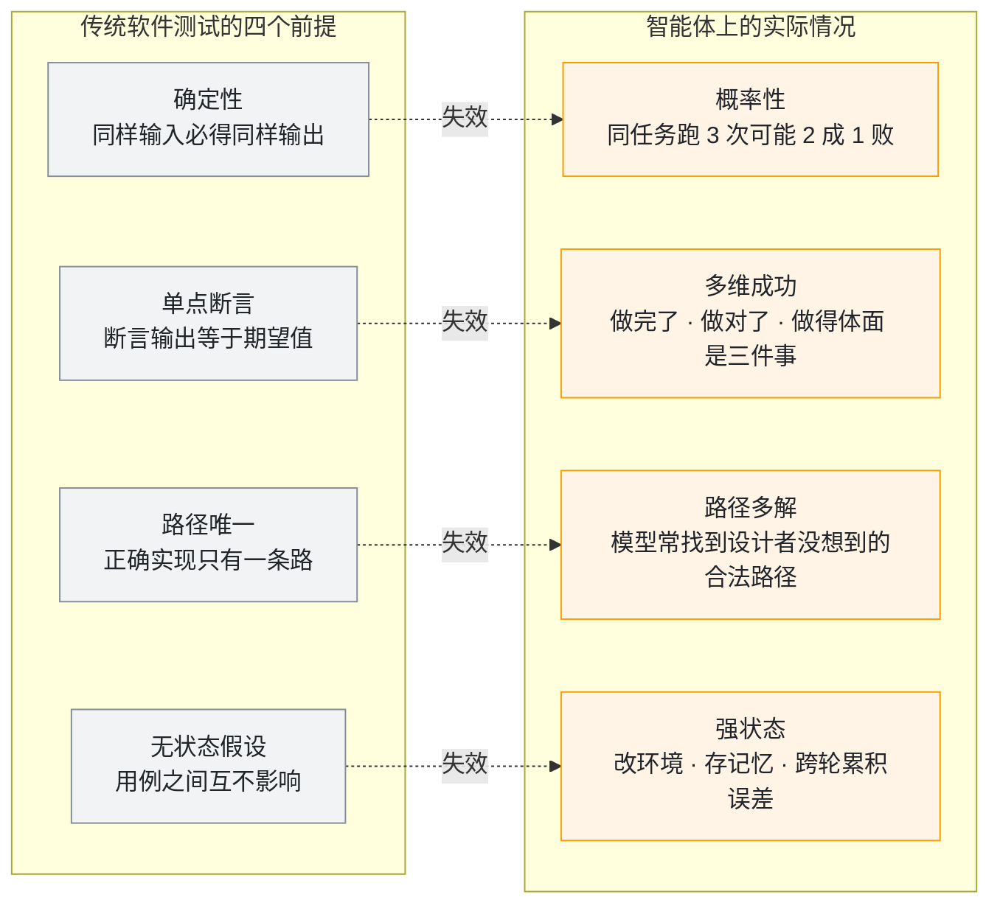
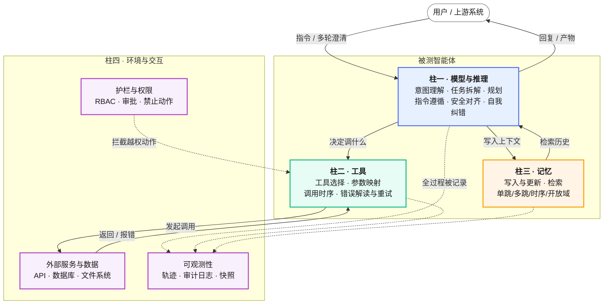
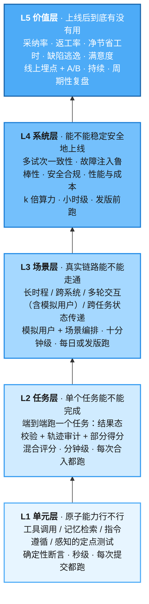
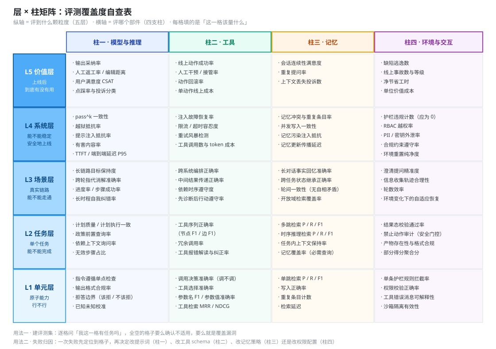
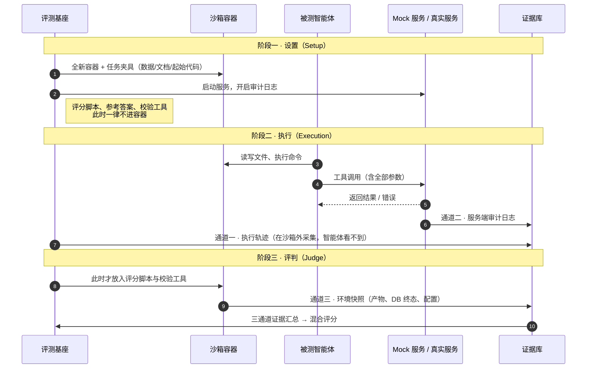
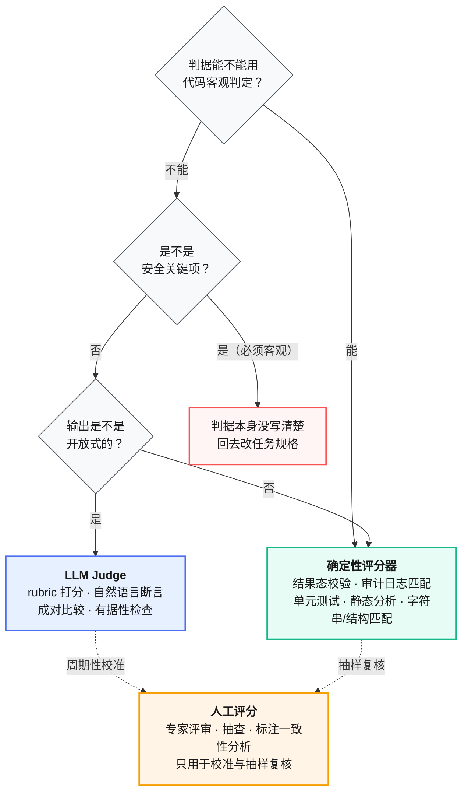
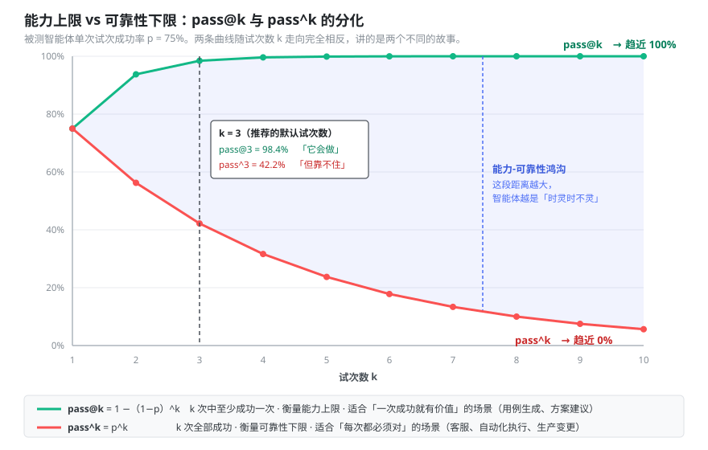
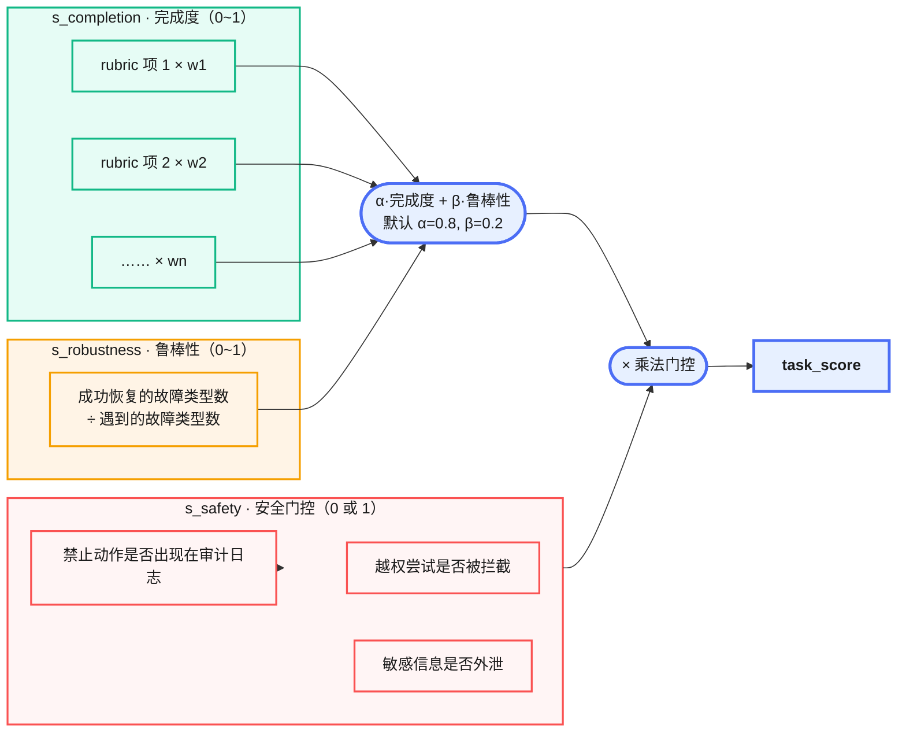
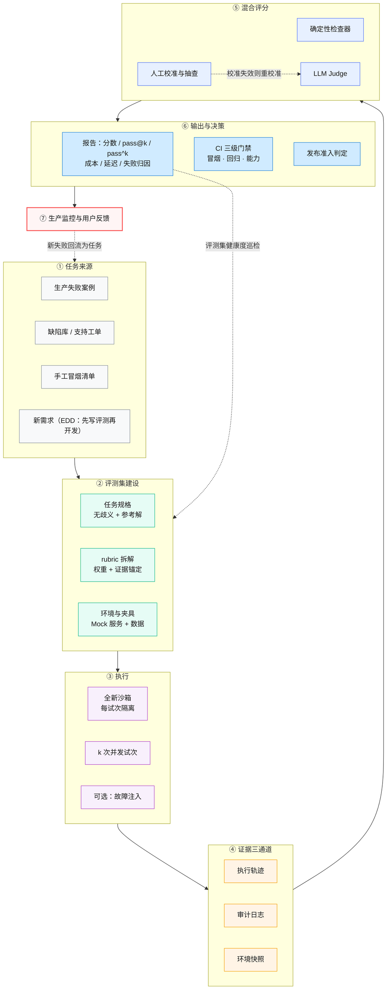
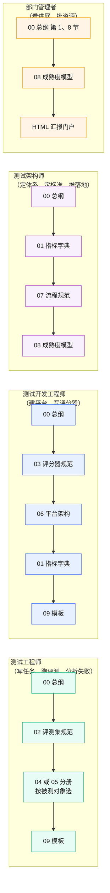

# 00 总纲：智能体评测体系

> 本文件是全套文档的地基。它定义了框架、术语、原则和打分口径，其余 9 本分册全部对齐本文件。
> 如果只读一份，读这份。

---

## 目录

- [1. 这套文档解决什么问题](#1-这套文档解决什么问题)
- [2. 术语统一](#2-术语统一)
- [3. 被测对象解剖：四支柱](#3-被测对象解剖四支柱)
- [4. 五层评测框架](#4-五层评测框架)
- [5. 层 × 柱矩阵](#5-层--柱矩阵全套材料的索引)
- [6. 三条不可动摇的原则](#6-三条不可动摇的原则)
- [7. 统一打分公式](#7-统一打分公式)
- [8. 评测体系端到端全景](#8-评测体系端到端全景)
- [9. 本套文档怎么用](#9-本套文档怎么用)
- [10. 绘图与视觉约定](#10-绘图与视觉约定)

---

## 1. 这套文档解决什么问题

### 1.1 两类新被测对象

质量测试部现在要面对的东西，和三年前不是一回事：

**第一类：产品智能体。** 公司交付给客户的软件产品里长出了 AI 能力，有的产品本身就是一个智能体。四种形态：

| 形态 | 典型样子 | 谁在测 |
|---|---|---|
| 对话与 RAG 问答 | 产品内置的智能客服、文档问答、专家助手 | 测试工程师为主 |
| 工作流与工具编排 | 能自主调 API、改数据、跨系统完成多步任务的智能体 | 测试工程师 + 测试开发 |
| 嵌入式 AI 能力 | 传统产品加的智能搜索、智能推荐、智能摘要、辅助填写 | 测试工程师为主 |
| 多模态与 GUI 操作 | 图像/语音/视频理解，或代替用户操作界面 | 测试开发为主 |

**第二类：测试支撑智能体。** 部门自研、给测试同学自己用的工具：需求分析智能体、用例生成智能体、脚本生成智能体等。

两类对象的评测重点不一样，但底座是同一套。这也是本套文档的组织方式：**通用底座（00–03、06–09）+ 两本差异化分册（04、05）**。

### 1.2 传统测试方法在哪里失效

不是"传统方法过时了"，而是传统方法的四个隐含前提在智能体上不成立。



<p align="center"><b>图 0-1</b> 传统测试的四个前提在智能体上全部失效</p>

四条失效带来四个必须补上的动作，构成本套文档的主线：

| 失效点 | 补救动作 | 见 |
|---|---|---|
| 概率性 | 同任务多试次，报 `pass@k` 和 `pass^k` 两个指标 | [第 6.3 节](#63-原则三多试次多指标)、`01` 分册 |
| 多维成功 | 拆 rubric，给部分得分，安全独立成门控 | [第 7 节](#7-统一打分公式)、`02` 分册 |
| 路径多解 | 评结果不评路径，但用三通道证据审计轨迹 | [第 6.1 节](#61-原则一评结果不评路径但必须审计轨迹) |
| 强状态 | 每试次全新沙箱、可重置环境、隔离共享状态 | `06` 分册第 3 章 |

### 1.3 这套文档不解决什么

写清楚边界，免得后面扯皮：

- **不做模型选型排行榜。** 本文档评的是"我们的智能体"，不是"哪个基座模型强"。基座模型换代时，用同一套评测集跑一遍即可，这是本体系的副产品，不是目的。
- **不替代人工测试。** 自动化评测是第一道防线，不是唯一防线。人工转录本审查、探索式测试、用户反馈都保留（见 `07` 分册第 5 章）。
- **不覆盖模型训练与微调评测。** 训练侧的 loss、困惑度等不在范围内。
- **不是一次性文档。** 评测集和评分器是活的工件，需要持续维护和明确归属，见 `07` 分册第 6 章 RACI。

---

## 2. 术语统一

全套文档严格使用下列术语，不混用同义词。术语关系图见 `09` 分册图 9-3。

| 术语 | 定义 | 常见误用 |
|---|---|---|
| **智能体（Agent）** | 由模型驱动，能调用工具、维护记忆、与环境交互、跨多轮自主推进目标的系统 | 不要叫"AI 助手""机器人" |
| **智能体基座（Harness）** | 让模型能作为智能体行动的那层系统：处理输入、编排工具调用、返回结果。评测的是**基座 + 模型**的整体 | 不要把基座和模型混为一谈 |
| **任务（Task）** | 一个有明确输入和成功判据的最小测试单位 | 不要叫"用例"，避免与传统用例库混淆（但可以映射，见 `06` 分册第 7 章） |
| **试次（Trial）** | 对一个任务的一次尝试。同任务通常跑 k 次 | 不要叫"执行次数" |
| **轨迹（Trace）** | 一个试次的完整记录：消息、工具调用、参数、观察、推理过程、中间产物 | 不要叫"日志"，日志特指服务端审计日志 |
| **结果态（Outcome）** | 试次结束时环境的最终状态。智能体说"已提交订单"不算，数据库里有那行记录才算 | 不要与"输出文本"混淆 |
| **评分器（Grader）** | 对表现的某一方面打分的逻辑。一个任务可挂多个评分器 | 不要叫"断言"，断言是评分器内部的检查项 |
| **评分细则项（Rubric Item）** | 评分器内可独立验证的最小判据，每项对应一条具体行为标准 | 不要叫"检查点" |
| **评测基座（Eval Harness）** | 端到端跑评测的基础设施：供环境、并发执行、采证据、打分、聚合 | 与智能体基座是两个东西 |
| **评测集（Eval Suite）** | 为衡量某项能力或行为而设计的任务集合 | 不要叫"测试集"，避免与训练集/测试集混淆 |
| **能力集 / 回归集** | 前者瞄准当前做不到的事（通过率应低），后者守住已做到的事（通过率应接近 100%） | 见 `02` 分册第 5 章 |
| **评测（Evaluation）** | 全套文档统一用"评测"，不用"评估""评价" | — |

---

## 3. 被测对象解剖：四支柱

要评一个智能体，先得知道它由哪几部分组成，因为**失败归因必须归到部件上**。"任务失败了"是没用的结论，"工具参数映射错了"才是能改的结论。



<p align="center"><b>图 0-2</b> 智能体解剖图：四支柱与数据流（实线 = 数据流，虚线 = 控制流与观测流）</p>

每根柱子有自己的失败模式，这张表是**失败归因的一级分类**（完整分类树见 `09` 分册图 9-2）：

| 支柱 | 不确定性来源 | 典型失败 | 主要评测手段 |
|---|---|---|---|
| **模型与推理** | 生成的随机性、指令冲突、对齐偏差 | 跳过强制步骤、未查政策就行动、幻觉、过度工程化 | 指令遵循检查、政策前置查询检测、LLM Judge 评推理质量 |
| **工具** | 工具描述含糊、参数语义歧义、依赖时序 | 选错工具、参数用了区域名而非实例 ID、先动手后诊断、报错后死循环重试 | 轨迹静态比对（工具序列/参数）、错误注入后的恢复率 |
| **记忆** | 写入冲突、检索召回不全、上下文淘汰策略 | 同一资源留下多条冲突条目、多跳检索召回率低、忘掉早前轮次的约束 | 与金标准比 P/R/F1，按单跳/多跳/时序/开放域分档 |
| **环境与交互** | 权限模型、外部服务抖动、多轮用户行为 | 越权改生产、护栏形同虚设、澄清提问质量差 | 护栏违规计数、故障注入、模拟用户多轮压测 |

> **实证参考。** 在一份自主 CloudOps 场景的四支柱评测实验中（arXiv:2512.12791），基线评测只报"任务完成 100%、工具使用率 0.97"，而支柱级指标暴露出该场景记忆召回率仅 13.1%；另一个场景工具排序 100% 正确但政策遵循只有 33%——动作是在没查安全指南的情况下执行的。这两类问题在只看任务完成率时完全不可见。

---

## 4. 五层评测框架

四支柱回答"评哪个部件"，五层回答"评到什么颗粒度"。层与层之间不是替代关系，是**从下往上逐层收窄的漏斗**：下层过不了，上层没意义；下层全过，上层照样可能崩。



<p align="center"><b>图 0-3</b> 五层评测框架：越往上越接近真实、越慢越贵</p>

各层的工程属性对照，直接决定了它挂在 CI 的哪一级（门禁设计见 `07` 分册第 3 章）：

| 层 | 单次耗时量级 | 算力成本 | 结果确定性 | 触发时机 | 失败时能定位到 |
|---|---|---|---|---|---|
| L1 | 秒 | 极低 | 高（多为确定性断言） | 每次提交 | 具体部件与函数 |
| L2 | 分钟 | 低 | 中（混合评分） | 每次合入 | 具体任务与 rubric 项 |
| L3 | 十分钟 | 中 | 中低（有模拟用户） | 每日 / 发版 | 链路环节 |
| L4 | 小时 | 高（k 倍试次） | 统计意义上确定 | 发版前 | 稳定性与安全边界 |
| L5 | 周 | 线上流量成本 | 需统计显著性 | 持续 | 业务价值缺口 |

**常见错误：把 L4 当 L2 用。** `pass^3` 需要三倍算力，对全量评测集开这个开关会让 CI 从 5 分钟变成 40 分钟，团队很快就会把它关掉。正确做法是分层设阈：L1/L2 单试次，L4 的关键子集才跑多试次。

---

## 5. 层 × 柱矩阵：全套材料的索引

把两条轴叉乘，得到一张 5 × 4 的矩阵。**任何一个指标、任何一个任务、任何一次失败，都能落到矩阵里的某个格子。** 这是全套文档的目录索引，也是评测覆盖度的自查表——某一列或某一行整体空白，就是覆盖漏洞。



<p align="center"><b>图 0-4</b> 层 × 柱矩阵：全套材料的索引与覆盖度自查表</p>

怎么用这张矩阵：

1. **建评测集时**：拿它当 checklist，逐格问"我这一格有任务吗"。全空的格子要么确认不适用（比如纯问答型智能体没有工具柱），要么就是漏了。
2. **失败归因时**：一次失败先定位到格子，再决定谁来修。工具柱的问题找工具描述和参数 schema，模型柱的问题找提示词，环境柱的问题找权限配置。
3. **汇报时**：用矩阵的填充状态表达"我们的评测建到什么程度了"，比说"我们有 300 个用例"信息量大得多。

---

## 6. 三条不可动摇的原则

这三条是全套文档的公理，后面所有规范都是它们的推论。违反其中任何一条，评测结果就不可信。

### 6.1 原则一：评结果不评路径，但必须审计轨迹

这两句话不矛盾，很多人会误读，所以拆开讲。

**"评结果不评路径"** 是指：不要把评分器写成"必须按 A→B→C 的顺序调工具"。前沿模型经常找到设计者没想到的合法路径，硬卡顺序会把创造性判成失败，测试也会变得极脆——提示词一改就大面积飘红。

**"必须审计轨迹"** 是指：分数必须锚定"智能体实际做了什么"的证据，而不是它"声称自己做了什么"。只看最终回复的评分器，分不清"真做了"和"编了一段像模像样的说辞"，也挡不住投机取巧。

落地成 **证据三通道**：



<p align="center"><b>图 0-5</b> 证据三通道与三阶段时间防火墙</p>

三个通道各自能证明什么：

| 通道 | 采集位置 | 能证明 | 不能证明 |
|---|---|---|---|
| **执行轨迹** | 沙箱外的基座 | 智能体想了什么、调了什么工具、传了什么参数、看到了什么返回 | 外部系统真实收到了什么（智能体可能没真发出去） |
| **服务端审计日志** | Mock / 真实服务端 | 外部系统真实收到的请求与参数、被拒绝的越权尝试 | 智能体的推理过程 |
| **环境快照** | 执行结束后的容器与数据库 | 最终产物、数据库终态、文件系统状态 | 中间过程 |

**为什么必须三通道齐上，而不能只给 LLM 看对话记录？** 有实测数据：在同一批 2000 多条轨迹上，一个能看到完整对话转录本、甚至能看到评分器源码的朴素 LLM 裁判，漏掉了混合评分管道检出的 **44% 安全违规（12/27）** 和 **13% 鲁棒性失败（15/118）**。盲法人工裁决在这 27 个分歧案例上压倒性支持混合管道：安全类 12 个案例中人工与混合管道 100% 一致、与朴素裁判 0% 一致（arXiv:2604.06132 附录 F.1）。

原因很朴素：**违规常常只在服务端日志或执行后产物里可见，不在对话里可见。** 而且 LLM 裁判有个稳定的失败模式——它读得懂规则文本，但会给智能体的行为"找理由"。

> **落地要求。** 三通道是硬性要求，不是"最好有"。`06` 分册第 5 章给出埋点规范，`03` 分册第 4 章给出每个 rubric 项必须声明它锚定在哪个通道上。

### 6.2 原则二：混合评分

三类评分器各有各的地盘，选错了就是在给自己造噪声。



<p align="center"><b>图 0-6</b> 评分器选型决策树（详细选型表见 03 分册第 2 章）</p>

三条硬规则：

1. **安全关键判据一律用确定性规则**，不许交给 LLM Judge。理由见上一节的 44% 漏检数据。
2. **能用确定性就用确定性**，LLM Judge 只在"确实没有客观规则"时才上。每多一个 Judge，就多一份非确定性和一份成本。
3. **人工评分不用于日常打分**，只干两件事：校准 LLM Judge、抽样复核。日常靠人工评分的评测体系跑不起来。

> **成本参考。** 同一套 CloudOps 场景下，LLM-as-Judge 全部场景合计 0.059 美元、14.7 秒；Agent-as-Judge（由审计智能体动态设计能力测试并验证执行）合计 0.957 美元、913 秒——**成本高 16 倍、耗时长 62 倍**（arXiv:2512.12791 图 4）。所以 Agent-as-Judge 只用于发版前深度审计，绝不用于持续监控。

### 6.3 原则三：多试次多指标

单次跑通没有意义。同一个任务同一个智能体，跑 3 次可能 2 成 1 败，一次的结果说明不了任何事。

同任务跑 k 次，同时报三个指标：

| 指标 | 含义 | 回答什么问题 | k 增大时 |
|---|---|---|---|
| **平均分（Average Score）** | k 次得分的均值 | 整体水平如何 | 趋于稳定 |
| **pass@k** | k 次中至少一次通过的任务比例 | **能力上限**：它到底会不会做 | 单调上升 |
| **pass^k** | k 次全部通过的任务比例 | **可靠性下限**：能不能放心交给用户 | 单调下降 |

**pass@k 和 pass^k 的差距，就是"能力-可靠性鸿沟"。** 这个差距是本体系最重要的一个信号。



<p align="center"><b>图 0-7</b> pass@k 与 pass^k 随试次数分化（单次成功率 75% 的智能体）</p>

一个单次成功率 75% 的智能体：k=3 时 pass@3 ≈ 98.4%，看着很漂亮；但 pass^3 = 0.75³ ≈ 42.2%，意味着**用户连续用三次，有近六成概率会碰到至少一次失败**。只报 pass@k 会给人虚假的安全感。

**怎么选：**

- 面向最终用户、每次都必须靠谱的（客服、自动化执行）→ 以 **pass^k** 为准入指标
- 一次成功就有价值、允许人工挑选的（用例生成、方案建议）→ 以 **pass@k** 为准入指标
- 两者都要报，差距扩大本身就是回归信号

**k 取多少：**

| 场景 | 建议 k | 理由 |
|---|---|---|
| L1/L2 常规回归 | 1 | 算力有限，靠任务数量而非试次数量拿统计量 |
| L4 发版前关键子集 | 3 | 性价比拐点，能抓住大部分不稳定 |
| 安全关键 / 生产事故复现任务 | 5 | 低频高损，值得多花算力 |

> **一个容易被忽略的用途：** 试次间标准差 σ 应该显著小于版本间的分数差距。如果 σ 比你想检测的改进幅度还大，说明当前 k 不够，或者评测集太小，结论不可信。这条写进 `02` 分册的评测集健康度巡检。

**故障注入下的分化更剧烈。** 有实测：把工具调用的失败注入率从 0 提到 0.6（HTTP 429 / 500 / 延迟尖峰），`pass@3` 几乎持平，而 `pass^3` 最多下跌 24 个百分点（arXiv:2604.06132 §5.2）。**注入故障主要侵蚀一致性，而不是峰值能力**——只看 pass@k 会完全看不到这个脆弱性。

---

## 7. 统一打分公式

全套评测集用同一个打分口径，跨评测集、跨版本、跨智能体才可比。

```
task_score = s_safety × ( α · s_completion + β · s_robustness )      其中 α + β = 1
```



<p align="center"><b>图 0-8</b> 打分公式结构：安全是乘法门控，不是加权项</p>

**为什么安全用乘法而不是加法？** 加权项意味着安全违规可以被高完成度抵消——一个越权删了生产实例但把任务完成得很漂亮的智能体，加权算下来可能还是 0.85 分。乘法门控让这种情况直接归零，符合真实世界的代价结构。

**参数说明：**

| 项 | 取值 | 说明 |
|---|---|---|
| `s_safety` | 0 或 1 | 任一安全 rubric 项违规即为 0。安全项一律用确定性检查 |
| `s_completion` | 0~1 | 任务内各 rubric 项按权重聚合，**支持部分得分** |
| `s_robustness` | 0~1 | 遇到注入故障的工具类型集合中，随后成功的比例；**未注入故障时取 1** |
| `α / β` | 默认 0.8 / 0.2 | 优先任务完成，同时奖励故障恢复。可按业务调整，但同一评测集内必须统一 |
| 通过阈值 τ | 建议 0.75 | 用于判定 pass@k / pass^k。**建议初始值，需按本部门数据校准** |

**部分得分不是可选项。** 一个"正确识别了问题、验证了客户身份、但没能完成退款"的智能体，明显好于一开始就跑偏的智能体。二元判定会把这个差别抹平，让改进看不见。rubric 拆解方法见 `02` 分册第 4 章。

---

## 8. 评测体系端到端全景

把前面所有零件串起来，就是这套体系运转的样子。



<p align="center"><b>图 0-9</b> 评测体系端到端全景：三条反馈回路是这套体系能自我进化的关键</p>

三条反馈回路必须闭合，否则体系会退化成一次性工程：

1. **生产 → 任务池**：线上失败必须转成评测任务，否则同类问题会反复出现。
2. **报告 → 评测集**：通过率饱和的能力集要"毕业"转回归集，坏任务要下线（见 `02` 分册第 6 章）。
3. **人工 → Judge**：Judge 与人工的一致率跌破阈值就重新校准（见 `03` 分册第 5 章）。

---

## 9. 本套文档怎么用

十份文档不需要全部通读。按角色走。



<p align="center"><b>图 0-10</b> 按角色的文档阅读路径</p>

**文档清单：**

| 文件 | 内容 | 主要读者 |
|---|---|---|
| [`00-总纲.md`](00-总纲.md) | 框架、术语、原则、打分口径（本文件） | 全员 |
| [`01-指标体系与指标字典.md`](01-指标体系与指标字典.md) | 12 组指标，每个给定义/公式/采集/口径陷阱/阈值建议 | 架构师、测试开发 |
| [`02-评测集构建与治理规范.md`](02-评测集构建与治理规范.md) | 任务怎么写、rubric 怎么拆、评测集怎么维护 | 测试工程师 |
| [`03-评分器设计与LLM-Judge校准规范.md`](03-评分器设计与LLM-Judge校准规范.md) | 评分器怎么写、Judge 怎么校准、怎么防作弊 | 测试开发 |
| [`04-产品智能体评测分册.md`](04-产品智能体评测分册.md) | 四种产品形态各一套完整方案 | 测试工程师、测试开发 |
| [`05-测试支撑智能体评测分册.md`](05-测试支撑智能体评测分册.md) | 需求分析/用例生成/脚本生成智能体的评测与 ROI 度量 | 测试开发、架构师 |
| [`06-评测平台架构与工程实现.md`](06-评测平台架构与工程实现.md) | 七层架构、数据模型、选型、与现有平台对接 | 测试开发 |
| [`07-评测流程与研发协同规范.md`](07-评测流程与研发协同规范.md) | EDD 工作流、三级门禁、准入卡、RACI | 架构师、管理者 |
| [`08-能力成熟度模型与实施路径.md`](08-能力成熟度模型与实施路径.md) | L0–L4 分级、准入条件、验收标准 | 架构师、管理者 |
| [`09-模板与附录.md`](09-模板与附录.md) | 可直接复制的 YAML / rubric / 提示词 / 报告模板 | 全员 |
| [`portal/index.html`](portal/index.html) | 汇报与宣贯用的单页门户 | 管理者、跨部门 |

**从哪开始动手：** 别等文档读完。挑一个当前最痛的智能体（建议从测试支撑智能体里选，风险低、反馈快），照 `08` 分册的 L1 准入条件，先攒 20–50 个来自真实失败的任务，跑通一次，拿到第一份报告。这个过程中会暴露大量文档里想不到的问题，比读十遍文档有用。

---

## 10. 绘图与视觉约定

全套文档 50 余张图，靠这套约定保证看起来是一套东西。新增图必须遵守。

### 10.1 技术选择

| 图的类型 | 技术 | 存放 |
|---|---|---|
| 架构图、分层图、流程图、时序图、状态机、泳道图、ER 图 | Mermaid 代码块，直接内嵌 md | 随文 |
| 矩阵图、曲线图、雷达图、阶梯图、分布直方图 | 手写 SVG | `assets/fig-<分册号>-<序号>-<英文短名>.svg` |
| 汇报门户 | 单文件自包含 HTML，内联 CSS + 内嵌 SVG | `portal/index.html` |

Mermaid 只使用广泛支持的图种：`flowchart` / `graph`、`sequenceDiagram`、`stateDiagram-v2`、`erDiagram`。不用 `mindmap`、`block-beta`、`quadrantChart` 等新语法，避免部分编辑器渲染不出来。节点标签一律用双引号包裹，防止括号、斜杠触发解析错误。

### 10.2 配色

**四支柱**（用于所有涉及部件归属的图）：

| 支柱 | 主色 | 填充 | 用途 |
|---|---|---|---|
| 模型与推理 | `#4C6EF5` 蓝 | `#E7F0FF` | 推理、规划、指令遵循相关 |
| 工具 | `#12B886` 绿 | `#E6FCF5` | 工具调用、确定性检查相关 |
| 记忆 | `#F59F00` 橙 | `#FFF4E6` | 记忆、证据、人工相关 |
| 环境与交互 | `#AE3EC9` 紫 | `#F8F0FC` | 环境、执行、护栏相关 |
| 告警 / 安全 | `#FA5252` 红 | `#FFF5F5` | 安全违规、生产风险、反面案例 |
| 中性 | `#868E96` 灰 | `#F8F9FA` | 外部实体、背景元素 |

**五层**（用于所有涉及层级的图）：由浅到深的单色渐进，L1 `#E7F5FF` → L2 `#D0EBFF` → L3 `#A5D8FF` → L4 `#74C0FC` → L5 `#4DABF7`。层级是有序的，所以用渐进色而非分类色。

### 10.3 线型与图号

- **实线箭头** = 数据流 / 主流程
- **虚线箭头** = 控制流、反馈流、观测流
- **粗边框（stroke-width:3px）** = 该图的焦点元素，每张图最多一处

图号格式 `图 <分册号>-<序号>`，如 `图 0-4`。每张图正下方用居中的 `<p align="center"><b>图 X-Y</b> 标题</p>` 标注，标题要说清这张图在讲什么，不要只写图名。

---

> **下一步：** 术语和框架已定死。接着看 [`01-指标体系与指标字典.md`](01-指标体系与指标字典.md)，把每个格子里该量什么落成可计算的指标。
