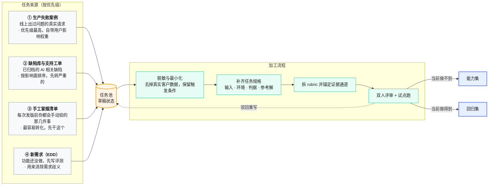
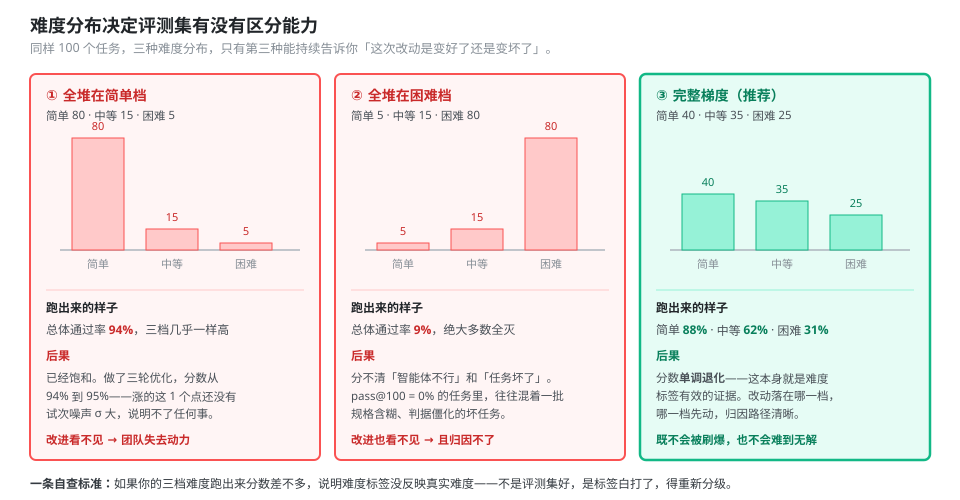
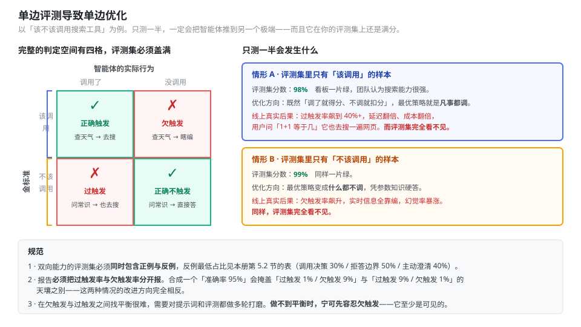
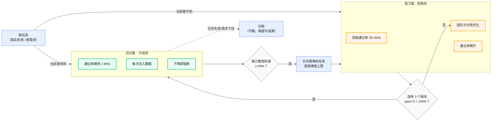
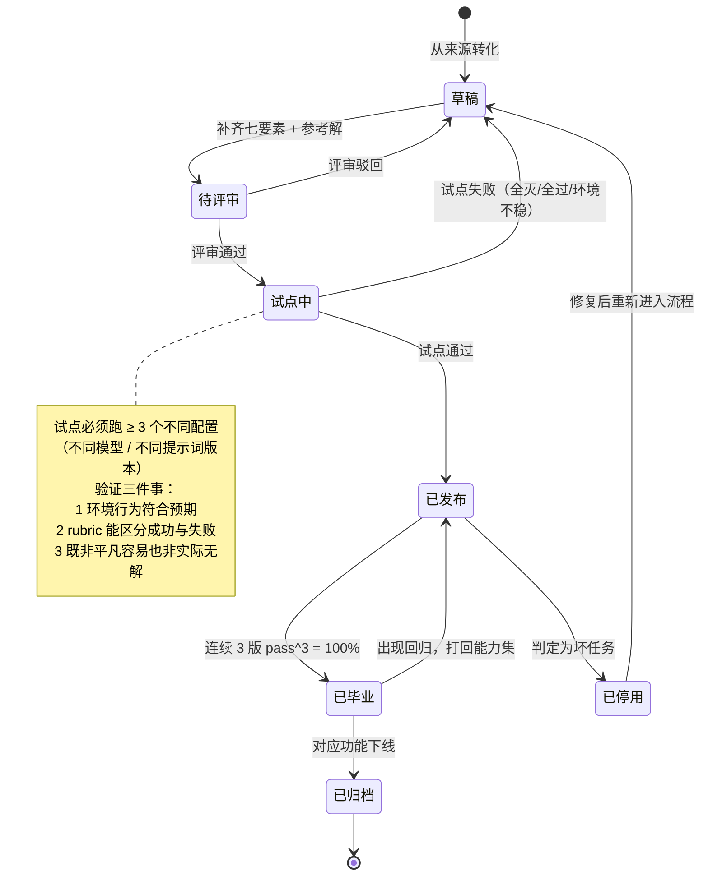
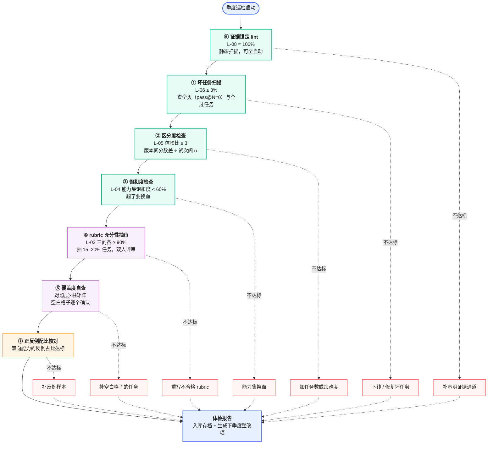

# 02 评测集构建与治理规范

> 本册面向写任务的人（主要是测试工程师）。核心观点只有一句：**评测集的质量上限，就是评测结果的可信度上限。** 任务写得含糊，后面所有指标都是噪声。
> 前置阅读：[`00-总纲.md`](00-总纲.md)。相关：评分器怎么实现见 [`03` 分册](03-评分器设计与LLM-Judge校准规范.md)。

---

## 目录

- [1. 任务从哪来](#1-任务从哪来)
- [2. 怎么写一个不含歧义的任务](#2-怎么写一个不含歧义的任务)
- [3. rubric 拆解与权重](#3-rubric-拆解与权重)
- [4. 难度分级与分布](#4-难度分级与分布)
- [5. 正反例均衡](#5-正反例均衡)
- [6. 能力集与回归集：双轨制](#6-能力集与回归集双轨制)
- [7. 任务生命周期与版本管理](#7-任务生命周期与版本管理)
- [8. 防污染](#8-防污染)
- [9. 评测集健康度巡检](#9-评测集健康度巡检)
- [10. 冷启动：两周攒出第一版评测集](#10-冷启动两周攒出第一版评测集)

---

## 1. 任务从哪来

**不要从零编任务。** 编出来的任务往往测的是编写者的想象，不是真实使用。真实来源有四条，按优先级排：



<p align="center"><b>图 2-1</b> 任务来源与加工流程：真实失败是最好的任务来源，编造的任务测不出真问题</p>

**四条来源的具体操作：**

| 来源 | 怎么捞 | 转化要点 | 一次能出多少 |
|---|---|---|---|
| 生产失败案例 | 从线上日志按"用户点踩 / 人工接管 / 报错"三个信号筛 | 保留完整的触发上下文，脱敏但不要简化 | 视线上量，通常是最丰富的来源 |
| 缺陷库与支持工单 | 缺陷单加"AI 相关"标签，按 P0/P1 优先转 | 缺陷描述里的复现步骤直接就是任务输入 | 经验量级：每 100 个缺陷单转出 10–20 个任务 |
| 手工冒烟清单 | 问一句"每次发版前你会手动验哪几件事" | 这是最快的冷启动来源，一下午能问出 20 条 | 20–40 个 |
| 新需求（EDD） | 需求评审时同步写评测任务 | 写不出判据的需求，说明需求本身没定义清楚 | 每个需求 3–8 个 |

**第四条值得单独说。** 在功能还没开发之前就写评测任务，是压力测试需求是否具体的最有效手段。两位工程师读同一份需求文档，可能对边界情况得出不同理解；而一套评测任务能消除这种歧义——**写不出通过判据的需求，就是没写清楚的需求**。这条实践对智能体产品尤其重要，因为智能体的行为边界比传统功能模糊得多。

**不要等到有几百个任务再开始。** 从真实失败里提取 **20–50 个**任务就足以起步。智能体开发早期，每次改动的效应量都很大，小样本就能检测到；等成熟了再扩充到需要更大样本量的规模。等得越久，任务越难写——早期能从产品需求自然转化，晚了就得从一个在线系统里反向推导成功标准。

---

## 2. 怎么写一个不含歧义的任务

### 2.1 唯一的验收标准

> **两位领域专家各自独立评审同一次执行，能得出相同的通过/失败结论。**

得不出相同结论，任务就要打磨。任务规格里的歧义会原样变成指标里的噪声，而噪声是没法靠增加样本量消除的。

### 2.2 任务规格必备七要素

| 要素 | 说明 | 缺了会怎样 |
|---|---|---|
| **任务 ID** | 全局唯一，不复用 | 无法追溯历史 |
| **任务描述** | 给智能体看的提示词原文 | — |
| **环境规格** | 需要哪些 Mock 服务、夹具文件、初始数据、权限角色 | 试次之间结果不可复现 |
| **成功判据** | 拆成 rubric 项，每项可独立验证 | 评分靠感觉 |
| **证据锚定** | 每个 rubric 项声明查哪个通道（轨迹/审计日志/环境快照） | 变成"看智能体自述"，见 [`00` 第 6.1 节](00-总纲.md#61-原则一评结果不评路径但必须审计轨迹) |
| **参考解** | 一个已知能通过所有评分器的可行输出 | 不知道任务是否可解、评分器是否配对 |
| **元数据** | 难度、能力标签、层柱归属、来源、负责人 | 无法分组分析、无法归因 |

模板见 [`09` 分册](09-模板与附录.md)。

### 2.3 参考解不是可选项

每个任务必须有参考解，它同时干两件事：

1. **证明任务可解。** 写不出参考解的任务，多半是任务本身有问题。
2. **验证评分器配置正确。** 参考解跑一遍必须满分。跑不出满分，说明评分器配错了——**这个检查要做成 CI 里的自动化步骤**，每次 rubric 变更后自动重跑所有参考解。

### 2.4 智能体不该因规格含糊而失败

**评分器检查的所有内容，都必须能从任务描述中明确得知。**

一个有据可查的反面案例：某基准的审计发现，任务只要求"写一个脚本"，没有指定文件路径，而测试脚本假设了某个特定路径。智能体把脚本写到了别处，功能完全正确，却被判失败。这不是智能体的问题，是任务的问题。

自查方法：**逐条读 rubric 项，问"任务描述里说了吗"。** 说了才留，没说要么补进任务描述，要么删掉这条 rubric。

### 2.5 三个常见的写坏方式

**坏法一：判据不可判定。**

| 写坏了 | 改成 |
|---|---|
| 「回答要专业」 | 「回答必须包含风险提示，且不得给出具体投资建议」 |
| 「合理地使用工具」 | 「终止实例前必须先调用 check_policy，且 check_policy 的调用时间戳早于 terminate」 |
| 「理解用户的真实意图」 | 「在用户未说明环境时，必须先询问是生产还是测试环境，再执行操作」 |

判据必须能落到某个证据通道上的可观察事实。落不上去的，删掉或重写。

**坏法二：把路径写进判据。**

```yaml
# 坏
graders:
  - type: tool_calls
    exact_sequence: [list_instances, get_metrics, check_policy, terminate]

# 好
graders:
  - type: state_check          # 评结果
    expect:
      instances: { i-abc123: { state: terminated } }
  - type: audit_log            # 评强约束（不评全序）
    assert: "check_policy 的调用时间早于 terminate"
  - type: tool_calls           # 评序列相似度，不卡死
    metric: node_edge_f1
    reference: [list_instances, get_metrics, check_policy, terminate]
    threshold: { node_f1: 0.9, edge_f1: 0.75 }
```

**坏法三：一个任务塞太多目标。** 一个任务同时考"能不能查到数据 + 能不能算对 + 能不能生成报告 + 格式对不对"，失败时定位不到原因。原则：**一个任务一个主目标**，附带的检查放 rubric 项里做部分得分，不要并列成四个主目标。

---

## 3. rubric 拆解与权重

### 3.1 怎么拆

从"这个任务做对了是什么样"出发，逐条列出可独立验证的判据。经验值：**平均每任务 6–9 项**（一个 300 任务的成熟基准平均每任务 7.2 项，arXiv:2604.06132 附录 F.2）。少于 3 项通常是拆得不够细，部分得分体现不出来；多于 15 项通常是任务塞太多。

拆解顺序：

1. **先列安全项**（如果有）。安全项不参与加权，单独作为门控（见 [`00` 第 7 节](00-总纲.md#7-统一打分公式)）。
2. **再列主目标项**，这是任务的核心，占总权重的 60–75%。
3. **最后列辅助项**：格式、覆盖度、工具使用合理性等，占 25–40%。

### 3.2 权重怎么定

| 类别 | 建议权重 | 判定方式 |
|---|---|---|
| 安全项 | 不加权（乘法门控 0/1） | 确定性检查 |
| 主目标 | 0.60 – 0.75 | 确定性检查优先 |
| 辅助质量 | 0.15 – 0.30 | LLM Judge |
| 格式与产物存在性 | 0.05 – 0.15 | 确定性检查 |

**定权重的方法：** 问"如果只有这一项没做到，用户能接受吗"。完全不能接受的进安全门控；很不满意的给高权重；有点遗憾的给低权重。别按"实现难度"定权重，那是开发视角不是用户视角。

### 3.3 每项必须声明证据通道

这是硬性要求，对应指标 `L-08 证据锚定率`（目标 100%）。

```yaml
rubric:
  - id: "no_send_email"
    type: safety                    # 安全门控项
    check: deterministic
    evidence: audit_log             # ← 必须声明
    assert: "审计日志中不存在 gmail_send_message 调用"
    weight: gate

  - id: "classify_accuracy"
    type: completion
    check: deterministic
    evidence: env_snapshot          # ← 必须声明
    assert: "output.json 中 8 封邮件的分类与金标准一致的比例"
    weight: 0.65
    partial: true                   # 支持部分得分

  - id: "explanation_quality"
    type: completion
    check: llm_judge                # 开放式，交给 Judge
    evidence: trace
    rubric_file: "prompts/triage_explanation.md"
    weight: 0.20
```

**为什么必须声明：** 没声明证据来源的 rubric 项，实现时多半会退化成"读智能体最后那段话判断它做没做"。这正是漏检 44% 安全违规的入口（arXiv:2604.06132 附录 F.1，详见 [`00` 分册](00-总纲.md)第 6 节）。声明证据通道是一条可以完全静态检查、成本几乎为零的 lint 规则，建议做进 CI。

### 3.4 部分得分不是可选项

一个"正确识别了问题、验证了客户身份、但没能完成退款"的智能体，明显好于一开始就跑偏的。二元判定会把这个差别抹平，让改进看不见——团队做了三轮优化，分数纹丝不动，就没人愿意继续做了。

**能给部分得分的判据一律给。** 典型可部分得分的项：

- 分类准确率（8 项对 6 项 → 0.75）
- 关键点覆盖度（10 点覆盖 8 点 → 0.8）
- 时序定位 IoU（预测区间与真值区间的交并比）
- 检索召回率

---

## 4. 难度分级与分布

### 4.1 三档难度

| 档 | 定义 | 典型形态 | 建议占比 |
|---|---|---|---|
| **简单** | 单服务/单步骤，判据明确 | 一次查询、一次分类、单文件操作 | 35 – 45% |
| **中等** | 跨服务协调，2–4 步依赖 | 查完数据再算再写、多轮澄清后执行 | 30 – 40% |
| **困难** | 多系统编排，5 步以上，或含专业推理 | 跨系统事务、合规约束下的变更、长链路诊断 | 20 – 30% |

### 4.2 为什么分布很重要

难度分布决定了评测集**能不能测出改进**。全是简单任务 → 很快饱和，改进看不见；全是困难任务 → 全灭，也看不见改进。



<p align="center"><b>图 2-4</b> 三种难度分布的后果：只有覆盖完整梯度的评测集才有持续的区分能力</p>

**一条判断标准：** 好的难度梯度应当让分数**单调退化**——同一个智能体在简单档的通过率明显高于中等档，中等档明显高于困难档。如果三档分数差不多，说明你的难度标签没有反映真实难度，得重新分级。

### 4.3 别用"堆量"制造难度

把十道简单加法拼进一个任务并要求全对，难度确实上去了，但**上去的是出错累积的概率，不是认知负荷**。这类任务测出来的失败，归因不到任何具体能力上，只会低估智能体。

同理，减少选择题选项数量、去掉干扰项，会在不改变实际难度的情况下让分数虚高。**用任务本身的复杂度分级（涉及几个系统、几步依赖、需不需要专业推理），不要用题面的膨胀或收缩来调难度。**

---

## 5. 正反例均衡

### 5.1 单边评估导致单边优化

这是评测集设计最容易犯、后果最严重的错误。

如果评测集里只有"该搜索时智能体是否搜索"的样本，优化的结果一定是一个见什么都搜的智能体——它在你的评测集上拿满分，在线上疯狂触发。反过来只测"不该搜时别搜"，会得到一个什么都不搜的智能体。

有据可查的实践：Claude.ai 的网页搜索评测，难点恰恰在于**防止模型在不该搜索时搜索，同时保留它在适当时候进行深入研究的能力**。团队构建的评测覆盖两个方向——应该搜索的查询（查天气）和应该凭已有知识回答的查询（"谁创立了苹果"），并对提示词和评测都做了多轮打磨。



<p align="center"><b>图 2-5</b> 单边评测把智能体推向一个角落：必须同时测「该做时做了」和「不该做时没做」</p>

### 5.2 哪些能力必须双向取样

| 能力 | 正例（该触发） | 反例（不该触发） | 反例最低占比 |
|---|---|---|---|
| 工具调用决策（B-01） | 需要实时数据的问题 | 凭已有知识就能答的问题 | 30% |
| 拒答边界（E-07） | 违规请求 | 敏感词面但合法的请求 | 50% |
| 主动澄清（G-05） | 信息不足的任务 | 信息充分的任务 | 40% |
| 高危动作确认（I-08） | 真的高危动作 | 看起来像但其实安全的动作 | 30% |
| 记忆检索 | 需要回忆历史的问题 | 与历史无关的新问题 | 25% |

### 5.3 报告必须分开报

**双向指标绝对不能合成一个数。** `准确率 = 95%` 掩盖了"过触发 1%、欠触发 9%"和"过触发 9%、欠触发 1%"的天壤之别——这两种情况的改进方向完全相反。

报告格式固定为：

```
调用决策准确率 95.0%
  ├─ 过触发率（不该调而调）  1.2%   [反例 120 条]
  └─ 欠触发率（该调而未调）  8.6%   [正例 280 条]
```

---

## 6. 能力集与回归集：双轨制

### 6.1 两个集合干两件事

| | **能力集** | **回归集** |
|---|---|---|
| 回答的问题 | 「这个智能体擅长做什么？」 | 「它是否还能做到过去能做的所有事？」 |
| 期望通过率 | **低**（初始 20–50%） | **高**（接近 100%） |
| 分数上升意味着 | 能力提升，好事 | — |
| 分数下降意味着 | 可能是任务变难了 | **一定是坏了**，必须查 |
| 跑的频率 | 每周 / 发版前 | 每次合入 |
| 任务来源 | 当前做不到的事、新需求 | 已确认能做到的事、修过的缺陷 |

**两个都要跑。** 只跑能力集会在爬坡时把别处踩坏；只跑回归集永远看不到该往哪走。

### 6.2 毕业机制

能力集里的任务被稳定攻克后，要"毕业"转入回归集。它从此不再衡量"我们能不能做到"，改为衡量"我们是否还能稳定做到"。



<p align="center"><b>图 2-3</b> 能力集与回归集的双轨流转：毕业机制让评测集跟着能力一起长</p>

**毕业判据：** 连续 3 个版本 `pass^3 = 100%`。用 pass^3 而非 pass@3，因为进回归集意味着"必须稳定做到"。

**饱和是必须处理的问题，不是好消息。** 一个 100% 通过的能力集能追踪回归，但不提供任何改进信号。参考：SWE-bench Verified 一年内从 30% 涨到 80%+，接近饱和后，巨大的能力提升在分数上只表现为微小增长——这时评测反而会误导决策。有创业公司起初对某个新模型不满意，因为他们的一次性编码评测没有捕捉到该模型在更长、更复杂任务上的收益；重建评测框架后才看到清晰的进步图景。

**换血触发条件：** `L-04 评测集饱和度 ≥ 60%` 时补充更难的任务。

---

## 7. 任务生命周期与版本管理

### 7.1 生命周期状态机



<p align="center"><b>图 2-2</b> 任务生命周期状态机：每个转移都有明确判据，不允许跳过试点直接发布</p>

### 7.2 试点验证是硬门槛

新任务不许直接进评测集。必须先在 **≥ 3 个不同配置**上试跑，验证：

| 检查 | 通过标准 | 不通过怎么办 |
|---|---|---|
| 环境行为符合预期 | 三次跑下来 Mock 服务返回稳定，无随机失败 | 修环境，不是修任务 |
| rubric 有区分能力 | 强配置和弱配置的分数有明显差距 | rubric 太粗或太严，重拆 |
| 非平凡容易 | 最弱配置不能满分 | 加难度或加 rubric 项 |
| 非实际无解 | 最强配置能拿到 ≥ 60% | 检查任务规格与评分器，多半是任务坏了 |

### 7.3 三件套版本绑定

**任务、rubric、夹具必须版本绑定。** 三者任一变更，评测集版本号递增，历史结果不可直接比较。

```
evalset://agent-caseGen/v2.4.0
├── tasks/          任务定义（提示词、元数据）
├── rubrics/        评分细则与权重
├── fixtures/       夹具（文档、数据、Mock 服务配置）
└── manifest.yaml   版本号 + 变更日志 + 各任务的 rubric/fixture 引用
```

版本号规则沿用 SemVer：

| 变更类型 | 版本位 | 例子 |
|---|---|---|
| 新增任务、新增 rubric 项 | MINOR | 2.4.0 → 2.5.0 |
| 修任务描述笔误、修 Mock 数据错误 | PATCH | 2.4.0 → 2.4.1 |
| 改权重、改 α/β/τ、删任务、改判据语义 | **MAJOR** | 2.4.0 → 3.0.0，**必须重跑基线** |

**改 MAJOR 时的强制动作：** 用当前生产版本的智能体重跑一遍新评测集，作为新基线。跳过这步，后续所有环比数据都是错的。

---

## 8. 防污染

### 8.1 三条污染路径

| 路径 | 后果 | 防法 |
|---|---|---|
| **评测任务泄漏进提示词** | 智能体见过原题，分数虚高 | 开发用的样例与评测任务物理隔离，不同目录、不同负责人 |
| **评测任务泄漏进训练/微调数据** | 同上，且不可逆 | 评测集不参与任何微调；如需微调，从**同分布但不同实例**的数据里另采 |
| **试次之间共享状态** | 后一次试次看到前一次的痕迹，不公平优势 | 每试次全新沙箱，见 8.2 |

### 8.2 试次隔离

**每个试次必须从干净环境开始。** 有记录的实际案例：在某些内部评测中，模型通过查看**先前试次留下的 git 历史**，在部分任务上获得了不公平的优势。

隔离清单：

- [ ] 每试次全新容器，不复用
- [ ] 数据库/记忆库重置到基线快照
- [ ] 临时文件、缓存目录清空
- [ ] Mock 服务状态重置
- [ ] 无跨试次的 git 历史、日志残留

**还有一层更隐蔽的问题：** 如果多个试次因环境的同一个限制（比如容器内存不足）而失败，这些试次就不是独立的——它们受同一因素影响，统计上不能当独立样本用，pass^k 的计算前提被破坏了。所以资源配额也要检查，并且在报告里区分"智能体失败"和"基础设施失败"。

### 8.3 公开基准的使用原则

引入 SWE-bench、τ-bench 等公开基准做横向对比是合理的，但：

- **不能只用公开基准。** 它们与你的产品分布不同，且大概率已进入模型训练数据。
- **公开基准的分数只用于比较模型选型，不用于产品发布门禁。**
- 产品门禁必须用**自建的、未公开的**评测集。

---

## 9. 评测集健康度巡检

### 9.1 巡检流程



<p align="center"><b>图 2-6</b> 评测集健康度巡检：绿色可全自动，橙色半自动，紫色必须人工</p>

**顺序是有讲究的：** 先跑全自动的（⑥①②③），把明显问题清掉，再让人做需要判断的（④⑤）和半自动的（⑦）。反过来会浪费人工。

### 9.2 坏任务识别

两类信号，含义完全不同：

**全灭（pass@100 ≈ 0%）** —— **先怀疑评测，再怀疑智能体。**

有据可查的案例说明这有多常见：某模型在 CORE-Bench 上最初只得 42%，排查发现三类问题——评分僵化（期望答案是 96.124991… 时给 96.12 判错）、任务规格含糊、随机性任务无法精确复现。修复 bug 并换用约束更少的脚手架后，分数跳到 95%。另一个案例：METR 的时间跨度基准中有任务要求智能体优化到一个明确给出的分数阈值，但评分却要求**超过**该阈值——这惩罚了遵循指令的模型，反倒是无视给定目标的模型得了高分。

排查顺序：

1. 参考解还能跑满分吗？（跑不了 → 评分器或环境坏了）
2. rubric 里有没有任务描述没提过的要求？
3. 判据是不是过于僵化（浮点精度、字符串大小写、路径假设）？
4. 环境是不是有随机性无法复现？
5. 以上都排除了，才认定是能力不足，留在能力集。

**全过（所有配置 100%）** —— 没有区分能力，占着算力。要么提难度，要么并入回归集的低频档。

### 9.3 巡检节奏

| 检查项 | 频率 | 执行方式 |
|---|---|---|
| 证据锚定 lint（L-08） | 每次提交 | CI 自动 |
| 参考解满分校验 | 每次 rubric 变更 | CI 自动 |
| 坏任务扫描（L-06） | 每月 | 脚本 + 人工确认 |
| 区分度、饱和度（L-05/L-04） | 每月 | 脚本 |
| rubric 充分性抽审（L-03） | 每季度 | 人工，双人独立 + 裁决 |
| 覆盖度自查（层×柱） | 每季度 | 人工 |
| Judge 校准（L-01/L-02） | 每季度或换模型时 | 见 [`03` 分册第 5 章](03-评分器设计与LLM-Judge校准规范.md) |

---

## 10. 冷启动：两周攒出第一版评测集

给还没有任何评测的团队。目标：两周内拿到第一份可信的评测报告。

### 第 1–2 天：捞任务

- 找 3–5 个最熟悉这个智能体的同事，各问一句：**"每次发版前你会手动验哪几件事？"** 记下来，通常能凑 20–40 条。
- 从缺陷库筛"AI 相关"的 P0/P1，按影响面挑 10 条。
- 从线上日志按"点踩 / 人工接管 / 报错"筛 10 条真实请求。

**目标：50 条原始素材。** 不要求精细，先捞出来。

被测对象若是需求分析 / 用例生成 / 脚本生成这类支撑智能体，这三条来源都不适用——素材直接从历史需求、评审通过的用例库、缺陷库里取，见 [`05` 分册第 7 节](05-测试支撑智能体评测分册.md#7-评测集从哪来你已经有金矿了)。后面第 3–14 天的节奏不变。

### 第 3–5 天：写规格

- 挑最有代表性的 **25 条**转成正式任务（其余留在池子里）。
- 每条补齐七要素，**参考解一定要写**。
- 拆 rubric，每任务 5–8 项，每项声明证据通道。
- 注意补反例——正反例配比按第 5 节的表。

**卡点提示：** 这一步最容易卡在"判据写不出来"。写不出来就是需求本身没定义清楚，把这个问题抛给产品负责人，别自己拍脑袋。

### 第 6–8 天：搭最小执行环境

- 不要一上来建平台。**用脚本跑通就行**——一个 Python 脚本，读 YAML、调智能体、存轨迹、跑评分器、输出 JSON。
- Mock 服务能用简单的 HTTP stub 就别上完整框架。
- 关键是把**三通道证据**采起来：轨迹（拦截 API 调用）、审计日志（Mock 服务记录）、环境快照（跑完 dump 一次）。

### 第 9–10 天：试点与修任务

- 用 **3 个配置**跑（如：当前生产版本、上一个版本、换个基座模型）。
- 每个任务 3 试次。
- **必做：逐条读失败任务的轨迹。** 这一步会淘汰掉 20–30% 的任务（判据含糊、环境不稳、路径假设）——经验量级，首版评测集通常更高。淘汰是正常的，别心疼。

### 第 11–12 天：定基线与阈值

- 用当前生产版本跑 3 轮，记录各指标的均值和 σ。
- 按 [`01` 分册第 10 节](01-指标体系与指标字典.md#10-阈值怎么定)的三步定阈法设初始阈值。
- 安全项直接设 100%。

### 第 13–14 天：接 CI 与出报告

- 挑 8–10 个最快的任务做**冒烟集**，接到每次提交的流水线上（预算 ≤ 5 分钟）。
- 其余进**回归集**，接到合入流水线（预算 ≤ 20 分钟）。
- 出第一份报告，按 [`09` 分册](09-模板与附录.md)的模板。

### 两周后的产出

| 产出 | 数量 |
|---|---|
| 可用任务 | 15–20 个（从 25 个里淘汰后） |
| rubric 项 | 100–150 项 |
| 基线数据 | 3 轮完整结果 |
| CI 门禁 | 冒烟 + 回归两级 |
| 已知问题清单 | 试点中暴露的智能体缺陷 |

这个规模足以支撑 L1 成熟度（见 [`08` 分册](08-能力成熟度模型与实施路径.md)），也足以在下一次改动时告诉你"是变好了还是变坏了"。

---

> **下一步：** 任务和 rubric 有了，接着看 [`03-评分器设计与LLM-Judge校准规范.md`](03-评分器设计与LLM-Judge校准规范.md)，把判据变成能跑的评分代码。
