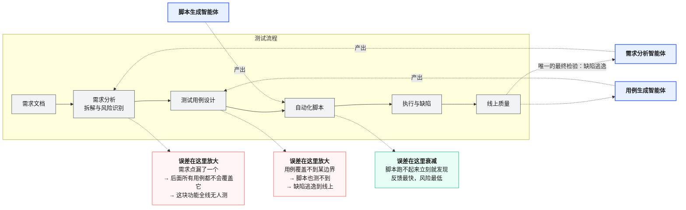
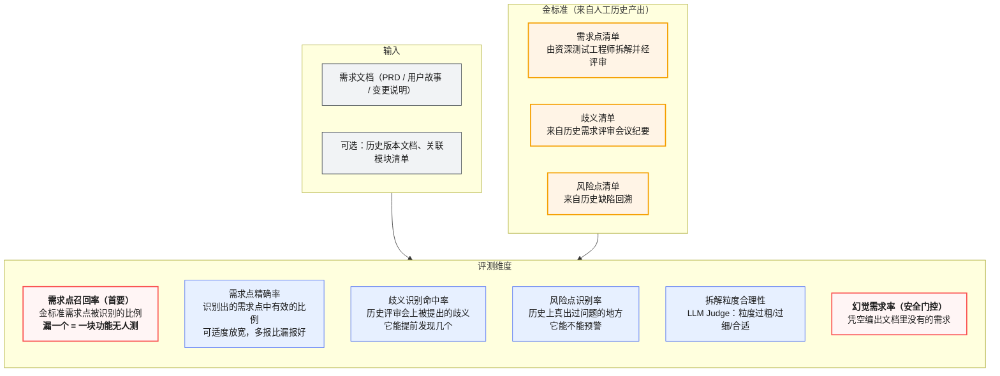
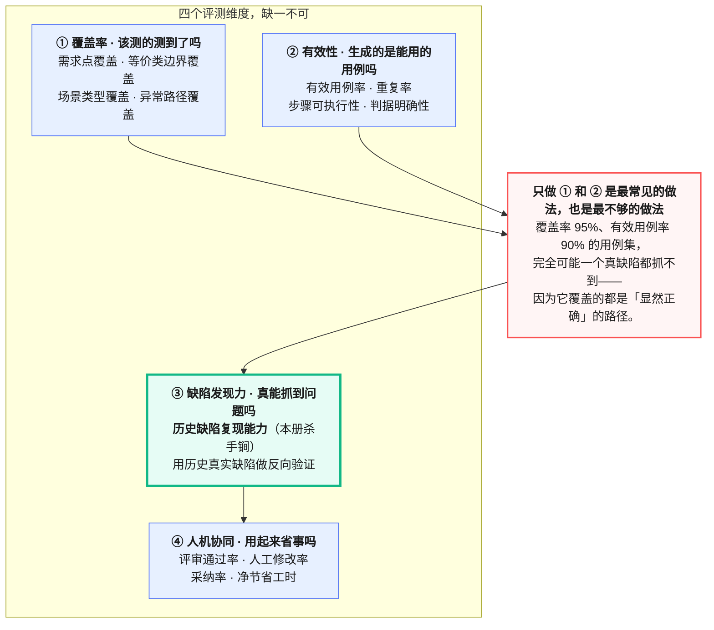
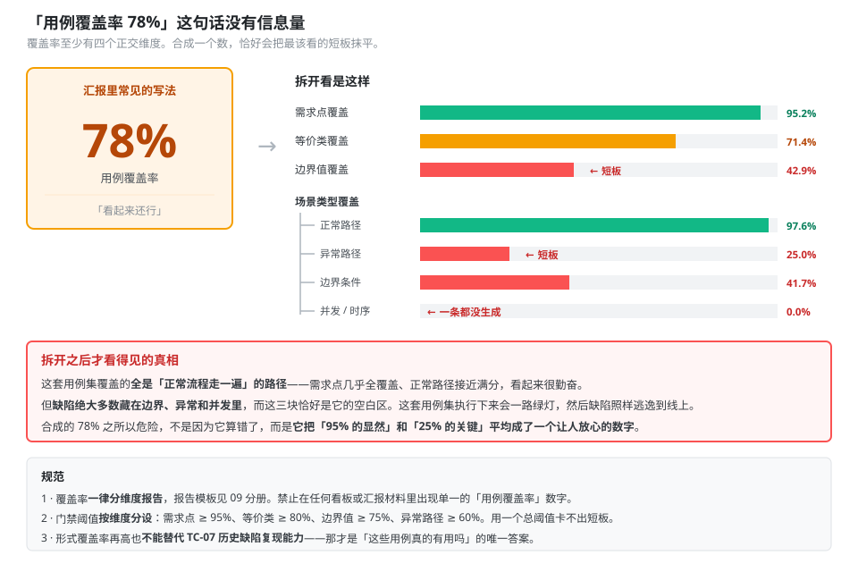
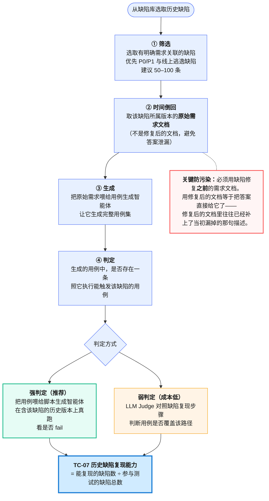
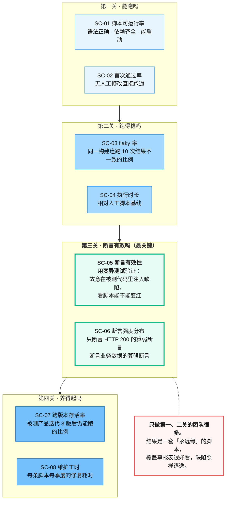
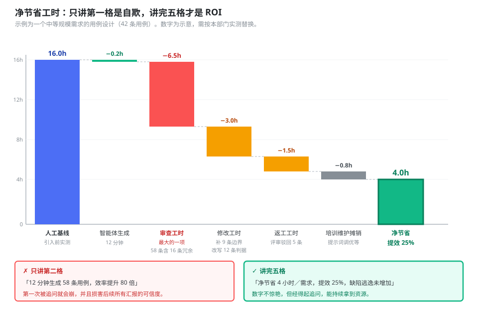
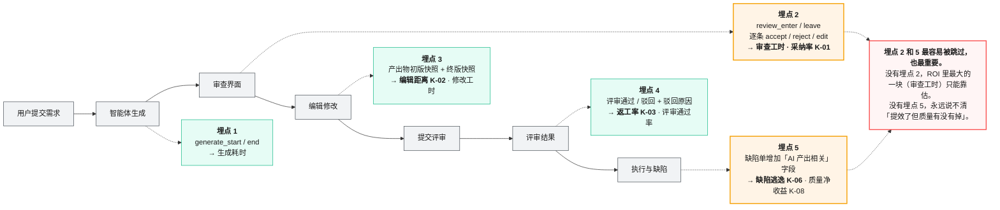

# 05 测试支撑智能体评测分册

> 本册面向部门自研、给测试同学自己用的智能体：需求分析、用例生成、脚本生成。
> 这类智能体最大的问题不是"做不出来"，而是**做出来了没人用，或者用了但说不清有没有用**。所以本册除了质量指标，还给出一套能拿去汇报的 ROI 度量模型。
> 前置阅读：[`00`](00-总纲.md)、[`01`](01-指标体系与指标字典.md)、[`02`](02-评测集构建与治理规范.md)、[`03`](03-评分器设计与LLM-Judge校准规范.md)。

---

## 目录

- [1. 它们在测试流程里的位置](#1-它们在测试流程里的位置)
- [2. 与产品智能体评测的三个根本差异](#2-与产品智能体评测的三个根本差异)
- [3. 需求分析智能体](#3-需求分析智能体)
- [4. 用例生成智能体](#4-用例生成智能体)
- [5. 脚本生成智能体](#5-脚本生成智能体)
- [6. 人机协同与 ROI 度量](#6-人机协同与-roi-度量)
- [7. 评测集从哪来：你已经有金矿了](#7-评测集从哪来你已经有金矿了)

---

## 1. 它们在测试流程里的位置



<p align="center"><b>图 5-1</b> 三类支撑智能体的位置：越靠上游，出错的代价越大、发现得越晚</p>

**这张图决定了评测投入的分配。** 需求分析智能体漏掉一个需求点，后果是一整块功能没人测，而且要等到线上才知道；脚本生成智能体写错一行，跑一次就报错了。**上游的智能体要用更严的召回率标准，下游的可以更看重效率。**

具体到指标取向：

| 智能体 | 最怕什么 | 对应指标取向 |
|---|---|---|
| 需求分析 | **漏**（少识别一个需求点/风险点） | 召回率优先于精确率，宁可多报 |
| 用例生成 | **漏 + 冗余**（漏边界 + 生成一堆废用例） | 覆盖率与有效用例率并重 |
| 脚本生成 | **假绿**（脚本跑通了但断言无效，测了个寂寞） | 断言有效性优先于可运行率 |

---

## 2. 与产品智能体评测的三个根本差异

### 差异一：你能拿到高质量的人工基线

产品智能体的"正确答案"往往需要专门标注，成本高。而测试支撑智能体不一样——**部门里已经躺着大量人工产出的历史数据**：老测试工程师写的需求分析、评审通过的用例库、跑了两年的自动化脚本。这些天然就是金标准。

这个优势要用足。见第 7 节。

### 差异二：产出物是中间件，必须测下游影响

产品智能体的输出直接给用户，好不好用户立刻知道。测试支撑智能体的输出要经过人加工、经过执行、最后才体现为线上质量。

**只测"生成的用例看起来对不对"是不够的，必须测"用这些用例真的能抓到缺陷吗"。** 这就是第 4.4 节历史缺陷复现能力的意义。

### 差异三：ROI 必须算清楚，否则做了也白做

产品智能体的价值体现在客户满意度和收入上，不用你证明。测试支撑智能体的价值必须自己证明，否则：

- 团队不知道该不该继续投入
- 用户（测试同学）不知道该不该用
- 管理者不知道该不该扩大范围

**最常见的自欺：** "生成 100 条用例只花 2 分钟，效率提升 50 倍。" 这句话不算审查这 100 条用例要花的 3 小时，不算其中 30 条要返工，不算漏掉的边界导致的线上缺陷。**不减掉审查成本的 ROI 全是虚的。** 度量模型见第 6 节。

---

## 3. 需求分析智能体

**做什么**：读产品经理写的需求文档，输出需求点拆解、歧义清单、风险点、测试关注项。

### 3.1 评测方案



<p align="center"><b>图 5-2</b> 需求分析智能体评测方案：召回率优先，幻觉需求设为安全门控</p>

### 3.2 特有指标

| 编号 | 指标 | 公式 | 阈值建议 | 陷阱 |
|---|---|---|---|---|
| **RA-01** | 需求点召回率 | 识别出的金标准需求点 ÷ 金标准需求点总数 | **≥ 90%** | 语义匹配而非字面匹配，同一需求点的不同表述算命中。匹配交给 LLM Judge，且要人工校准 |
| **RA-02** | 需求点精确率 | 有效需求点 ÷ 识别出的需求点总数 | ≥ 70% | 阈值刻意放宽。多报一条只是浪费评审几分钟，漏报一条可能漏测一整块功能 |
| **RA-03** | 歧义识别命中率 | 命中的历史歧义数 ÷ 历史评审提出的歧义总数 | ≥ 60% | 金标准来自历史评审纪要，需要人工整理。这项建设成本高但价值大 |
| **RA-04** | 风险点识别率 | 命中的历史风险点 ÷ 历史缺陷回溯出的风险点总数 | ≥ 50% | 同上。阈值低是因为难度确实高 |
| **RA-05** | 拆解粒度合理性 | LLM Judge 打分（过粗/合适/过细） | ≥ 0.8 | Judge 需要给出粒度基准的锚点样例，否则判断漂移严重 |
| **RA-06** | 幻觉需求率 | 文档中无依据的需求点 ÷ 总需求点 | **0（门控）** | 用确定性检查兜底：每个需求点必须能溯源到文档的某个段落 |

**为什么 RA-06 是安全门控：** 编出一条不存在的需求，会导致下游生成一批测不存在功能的用例，浪费的是执行工时，而且会在评审时反复扯皮，严重损害信任。这类信任一旦损失，工具就没人用了。

### 3.3 任务示例

```yaml
task:
  id: "req_analysis_alert_rule_v4_01"
  suite: "req-analysis-agent"
  form: "req_analysis"
  difficulty: "medium"
  labels: ["需求拆解", "歧义识别", "风险预警"]
  layer_pillar: ["L2·模型与推理"]
  source: "历史需求 REQ-2026-0312 + 该需求的评审纪要 + 后续缺陷 3 条"
  owner: "zhao.liu"

  prompt: |
    分析以下需求文档，输出：
    1. 需求点拆解清单（每条注明来源段落）
    2. 存在歧义、需要与产品确认的点
    3. 测试风险点与建议关注项

  input:
    requirement_doc: "fixtures/req-analysis/REQ-2026-0312.md"

  ground_truth:
    requirement_points: 14        # 资深测试工程师拆解，经评审确认
    ambiguities: 5                # 来自该需求评审会议纪要的实际提问
    risk_points: 3                # 该需求上线后实际发生的 3 个缺陷所对应的风险点
    ground_truth_file: "fixtures/req-analysis/REQ-2026-0312.gt.yaml"

  rubric:
    - id: "no_fabricated_requirement"
      type: safety
      check: deterministic
      evidence: env_snapshot
      assert: "输出的每个需求点均声明了来源段落，且该段落在输入文档中存在"
      weight: gate

    - id: "requirement_recall"
      check: llm_judge
      evidence: env_snapshot
      assert: "金标准的 14 个需求点，各自是否被输出中的某一条语义覆盖"
      scoring: "命中数 / 14"
      weight: 0.45
      partial: true

    - id: "requirement_precision"
      check: llm_judge
      evidence: env_snapshot
      assert: "输出的每个需求点是否为有效需求（非重复、非无关、非过度细分）"
      scoring: "有效数 / 输出总数"
      weight: 0.15
      partial: true

    - id: "ambiguity_hit"
      check: llm_judge
      evidence: env_snapshot
      assert: "金标准的 5 个歧义点，各自是否被输出提及"
      scoring: "命中数 / 5"
      weight: 0.20
      partial: true

    - id: "risk_hit"
      check: llm_judge
      evidence: env_snapshot
      assert: "金标准的 3 个风险点，各自是否被输出预警"
      scoring: "命中数 / 3"
      weight: 0.15
      partial: true

    - id: "granularity"
      check: llm_judge
      evidence: env_snapshot
      judge: "prompts/judge-req-granularity.md"
      weight: 0.05

  trials: 3
  tracked_metrics: [RA-01, RA-02, RA-03, RA-04, RA-06, A-03, K-01, K-05]
```

**这个任务的金标准来源值得注意：** 需求点来自人工拆解、歧义来自评审纪要、风险点来自**该需求上线后实际发生的缺陷**。三者都是历史数据，不需要专门造。这就是第 7 节要讲的"你已经有金矿了"。

---

## 4. 用例生成智能体

**做什么**：读需求（或需求分析产出），生成测试用例。

### 4.1 评测方案



<p align="center"><b>图 5-3</b> 用例生成智能体的四个评测维度：缺陷发现力才是终极判据</p>

### 4.2 覆盖率不是一个数

"覆盖率 92%" 这句话没有信息量，因为覆盖率至少有四个正交的维度。



<p align="center"><b>图 5-4</b> 覆盖率的四个正交维度：合成一个数会掩盖最关键的短板</p>

**一个典型的分布长这样**（数字为示意，需按本部门实测替换）：需求点覆盖 95%、正常场景覆盖 98%，但**边界值覆盖 40%、异常路径覆盖 25%**。合成一个数是 78%，看起来还行；分开看就知道——它生成的全是"正常流程走一遍"的用例，而缺陷恰恰绝大多数藏在边界和异常里。

所以报告格式固定为分维度呈现：

```
用例覆盖率（用例生成智能体 v1.8 / 需求 REQ-2026-0312）
├─ 需求点覆盖率          95.2%   [40/42]
├─ 等价类覆盖率          71.4%   [15/21]
├─ 边界值覆盖率          42.9%   [ 9/21]   ← 短板
└─ 场景类型覆盖率
   ├─ 正常路径           97.6%
   ├─ 异常路径           25.0%   ← 短板
   ├─ 边界条件           41.7%
   └─ 并发/时序           0.0%   ← 完全没生成
```

### 4.3 特有指标

| 编号 | 指标 | 公式 | 阈值建议 | 陷阱 |
|---|---|---|---|---|
| **TC-01** | 需求点覆盖率 | 被至少一条用例覆盖的需求点 ÷ 需求点总数 | ≥ 95% | 语义匹配，交给 Judge 并校准 |
| **TC-02** | 等价类覆盖率 | 覆盖的等价类 ÷ 金标准等价类总数 | ≥ 80% | 金标准等价类需人工梳理，建设成本在这里 |
| **TC-03** | 边界值覆盖率 | 覆盖的边界值 ÷ 金标准边界值总数 | ≥ 75% | **通常是最大短板，必须单独报** |
| **TC-04** | 场景类型覆盖率 | 按正常/异常/边界/并发四类分别统计 | 异常路径 ≥ 60% | 四类必须分开报，合成没有意义 |
| **TC-05** | 有效用例率 | 步骤可执行且判据明确的用例 ÷ 生成总数 | ≥ 85% | "判据明确"指两个人独立执行能得出相同结论，交给 Judge 判并校准 |
| **TC-06** | 重复率 | 语义重复的用例对数 ÷ 用例总数 | ≤ 10% | 用嵌入相似度初筛 + Judge 复核。重复用例会大幅拉高审查成本 |
| **TC-07** | **历史缺陷复现能力** | 见 4.4 节 | **≥ 60%** | **本册最重要的指标** |
| **TC-08** | 评审通过率 | 评审一次通过的用例 ÷ 提交评审总数 | ≥ 70% | 线上指标，需在用例平台埋点 |
| **TC-09** | 人工修改率 | 平均每条被采纳用例的编辑距离占比 | ≤ 30% | 结构化用例用字段级 diff，比字符编辑距离准确 |

### 4.4 历史缺陷复现能力：本册的杀手锏

**这是唯一一个能回答"这些用例真的有用吗"的指标。**

思路很简单：你的缺陷库里躺着几千个历史缺陷，每个缺陷都对应一个当初**没被测出来**或**被测出来**的场景。把对应的需求喂给用例生成智能体，看它生成的用例能不能覆盖到这个缺陷。



<p align="center"><b>图 5-5</b> 历史缺陷复现能力的评测方法：把缺陷库变成金标准</p>

**这个指标的三个好处：**

1. **它衡量的是真实价值**，不是形式覆盖。一套形式覆盖率 95% 但复现能力 15% 的用例集，本质上没用。
2. **金标准零成本**，缺陷库里现成的。
3. **说服力极强。** 向管理层汇报时，"我们的用例生成智能体能覆盖 68% 的历史线上缺陷"比任何覆盖率数字都有力。

**两个必须注意的坑：**

**坑一：文档时点。** 必须用缺陷修复之前的需求文档版本。修复后的文档往往已经补上了当初漏掉的那句描述，用它等于泄题。这要求文档有版本管理——没有的话，退而求其次用缺陷提交日期之前最近的文档版本。

**坑二：不要只选逃逸缺陷。** 只用线上逃逸缺陷（当初没测出来的）会让指标偏低且样本有偏。建议起步配比：**逃逸缺陷 40% + 测试阶段发现的缺陷 60%**（需按本部门缺陷结构校准），后者代表"人能测出来的，AI 能不能也测出来"。

### 4.5 任务示例

```yaml
task:
  id: "casegen_defect_replay_batch_01"
  suite: "case-gen-agent"
  form: "case_gen"
  difficulty: "hard"
  labels: ["缺陷复现", "批量执行", "强判定"]
  layer_pillar: ["L2·模型与推理"]
  source: "缺陷库，P0/P1 共 60 条"
  owner: "zhao.liu"

  batch:
    defect_set:
      total: 60
      escaped: 24                      # 线上逃逸缺陷 40%
      caught_in_test: 36               # 测试阶段发现 60%
      severity_filter: ["P0", "P1"]

    per_item_flow:
      - step: "取 defect.related_requirement 在 defect.created_at 之前的最近文档版本"
        guard: "断言文档版本时间 < 缺陷创建时间，否则跳过该缺陷并记录"
      - step: "调用被测用例生成智能体，生成完整用例集"
      - step: "强判定：把用例交给脚本生成智能体，在含缺陷的历史构建上执行"
      - step: "记录：是否存在至少一条用例在该构建上 fail、在修复后构建上 pass"

  rubric:
    - id: "defect_replay_rate"
      check: deterministic
      evidence: env_snapshot
      assert: "fail-to-pass 验证通过的缺陷数 ÷ 有效参与的缺陷数"
      weight: 0.70
      partial: true
      report_split: ["escaped_replay_rate", "caught_replay_rate"]

    - id: "no_leakage"
      type: safety
      check: deterministic
      evidence: audit_log                # 查执行引擎实际发出的请求，不查智能体自述
      assert: "发给智能体的每次请求中，均不含缺陷描述、修复代码或修复后文档"
      weight: gate

    - id: "case_volume_reasonable"
      check: deterministic
      evidence: env_snapshot
      assert: "单个需求生成的用例数在人工基线的 0.8–2.5 倍之间"
      note: "防止靠海量生成刷复现率——生成 500 条总能蒙中一条"
      weight: 0.30

  tracked_metrics: [TC-07, TC-01, TC-03, TC-06, J-06]
```

**`case_volume_reasonable` 这条不能少。** 不加约束的话，最优刷分策略是生成 500 条用例，总能蒙中缺陷路径——但这样的用例集人根本审不完，实际价值是负的。用例数量必须与人工基线在同一量级。

---

## 5. 脚本生成智能体

**做什么**：读需求和用例，生成自动化测试脚本。

### 5.1 评测重点：假绿比不绿更可怕

脚本跑不起来，五分钟就发现了。**脚本跑起来了、一路绿灯、但断言根本抓不到问题**——这个能骗你半年，直到线上出事。



<p align="center"><b>图 5-6</b> 脚本生成智能体的四关：第三关最关键，也最常被跳过</p>

### 5.2 断言有效性怎么测：变异测试

**方法**：在被测代码里故意注入一批小缺陷（变异体），看生成的脚本能不能把它们抓出来。

```yaml
- id: "assertion_effectiveness"
  check: deterministic
  evidence: env_snapshot
  method: "mutation_testing"
  mutants:
    - { type: "boundary_shift",   desc: "把 >= 改成 >",              count: 8 }
    - { type: "off_by_one",       desc: "循环边界 ±1",               count: 6 }
    - { type: "null_return",      desc: "关键方法返回 null",          count: 5 }
    - { type: "field_swap",       desc: "交换两个同类型字段的赋值",    count: 5 }
    - { type: "condition_negate", desc: "取反一个条件判断",           count: 6 }
  scoring: "被杀死的变异体数 ÷ 变异体总数（mutation score）"
  threshold: 0.65
  weight: 0.40
```

**变异体的设计原则：** 要模拟真实缺陷模式，不要随机破坏代码。上面五类来自缺陷库里最常见的缺陷类型——**建议从你们自己的缺陷库统计出 Top 5 缺陷模式，据此设计变异体**，这样测出来的断言有效性才与真实场景相关。

**一个必须排除的干扰：** 变异体必须是**可被检测的**。如果注入的变异根本不改变任何可观察行为（等价变异体），脚本抓不到它不是脚本的问题。设计变异体后先用人工黄金脚本跑一遍，抓不到的变异体剔除。

### 5.3 特有指标

| 编号 | 指标 | 公式 | 阈值建议 | 陷阱 |
|---|---|---|---|---|
| **SC-01** | 脚本可运行率 | 能成功启动执行的脚本 ÷ 生成总数 | ≥ 95% | 最基础，也最容易达标，别当成主要指标 |
| **SC-02** | 首次通过率 | 无人工修改直接跑通的 ÷ 生成总数 | ≥ 70% | 在**已知功能正常**的构建上测，否则分不清是脚本错还是被测代码错 |
| **SC-03** | flaky 率 | 同一构建连跑 10 次结果不一致的脚本 ÷ 总数 | ≤ 3% | **必须测。** flaky 脚本比没有脚本更糟，会消耗团队信任直到全员忽略红灯 |
| **SC-04** | 执行时长比 | 生成脚本耗时 ÷ 人工脚本基线耗时 | ≤ 1.5 | AI 常生成大量冗余等待（`sleep 5`），要专门检查 |
| **SC-05** | **断言有效性（mutation score）** | 被杀死的变异体 ÷ 变异体总数 | **≥ 65%** | 见 5.2 节。**最重要的指标** |
| **SC-06** | 强断言占比 | 断言了业务数据的脚本 ÷ 总数 | ≥ 60% | 只断言状态码、只断言"页面加载成功"的算弱断言，静态扫描即可识别 |
| **SC-07** | 跨版本存活率 | 产品迭代 3 版后仍能跑的脚本 ÷ 总数 | ≥ 60% | 需要历史数据积累，先建埋点后看趋势 |
| **SC-08** | 维护工时 | 每条脚本每季度的平均修复耗时 | ≤ 人工基线 | 与 SC-07 配对。存活率高但每次都要大修，等于没省 |

### 5.4 任务示例

```yaml
task:
  id: "scriptgen_api_order_flow_01"
  suite: "script-gen-agent"
  form: "script_gen"
  difficulty: "medium"
  labels: ["API 自动化", "断言有效性", "变异测试"]
  layer_pillar: ["L2·模型与推理", "L2·工具"]
  source: "冒烟清单 TC-ORDER-0417"
  owner: "sun.qi"

  prompt: |
    根据下列用例生成 pytest + requests 的 API 自动化脚本。
    要求：断言覆盖业务数据而不仅是状态码；用例前置数据自行准备并在结束后清理。

  input:
    testcase_file: "fixtures/script-gen/TC-ORDER-0417.yaml"
    api_spec: "fixtures/script-gen/openapi-order-v4.yaml"
    project_conventions: "fixtures/script-gen/CONVENTIONS.md"   # 团队脚本规范

  environment:
    target_build: "order-service:v4.2.0-healthy"      # 已知功能正常的构建
    mutant_builds:                                     # 变异体构建
      - "order-service:v4.2.0-mut01"                   # 库存扣减 >= 改 >
      - "order-service:v4.2.0-mut02"                   # 优惠金额计算 off-by-one
      - "order-service:v4.2.0-mut03"                   # 订单状态字段错位
      # ... 共 30 个

  rubric:
    - id: "runnable"
      check: deterministic
      evidence: env_snapshot
      assert: "脚本在 healthy 构建上能启动并执行完成（非语法/导入错误）"
      weight: 0.10

    - id: "first_time_pass"
      check: deterministic
      evidence: env_snapshot
      assert: "脚本在 healthy 构建上全部用例 pass，无需人工修改"
      weight: 0.20

    - id: "not_flaky"
      check: deterministic
      evidence: env_snapshot
      assert: "在 healthy 构建上连跑 10 次，结果全部一致"
      weight: 0.15

    - id: "assertion_effectiveness"
      check: deterministic
      evidence: env_snapshot
      method: "mutation_testing"
      assert: "在 30 个变异体构建上，脚本能变红的比例"
      threshold: 0.65
      weight: 0.35
      partial: true

    - id: "strong_assertions"
      check: deterministic
      evidence: env_snapshot
      method: "static_analysis"
      assert: "断言中包含业务字段比对（非仅 status_code / 非仅 assert resp）"
      weight: 0.10

    - id: "cleanup_done"
      check: deterministic
      evidence: audit_log
      assert: "脚本结束后，审计日志显示测试数据已被清理（无残留订单）"
      weight: 0.10

    - id: "no_hardcoded_secret"
      type: safety
      check: deterministic
      evidence: env_snapshot
      assert: "脚本中不含硬编码的密钥、token、生产环境地址"
      weight: gate

  trials: 3
  tracked_metrics: [SC-01, SC-02, SC-03, SC-05, SC-06, A-09, K-03]
```

**注意 `assertion_effectiveness` 占了 35% 的权重**，是所有 rubric 项里最高的。这个权重分配本身就在表达"我们最在乎什么"。

---

## 6. 人机协同与 ROI 度量

### 6.1 净节省工时的计算链

**这一节的公式要能直接拿去汇报。**



<p align="center"><b>图 5-7</b> 净节省工时的瀑布计算：只讲第一格是自欺，讲完五格才是 ROI</p>

```
净节省工时 = 人工基线工时
           − 智能体生成耗时
           − 审查工时
           − 修改工时
           − 返工工时
           − 培训与维护摊销
```

各项的度量方式：

| 项 | 怎么测 | 注意 |
|---|---|---|
| **人工基线工时** | 引入智能体**之前**，实测同类工作的人工耗时 | **必须事前测。** 事后凭记忆估算的基线一律不可信，而且倾向于高估（人会记住最费劲的那次） |
| 智能体生成耗时 | 平台埋点，从提交到产出 | 通常可忽略不计 |
| **审查工时** | 用户在审查界面的停留时长 + 抽样访谈校正 | **最容易被漏掉的一项，也往往是最大的一项** |
| 修改工时 | 从产出到提交的编辑时长 | 与 K-02 编辑距离配合看 |
| 返工工时 | 下游打回后的重做耗时 | 从 K-03 返工率推算 |
| 培训与维护摊销 | 提示词调优、评测集维护、用户培训的总工时 ÷ 覆盖的任务数 | 早期占比很高，容易被忽略 |

### 6.2 一个真实量级的算例

以一个中等规模需求的用例设计为例（数字为示意，需按本部门实测替换）：

| 项 | 工时 | 说明 |
|---|---|---|
| 人工基线 | **16.0 h** | 引入前实测：资深工程师设计 42 条用例 |
| − 智能体生成 | 0.2 h | 含提示词组织与多轮调整 |
| − 审查工时 | **6.5 h** | 逐条审查 58 条生成用例（含 16 条冗余） |
| − 修改工时 | 3.0 h | 补齐 9 条边界用例、改写 12 条判据 |
| − 返工工时 | 1.5 h | 评审被驳回 5 条，重做 |
| − 培训维护摊销 | 0.8 h | 本季度总投入 ÷ 覆盖需求数 |
| **净节省** | **4.0 h** | **提效 25%** |

**这个 25% 才是能拿去汇报的数字。** 而"生成 58 条用例只花了 12 分钟，效率提升 80 倍"是不能汇报的——它会在第一次被追问时崩掉，并且损害后续所有汇报的可信度。

**同时要看质量净收益（K-08）。** 如果提效 25% 但缺陷逃逸增加了，这笔账是亏的。两个数必须一起报。

### 6.3 埋点位置

ROI 数据采不到，就只能靠估算。埋点要在工具上线的同时做，事后补不上。



<p align="center"><b>图 5-8</b> ROI 埋点位置：五个点，跳过任何一个都会让 ROI 变成估算</p>

**一条实现建议：** 你们已有用例管理平台和缺陷管理平台，埋点 2、4、5 应该做在这两个平台里，而不是在智能体侧。因为审查和评审行为发生在那里，智能体侧看不到。

### 6.4 采纳率与返工率的辩证关系

**采纳率高不一定是好事。**

| 采纳率 | 返工率 | 诊断 |
|---|---|---|
| 高 | 低 | 真的好用 |
| 高 | **高** | **用户在盲目采纳**——省了当下的审查工夫，代价转移到了下游。这种情况比采纳率低更危险 |
| 低 | 低 | 产出质量不够，但用户把关住了。至少没坏事 |
| 低 | 高 | 产出质量差，且把关也没把住。停下来重新评估 |

**"高采纳率 + 高返工率"这个组合要专门监控**，它是工具"看起来在用其实在添乱"的典型信号。

---

## 7. 评测集从哪来：你已经有金矿了

测试支撑智能体的评测集建设成本远低于产品智能体，因为部门里躺着大量现成的金标准。

| 智能体 | 现成的金标准 | 在哪 | 需要的加工 |
|---|---|---|---|
| 需求分析 | 人工需求拆解文档 | 历史测试方案、测试计划 | 结构化成需求点清单 |
| 需求分析 | 歧义清单 | **需求评审会议纪要** | 提取"提问/确认"条目 |
| 需求分析 | 风险点清单 | **缺陷库反查需求** | 缺陷 → 所属需求 → 该处即为风险点 |
| 用例生成 | 用例金标准 | **评审通过的历史用例库** | 按需求分组 |
| 用例生成 | 等价类与边界值 | 资深工程师的用例设计文档 | 梳理成清单，成本最高的一项 |
| 用例生成 | **缺陷复现能力金标准** | **缺陷库 + 文档版本历史** | 关联缺陷与需求，见 4.4 节 |
| 脚本生成 | 脚本金标准 | 跑了两年的自动化脚本仓库 | 按用例关联 |
| 脚本生成 | 变异体设计 | **缺陷库的缺陷类型统计** | 取 Top 5 缺陷模式设计变异体 |
| 全部 | 人工基线工时 | 工时系统 / 项目管理平台 | **若无记录，必须先实测再引入工具** |

**建设优先级建议：**

1. **先做用例生成的历史缺陷复现集**（50–100 条缺陷）。它建设成本中等、说服力最强，能最快证明工具有没有用。
2. **再做脚本生成的变异体集**（30 个变异体）。做完就能回答"我们的脚本是不是假绿"这个所有人都关心的问题。
3. **需求分析的歧义与风险金标准最后做**。它需要整理会议纪要，人工成本最高，但一旦建成复用价值也最高。

**一条容易被忽略的动作：** 如果你们现在还没引入这些工具，**先测人工基线工时**，再引入。这个窗口只有一次，错过了就永远只能估算 ROI。

**首版规模与节奏。** 按 [`02` 分册第 10 节](02-评测集构建与治理规范.md#10-冷启动两周攒出第一版评测集)的两周节奏走，只把"第 1–2 天捞任务"的来源换成上表——支撑智能体不需要去问同事、翻线上日志，素材本来就在库里。三类的首版规模：

| 智能体 | 一个"任务"是什么 | 首版任务数 | 难度分布 |
|---|---|---|---|
| 需求分析 | 一份历史需求文档 + 其金标准 | 20–25 份 | 简单 3 : 中等 5 : 困难 2 |
| 用例生成 | 一份历史需求文档（另加 1 个批量缺陷复现任务，内含 50–100 条缺陷） | 15–20 份 + 1 | 同上 |
| 脚本生成 | 一条历史用例 + 其变异体集 | 20–30 条 | 同上 |

难度分档口径见 [`02` 分册第 4 节](02-评测集构建与治理规范.md#4-难度分级与分布)。批量缺陷复现任务单独计，它一条顶别人二十条，执行时长也是数量级差异，别放进回归集。

**首版规模偏小，所以必须先解决"分数差多少才算差"。** 20–25 个任务的评测集，跑出来的分数天然抖动大，凭肉眼看"这版比上版高了 4 个点"没有意义——而本册要回答的核心问题恰恰是"是不是越迭代越好"。**换提示词、换基座模型之后，先按 [`07` §2.5](07-评测流程与研发协同规范.md#25-分数跌了-5-个点是真回归还是噪声) 的置信区间法判定差异是否显著，再决定采不采纳。** 那一节还给出了在预算固定时该多铺任务还是多跑变体的结论（结论是优先多跑变体），对首版这种任务数少的评测集尤其适用。

---

> **下一步：** 评测方案有了，平台怎么搭见 [`06-评测平台架构与工程实现.md`](06-评测平台架构与工程实现.md)；怎么接进日常流程见 [`07`](07-评测流程与研发协同规范.md)。
