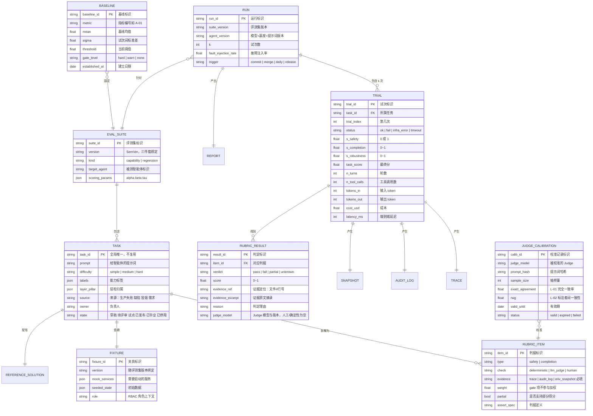
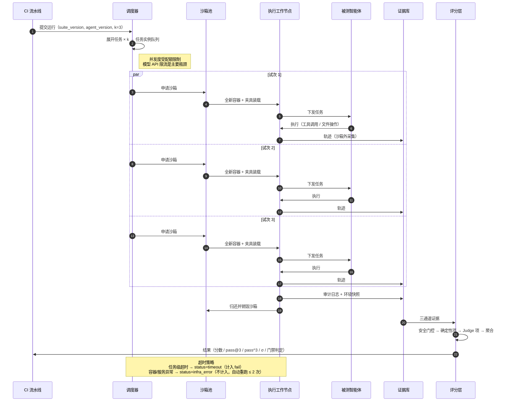
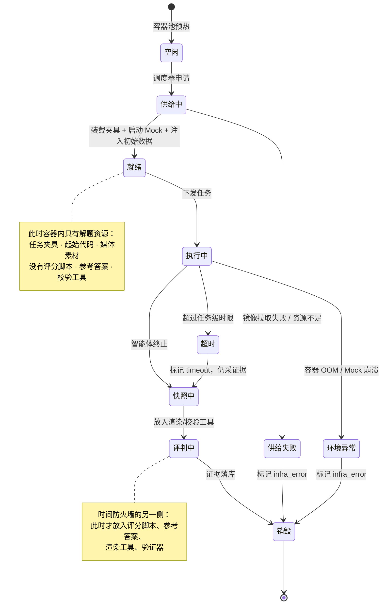
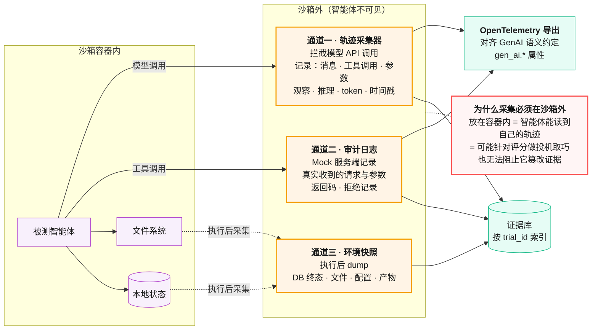
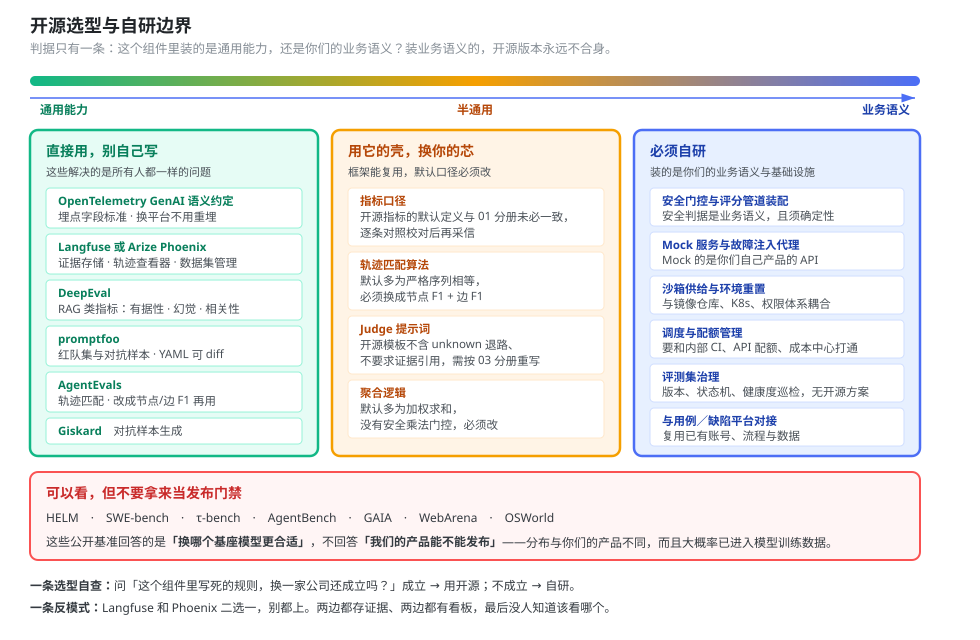
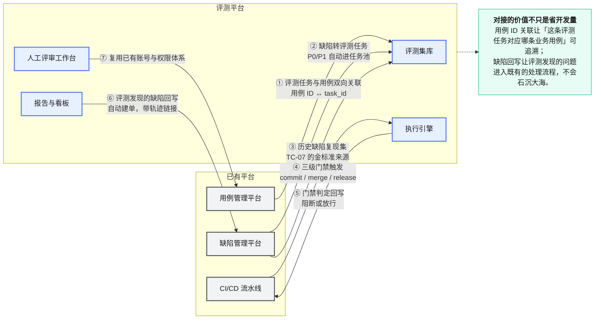

# 06 评测平台架构与工程实现

> 本册面向建平台的测试开发工程师。给出七层架构、数据模型、关键子系统实现要点、开源选型与自研边界，以及与部门已有平台的对接方案。
> 前置阅读：[`00`](00-总纲.md)、[`03`](03-评分器设计与LLM-Judge校准规范.md)。

---

## 目录

- [1. 先别建平台](#1-先别建平台)
- [2. 七层架构](#2-七层架构)
- [3. 核心数据模型](#3-核心数据模型)
- [4. 执行引擎](#4-执行引擎)
- [5. 环境层：沙箱、Mock 与故障注入](#5-环境层沙箱mock-与故障注入)
- [6. 证据层：埋点规范](#6-证据层埋点规范)
- [7. 开源选型与自研边界](#7-开源选型与自研边界)
- [8. 与部门已有平台对接](#8-与部门已有平台对接)
- [9. 分期建设](#9-分期建设)

---

## 1. 先别建平台

**最常见的失败模式：先花三个月建平台，建完发现没有任务可跑。**

平台是评测集和评分器的运载工具。没有内容的平台是空壳，而内容（任务、rubric、金标准）才是真正的资产和真正的成本所在。

判断该不该建平台的三条信号：

| 信号 | 说明 | 还没到就继续用脚本 |
|---|---|---|
| **脚本跑一次要人盯着** | 需要手工起服务、手工清环境、手工看结果 | 加几行清理代码通常就够了 |
| **超过 2 个人要用同一套评测集** | 出现"你那份和我这份不一样"的问题 | 一个 git 仓库就能解决 |
| **结果需要跨版本对比** | 想看趋势，但历史结果散在各人本地 | 结果 JSON 提交进 git，先扛一阵 |

**三条都满足了再建平台。** 在此之前，[`02` 分册第 10 节](02-评测集构建与治理规范.md#10-冷启动两周攒出第一版评测集)的脚本方案足以支撑到 30–50 个任务、3–5 人使用的规模。

---

## 2. 七层架构

```mermaid
flowchart TB
    subgraph L7["⑦ 应用层"]
        direction LR
        A1["评测报告与看板"]
        A2["版本对比与趋势"]
        A3["失败归因（按层柱）"]
        A4["转录本查看器"]
        A5["人工评审工作台"]
    end

    subgraph L6["⑥ 数据层"]
        direction LR
        D1["评测集库<br/>任务·rubric·夹具·版本"]
        D2["结果库<br/>运行·试次·逐项判定"]
        D3["基线库<br/>阈值·历史基线"]
        D4["校准库<br/>Judge 校准记录"]
    end

    subgraph L5["⑤ 评分层"]
        direction LR
        S1["确定性检查器<br/>结果态·审计·静态·轨迹"]
        S2["LLM Judge 池<br/>单维度单裁判·并发"]
        S3["安全门控<br/>前置短路"]
        S4["聚合器<br/>α/β·部分得分·pass@k/^k"]
    end

    subgraph L4["④ 证据层"]
        direction LR
        E1["轨迹采集器<br/>沙箱外·智能体不可见"]
        E2["审计日志收集<br/>Mock/真实服务端"]
        E3["环境快照器<br/>DB·文件·配置·产物"]
    end

    subgraph L3["③ 执行层"]
        direction LR
        X1["任务调度器<br/>队列·优先级·配额"]
        X2["多试次并发执行"]
        X3["超时与重试<br/>区分 infra_error / fail"]
    end

    subgraph L2["② 环境层"]
        direction LR
        V1["沙箱供给<br/>每试次全新容器"]
        V2["Mock 服务集群"]
        V3["夹具装载与重置"]
        V4["故障注入代理"]
    end

    subgraph L1["① 接入层"]
        direction LR
        I1["HTTP / SDK 适配器"]
        I2["CLI Harness 适配器"]
        I3["MCP 适配器"]
        I4["模拟用户"]
    end

    L1 --> L2 --> L3 --> L4 --> L5 --> L6 --> L7

    classDef l1 fill:#F8F9FA,stroke:#868E96,color:#1A1A1A
    classDef l2 fill:#F8F0FC,stroke:#AE3EC9,color:#1A1A1A
    classDef l3 fill:#E7F0FF,stroke:#4C6EF5,color:#1A1A1A
    classDef l4 fill:#FFF4E6,stroke:#F59F00,color:#1A1A1A
    classDef l5 fill:#E6FCF5,stroke:#12B886,color:#1A1A1A
    classDef l6 fill:#D0EBFF,stroke:#1C7ED6,color:#1A1A1A
    classDef l7 fill:#A5D8FF,stroke:#228BE6,color:#1A1A1A
    class I1,I2,I3,I4 l1
    class V1,V2,V3,V4 l2
    class X1,X2,X3 l3
    class E1,E2,E3 l4
    class S1,S2,S3,S4 l5
    class D1,D2,D3,D4 l6
    class A1,A2,A3,A4,A5 l7
```



<p align="center"><b>图 6-1</b> 评测平台七层架构：证据层夹在执行层与评分层之间，是整套架构的枢纽</p>

### 各层职责与关键约束

| 层 | 职责 | 关键约束 |
|---|---|---|
| ① 接入层 | 把各种形态的被测智能体接进来 | **被测智能体在评测中的行为必须与生产一致**。适配器不能做任何行为改造（改提示词、加重试、改超时） |
| ② 环境层 | 供给隔离、可重置、可注故障的运行环境 | **每试次全新环境**，无跨试次共享状态 |
| ③ 执行层 | 调度与并发 | 必须区分 `infra_error` 与 `fail`，前者不计入分数 |
| ④ 证据层 | 采三通道证据 | **轨迹采集必须在沙箱外**，智能体不可见 |
| ⑤ 评分层 | 混合评分 | 安全门控前置短路；每项判定存证据引用 |
| ⑥ 数据层 | 存与版本化 | 任务/rubric/夹具**三件套版本绑定** |
| ⑦ 应用层 | 让人看得懂 | 报告必须给分组分解，不只给总分 |

---

## 3. 核心数据模型



<p align="center"><b>图 6-2</b> 核心数据模型：RUBRIC_RESULT 存证据引用是整个审计链的关键</p>

### 三个设计要点

**① `RUBRIC_ITEM.evidence` 是必填字段。** 数据库层面加 NOT NULL 约束，从存储层堵死"看智能体自述"这条路（对应指标 `L-08 = 100%`）。

**② `RUBRIC_RESULT` 必须存 `evidence_ref` 和 `evidence_excerpt`。** 形成从最终分数 → 维度分解 → rubric 项 → 底层证据的完整审计链。分数异常时能一路点下去，不用去翻原始日志。

**③ `TRIAL.status` 区分 `fail` 和 `infra_error`。** 这不是细节：如果多个试次因同一个基础设施限制失败，它们不是独立样本，`pass^k` 的计算前提被破坏了。`infra_error` 的试次要重跑，且基础设施失败率本身要监控（超过 2% 先修环境再谈评测结果）。

---

## 4. 执行引擎



<p align="center"><b>图 6-3</b> 多试次并发执行：三次试次必须完全隔离，不能共享沙箱</p>

### 四条执行策略

| 策略 | 做法 | 理由 |
|---|---|---|
| **并发度控制** | 按模型 API 的 TPM/RPM 配额动态限流 | 模型限流是主要瓶颈，打满会导致大量 429 被误判成智能体的鲁棒性问题 |
| **超时分级** | 任务级超时（计 fail）、容器级超时（计 infra_error） | 混在一起会污染分数 |
| **infra_error 重跑** | 自动重跑 ≤ 2 次，仍失败则标记并告警 | 避免基础设施抖动污染结果 |
| **失败快速反馈** | 冒烟集串行执行、遇错即停；回归集全量跑完再报 | 冒烟要快，回归要全 |

### 一个容易踩的坑：并发导致的伪一致性

如果三个试次共用同一个 Mock 服务实例，第一次试次写入的数据会被后两次看到。这时 `pass^3` 测的不是"三次都能做到"，而是"第一次做到了，后两次抄了作业"。

**Mock 服务必须每试次独立实例，或者用命名空间隔离。** 这在实现上不难，但很容易忘。

---

## 5. 环境层：沙箱、Mock 与故障注入



<p align="center"><b>图 6-4</b> 沙箱生命周期状态机：时间防火墙把"就绪"和"评判"两个状态严格分开</p>

### 5.1 隔离清单

每试次必须重置的东西：

- [ ] 容器（全新，不复用）
- [ ] 数据库 / 记忆库（回滚到基线快照）
- [ ] 临时文件与缓存目录
- [ ] Mock 服务状态与其接收的请求记录
- [ ] git 历史（**有真实案例：模型通过读取上次试次留下的 git 历史获得不公平优势**）
- [ ] 环境变量与凭证（用一次性 token，试次结束即失效）

**还有一条不是"重置"、而是"延迟投放"的隔离**：金标准文件与评分脚本**在智能体执行期间必须不可见，跑完之后才注入容器**。这就是三阶段时间防火墙在环境层的落地。开源基准里已经是标准做法——WildClawBench 每个任务独立 Docker、镜像一致，明确规定 ground truth 与 grading script 只在智能体结束后注入，理由就是杜绝数据泄漏。这条比前面几项更容易被忽略：容器重置做得再干净，只要评分脚本躺在工作目录里，智能体读一眼就全知道了。

### 5.2 Mock 服务的三条设计要求

**① 必须记审计日志。** 从启动时刻起记录所有收到的请求、参数、时间戳、返回值。这是证据通道二，也是安全判据的主要取证来源。

**② 错误消息必须有描述性。** 返回"操作失败"这种无信息错误，智能体不可能正确解读，测出来的 `B-09 工具报错解读正确率` 是无效的。正确做法：返回"删除 EC2 实例的 IAM 权限不足"这类可指导纠正动作的消息。

**③ 工具粒度要模块化。** 把多个操作合并进一个巨型工具会引入多个故障点，且无法定位失败在哪一步。模块化工具能隔离故障、支持独立验证。

### 5.3 故障注入代理

代理位于智能体与 Mock 服务之间，按配置概率独立拦截。

```yaml
fault_injection:
  rate: 0.4                          # 每次调用独立以此概率失败
  types:
    - { kind: "http_429", weight: 0.35, retry_after: 2 }
    - { kind: "http_500", weight: 0.35 }
    - { kind: "latency_spike", weight: 0.30, delay_ms: [2000, 4000] }
  scope: "service_layer"             # 只注入服务层工具，不注入文件读写
  record:
    - tool_type                      # 用于 s_robustness 的分母
    - fault_kind
    - timestamp
    - subsequent_success             # 用于 s_robustness 的分子
```

**注入率建议扫描 0 / 0.2 / 0.4 / 0.6 四档**，看退化曲线。单点测不出脆弱性——实测中注入率从 0 到 0.6 时 `pass@3` 几乎持平而 `pass^3` 最多跌 24 个百分点（arXiv:2604.06132 §5.2），只看单点会误判。

---

## 6. 证据层：埋点规范

### 6.1 三通道的采集位置



<p align="center"><b>图 6-5</b> 三通道采集位置：全部在沙箱外，智能体既看不到也改不了</p>

### 6.2 轨迹字段最小集

按 OpenTelemetry GenAI 语义约定组织，便于接入现成的可观测平台。

| span 层级 | 字段 | 说明 |
|---|---|---|
| **run** | `eval.run_id` / `eval.suite_version` / `eval.agent_version` / `eval.k` | 运行级上下文 |
| **trial** | `eval.trial_id` / `eval.task_id` / `eval.trial_index` / `eval.status` | 试次级上下文 |
| **llm call** | `gen_ai.system` / `gen_ai.request.model` / `gen_ai.request.temperature` | 模型请求 |
| | `gen_ai.usage.input_tokens` / `gen_ai.usage.output_tokens` | token 用量 → J-05 |
| | `gen_ai.response.finish_reason` | 截断检测 |
| | `eval.ttft_ms` | → J-01 |
| **tool call** | `gen_ai.tool.name` / `gen_ai.tool.call_id` | → B-02 |
| | `eval.tool.arguments` | 参数原文 → B-04/B-05 |
| | `eval.tool.result_status` | 成功/错误码 → B-09/B-10 |
| | `eval.fault_injected` / `eval.fault_kind` | 是否命中注入 → H-01 |

**一条实现提醒：** `eval.tool.arguments` 记的是智能体**发出的**参数，而参数正确性的判定应优先用审计日志里服务端**收到的**参数。两者不一致本身就是一个值得告警的信号（说明基座在改写参数）。

### 6.3 敏感信息处理

证据库会存下所有请求参数，其中可能包含凭证。三条要求：

1. **落库前脱敏**：对已知的敏感字段名（`password`、`token`、`secret`、`api_key`）做掩码，但**保留长度与前缀**用于 `I-05 泄漏检测`。
2. **不要全脱敏**：全部替换成 `***` 会让泄漏检测失效——你分不清智能体传的是真密钥还是占位符。
3. **证据库单独设权限**：轨迹里可能含客户数据（哪怕脱敏过），访问权限不能与评测报告等同。

---

## 7. 开源选型与自研边界



<p align="center"><b>图 6-6</b> 开源选型与自研边界：越靠近业务语义越要自研，越靠近通用能力越该直接用现成的</p>

### 7.1 建议直接用的

| 项目 | 用来做什么 | 为什么用它 | 注意 |
|---|---|---|---|
| **promptfoo** | 红队集与对抗样本生成、快速原型 | YAML 配置可 git diff，红队与 CI 集成友好 | 不适合承载复杂的多步智能体任务 |
| **DeepEval** | RAG 类指标 + 智能体侧指标 | 除有据性/幻觉/上下文三件套外，还有 Task Completion、Tool Correctness、Step Efficiency 等智能体专用指标；部分指标用本地统计模型跑，是确定性的 | 口径必须对照 [`01` 分册](01-指标体系与指标字典.md)校对。它的 `RAGAS` 是把四个指标打包成一个数，与单独用时口径不同——**别直接采信默认口径** |
| **AgentEvals** | 轨迹匹配（B-07 工具序列） | 四种匹配模式：`strict`（同序）/ `unordered`（顺序任意但都要出现）/ `superset`（可以多调）/ `subset`（不许多调）；参数级还能用 `tool_args_match_overrides` 传自定义比较函数 | **匹配类评估器只返回布尔值，没有 F1 或图式打分。** 合法路径不唯一时要部分得分，得自己在它外面套一层节点/边 F1（算法见 [`01` B-07](01-指标体系与指标字典.md)）。默认 `strict` + `exact` 参数匹配几乎必然误判 |
| **whatbroke** | 两次运行的轨迹 diff，进回归门禁 | 专门抓"智能体声称成功、却悄悄跳过了关键工具调用"这类文本 diff 看不出的变化。发现分 breaking / changed / informational 三档，CI 里 `--fail-on` 控制严格度 | 输入是 JSONL 逐事件格式，可从 OTel / Langfuse / LangSmith 导入。默认阈值延迟 1.5×、成本 +25%，要按本部门基线调 |
| **Langfuse** 或 **Arize Phoenix** | 证据层存储 + 轨迹查看器 + 数据集管理 | OTel 原生、可自托管、自带转录本查看 UI | 二选一即可，别都上。看板做在哪一边要一次定死 |
| **Giskard** | 安全与鲁棒性对抗样本生成 | 按自然语言描述的应用自动生成对抗测试套件，黑盒、对任何 callable 都适用；扫描类别对齐 **OWASP LLM Top-10** | 生成的样本要人工筛，误报率不低 |
| **OpenTelemetry GenAI 语义约定** | 埋点字段标准 | 生态兼容，换可观测平台不用重新埋点。学术界做轨迹标注也在用它——TRAIL 的 148 条标注轨迹就是 1987 个 OTel span（arXiv:2505.08638） | — |

### 7.2 必须自研的

| 组件 | 为什么不能用现成的 |
|---|---|
| **安全门控与混合评分管道装配** | 安全判据是业务语义，且必须确定性实现。开源框架的默认评分逻辑普遍是加权求和，没有乘法门控 |
| **Mock 服务与故障注入代理** | 强业务相关。Mock 的是你们自己产品的 API |
| **沙箱供给与环境重置** | 与内部基础设施（镜像仓库、K8s、权限）耦合 |
| **任务调度与配额管理** | 要和内部 CI、模型 API 配额、成本中心打通 |
| **与用例/缺陷平台的对接** | 见第 8 节 |
| **评测集治理（版本、状态机、健康度巡检）** | 见 [`02` 分册](02-评测集构建与治理规范.md)，没有开源方案覆盖 |

### 7.3 不建议直接用于产品门禁的

| 项目 | 定位 | 为什么不适合当门禁 |
|---|---|---|
| **HELM** | 学术性整体评测 | 面向模型横向对比，与你们产品分布不同 |
| **SWE-bench / τ-bench / AgentBench / GAIA** | 公开基准 | 用于**模型选型参考**可以，用于**产品发布门禁**不行——分布不同，且大概率已进入模型训练数据（污染） |

**一条原则：** 公开基准的分数只回答"换哪个基座模型更合适"，不回答"我们的产品能不能发布"。后者必须用自建的、未公开的评测集。

**但公开基准的"做法"可以照抄，这和它的"分数"是两回事。** 一个值得抄的例子是 WildClawBench：它用同一套 60 个任务分别跑四种 harness（OpenClaw / Claude Code / Codex CLI / Hermes Agent），目的是**把模型能力与脚手架能力分开归因**。实测中同一个模型换脚手架分数能差 6 个百分点以上。这个设计对你们很直接——产品智能体出问题时，"是基座模型不行"还是"是我们的编排框架不行"通常吵不清楚，固定一边、换另一边跑同一套任务，就能把责任分开。做法本身不需要用它的任务集。

---

## 8. 与部门已有平台对接

你们已有用例管理平台、缺陷管理平台和 CI/CD。评测平台不重复造，而是**挂接进去**。



<p align="center"><b>图 6-7</b> 与已有平台的七个对接点：复用账号、复用流程、复用数据</p>

### 七个对接点的实现优先级

| 优先级 | 对接点 | 工作量 | 收益 |
|---|---|---|---|
| **P0** | ④ CI 门禁触发 | 小 | 评测能自动跑，是一切的前提 |
| **P0** | ⑤ 门禁判定回写 | 小 | 不达标能真的阻断，评测才有约束力 |
| **P1** | ② 缺陷转评测任务 | 中 | 任务来源自动化，见 [`02` 第 1 节](02-评测集构建与治理规范.md#1-任务从哪来) |
| **P1** | ⑦ 复用账号权限 | 小 | 省掉一套用户体系 |
| **P2** | ③ 历史缺陷复现集 | 中 | 测试支撑智能体的杀手锏指标 TC-07 靠它 |
| **P2** | ⑥ 缺陷回写 | 中 | 评测发现的问题进入既有处理流程 |
| **P3** | ① 用例双向关联 | 中 | 可追溯性，长期价值 |

**缺陷管理平台需要加一个字段：** `是否与 AI 产出相关`（枚举：无关 / 用例生成相关 / 脚本生成相关 / 产品 AI 能力相关）。这个字段是 `K-06 缺陷逃逸数` 和 `K-08 质量净收益` 的数据基础。**归因规则要事先写死并让相关方认可，事后定规则一定吵架。**

---

## 9. 分期建设

对应 [`08` 分册](08-能力成熟度模型与实施路径.md)的成熟度等级。

### 第一期：能跑（对应 L1→L2）

**目标：把脚本变成服务，多人可用。**

| 建什么 | 不建什么 |
|---|---|
| 执行引擎（调度 + 多试次并发） | 看板（先用 JSON + 静态 HTML 报告） |
| 沙箱供给与环境重置 | 人工评审工作台（先用表格） |
| 三通道证据采集与落库 | 版本对比（先手工比） |
| 混合评分管道 + 安全门控 | 多租户与权限（先内部单团队用） |
| 评测集库（git 仓库 + manifest 即可） | 可视化编辑器 |
| CI 门禁对接（④⑤） | — |

**验收：** 一条命令跑完全量回归集，出报告，CI 能据此阻断。

### 第二期：能看懂（对应 L2→L3）

| 建什么 | 关键点 |
|---|---|
| 报告与看板 | **必须给按难度、按能力标签、按支柱的分组分解**，不只给总分 |
| 转录本查看器 | 三通道证据并排展示，rubric 判定可点开到证据原文 |
| 版本对比与趋势 | 环比、基线偏离、能力-可靠性鸿沟（H-05）趋势 |
| 失败归因 | 按层×柱矩阵自动归类，见 [`00` 第 5 节](00-总纲.md#5-层--柱矩阵全套材料的索引) |
| 故障注入代理 | 四档注入率扫描 |
| 人工评审工作台 | 支持盲法标注、双人独立、分歧裁决 |

**转录本查看器是这一期投入产出比最高的东西。** [`03` 分册第 9.1 节](03-评分器设计与LLM-Judge校准规范.md#91-四道防线)讲过，不读转录本就不知道评分器工作得好不好，而没有好用的查看器，没人会去读。

### 第三期：能自转（对应 L3→L4）

| 建什么 | 关键点 |
|---|---|
| 生产反馈回流 | 线上失败自动转候选任务，人工确认后入库 |
| Judge 校准流水线 | 定期抽样、分发标注、计算一致率、失效自动降级 |
| 评测集健康度巡检自动化 | L-04/L-05/L-06/L-08 自动计算与告警 |
| 自适应评测深度 | 按变更风险等级动态决定跑哪一级、跑几试次 |
| 成本管控 | 按团队配额、超支告警、单位有效产出成本（J-07）看板 |

**自适应评测深度值得单独说：** 改一行提示词和换一个基座模型，需要的评测深度完全不同。按变更类型自动选择评测范围（改提示词 → 回归集单试次；换模型 → 全量 + 3 试次 + 故障注入扫描），能省下大量算力。

---

> **下一步：** 平台有了，怎么接进日常研发流程见 [`07-评测流程与研发协同规范.md`](07-评测流程与研发协同规范.md)。
