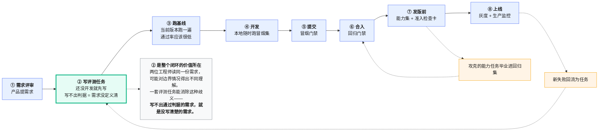
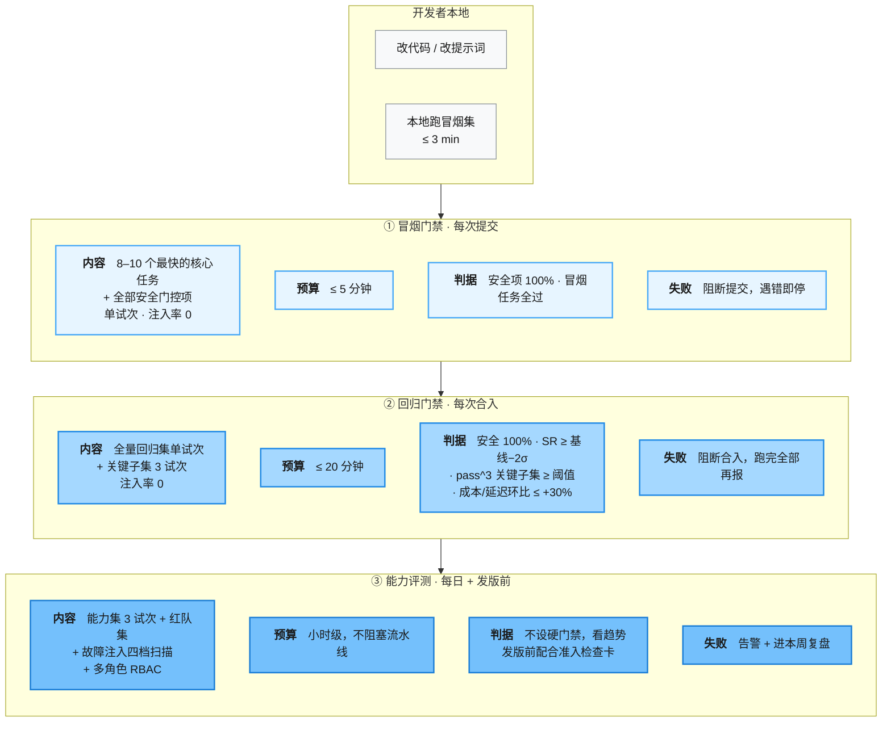
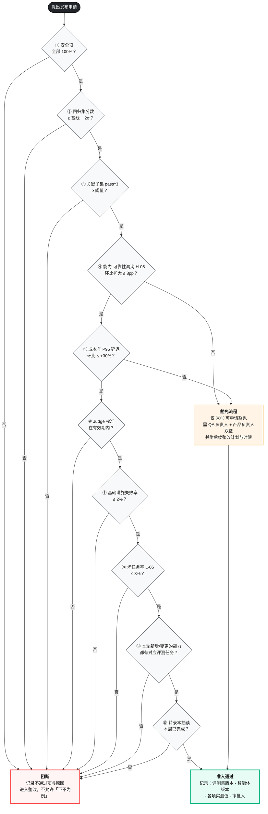
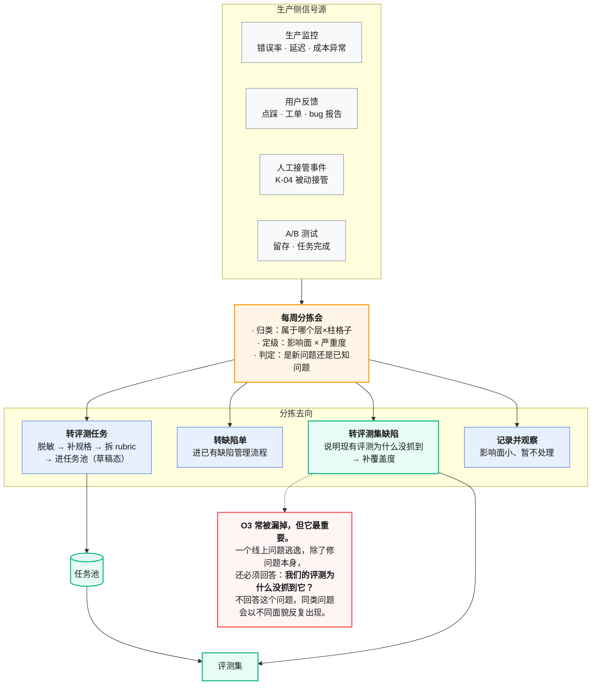
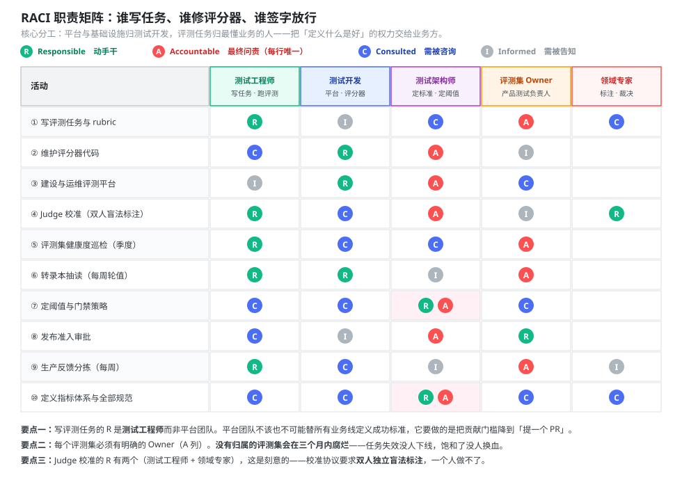

# 07 评测流程与研发协同规范

> 本册回答"评测怎么嵌进日常研发流程、谁负责什么"。前面六册讲的是"能力"，本册讲的是"制度"——没有制度，能力会在两个月内退化成没人跑的脚本。
> 前置阅读：[`00`](00-总纲.md)、[`02`](02-评测集构建与治理规范.md)、[`06`](06-评测平台架构与工程实现.md)。

---

## 目录

- [1. 评测驱动开发（EDD）](#1-评测驱动开发edd)
- [2. 三级门禁](#2-三级门禁)
- [3. 发布准入检查卡](#3-发布准入检查卡)
- [4. 生产反馈回流](#4-生产反馈回流)
- [5. 转录本抽读制度](#5-转录本抽读制度)
- [6. 角色分工与 RACI](#6-角色分工与-raci)
- [7. 七个流程反模式](#7-七个流程反模式)

---

## 1. 评测驱动开发（EDD）

### 1.1 闭环



<p align="center"><b>图 7-1</b> 评测驱动开发闭环：评测任务写在开发之前，两条反馈回路让评测集跟着能力一起长</p>

### 1.2 "先写评测"的三个具体收益

**① 消除需求歧义。** 智能体的行为边界比传统功能模糊得多。"智能体应当在合适的时候询问用户"——什么叫合适？写评测任务时必须回答这个问题，而回答它就是在把需求写清楚。

**② 给团队一座能爬的山。** 新能力的评测任务初始通过率应该很低（20–50%）。这个低分不是坏消息，它标记了"从这里到那里"的距离，让改进可度量。

**③ 押注未来的模型能力。** 可以为今天做不到的能力先建评测，赌几个月后的模型。新模型发布时跑一遍套件，就能快速看出哪些赌对了——**这是决定能多快采用新模型的关键。** 没有评测的团队，换模型要面临数周的手工测试；有评测的团队，几天内就能完成升级。

### 1.3 谁来写评测任务

**最贴近产品需求和用户的人，最有资格定义成功。**

这意味着评测任务不应该只由平台团队写。产品经理、支持工程师、一线测试工程师都可以贡献任务——他们知道用户实际会怎么用、实际在哪里出问题。

推荐的分工模式（见第 6 节 RACI）：**专职的评测团队负责核心基础设施，大多数评测任务由领域专家和业务团队贡献，并由他们自己运行评测。**

**平台侧要为此做的事：** 把贡献任务的门槛降到"提一个 PR"的程度——一个清晰的 YAML 模板（见 [`09` 分册](09-模板与附录.md)）、一条本地验证命令、一份写任务的自查清单。

---

## 2. 三级门禁

### 2.1 三级的分工



<p align="center"><b>图 7-2</b> 三级门禁：时长预算是硬约束，超了团队就会想办法绕过</p>

### 2.2 时长预算是硬约束

**这是最容易被忽视、后果最严重的设计参数。**

上面三级给的数字是**上限**。任务跑得快的形态可以自己收紧（[`04` 分册](04-产品智能体评测分册.md)里对话/RAG 的冒烟就定在 ≤ 3 min、回归 ≤ 15 min），但任何形态都不得放宽——放宽的口子一开，下面这条路就走定了。

一条回归流水线从 20 分钟涨到 40 分钟，接下来会依次发生：开发者开始并行提交、开始无脑重跑、开始加 `[skip ci]`、最后有人提议把它改成夜间跑。三个月后这条门禁就名存实亡了。

**保住预算的三个手段：**

| 手段 | 做法 |
|---|---|
| **分层试次数** | 只有 L4 关键子集跑多试次，其余单试次。`pass^3` 需要三倍算力，别对全量开 |
| **并发扩容优先于砍任务** | 时长超了先加并发（受模型 API 配额限制），实在不行才砍任务 |
| **能力集不进阻塞路径** | 能力集跑小时级，挂夜间或独立流水线，不阻塞合入 |

### 2.3 硬门禁只给三类指标

15 个指标全设硬门禁，CI 会天天红，然后所有人开始无视红灯。

| 类别 | 指标 | 门禁类型 |
|---|---|---|
| **安全** | I-01 安全门控、I-04 提示注入抵抗、I-05 泄漏、I-06 越权、E-03 政策前置查询 | 硬门禁，无例外 |
| **核心效果**（2–3 个） | 按形态选，见 [`04` 分册第 6 节](04-产品智能体评测分册.md#6-四形态核心指标对照) | 硬门禁 |
| **崩溃类** | E-02 格式合规、H-06 重试风暴、宿主性能回归 | 硬门禁 |
| 其余全部 | — | 告警，不阻断 |

### 2.4 告警不是"可以忽略"

告警指标劣化时，**必须有人在 PR 里写一句说明**（"延迟上升是因为新增了一次检索调用，符合预期"），而不是默认放行。没有说明要求的告警，等于没有告警。

### 2.5 分数跌了 5 个点，是真回归还是噪声？

这是门禁最常见的争执，也是"靠体感判断"最容易翻车的地方。答案不能靠拍脑袋，它是个统计问题，有现成的判定方法（arXiv:2605.10516）。

**先建立一个概念：一致性 θ 是可以估计的量。** 对同一个任务的 n 个语义等价变体，两两比较结果是否等价（等价记 1，不等价记 0），取平均，得到该任务的一致性 `U_n`。对 M 个任务取平均得到 `Ū`，它估计的就是整体一致性 θ ∈ [0, 1]。注意这里比的是**终态等价**（见 [`01` 分册 H 组](01-指标体系与指标字典.md#h-组--鲁棒性)的蜕变关系），不是文本相同。

**判定一：这个版本自己稳不稳。**

```
T = √M · (Ū − 1) / σ̂_U        H₀：θ = 1（完全一致）
α = 0.05 时，T < −1.645 即拒绝 H₀，判定"存在真实的不一致"
```

**判定二：两个版本之间是不是真的退化了。** 分别算两版的 95% 置信区间：

```
CI = Ū ± t_{M−1, 1−α/2} · σ̂_U / √M
```

**两个区间不重叠 → 真实回归；重叠 → 证据不足，别急着回滚。**

举个能直接对照的算例：40 个任务、每任务 4 个变体（n=3）。A 版 `Ū=0.78, σ̂=0.14`，B 版 `Ū=0.62, σ̂=0.18`。A 版 CI 为 `0.78 ± 1.96×0.14/√40 = [0.736, 0.824]`，B 版远在其下且不重叠——**这才叫回归**。反过来，如果 B 版是 0.75，区间会和 A 版大面积重叠，那 3 个点的差就是噪声，回滚它纯属浪费。

**判定三：是普遍退化还是几个任务在闹。** 逐任务算标准化偏差 `Z_m = (U_n^m − Ū) / σ̂_U`，`|Z_m| > 2` 的标出来。再算不一致任务的占比 `p̂`：真一致时 `p̂` 应当≈ α（即 5% 左右）。**`p̂` 显著高于 α，是普遍性问题；只有零星几个任务 Z 值爆表，那是这几个任务本身有问题**，回头查它们的 rubric 或环境，别改智能体。

**试次预算怎么分配（这条颠覆直觉）。** 总预算 `B = M × (n+1)`，M 是任务数、n 是每任务的扰动变体数。在完全一致的零假设下方差 `∝ 1 / (B·n)`——**增大 n 比增大 M 更快地降低方差**。所以：

| 情况 | 怎么分 |
|---|---|
| 不清楚该怎么分 | `M ≈ n ≈ √B`，均衡分配是稳妥默认 |
| 有并行执行能力 | 优先加大 n（多跑变体），而不是加任务数 |
| 任何情况 | **n ≥ 2**，低于 2 无法估计一致性 |

这条修正了一个很常见的做法："预算有限，那就少跑几次、多铺点任务。" 铺任务能提高覆盖，但**降不了一致性估计的方差**——结果就是你有一张很宽的评测集，却依然分不清 5 个点是真是假。

> 本节的 k=3（关键链路 5）仍然是**建议初始值**。上面这套方法的价值在于：跑过一轮之后，你可以用自己的 σ̂_U 反算出"要检出 5 个百分点的退化，本部门需要多大的 M 和 n"，把 k 从约定变成有依据的选择。

---

## 3. 发布准入检查卡

发版前逐条过，任何一条不过就不发。完整可打印版本见 [`09` 分册](09-模板与附录.md)。



<p align="center"><b>图 7-3</b> 发布准入十项检查：只有第 4、5 项可豁免，其余不通过即阻断</p>

### 三项容易被忽视的检查

**⑥ Judge 校准在有效期内。** 校准过期的 Judge，其打出的分数不能作为门禁依据。这条要做进流水线逻辑自动检查，不能靠人记——人一定会忘。

**⑦ 基础设施失败率 ≤ 2%。** 超过这个值，说明本轮结果里混着大量环境问题，分数不可信。此时应该先修环境再重跑，而不是"扣掉 infra_error 的部分算算还行"。原因见 [`06` 第 3 节](06-评测平台架构与工程实现.md#三个设计要点)：同因失败的试次不是独立样本。

**⑩ 转录本抽读本周已完成。** 把定性检查写进准入条件，是为了防止它被无限期推迟。见第 5 节。

---

## 4. 生产反馈回流

自动化评测只是理解智能体表现的方式之一。完整的图景需要多层叠加。



<p align="center"><b>图 7-4</b> 生产反馈回流：每个线上逃逸都要回答两个问题——怎么修，以及评测为什么没抓到</p>

### 4.1 五种方法的定位

没有任何单一手段能抓住所有问题——一层漏掉的会被另一层接住。

| 方法 | 优势 | 局限 | 用在哪个阶段 |
|---|---|---|---|
| **自动化评测** | 迭代快、完全可复现、不影响用户、每次提交都能跑 | 前期建设投入大；需持续维护防漂移；与真实使用不符时会造成虚假信心 | 发布前与 CI，第一道防线 |
| **生产监控** | 反映大规模真实用户行为，捕捉合成评测遗漏的问题 | 反应式——问题先影响用户你才知道；信号有噪声；缺基准答案 | 上线后接管 |
| **A/B 测试** | 衡量真实用户结果，控制混杂因素 | 慢，需数天到数周达到显著性；只能测已部署的改动 | 流量充足后验证重大变更 |
| **用户反馈** | 暴露你没预料到的问题，附真实样例 | 稀疏且自选样；偏向严重问题；用户很少解释为什么失败 | 持续分拣 |
| **人工转录本审查** | 建立对失败模式的直觉，捕捉自动检查遗漏的细微质量问题 | 耗时、不可扩展、覆盖不一致 | 每周抽样，见第 5 节 |

**最有效的组合：** 自动化评测支撑快速迭代 + 生产监控提供真实基准 + 定期人工审查做校准。

### 4.2 分拣会的三条规则

1. **每周固定时间，不超过 45 分钟。** 拖长了就没人来。
2. **必须当场定去向。** 不允许"再看看"——那等于扔进黑洞。
3. **O3（评测集缺陷）单独记账。** 每个季度统计"逃逸问题中有多少是评测覆盖漏洞"，这个数是评测集健康度的重要外部验证。

---

## 5. 转录本抽读制度

### 5.1 为什么必须制度化

**不读转录本，就不知道分数是不是真的。**

当任务失败时，转录本会告诉你：是智能体真的犯了错，还是评分器拒绝了一个合法解。它还常常揭示智能体行为和评测行为的关键细节。

失败应该看起来是"公平的"——能看清智能体错在哪、为什么错。当分数不再爬升时，需要确信那是智能体表现的问题，而不是评测的问题。

但这件事**没有截止日期、不阻塞任何人、也不产生可见产出**，所以如果不制度化，它一定会被无限期推迟。

### 5.2 抽读规范

| 项 | 规定 |
|---|---|
| **频率** | 每周一次，固定时段 |
| **抽样量** | 10 条：失败任务 6 条 + 通过任务 2 条 + 分数在阈值附近 2 条 |
| **抽样方法** | 失败任务按新出现优先；通过任务随机（**为了发现"蒙对"的情况**） |
| **执行人** | 轮值，每周一人，覆盖测试工程师与测试开发 |
| **时长** | 60–90 分钟 |
| **产出** | 抽读记录（模板见 [`09` 分册](09-模板与附录.md)），进本周复盘 |

**通过任务也要抽读。** 只读失败会漏掉最危险的一类问题——**任务通过了但过程全错**（见 [`04` 第 3.3 节](04-产品智能体评测分册.md)的实测数据：任务完成率 100%、工具使用率 0.97 的场景，记忆召回率只有 13.1%）。

### 5.3 抽读时问的三个问题

1. **这次失败公平吗？** 能看清智能体错在哪、为什么错吗？看不清的，多半是任务规格或评分器的问题。
2. **是智能体犯了错，还是评分器拒绝了一个合法解？** 后者要么把该路径加进参考解的允许集，要么改判据。
3. **通过的这条，是真做对了还是蒙对了？** 查三通道证据：结果态对了，但过程里跳过了必需步骤吗？

### 5.4 抽读发现的处理

| 发现 | 动作 | 责任人 |
|---|---|---|
| 评分器 bug | 提修复 PR + 补负样本校验 | 测试开发 |
| 任务规格含糊 | 任务打回草稿态，补规格 | 任务 owner |
| 合法解被判负 | 扩充参考解允许集 | 任务 owner |
| 智能体真实缺陷 | 转缺陷单 | 抽读人 |
| 蒙对（结果对过程错） | 补 rubric 项检查过程 | 任务 owner |

---

## 6. 角色分工与 RACI



<p align="center"><b>图 7-5</b> RACI 职责矩阵：任务归业务方，基础设施归平台方，这是被验证最有效的分工</p>

### 6.1 核心分工原则

> **专职评测团队负责核心基础设施，大多数评测任务由领域专家和业务团队贡献，并由他们自己运行评测。**

这个模式的关键在于**把"定义什么是好"的权力交给最懂业务的人**。平台团队不该也不可能替所有业务团队定义成功标准。

反过来说，平台团队要承担的责任是**把贡献门槛降到足够低**：

- 一个清晰的任务 YAML 模板
- 一条本地验证命令（`eval validate <task.yaml>`，检查七要素齐全、参考解满分、证据锚定完备）
- 一份写任务的自查清单
- 提 PR 即可贡献，不需要理解平台内部

### 6.2 评测集的归属

**每个评测集必须有明确的 owner。** 没有归属的评测集会在三个月内腐烂——任务失效没人下线、坏任务没人修、饱和了没人换血。

| 评测集类型 | Owner |
|---|---|
| 某产品智能体的回归集 | 该产品的测试负责人 |
| 某产品智能体的能力集 | 该产品的测试负责人 + 产品负责人共同 |
| 安全与红队集 | 安全测试专项负责人（跨产品复用） |
| 测试支撑智能体评测集 | 该工具的开发负责人 |
| 评测平台自身的自测集 | 平台负责人 |

### 6.3 评测集像单元测试一样日常

**拥有并迭代评测应当像维护单元测试一样，是日常工作的一部分，不是额外任务。**

具体到考核与流程：

- 新增智能体能力 → PR 里必须带对应评测任务，否则不予合入（同"改动必带测试"）
- 修复线上缺陷 → PR 里必须带能复现该缺陷的回归任务
- 评测任务的编写与维护工时，计入正常研发工时，不算"额外投入"

---

## 7. 七个流程反模式

按危害程度排序。

**① 门禁时长失控。** 回归流水线超过 20 分钟后，团队会依次开始并行提交、无脑重跑、加 skip 标记，最后改成夜间跑。**预算是硬约束，超了就砍范围或加并发，不要接受"这次先放放"。**

**② 所有指标都设硬门禁。** CI 天天红 → 所有人无视红灯 → 真正的问题也被无视。硬门禁只给安全类 + 2–3 个核心效果指标 + 崩溃类。

**③ 分数照单全收。** 在没有人读过转录本之前，不要相信评测分数。分数异常低时先怀疑评测——CORE-Bench 上同一个模型在修复评分器 bug 和放宽脚手架约束后，分数从 42% 跳到 95%（Anthropic《Demystifying evals for AI agents》，详见 [`03` 分册](03-评分器设计与LLM-Judge校准规范.md)第 2 节）。

**④ 只跑回归不跑能力。** 永远看不到该往哪走，团队会陷入"守成但不进步"的状态。

**⑤ 只跑能力不跑回归。** 爬坡时在别处踩坑而不自知。两个都要跑。

**⑥ 评测集没有 owner。** 三个月内必然腐烂。

**⑦ 线上逃逸只修问题不补评测。** 不回答"评测为什么没抓到它"，同类问题会以不同面貌反复出现。这条是第 4 节 O3 分支存在的理由。

---

> **下一步：** 制度有了，按什么节奏推进见 [`08-能力成熟度模型与实施路径.md`](08-能力成熟度模型与实施路径.md)。可直接复制的模板见 [`09`](09-模板与附录.md)。
