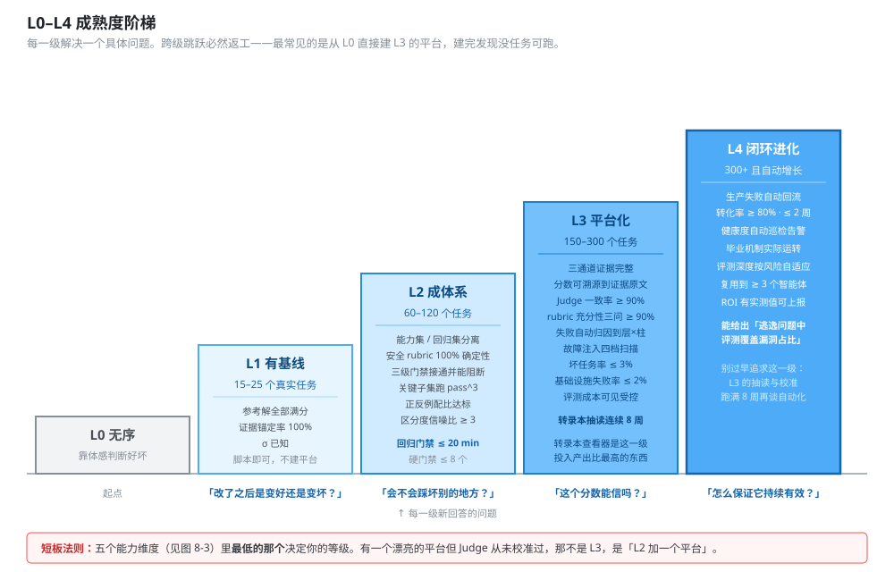
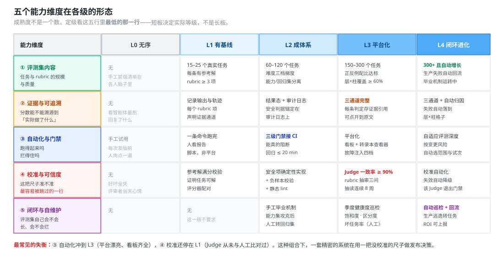
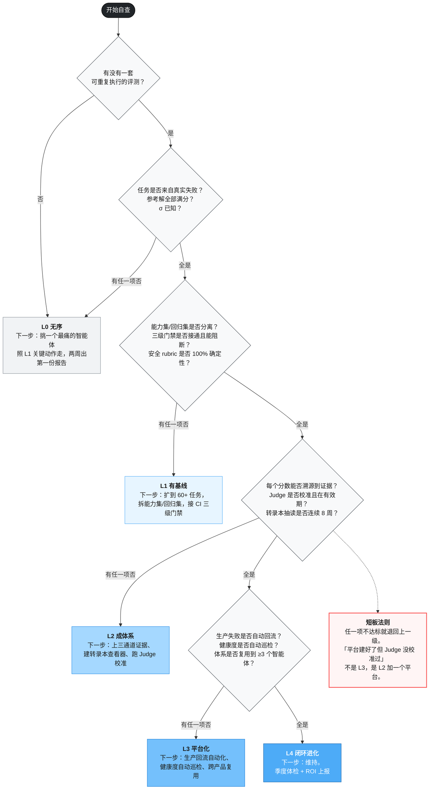
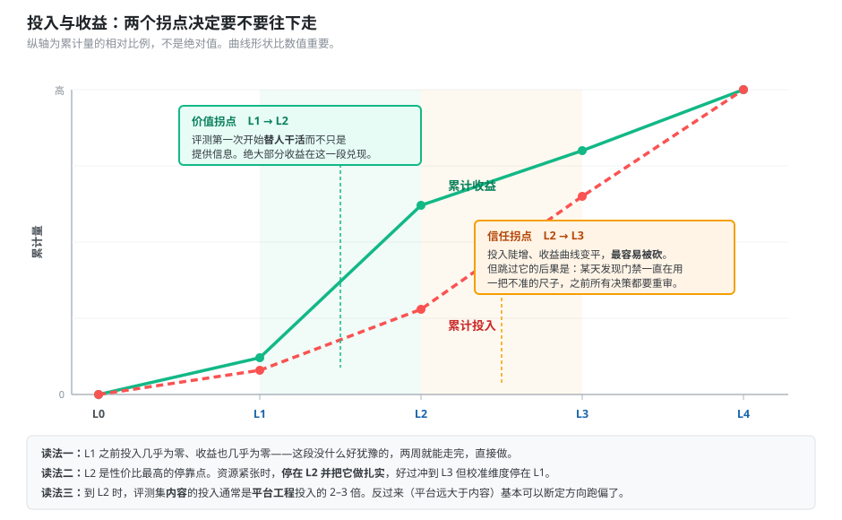
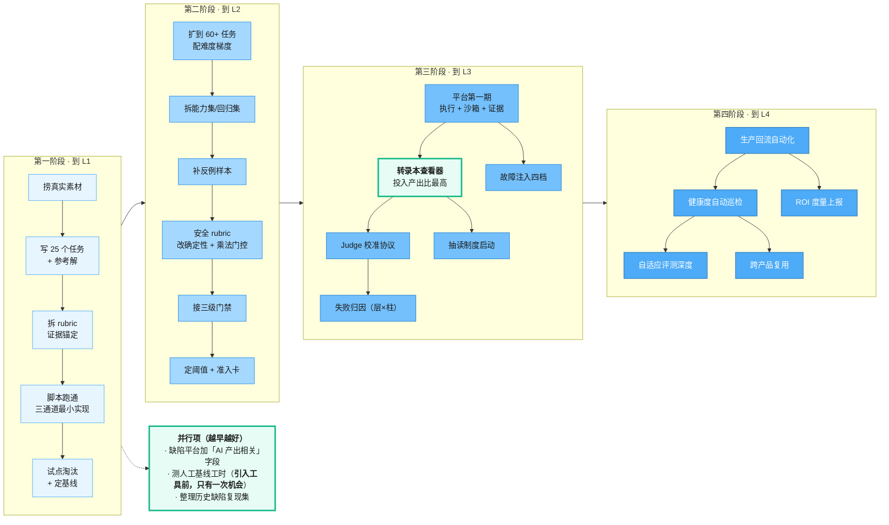

# 08 能力成熟度模型与实施路径

> 本册面向架构师和管理者。不给日历表，给分级模型——每一级的能力特征、准入条件、**可量化验收标准**、典型产出物和常见踩坑。部门按自己的资源排期。
> 前置阅读：[`00-总纲.md`](00-总纲.md)。各级涉及的具体做法散在 `01`–`07` 各册，本册给索引。

---

## 目录

- [1. 为什么不给时间表](#1-为什么不给时间表)
- [2. L0–L4 总览](#2-l0l4-总览)
- [3. 五个能力维度](#3-五个能力维度)
- [4. 各级详述](#4-各级详述)
- [5. 定级自查](#5-定级自查)
- [6. 投入与收益](#6-投入与收益)
- [7. 建设路径与依赖](#7-建设路径与依赖)

---

## 1. 为什么不给时间表

给"6 个月分三期"这种计划，看起来清晰，实际会出两个问题：

**第一，它假设了资源投入。** 3 个人全职和 3 个人各投入 20%，进度差 5 倍。写死时间表等于隐含承诺了资源，而资源不是评测团队能决定的。

**第二，它掩盖了真正的约束。** 从 L1 到 L2 的瓶颈是**评测集内容**（写任务、拆 rubric、建金标准），不是工程量。这部分工作没法靠加人线性加速——它需要领域知识和反复打磨。

所以本册给的是**分级 + 准入条件 + 可量化验收**。到没到一级，看验收标准而不是看日历。

> **关于本册各级"可量化验收"表里的数值。** 只有两项有实测参照：L-01 Judge 与人工完全一致率，实测为 96% / 95% / 94%、总体 95%（arXiv:2604.06132 附录 F.3），本体系取 ≥ 90% 作为门禁下限，留 5 个百分点余量；L-02 标注者一致性 r_WG，实测 0.70–0.91、均值 0.83（Nature 652, 2026），本体系取 ≥ 0.7。其余数值均为**建议初始值，需按本部门数据校准**。定级的意义在于"这一维度是否已经成体系"，不在于卡死某个具体数字。

---

## 2. L0–L4 总览

<b>图 8-1</b> L0–L4 成熟度阶梯：每一级解决一个具体问题，跨级跳跃必然返工

| 级 | 一句话 | 解决的问题 | 典型规模 |
|---|---|---|---|
| **L0 无序** | 靠体感判断好坏 | — | — |
| **L1 有基线** | 有了可重复的数字 | "改了之后是变好还是变坏？"能回答了 | 15–25 个任务 |
| **L2 成体系** | 能挡住回归 | "会不会踩坏别的地方？"能回答了 | 60–120 个任务 |
| **L3 平台化** | 分数变得可信 | "这个分数能信吗？"能回答了 | 150–300 个任务 |
| **L4 闭环进化** | 体系自己会长 | "怎么保证它持续有效？"能回答了 | 300+ 且自动增长 |

**跨级跳跃必然返工。** 最常见的错误是从 L0 直接建 L3 的平台——三个月后平台建好了，但没有任务可跑，也不知道该测什么。评测集的内容和平台的能力必须交替生长。

---

## 3. 五个能力维度

成熟度不是一个数，它是五个维度的综合。

<b>图 8-3</b> 五个能力维度在各级的形态：短板决定实际等级，不是长板

**定级用短板法则：** 五个维度里最低的那个决定你的等级。有一个漂亮的平台但 Judge 从未校准过，那不是 L3，是"L2 加一个平台"。

---

## 4. 各级详述

### L0 · 无序

**能力特征**

- 判断智能体好坏靠人工试用和直觉
- 改一版提示词，只能靠"感觉好像好点了"
- 分不清真实回归和随机波动
- 用户反馈"最近变差了"，团队无从查起
- 换基座模型要面临数周的手工验证

**这一级没有准入条件，所有人都从这里开始。** 但要认识到它的代价：调试是反应式的——等投诉、手动复现、修 bug、祈祷没引入别的问题。

**下一步：** 挑一个当前最痛的智能体。**建议从测试支撑智能体里选**（风险低、反馈快、金标准现成），照 L1 的动作走。

---

### L1 · 有基线

**能力特征**

- 有第一批来自**真实失败**的评测任务
- 能跑出可重复的分数，知道试次间波动有多大
- 改动前后能对比，"变好还是变坏"有据可依

**准入条件**

- [ ] 确定了被测对象，且有明确的负责人
- [ ] 能拿到该智能体的真实失败案例（生产日志 / 缺陷库 / 冒烟清单）

**关键动作**（详见 [`02` 第 10 节](02-评测集构建与治理规范.md#10-冷启动两周攒出第一版评测集)）

1. 捞 50 条真实素材（问同事"发版前你会手动验哪几件事"是最快的路子）
2. 转 25 条正式任务，补齐七要素，**每条写参考解**
3. 拆 rubric，每项声明证据通道
4. 脚本跑通（**不要建平台**）
5. 试点淘汰 20–30% 的坏任务
6. 跑 3 轮定基线，记录均值与 σ

**可量化验收**

| 项 | 标准 |
|---|---|
| 有效任务数 | ≥ 15（试点淘汰后） |
| 每任务 rubric 项 | ≥ 3 项 |
| 证据锚定率 L-08 | 100% |
| 参考解满分校验 | 全部通过 |
| 基线轮次 | ≥ 3 轮，σ 已知 |
| 报告 | 至少一份，含分数、σ、失败清单 |

**典型产出物**：评测集 v0.1（git 仓库）、执行脚本、基线报告

**三个常见踩坑**

| 坑 | 后果 | 对策 |
|---|---|---|
| 一上来建平台 | 三个月后平台建好，没任务可跑 | 脚本能撑到 30–50 任务、3–5 人用 |
| 任务全是编的 | 测的是编写者的想象，不是真实使用 | 优先级：生产失败 > 缺陷库 > 冒烟清单 > 编的 |
| 不写参考解 | 不知道任务是否可解、评分器是否配对 | 参考解满分是硬性检查，进 CI |

---

### L2 · 成体系

**能力特征**

- 能力集与回归集分离，各司其职
- 混合评分（确定性 + Judge），安全项全部确定性实现
- 关键子集跑多试次，`pass^k` 可见
- 三级门禁接通 CI，能真的阻断
- 双向能力的正反例配比达标

**准入条件**

- [ ] L1 全部验收项达成
- [ ] 有 CI/CD 流水线可挂接（你们已有）
- [ ] 有大模型 API 配额支持多试次（你们已有）

**关键动作**

1. 任务扩到 60+，按 [`02` 第 4 节](02-评测集构建与治理规范.md#4-难度分级与分布)配难度梯度（简单 40% / 中等 35% / 困难 25%）
2. 拆分能力集与回归集，建立毕业机制
3. 补反例样本（调用决策 ≥30%、拒答边界 ≥50%、主动澄清 ≥40%）
4. 安全 rubric 全部改成确定性检查，装配乘法门控
5. 接三级门禁，**守住时长预算**（冒烟 ≤5min、回归 ≤20min）
6. 按 [`01` 第 10 节](01-指标体系与指标字典.md#10-阈值怎么定)三步定阈法设初始阈值
7. 编写发布准入检查卡

**可量化验收**

| 项 | 标准 |
|---|---|
| 任务数 | ≥ 60 |
| 层×柱矩阵覆盖 | ≥ 60% 的格子有任务（或已确认不适用） |
| 难度分布 | 三档分数单调退化 |
| 回归集 SR | ≥ 95% |
| 能力集初始通过率 | 20–50% |
| 安全 rubric 实现方式 | 100% 确定性 |
| 三级门禁 | 全部接通，回归门禁 ≤ 20 min |
| 关键子集 | 跑 pass^3 |
| 反例占比 | 各双向能力达标 |
| L-05 区分度信噪比 | ≥ 3 |
| 硬门禁指标数 | ≤ 8 个（安全类 + 2–3 核心 + 崩溃类） |

**典型产出物**：评测集 v1.0、CI 门禁配置、发布准入检查卡、阈值基线表

**四个常见踩坑**

| 坑 | 后果 | 对策 |
|---|---|---|
| 所有指标设硬门禁 | CI 天天红 → 全员无视红灯 | 硬门禁 ≤ 8 个，其余设告警但要求 PR 里写说明 |
| 门禁时长失控 | 团队开始加 skip、改夜间跑，门禁名存实亡 | 时长是硬约束，超了先加并发再砍范围 |
| 只跑回归不跑能力 | 守成但不进步，看不到该往哪走 | 两个都跑，能力集不阻塞流水线 |
| 单边取样 | 优化出一个"见啥都触发"或"啥都不触发"的智能体 | 见 [`02` 第 5 节](02-评测集构建与治理规范.md#5-正反例均衡)，反例占比进验收 |

---

### L3 · 平台化

**能力特征**

- 三通道证据完整，每个分数都能溯源到原始证据
- Judge 经过校准且校准有效期受控
- 失败能自动归因到层×柱格子
- 转录本抽读制度化运转
- 故障注入可做四档扫描
- 评测执行成本可见且受控

**准入条件**

- [ ] L2 全部验收项达成
- [ ] 评测平台第一期完成（见 [`06` 第 9 节](06-评测平台架构与工程实现.md#9-分期建设)）
- [ ] 有可投入的人工标注/专家评审人力（你们已有）

**关键动作**

1. 三通道证据全面落地，`RUBRIC_RESULT` 存证据引用
2. 建转录本查看器（**这一期投入产出比最高的东西**）
3. 跑通 Judge 校准协议，建立校准记录库与有效期机制
4. 失败归因按层×柱矩阵自动分类
5. 启动转录本抽读制度（每周轮值）
6. 上故障注入代理，做四档扫描
7. 建评测成本看板

**可量化验收**

| 项 | 标准 |
|---|---|
| 三通道证据覆盖 | 每个 rubric 判定都有 `evidence_ref` 可溯源 |
| L-01 Judge 完全一致率 | ≥ 90%，且校准记录在有效期内 |
| L-02 标注者间一致性 | `r_WG` ≥ 0.7 |
| L-03 rubric 充分性三问 | 各 ≥ 90% |
| 转录本抽读 | 连续 ≥ 8 周执行，有记录 |
| 失败归因 | 能自动落到层×柱格子 |
| 故障注入 | 0/0.2/0.4/0.6 四档可扫描 |
| 基础设施失败率 | ≤ 2% |
| L-06 坏任务率 | ≤ 3% |
| J-08 评测执行成本 | 可见、有配额、有告警 |

**典型产出物**：评测平台、Judge 校准记录库、季度体检报告、成本看板

**四个常见踩坑**

| 坑 | 后果 | 对策 |
|---|---|---|
| 建了平台不读转录本 | 分数看起来很专业，但没人知道准不准 | 抽读进准入检查卡第 ⑩ 项 |
| Judge 未校准就上门禁 | 用一把没校准的尺子做发布决策 | 校准过期 → 该 Judge 的 rubric 项自动降级为参考数据 |
| Agent-as-Judge 挂进 CI | 62 倍耗时，流水线不可用 | 只用于发版前深度审计 |
| 只看总分不看分组 | 掩盖关键短板 | 报告强制给按难度、按标签、按支柱的分解 |

---

### L4 · 闭环进化

**能力特征**

- 生产失败自动回流为评测任务
- 评测集健康度自动巡检，饱和自动预警
- 评测深度按变更风险自适应
- 体系可复用到多个智能体，形成部门级资产
- ROI 可量化上报

**准入条件**

- [ ] L3 全部验收项达成
- [ ] 至少一个智能体已在生产运行 ≥ 3 个月，有稳定的线上信号
- [ ] 生产监控与用户反馈埋点已就位（见 [`05` 第 6.3 节](05-测试支撑智能体评测分册.md#63-埋点位置)）

**关键动作**

1. 生产反馈回流自动化：线上失败 → 候选任务 → 人工确认 → 入库
2. 健康度巡检自动化（L-04/L-05/L-06/L-08）
3. 能力集毕业机制实际运转
4. 自适应评测深度：按变更类型自动选范围与试次数
5. 体系跨产品复用，沉淀通用组件（安全 rubric 库、红队集、Mock 服务模板）
6. ROI 度量上报（测试支撑智能体的 K-05/K-08）

**可量化验收**

| 项 | 标准 |
|---|---|
| 生产逃逸转评测任务率 | ≥ 80%，转化时长 ≤ 2 周 |
| 健康度指标自动化 | L-04/L-05/L-06/L-08 自动计算 + 告警 |
| 毕业机制 | 有实际毕业记录，能力集换过血 |
| 自适应深度 | 按变更类型自动选评测范围，有配置与生效记录 |
| 复用范围 | ≥ 3 个智能体使用同一套体系 |
| ROI 数据 | 测试支撑智能体的 K-05 净节省工时、K-08 质量净收益有实测值 |
| 逃逸归因 | 每季度能给出"逃逸问题中评测覆盖漏洞占比" |

**典型产出物**：自转的评测体系、部门级基准与通用组件库、季度 ROI 报告

**两个常见踩坑**

| 坑 | 后果 | 对策 |
|---|---|---|
| 过早追求 L4 | 自动化了一个还没验证有效的流程 | L3 的抽读和校准跑满 8 周再谈自动化 |
| 把公开基准当部门基准 | 分布不同、已被污染，结论误导 | 公开基准只用于模型选型参考 |

---

## 5. 定级自查

<b>图 8-2</b> 定级自查：任一项不达标即退回上一级，用短板定级不用长板

---

## 6. 投入与收益

<b>图 8-4</b> 投入与收益：L1→L2 是价值拐点，L2→L3 是信任拐点

### 6.1 两个拐点

**L1→L2 是价值拐点。** L1 只能回答"这次改动好不好"，L2 能挡住回归，评测第一次开始**替人干活**而不只是提供信息。绝大部分收益在这一段兑现。

**L2→L3 是信任拐点。** L2 的分数好看，但没人知道准不准。L3 通过三通道证据和 Judge 校准让分数变得**可以拿去做决策**。这一段投入大、收益不直观，但跳过它的后果是：某一天发现门禁一直在用一把不准的尺子，之前所有决策都要重新审视。

### 6.2 资源估算方法

不给绝对人力数，给估算公式（按你们自己的实际参数代入）：

| 工作项 | 估算方法 |
|---|---|
| **写一个任务**（含 rubric、参考解、夹具） | 简单 0.5–1 h / 中等 1.5–3 h / 困难 3–6 h |
| **写一个确定性评分器** | 复用已有类型 0.5 h / 新类型 4–8 h |
| **写一个 Judge**（含提示词 + 首次校准） | 8–16 h |
| **一次 Judge 校准**（100 项 × 2 人 + 裁决） | 6–10 人时 |
| **一次季度健康度巡检** | 自动部分 0.5 h / 人工抽审 8–16 人时 |
| **每周转录本抽读** | 1.5 h × 1 人 |
| **平台第一期** | 参照内部同规模服务的建设量估 |

**一条经验：** 到 L2 时，**评测集内容的投入通常是平台工程投入的 2–3 倍**。这个比例是健康的。如果反过来（平台投入远大于内容投入），基本可以断定方向跑偏了。

### 6.3 算力成本

| 级 | 主要算力开销 | 控制手段 |
|---|---|---|
| L1 | 可忽略 | — |
| L2 | 回归门禁每次合入跑一遍 + 关键子集 3 试次 | 分层试次数；冒烟集限 8–10 任务 |
| L3 | 加 Judge 调用 + 故障注入四档扫描 | Judge 单维度短提示词并行；四档扫描只在发版前跑 |
| L4 | 加自适应深度带来的动态开销 | 按变更风险选深度，低风险变更省下大部分算力 |

参考量级：LLM-as-Judge 的开销约为被测任务本身的同量级；Agent-as-Judge 约为 15 倍。这个差距决定了后者只能用于发版前审计。

---

## 7. 建设路径与依赖

<b>图 8-5</b> 四阶段建设路径与三个并行项：并行项拖得越久损失越大

### 三个并行项要尽早启动

**① 缺陷平台加「AI 产出相关」字段。** 这是 `K-06 缺陷逃逸` 和 `K-08 质量净收益` 的数据基础。归因规则必须**事先写死并让相关方认可**——事后定规则一定吵架。

**② 测人工基线工时。** **这个窗口只有一次。** 工具一旦引入，就再也测不到干净的人工基线了，ROI 只能靠事后估算，而事后估算不可信（人会记住最费劲的那次，倾向高估基线）。

**③ 整理历史缺陷复现集。** 用例生成智能体的杀手锏指标 `TC-07` 靠它。这项工作量中等，但说服力最强——"我们的用例生成智能体能覆盖 68% 的历史线上缺陷"比任何覆盖率数字都有力。

---

> **下一步：** 可直接复制使用的模板见 [`09-模板与附录.md`](09-模板与附录.md)。
