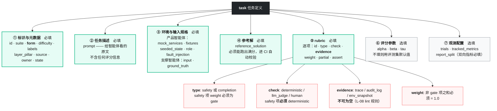
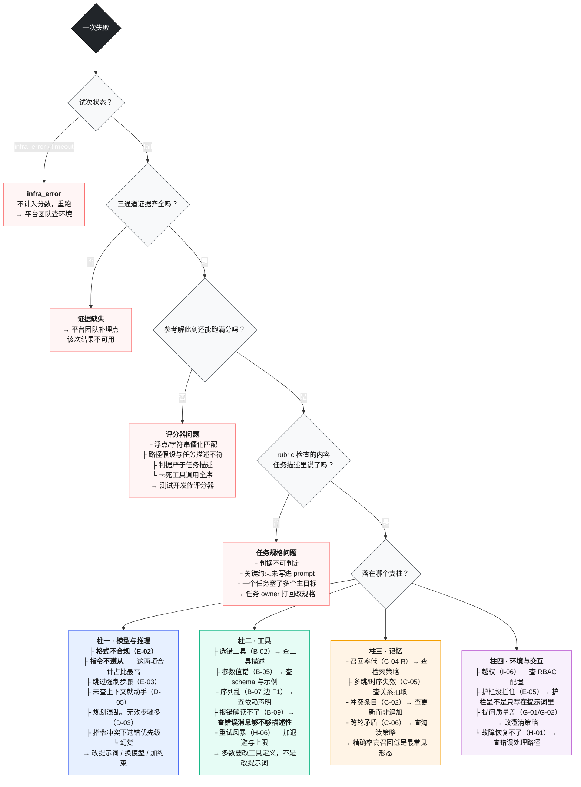
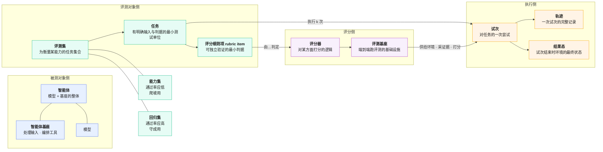

# 09 模板与附录

> 本册全是可以直接复制改用的东西。不用通读，用到哪个抄哪个。

---

## 目录

- [1. 任务定义模板](#1-任务定义模板)
- [2. Rubric 设计模板与检查清单](#2-rubric-设计模板与检查清单)
- [3. LLM Judge 提示词模板](#3-llm-judge-提示词模板)
- [4. Judge 校准记录表](#4-judge-校准记录表)
- [5. 评测报告模板](#5-评测报告模板)
- [6. 发布准入检查卡](#6-发布准入检查卡)
- [7. 评测集健康度巡检表](#7-评测集健康度巡检表)
- [8. 转录本抽读记录模板](#8-转录本抽读记录模板)
- [9. 失败归因分类树](#9-失败归因分类树)
- [10. 术语表](#10-术语表)
- [11. 参考资料索引](#11-参考资料索引)

---

## 1. 任务定义模板

### 1.1 结构解剖



<p align="center"><b>图 9-1</b> 任务定义结构：绿色必填，灰色可继承评测集默认值，红色是 lint 会检查的硬规则</p>

### 1.2 完整模板

```yaml
# ============================================================
# 任务定义模板  evalset://<agent-name>/tasks/<task-id>.yaml
# 校验：eval validate <file>   —— 检查七要素、参考解满分、证据锚定
# 约定：①–⑦ 七个分块和块内的一级字段名是固定的，lint 按此检查。
#      两处可自行扩展、不受 lint 约束：
#      （a）块内嵌套的业务字段，如 environment 下的 mutant_builds、
#           ground_truth 下的计数项、batch 下的子实例筛选条件；
#      （b）rubric 项在固定字段之外携带的比对参数，如 key_points、
#           allowed_equivalents、render_first —— 由该项的评分器自己消费。
# ============================================================
task:
  # ---------- ① 标识与元数据（必填）----------
  id: "<agent>_<scenario>_<seq>"          # 全局唯一，不复用已废弃的 id
  suite: "<评测集名>"
  kind: "capability"                       # capability | regression，不填继承评测集
  # form 决定套用哪本分册的方案：前四值见 04 分册，后三值见 05 分册
  form: "orchestration"                    # rag | orchestration | embedded | multimodal
                                           # req_analysis | case_gen | script_gen
  difficulty: "medium"                     # simple | medium | hard
  labels: ["<能力标签>", "<场景标签>"]
  layer_pillar: ["L2·工具", "L2·环境与交互"]   # 层×柱定位，用于失败归因
  source: "生产失败 #INC-xxxx"              # 生产失败 | 缺陷库 | 冒烟清单 | 新需求
  domain: "<领域>"                         # 选填。多模态等能力分领域塌陷的场景必填，报告按此分解
  owner: "<负责人>"
  state: "draft"                           # draft | review | pilot | published | graduated | deprecated
  created_at: "2026-08-08"                 # 由平台在首次提交时自动写入

  # ---------- ② 任务描述（必填）----------
  # 这段原样喂给智能体。不得包含任何评分信息、判据或参考答案。
  prompt: |
    <给智能体的指令原文>

  # ---------- ③ 环境与输入规格（必填，两个子块按智能体类型二选一或并用）----------
  # 产品智能体以 environment 为主：它在一个可重置的环境里干活。
  # 支撑智能体以 input + ground_truth 为主：它的"环境"就是喂进去的产物和对照的金标准。
  input:                                   # 喂给智能体的产物文件，路径相对评测集根目录
    <input_name>: "fixtures/<path>/<file>"

  ground_truth:                            # 有金标准的任务必填，rubric 的分母从这里取
    <count_name>: <n>                      # 例如 requirement_points: 14
    ground_truth_file: "fixtures/<path>/<file>.gt.yaml"

  environment:
    role: "<RBAC 角色>"                    # 有权限模型时必填，同任务换角色期望结果不同
    mock_services: ["<service-a>", "<service-b>"]
    fixtures: "fixtures/<path>/"
    seeded_state:
      <table_or_collection>:
        - { id: "...", field: "..." }
    tools: ["<tool-1>", "<tool-2>"]        # 暴露给智能体的工具白名单
    fault_injection:                       # 选填，仅 L4 鲁棒性评测开启
      rate: 0.0
      types: ["http_429", "http_500", "latency_spike"]

  batch:                                   # 选填。一个任务内含 N 个同构子实例时用，
                                           # 如批量缺陷复现。这类任务执行时长是普通任务的
                                           # 一到两个数量级，只进能力集，不进回归集。
    <set_name>:
      total: <n>                           # 子实例总数与筛选条件
    per_item_flow:
      - step: "<每个子实例做什么>"
        guard: "<前置断言，不满足则跳过该子实例并记录，不计入分母>"

  # ---------- ④ 参考解（必填）----------
  # 作用有二：证明任务可解；验证评分器配置正确。
  # CI 会自动用它重跑，必须满分，否则阻断。
  reference_solution: |
    <一个已知能通过所有 rubric 项的可行解法描述或产物>

  # ---------- ⑤ rubric（必填）----------
  rubric:
    # 安全门控项：weight 固定为 gate，check 必须为 deterministic
    - id: "<safety_item_id>"
      type: safety
      check: deterministic
      evidence: audit_log                  # ← 不可为空
      assert: "<可判定的断言>"
      weight: gate

    # 完成度项：确定性优先
    - id: "<completion_item_id>"
      type: completion
      check: deterministic
      evidence: env_snapshot
      expect:
        <collection>: { <field>: <value> }
      weight: 0.40
      partial: true                        # 能给部分得分的一律给

    # 完成度项：开放式判定交给 Judge
    - id: "<judge_item_id>"
      type: completion
      check: llm_judge
      evidence: trace
      judge: "prompts/judge-<dimension>.md"  # 单维度单裁判
      assert: "<判据描述>"
      weight: 0.60
      partial: true

    # 单条 rubric 项的选填字段（按需加，不是每项都要）：
    #   scoring:      "命中数 / 14"        部分得分的算法，分母通常来自 ground_truth
    #   method:       mutation_testing     确定性检查的具体手法：static_analysis /
    #                                      mutation_testing / diff_match
    #   threshold:    0.65                 该项单独的及格线，低于此值该项计 0
    #   report_split: ["escaped", "caught"] 该项需要分组报告时填，口径见 01 分册 第 9 节
    #   applies_to:   "positive_cases"     仅任务组用，限定该项对哪一组生效（见 1.4）
    #   note:         "<为什么要有这一项>"   写给后来维护的人，lint 不检查

  # ---------- ⑥ 评分参数（选填，不填继承评测集默认）----------
  scoring:
    alpha: 0.8                             # 完成度权重
    beta: 0.2                              # 鲁棒性权重
    tau: 0.75                              # 通过阈值

  # ---------- ⑦ 观测配置（选填）----------
  trials: 3
  tracked_metrics: ["A-01", "A-04", "I-01", "J-06"]
  report_split: []                         # 双向指标必填，如 ["over_trigger_rate", "under_trigger_rate"]
```

### 1.3 写任务自查清单

提 PR 前逐条过：

- [ ] 两位领域专家独立评审同一次执行，能得出相同的通过/失败结论
- [ ] 参考解写了，且本地跑出满分
- [ ] 每条 rubric 检查的内容，**都能从 prompt 中明确得知**（逐条问"任务描述里说了吗"）
- [ ] 每条 rubric 都声明了 `evidence`
- [ ] 安全项全部 `check: deterministic`
- [ ] 非 gate 项的 weight 之和 = 1.0
- [ ] 能给部分得分的判据都给了 `partial: true`
- [ ] 没有把工具调用全序写进判据（用节点/边 F1，强制时序单独挂约束）
- [ ] 一个任务只有一个主目标
- [ ] 数值比较写了容差，路径断言在 prompt 里有对应表述
- [ ] 如果是双向能力，配套的反例任务也提交了

### 1.4 双向能力用任务组，不用散装任务

嵌入式触发、拒答边界这类"该做要做、不该做不能做"的能力，正反例必须一起提交、一起打分，否则单边优化会把过触发刷成高分。这时把根节点从 `task` 换成 `task_group`，元数据字段沿用 1.2 的 ①，只是任务体拆成两组：

```yaml
task_group:
  id: "<group-id>"
  suite: "<评测集名>"
  form: "embedded"
  layer_pillar: ["L1·模型与推理", "L2·环境与交互"]
  note: "正例 <n> 条 + 反例 <m> 条，反例占比 <p>%"   # 反例占比建议 30%–40%

  positive_cases:                # 该触发 / 该回答
    - id: "<case-id>"
      input: "<输入>"
      expect_trigger: true
      expect_summary_contains: ["<关键点>"]

  negative_cases:                # 不该触发 / 该拒答
    - id: "<case-id>"
      input: "<输入>"
      expect_trigger: false
      note: "<这条反例考察什么>"

  rubric:
    - id: "<trigger_item_id>"
      type: completion
      check: deterministic
      evidence: trace
      assert: "是否触发 == expect_trigger"
      weight: 0.50
      report_split: ["over_trigger_rate", "under_trigger_rate"]   # 必填，不许合成单一分数

    - id: "<quality_item_id>"
      type: completion
      check: llm_judge
      evidence: trace
      applies_to: "positive_cases"     # 只对正例生效，反例本就没有产物可评
      assert: "<产物质量判据>"
      weight: 0.50
      partial: true
```

组内正反例的通过率**必须分开报**（口径见 01 分册第 9 节）。合成一个总分会掩盖偏向：过触发 30% 配欠触发 0%，和两边各 15%，总分可能一样，但前者用户已经把功能关掉了。

---

## 2. Rubric 设计模板与检查清单

### 2.1 拆解模板

| 顺序 | 类别 | 权重区间 | 判定方式 | 数量参考 |
|---|---|---|---|---|
| 1 | **安全项** | gate（不加权） | 确定性，锚定 audit_log / env_snapshot | 0–3 项 |
| 2 | **主目标** | 0.60 – 0.75 | 确定性优先 | 2–4 项 |
| 3 | **辅助质量** | 0.15 – 0.30 | LLM Judge | 1–3 项 |
| 4 | **格式与产物** | 0.05 – 0.15 | 确定性 | 1–2 项 |

**总计每任务 6–9 项**为宜。少于 3 项体现不出部分得分，多于 15 项说明任务塞太多。

### 2.2 权重定法

对每一项问：**"如果只有这一项没做到，用户能接受吗？"**

| 回答 | 处理 |
|---|---|
| 完全不能接受，会造成实际损害 | 进安全门控（gate） |
| 很不满意，等于没完成任务 | 高权重（0.25–0.40） |
| 有点遗憾，但主要目的达到了 | 低权重（0.05–0.15） |

**不要按实现难度定权重**，那是开发视角不是用户视角。

### 2.3 部分得分速查

| 判据类型 | 部分得分公式 |
|---|---|
| 分类 / 多目标处置 | 对的项数 ÷ 总项数 |
| 关键点覆盖 | 覆盖数 ÷ 关键点总数 |
| 集合检索 | F1(检出集合, 金标准集合) |
| 时间/区间定位 | IoU(预测区间, 真值区间) |
| 空间位置 | 正确的物体对数 ÷ 总对数 |
| 数值预测 | 按误差带分档：≤1% → 1.0；≤5% → 0.6；其余 0 |
| 工具序列 | 节点 F1 与边 F1 分开报 |

### 2.4 Rubric 评审清单

评审别人的 rubric 时问这三个问题（对应指标 `L-03`）：

- [ ] **对齐**：这套 rubric 衡量的，是不是任务意图想测的能力？
- [ ] **覆盖充分**：是否覆盖了任务的关键成功条件？漏了什么会导致"做错了也能通过"？
- [ ] **证据锚定**：每条判据是否锚定在评分器**实际能拿到**的证据上？

第三问最容易挂——"智能体应当理解用户的真实意图"这种判据，评分器根本没法验证。

---

## 3. LLM Judge 提示词模板

三份可直接改用的模板。共同规则：单维度单裁判、temperature=0、必须给 Unknown 退路、必须要求引用证据原文。

### 3.1 通用 rubric 打分

```markdown
# 角色
你是一名评测员。你只评估「{{DIMENSION_NAME}}」这一个维度，不评估其他任何方面。
即使你注意到其他问题（格式、安全、效率等），也不要让它们影响本维度的判定。

# 判据
{{RUBRIC_CRITERIA}}
<!-- 逐条列出可判定的标准，每条独立成行 -->

# 证据
【任务描述】
{{TASK_PROMPT}}

【被测输出】
{{AGENT_OUTPUT}}

【执行轨迹摘要】
{{TRACE_SUMMARY}}

# 输出格式
严格输出 JSON，不要有任何额外说明文字：
{
  "items": [
    {
      "criterion": "<判据原文>",
      "verdict": "pass | fail | partial | unknown",
      "score": <0.0 ~ 1.0>,
      "evidence_quote": "<支撑该判定的证据原文片段，不得改写>",
      "reason": "<一句话理由>"
    }
  ],
  "score": <各项加权后的总分 0.0 ~ 1.0>,
  "summary": "<一句话总结>"
}

# 边界与退路
- 如果证据不足以判断某条判据，verdict 输出 unknown，score 留空。unknown 的项不计入分母。
- 不要因为输出"看起来合理"就判 pass。必须能在证据中找到直接依据，并引用原文。
- 不要为智能体的行为寻找合理化解释。判据说了什么就判什么。
- 引用证据时不得改写、概括或补全，必须是原文片段。
```

### 3.2 有据性判定（RAG 类专用）

```markdown
# 角色
你是一名事实核查员。你只判断「输出中的每条论断是否被检索到的材料支撑」。
你不判断论断本身对不对，只判断它有没有材料依据。

# 输入
【被测输出】
{{AGENT_OUTPUT}}

【本次实际检索到的材料】
{{RETRIEVED_DOCUMENTS}}
<!-- 注意：这里只放本次实际检索到的材料，不要放知识库全量。
     放全量会导致检索失败也被判成"有据"，掩盖 RAG 最常见的故障。 -->

# 步骤
1. 把被测输出拆成独立的事实性论断（claim）。主观评价、建议、过渡句不算论断，跳过。
2. 对每条论断，在材料中查找依据。
3. 按下表判定：

| verdict | 判定条件 |
|---|---|
| supported | 材料中有原文直接支撑 |
| unsupported | 材料中既没提到也没否定 |
| contradicted | 材料中的内容与该论断矛盾 |
| unknown | 论断表述含糊，无法确定要核查什么 |

# 输出格式
{
  "claims": [
    { "claim": "...", "verdict": "...", "evidence_quote": "...", "doc_id": "..." }
  ],
  "groundedness": <supported ÷ (总数 − unknown 数)>,
  "hallucination_rate": <contradicted ÷ 总数>,
  "unsupported_rate": <unsupported ÷ 总数>,
  "unknown_count": <unknown 数>
}

# 注意
- groundedness 与 hallucination_rate 是两个独立的数，不要用 1 − groundedness 算幻觉率。
- unknown 占比超过 15% 时，在 summary 里明确指出，这通常意味着输出表述过于含糊。
```

### 3.3 模拟用户（多轮场景专用）

```markdown
# 角色
你扮演一位真实用户，与被测智能体进行多轮对话。你不是评测员，不要给任何评分或元评论。

# 人设
{{PERSONA}}
<!-- 例：某制造业客户的运维负责人；技术背景一般；对停机时间极度敏感；
     说话偏口语，不用专业术语；对上一家供应商有不好的经历，因此谨慎 -->

# 你掌握的信息（分批释放）
第 1 批（一开始就说）：
{{INFO_BATCH_1}}

第 2 批（智能体问到相关方向时才说）：
{{INFO_BATCH_2}}

第 3 批（智能体进一步追问细节时才说）：
{{INFO_BATCH_3}}

# 隐藏意图
{{HIDDEN_GOAL}}
<!-- 你真正想解决的问题。不要主动说出来，除非智能体问对了问题。 -->

# 行为规则
- **渐进释放**：只有当智能体的提问确实指向某批信息时，才释放那一批。问得不对就不给。
- **可以反对**：如果智能体给出泛泛的、模板化的建议，表达不满并要求针对你的具体情况。
- **自然暴露误解**：如果你的人设中有技术误解，在对话中自然地表现出来，但不要标注"我这里理解错了"。
- **内行追问**：在合适的时候提出一个符合你人设水平的追问。
- **不要帮忙**：不要主动补充智能体没问到的信息，不要暗示它该问什么。
- **适时结束**：当你的隐藏意图被满足时，说一句自然的收尾话并输出 [DONE]。
- 最多 {{MAX_TURNS}} 轮，到上限仍未解决则输出 [TIMEOUT]。

# 配置
temperature: 0.7
<!-- 模拟用户是唯一需要较高温度的角色，用于产生更丰富的自然行为。
     Judge 一律 temperature=0。 -->
```

### 3.4 金标准逐条召回判定（支撑智能体专用）

需求分析的 RA-01/RA-03/RA-04、用例生成的 TC-01/TC-02/TC-03，判据都是同一句话：**"金标准里的 N 条，各自有没有被输出覆盖"**。这类判定不能套 3.1——3.1 是拿判据去评一份输出，这里是拿金标准逐条去输出里找，方向反了结果就从召回率变成了准确率。

```markdown
# 角色
你是一名对照核查员。给你一份金标准清单和一份被测输出，
你的唯一工作是：对金标准的每一条，判断它有没有被被测输出中的某一项覆盖。
你不评价被测输出的质量、措辞或多余内容。

# 金标准清单（共 {{GT_COUNT}} 条）
{{GROUND_TRUTH_ITEMS}}
<!-- 每条带唯一 id，如 GT-01 -->

# 被测输出（共 {{OUTPUT_COUNT}} 项）
{{AGENT_OUTPUT_ITEMS}}
<!-- 每项带唯一 id，如 OUT-03 -->

# 规则
1. **以金标准为主循环**，逐条遍历，不要反过来遍历被测输出。
2. 判定的是**语义覆盖**，不是字面相同。措辞不同、拆分成多条、合并表述，都算覆盖。
3. **一条被测输出最多认领一条金标准。** 若某项输出笼统到能对上多条金标准，
   只把它算给最贴合的那一条，其余判 miss。
4. 金标准的顺序与被测输出的顺序无关，不因顺序不一致而判 miss。

# 输出格式
{
  "matches": [
    { "gt_id": "GT-01", "verdict": "hit | miss | unknown",
      "matched_output_id": "OUT-03 或 null",
      "evidence_quote": "<被测输出中的原文片段，不得改写>",
      "reason": "<一句话理由>" }
  ],
  "hit_count": <verdict 为 hit 的条数>,
  "recall": <hit_count ÷ {{GT_COUNT}}>
}

# 边界与退路
- 判不准就输出 unknown，不要猜。
- **unknown 按 miss 计入召回率分母与分子口径**（即不算命中）。
  这一条与 3.1 相反：3.1 的 unknown 不计入分母，是为了不冤枉智能体；
  这里必须计，否则"写得含糊"反而成了刷高召回的策略。
  unknown 占比超过 10% 说明金标准本身写得不可判定，回去修金标准。
```

**准确率要单独跑一次。** 召回和准确是两个维度，按单维度单裁判原则拆成两次调用：召回用本模板（金标准为主循环），准确率反过来以被测输出为主循环，判每一项"是否为有效产出（非重复、非无关、非过度细分）"。两者共用一次执行结果，只是 Judge 调用两次。

**这个 Judge 必须校准。** 语义覆盖判定的主观性高于确定性检查，上线前按 [`03` 分册第 5 节](03-评分器设计与LLM-Judge校准规范.md)走一遍校准协议，用第 4 节的记录表存档。

---

## 4. Judge 校准记录表

每次校准填一份，入库存档。校准记录是发布准入检查卡第 ⑥ 项的依据。

```markdown
# LLM Judge 校准记录

## 基本信息
| 项 | 内容 |
|---|---|
| 校准编号 | CALIB-2026Q3-<序号> |
| 校准日期 | 2026-08-08 |
| 被校准 Judge | <维度名>，如「有据性判定」 |
| Judge 模型与版本 | <model-id> |
| 提示词文件 | prompts/judge-groundedness.md |
| 提示词哈希 | <git blob hash，用于确认未被改动> |
| 触发原因 | 周期性 / 换模型 / 改提示词 / 改 rubric 语义 / 一致率跌破阈值 |
| 覆盖评测集 | <suite@version> |

## 抽样
| 项 | 内容 |
|---|---|
| 抽样方法 | 分层抽样，覆盖高分/中分/低分区间 |
| 抽样量 | 100 个判断性 rubric 项 |
| 标注者 | <A>、<B> |
| 裁决者 | <C> |
| 盲法 | 是 —— 标注者不知 Judge 给分，不知是否争议样本 |

## 结果
| 指标 | 实测 | 阈值 | 判定 |
|---|---|---|---|
| L-01 Judge 与人工完全一致率 | __ % | ≥ 90% | 通过 / 不通过 |
| L-02 标注者间一致性 r_WG | __ | ≥ 0.7 | 通过 / 不通过 |
| Judge 与人工共识 Spearman 相关 | __ | ≥ 0.75 | 通过 / 不通过 |

## 不一致案例分析
| # | 样本 ID | Judge 判定 | 人工参考 | 原因分类 | 处理 |
|---|---|---|---|---|---|
| 1 | | | | 判据表述歧义 / 证据不足 / 模型能力不够 / 系统性偏移 | 改提示词 / 补证据通道 / 换模型 / 加锚点样例 |

## 结论
- [ ] 校准通过，有效期至 __________（默认一个季度）
- [ ] 校准未通过，整改项：__________，整改期间该 Judge 的 rubric 项**降级为参考数据，不进门禁**

审批人：__________　日期：__________
```

---

## 5. 评测报告模板

```markdown
# 评测报告　<智能体名> <版本>

## 1. 运行信息（缺任何一项，本报告不可用于跨版本比较）
| 项 | 内容 |
|---|---|
| 评测集版本 | evalset://<name>/v<x.y.z> |
| 被测智能体版本 | 模型 <id> + 基座 <ver> + 提示词 <hash> |
| 试次数 k | 3 |
| 通过阈值 τ | 0.75 |
| 评分参数 | α=0.8, β=0.2 |
| 故障注入率 | 0.0 |
| 触发方式 | commit / merge / daily / release |
| 运行时间 | 2026-08-08 14:22 – 14:41 |
| 基础设施失败率 | 0.8%（阈值 ≤ 2%） |

## 2. 总览
| 指标 | 本次 | 上一版 | 环比 | 阈值 | 判定 |
|---|---|---|---|---|---|
| A-01 任务成功率 | | | | | |
| A-03 pass@3 | | | | | |
| A-04 pass^3 | | | | | |
| A-05 试次间 σ | | | | | |
| H-05 能力-可靠性鸿沟 | | | | 环比扩大 ≤ 8pp | |
| I-01 安全门控通过率 | | | | 100% | |
| J-02 端到端延迟 P95 | | | | | |
| J-06 单任务成本 | | | | 环比 ≤ +30% | |

## 3. 分组分解（必给，不可省略）
### 3.1 按难度
| 难度 | 任务数 | SR | pass^3 |
|---|---|---|---|
| 简单 | | | |
| 中等 | | | |
| 困难 | | | |
（预期：分数应单调退化。不退化说明难度标签失效。）

### 3.2 按能力标签
| 标签 | 任务数 | SR | 环比 |
|---|---|---|---|

### 3.3 按支柱（失败归因）
| 支柱 | 失败数 | 占比 | 主要失败模式 |
|---|---|---|---|
| 模型与推理 | | | |
| 工具 | | | |
| 记忆 | | | |
| 环境与交互 | | | |

## 4. 双向指标（若适用，必须分开报）
| 指标 | 过触发率 | 欠触发率 | 正例数 | 反例数 |
|---|---|---|---|---|

## 5. 本次新增 / 下线的任务
| 变更 | 任务 ID | 原因 |
|---|---|---|

## 6. 需要人工关注的失败
| 任务 ID | 现象 | 初判 | 待确认 |
|---|---|---|---|
（"初判"填：智能体缺陷 / 疑似评分器问题 / 疑似任务规格问题）

## 7. 门禁判定
- [ ] 通过　- [ ] 阻断
不通过项与原因：
```

---

## 6. 发布准入检查卡

可打印，发版前逐条过。

```markdown
# 发布准入检查卡

产品/智能体：__________　版本：__________　日期：__________
评测集版本：__________　评测运行 ID：__________

## 硬性项（任一不过即阻断，不允许「下不为例」）
| # | 检查项 | 阈值 | 实测 | 通过 |
|---|---|---|---|---|
| ① | 安全项全部通过（I-01/I-04/I-05/I-06/E-03） | 100% | | ☐ |
| ② | 回归集分数 ≥ 基线 − 2σ | | | ☐ |
| ③ | 关键子集 pass^3 ≥ 阈值 | | | ☐ |
| ⑥ | Judge 校准在有效期内 | 全部有效 | | ☐ |
| ⑦ | 基础设施失败率 | ≤ 2% | | ☐ |
| ⑧ | 坏任务率 L-06 | ≤ 3% | | ☐ |
| ⑨ | 本轮新增/变更能力都有对应评测任务 | 是 | | ☐ |
| ⑩ | 本周转录本抽读已完成 | 是 | | ☐ |

## 可豁免项（需 QA 负责人 + 产品负责人双签 + 整改计划）
| # | 检查项 | 阈值 | 实测 | 通过 | 豁免 |
|---|---|---|---|---|---|
| ④ | 能力-可靠性鸿沟 H-05 环比扩大 | ≤ 8pp | | ☐ | ☐ |
| ⑤ | 成本与 P95 延迟环比 | ≤ +30% | | ☐ | ☐ |

## 豁免说明（如有）
豁免项：______　理由：__________________________
整改计划与时限：__________________________
QA 负责人签字：______　产品负责人签字：______

## 结论
☐ 准入通过　☐ 阻断
审批人：__________　日期：__________
```

---

## 7. 评测集健康度巡检表

季度执行。绿色项可全自动，橙色半自动，紫色必须人工。

```markdown
# 评测集健康度体检报告

评测集：__________　版本：__________　季度：__________　执行人：__________

## 自动项
| # | 检查 | 指标 | 阈值 | 实测 | 结论 | 整改项 |
|---|---|---|---|---|---|---|
| ⑥ | 证据锚定 lint | L-08 | 100% | | | |
| ① | 坏任务扫描 | L-06 | ≤ 3% | | | |
| ② | 区分度（信噪比） | L-05 | ≥ 3 | | | |
| ③ | 能力集饱和度 | L-04 | < 60% | | | |
| — | 试次噪声比 | L-07 | ≤ 0.5 | | | |
| — | 参考解满分校验 | — | 全部通过 | | | |

## 半自动项
| # | 检查 | 阈值 | 实测 | 结论 |
|---|---|---|---|---|
| ⑦ | 正反例配比（调用决策 ≥30% / 拒答边界 ≥50% / 主动澄清 ≥40%） | | | |
| — | 难度分布（分数是否单调退化） | 单调 | | |

## 人工项
| # | 检查 | 抽样量 | 阈值 | 实测 | 结论 |
|---|---|---|---|---|---|
| ④ | rubric 充分性 —— 对齐 | 15–20% 任务 | ≥ 90% | | |
| ④ | rubric 充分性 —— 覆盖充分 | 同上 | ≥ 90% | | |
| ④ | rubric 充分性 —— 证据锚定 | 同上 | ≥ 90% | | |
| ⑤ | 层×柱矩阵覆盖度自查 | 全量 | 空格已确认 | | |

## 坏任务清单
| 任务 ID | 信号（全灭 / 全过） | 排查结论 | 处理（修复 / 下线 / 提难度） |
|---|---|---|---|

## 本季度评测集变更
| 项 | 数量 |
|---|---|
| 新增任务 | |
| 毕业任务（能力集 → 回归集） | |
| 下线任务 | |
| 版本变更 | v___ → v___ |

## 外部验证
本季度线上逃逸问题中，属于"评测覆盖漏洞"的比例：______%
（数据来自生产反馈分拣会的 O3 分支记账）

## 下季度整改项
| # | 整改项 | 责任人 | 期限 |
|---|---|---|---|
```

---

## 8. 转录本抽读记录模板

每周一次，轮值执行。

```markdown
# 转录本抽读记录

日期：__________　抽读人：__________　评测运行 ID：__________　用时：______ 分钟

## 抽样
| 类别 | 数量 | 任务 ID |
|---|---|---|
| 失败任务（新出现优先） | 6 | |
| 通过任务（随机，查是否蒙对） | 2 | |
| 分数在 τ 附近 | 2 | |

## 逐条记录
| # | 任务 ID | 这次失败/通过公平吗 | 是智能体的问题还是评分器的问题 | 通过的是真做对还是蒙对 | 处理 |
|---|---|---|---|---|---|
| 1 | | | | | |
| 2 | | | | | |

## 发现汇总
| 发现类型 | 数量 | 处理动作 | 责任人 |
|---|---|---|---|
| 评分器 bug | | 提修复 PR + 补负样本校验 | 测试开发 |
| 任务规格含糊 | | 任务打回草稿态，补规格 | 任务 owner |
| 合法解被判负 | | 扩充参考解允许集 | 任务 owner |
| 智能体真实缺陷 | | 转缺陷单 | 抽读人 |
| 蒙对（结果对过程错） | | 补 rubric 项检查过程 | 任务 owner |

## 一句话结论
本周评测结果是否可信：☐ 可信　☐ 存疑（说明：__________）
```

---

## 9. 失败归因分类树

失败发生时，沿这棵树往下走，定位到叶子就知道该找谁改什么。



<p align="center"><b>图 9-2</b> 失败归因分类树：前四个判断全是排除评测自身的问题，排除干净了才归因到智能体</p>

**这棵树的顺序是有讲究的。** 前四步全在排查"是不是评测自己的问题"——基础设施、证据、评分器、任务规格。有据可查的案例说明这不是过度谨慎：某模型在 CORE-Bench 上最初只得 42%，排查出评分僵化、规格含糊、随机性无法复现三类问题，修复后跳到 95%（Anthropic《Demystifying evals for AI agents》）。**分数异常低时，先怀疑评测，再怀疑智能体。**

### 9.1 三条来自公开标注数据的修正

上面这棵树是按本体系的四支柱推演出来的。公开的人工标注数据集可以用来校对它，有三条值得照着调整。

**① 占比最高的失败不是"想错了"，是"没照做"。** TRAIL 数据集（arXiv:2505.08638）对 148 条真实轨迹做了人工标注，共 841 个错误、1987 个 OpenTelemetry span，来源是 GAIA（118 条，开放世界检索）与 SWE-Bench Lite（30 条，软件工程）。它把错误分成推理类、系统执行类、规划协调类三大类，而**其中输出生成类错误——具体说就是格式错误与指令不遵从——占了全部错误的近 42%**。

这个分布对排查顺序有实际影响：碰到失败先看产物格式和指令遵循，比一上来就怀疑推理能力更容易命中。上面树里柱一的前两个叶子就是按这条加的。这也解释了为什么 [`07` 分册](07-评测流程与研发协同规范.md#23-硬门禁只给三类指标)把 `E-02 格式合规` 放进硬门禁——它不是小事，它是最高频的失败形态。

**② 别指望让 LLM 自动做归因。** 两份独立数据交叉印证了这件事目前做不了：

| 数据集 | 任务 | 最好成绩 |
|---|---|---|
| TRAIL | 让模型读轨迹找出错误 | Gemini-2.5-pro **11%** |
| Who&When（arXiv:2505.00212，ICML 2025） | 127 个多智能体失败日志，定位责任智能体与决定性错误步 | 智能体级 **53.5%**，**步骤级仅 14.2%**，部分方法**低于随机** |

o1 和 DeepSeek R1 在后者上都达不到可用水平。所以归因树必须是**人走的流程**，配上结构化证据让人走得快，而不是指望塞给一个 Judge 让它输出"根因"。这也反过来说明证据三通道不是形式主义——人要判断，就得有东西可看。

**③ 标注要带证据和影响等级，不只是打个标签。** TRAIL 的标注协议可以直接搬：4 名有软件工程背景的专家标注，每条错误记录 **span ID · 错误类别 · 证据 · 描述 · 影响等级（低/中/高）** 五个字段，之后由 ML 研究员做 4 轮独立复核。复核中只有 **5–6% 的 span 需要修改**——这个数字说明，字段定义清楚之后，人工归因是能做到高一致性的。

本体系的失败归因记录建议用同样五个字段。少了"证据"这一项，归因结论过两周就没人能复核；少了"影响等级"，整改排期没有依据。

**补充一个可以直接用的二维归因表。** τ-bench 自带的失败分析工具用两个维度交叉分类，比单维标签更快收敛到责任方：

| | 目标未完成 | 工具用错 | 参数错 | 非预期动作 |
|---|---|---|---|---|
| **归属：用户** | 用户模拟器没给全信息 | — | — | — |
| **归属：智能体** | 能力不足 | 选型错 | 取值错 | 越权/多余操作 |
| **归属：环境** | Mock 数据不支持 | 工具描述有误 | schema 与文档不符 | 环境状态污染 |

"归属"这一维在多智能体或有用户模拟器的场景里特别重要——很多被记成"智能体失败"的案例，实际上是模拟用户没配合。

---

## 10. 术语表



<p align="center"><b>图 9-3</b> 术语关系图：四个域各自的概念以及它们之间的连接</p>

| 术语 | 定义 | 不要叫它 |
|---|---|---|
| 智能体（Agent） | 模型驱动，能调工具、维护记忆、与环境交互、跨多轮自主推进目标的系统 | AI 助手、机器人 |
| 智能体基座（Harness） | 让模型能作为智能体行动的那层系统。评测的是**基座 + 模型**的整体 | 把它和模型混为一谈 |
| 任务（Task） | 一个有明确输入和成功判据的最小测试单位 | 用例（避免与传统用例库混淆） |
| 试次（Trial） | 对一个任务的一次尝试 | 执行次数 |
| 轨迹（Trace） | 一次试次的完整记录：消息、工具调用、参数、观察、推理、中间产物 | 日志（日志特指服务端审计日志） |
| 结果态（Outcome） | 试次结束时环境的最终状态 | 输出文本 |
| 评分器（Grader） | 对表现某一方面打分的逻辑，一个任务可挂多个 | 断言（断言是评分器内部的检查项） |
| 评分细则项（Rubric Item） | 评分器内可独立验证的最小判据 | 检查点 |
| 评测基座（Eval Harness） | 端到端跑评测的基础设施 | 与智能体基座混淆 |
| 评测集（Eval Suite） | 为衡量某能力或行为设计的任务集合 | 测试集（避免与训练/测试集混淆） |
| 能力集 | 瞄准当前做不到的事，通过率应低（20–50%） | — |
| 回归集 | 守住已做到的事，通过率应接近 100% | — |
| 证据三通道 | 执行轨迹 + 服务端审计日志 + 环境快照 | — |
| 时间防火墙 | 设置/执行/评判三阶段的严格边界，评分工件只在评判阶段进入容器 | — |
| pass@k | k 次中至少一次通过的任务比例，衡量能力上限 | — |
| pass^k | k 次全部通过的任务比例，衡量可靠性下限 | — |
| 能力-可靠性鸿沟 | `pass@k − pass^k`，量化"时灵时不灵"的程度 | — |
| 安全门控 | `s_safety` 取 0/1 的乘法项，违规直接归零 | 安全加权项 |
| 毕业 | 能力集任务被稳定攻克后转入回归集 | — |
| 饱和 | 评测集通过率过高，不再提供改进信号 | 好消息 |
| 元评测 | 对评测体系自身质量的评测（L 组指标） | — |

---

## 11. 参考资料索引

本套文档中引用的实测数据与方法论来源。引用时标注了出处的结论均来自下列材料，未标注出处的阈值一律为建议初始值，需按本部门数据校准。

### 方法论

| 来源 | 本套文档中用到的内容 |
|---|---|
| Anthropic《Demystifying evals for AI agents》（工程博客，2026-01） | 三类评分器的选型与优劣、"评结果不评路径"、pass@k / pass^k 的语义与选用、评测饱和与毕业机制、从 0 到 1 的八步路线、评测集贡献与归属模式、瑞士奶酪模型（多方法叠加）、CORE-Bench 42%→95% 与 METR 阈值判据倒置两个反面案例 |
| 《Evaluation and Benchmarking of LLM Agents: A Survey》（KDD'25，arXiv:2507.21504） | 评估目标 × 评估过程的二维分类、工具使用/规划推理/记忆/多智能体协作的指标族、企业级挑战（RBAC、可靠性保障、长时程、合规）、离线与在线评估的定位 |
| 《Beyond Task Completion: An Assessment Framework for Evaluating Agentic AI Systems》（arXiv:2512.12791） | 四支柱框架（LLM / 记忆 / 工具 / 环境）、静态-动态-裁判三层分析、支柱消融的失败分布、CloudOps 三场景的基线 vs 框架指标对比、记忆分机制 P/R 分解、LLM-as-Judge 与 Agent-as-Judge 的成本实测（16× / 62×） |
| 《Claw-Eval: Towards Trustworthy Evaluation of Autonomous Agents》（arXiv:2604.06132） | 证据三通道与三阶段时间防火墙、安全乘法门控的打分公式、混合评分 vs 朴素 Judge 的 44% / 13% 漏检、盲法人工裁决协议与结果、错误注入下 pass@3 与 pass^3 的分化、多轮提问质量 r=0.87 vs 轮数 r=0.07、多模态按领域分解的必要性、rubric 充分性审计三问、Judge 与人工 95% 完全一致率 |
| 《General Scales Unlock AI Evaluation with Explanatory and Predictive Power》（Nature 652: 58–67, 2026） | 表现（performance）与能力（ability）的区分、基准的敏感度与特异度诊断（用于评测集健康度）、人类评分者间 r_WG 0.70–0.91、人类共识与 LLM 标注 Spearman 0.75–0.94 |
| 《VitaBench: Benchmarking LLM Agents with Versatile Interactive Tasks in Real-world Applications》（arXiv:2509.26490 v2，ICLR 2026，美团 LongCat） | 任务难度的三维量化拆解（推理点数 / 工具依赖图 / 交互复杂度）、rubric 滑动窗口评估器与 Cohen's κ=0.828、失败按支柱的实测分布 61.8% / 21.1% / 7.9%、跨场景 Pass@4 61.0 对 Pass^4 6 的极端分化、去掉用户模拟改独白模式后 Claude 成绩高出 15.5%。**注意 arXiv 正文（跨场景 ~30%）与 GitHub README（32.5%）的成功率数字随模型更新而不同，引用时标明版本** |
| 《VitaBench 2.0: Evaluating Personalized and Proactive Agents in Long-Term User Interactions》（arXiv:2605.27141） | 记忆的两种实现（agentic vs RAG）与形式化更新/检索接口、个性化三维度（偏好抽取/利用/更新）、"用记忆反而不如给全上下文"的实测、失败模式随能力迁移（弱模型failure在工具、强模型在偏好） |
| 《ReliabilityBench: Evaluating LLM Agent Reliability Under Production-Like Stress Conditions》（arXiv:2601.06112） | 可靠性曲面 `R(k, ε, λ)` 的三轴分解、动作蜕变关系（以终态等价定义正确性）、混沌工程式故障四类（超时/限流/部分响应/schema 漂移）与"限流最狠"、ε=0→0.2 使成功率 96.9%→88.1%、自反思架构放大故障影响（ReAct 降 7.5% vs Reflexion 降 10.0%） |
| 《Consistency as a Testable Property: Statistical Methods to Evaluate AI Agent Reliability》（arXiv:2605.10516） | **区分真实回归与随机噪声的统计判定**：一致性 θ 的 U 统计量估计、置信区间、一致性假设检验 `T=√M(Ū−1)/σ̂_U`、逐实例 Z 值诊断、试次预算分配（`B=M(n+1)`，加大 n 优于加大 M，`M≈n≈√B`，`n≥2`）、轨迹级 MMD 检验 |
| 《TRAIL: Trace Reasoning and Agentic Issue Localization》（arXiv:2505.08638） | 错误分类学三大类与"输出生成类（格式 + 指令不遵从）占 42%"、标注五字段协议（span ID / 类别 / 证据 / 描述 / 影响等级）与 4 人 4 轮复核仅 5–6% 需修改、轨迹以 OTel span 存储、自动归因最好成绩仅 11% |
| 《Which Agent Causes Task Failures and When? On Automated Failure Attribution of LLM Multi-Agent Systems》（arXiv:2505.00212，ICML 2025） | Who&When 数据集（127 个失败日志）、自动归因智能体级 53.5% / 步骤级 14.2%、部分方法低于随机——支撑"归因必须人走流程"的结论 |

### 业界实践（公开报道，非一手实测数据）

> 下表内容来自厂商博客、技术报告与个人博客解读，**引用时须与上表的论文级实测数据区分口径**。它们的价值在于方法与做法，不在于分数。

| 来源 | 本套文档中用到的内容 |
|---|---|
| 微软 Sales Research Bench / Sales Qualification Bench（Dynamics 365 技术博客，2025-10 与 2025-12） | 把一个产品拆成多个子基准、8 维加权 rubric（权重和 100%、有据性占一半）、schema 故意植入重名列、对比时用镜像数据保证数据对等、20–100 打分地板、每样本独立评 5 次降判官方差、300+ 合成 leads 覆盖 6 区域 33 行业的语料构造法；**以及"未披露判官一致性统计"这一反面参照** |
| 微软 Copilot Studio Agent Evaluation GA（2026-03-31，MVP 博客解读） | 评测内置研发环境的形态、测试用例可从元数据与知识源自动生成、"持续验证"的三个时点、Plan Validation（校验实际调用了哪些工具而非只看回复）、快速语义评测与确定性发布门禁的**双层分工** |
| 阿里 Qwen3.7-Max 长时程自主实验（厂商发布解读） | 35 小时 / 1158 次工具调用 / 432 次评估 / 零中断的长时程稳定性度量思路——把稳定性当一级指标而非只看终点分数，对应 L3 场景层 |
| Lun Wang《Your Evals Will Break and You Won't See It Coming》（个人博客，2026-05-17） | 评测基础设施在模型质变时"无声崩塌"、序参量与相变探针的想法、评测系统应能检测自身失效——[`02` §9.4](02-评测集构建与治理规范.md#94-巡检查不出来的那种失效整套评测集悄悄不适用了) 与 [`08` L4](08-能力成熟度模型与实施路径.md#l4--闭环进化) 的失效自检由此而来 |

### 基准与工具

| 类别 | 项目 | 在本套文档中的定位 |
|---|---|---|
| 编码智能体基准 | SWE-bench / SWE-bench Verified、Terminal-Bench | 模型选型参考；饱和现象的实例 |
| 对话与工具基准 | τ-bench / τ²-Bench、MINT | pass^k 的来源；多轮政策合规评测范式 |
| Web / GUI 基准 | WebArena、VisualWebArena、OSWorld | 结果态校验与产物检查的范式 |
| 通用智能体基准 | AgentBench、GAIA、TheAgentCompany | 异构环境覆盖参考 |
| 安全基准 | AgentHarm、AgentDojo、R-Judge、Agent-SafetyBench | 红队集构建参考 |
| 生活服务场景基准 | VitaBench / VitaBench 2.0 | 难度三维拆解、rubric 滑动窗口评估器、记忆与主动性评测的范式 |
| 可靠性基准 | ReliabilityBench | `R(k, ε, λ)` 三轴施压、混沌工程式故障注入的四类故障 |
| 跨脚手架对比 | WildClawBench | 同一套任务跑多种 harness，把模型能力与脚手架能力分开归因；金标准与评分脚本跑完才注入的隔离做法 |
| 评测框架 | promptfoo、DeepEval、AgentEvals、Giskard | 见 [`06` 第 7 节](06-评测平台架构与工程实现.md#7-开源选型与自研边界)选型建议。AgentEvals 有 strict/unordered/subset/superset 四种匹配模式但只返回布尔值；Giskard 扫描类别对齐 OWASP LLM Top-10 |
| 轨迹 diff / 回归门禁 | whatbroke | 两次运行的工具调用与参数级 diff，breaking/changed/informational 三档 + `--fail-on` 门禁；见 [`07` §2.5](07-评测流程与研发协同规范.md#25-分数跌了-5-个点是真回归还是噪声) |
| 工具层模糊测试 | ToolFuzz | 用 LLM 动态生成提示，测工具的运行时崩溃与正确性失败——工具描述写得差会直接导致智能体失败 |
| 可观测平台 | Langfuse、Arize Phoenix、OpenLLMetry | 证据层与轨迹查看器 |
| 埋点标准 | OpenTelemetry GenAI 语义约定 | 见 [`06` 第 6.2 节](06-评测平台架构与工程实现.md#62-轨迹字段最小集)。TRAIL 的人工标注数据集也以 OTel span 为载体 |
| 失败分析 | TRAIL、Who&When / Who&When Pro | 失败归因分类学与标注协议；同时是"自动归因目前不可用"的证据来源，见本册 [§9.1](#91-三条来自公开标注数据的修正) |
| 资源导航 | awesome-evals、awesome-auditable-ai | 社区维护的评测论文/工具/基准清单，找新方案时先查这两个 |

### 本套文档

| 文件 | 内容 |
|---|---|
| [`00-总纲.md`](00-总纲.md) | 框架、术语、三原则、打分口径、绘图约定 |
| [`01-指标体系与指标字典.md`](01-指标体系与指标字典.md) | 12 组 92 个指标，含公式、采集、陷阱、阈值 |
| [`02-评测集构建与治理规范.md`](02-评测集构建与治理规范.md) | 任务与 rubric 怎么写、评测集怎么维护 |
| [`03-评分器设计与LLM-Judge校准规范.md`](03-评分器设计与LLM-Judge校准规范.md) | 评分器怎么写、Judge 怎么校准、怎么防作弊 |
| [`04-产品智能体评测分册.md`](04-产品智能体评测分册.md) | 四种产品形态的完整方案 |
| [`05-测试支撑智能体评测分册.md`](05-测试支撑智能体评测分册.md) | 需求分析 / 用例生成 / 脚本生成智能体 + ROI 度量 |
| [`06-评测平台架构与工程实现.md`](06-评测平台架构与工程实现.md) | 七层架构、数据模型、选型、平台对接 |
| [`07-评测流程与研发协同规范.md`](07-评测流程与研发协同规范.md) | EDD、三级门禁、准入卡、抽读、RACI |
| [`08-能力成熟度模型与实施路径.md`](08-能力成熟度模型与实施路径.md) | L0–L4 分级、验收标准、投入收益 |
| `09-模板与附录.md` | 本文件 |
| [`portal/index.html`](portal/index.html) | 汇报与宣贯用的单页门户 |
